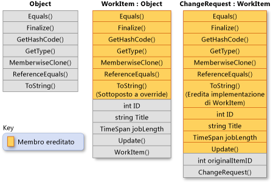

# Ereditarietà (Guida per programmatori C#)

L'ereditarietà, insieme all'incapsulamento e al polimorfismo, rappresenta una delle tre principali caratteristiche (o pilastri) della programmazione orientata a oggetti. L'ereditarietà consente di creare nuove classi che riusano, estendono e modificano il comportamento definito in altre classi. La classe i cui membri vengono ereditati è denominata *classe di base*, mentre la classe che eredita tali membri è denominata *classe derivata*. Una classe derivata può avere una sola classe di base diretta. L'ereditarietà, tuttavia, è transitiva. Se la classe C viene derivata dalla classe B e la classe B viene derivata dalla classe A, la classe C eredita i membri dichiarati nella classe B e nella classe A.  
  
> [!NOTE]
>  Gli struct non supportano l'ereditarietà, mentre possono implementare interfacce. Per altre informazioni, vedere [Interfacce](../../../csharp/programming-guide/interfaces/index.md).  
  
 Concettualmente, una classe derivata rappresenta una specializzazione della classe di base. Ad esempio, avendo una classe di base `Animal`, è possibile definire una classe derivata denominata `Mammal` e un'altra classe derivata denominata `Reptile`. Un oggetto `Mammal` è anche un oggetto `Animal` e un oggetto `Reptile` è anche un `Animal`, ma ogni classe derivata rappresenta una diversa specializzazione della classe di base.  
  
 Quando si definisce una classe derivandola da un'altra classe, la classe derivata acquista implicitamente tutti i membri della classe di base, con l'eccezione dei costruttori e dei finalizzatori. Di conseguenza, la classe derivata può riusare il codice definito nella classe di base senza doverlo implementare nuovamente. Nella classe derivata è possibile aggiungere altri membri. In questo modo, la classe derivata estende la funzionalità della classe di base.  
  
 La figura riportata di seguito illustra una classe `WorkItem` che rappresenta un elemento di lavoro in un qualche processo aziendale. Come per tutte le classi, è derivata da <xref:System.Object?displayProperty=fullName> ed eredita tutti i metodi di tale classe. `WorkItem` aggiunge cinque propri membri, tra i quali un costruttore, perché i costruttori non vengono ereditati. La classe `ChangeRequest` eredita da `WorkItem` e rappresenta un particolare tipo di elemento di lavoro. `ChangeRequest` aggiunge altri due membri ai membri che eredita da `WorkItem` e da <xref:System.Object>. Deve aggiungere il proprio costruttore e aggiunge anche `originalItemID`. La proprietà `originalItemID` consente l'associazione dell'istanza di `ChangeRequest` all'oggetto `WorkItem` originale a cui si applica la richiesta di modifica.  
  
   
Ereditarietà delle classi  
  
 Nell'esempio seguente viene illustrato come le relazioni tra le classi mostrate nella precedente illustrazione vengono espresse in C#. Nell'esempio viene descritto anche come `WorkItem` esegue l'override del metodo virtuale <xref:System.Object.ToString%2A?displayProperty=fullName> e come la classe `ChangeRequest` eredita l'implementazione del metodo propria della classe `WorkItem`.  
  
 [!code-cs[csProgGuideInheritance#49](../../../csharp/programming-guide/classes-and-structs/codesnippet/CSharp/inheritance_1.cs)]  
  
## Metodi virtuali e astratti  
 Quando una classe di base dichiara un metodo come [virtual](../../../csharp/language-reference/keywords/virtual.md) (virtuale), una classe derivata può [eseguire l'override](../../../csharp/language-reference/keywords/override.md) del metodo definendo una propria implementazione. Se una classe di base dichiara un membro come [abstract](../../../csharp/language-reference/keywords/abstract.md) (astratto), è necessario effettuare l'override di tale metodo in ogni classe non astratta che eredita direttamente da tale classe. Quando una classe derivata è essa stessa astratta, eredita i membri astratti senza implementarli. I membri astratti e virtuali costituiscono la base del polimorfismo, che rappresenta la seconda principale caratteristica della programmazione orientata a oggetti. Per altre informazioni, vedere [Polimorfismo](../../../csharp/programming-guide/classes-and-structs/polymorphism.md).  
  
## Classi di base astratte  
 Se si vuole evitare la generazione di istanze dirette di una classe, è possibile dichiarare la classe stessa come [abstract](../../../csharp/language-reference/keywords/abstract.md) (astratta) usando la parola chiave [new](../../../csharp/language-reference/keywords/new.md). In questo modo, la classe è utilizzabile soltanto quando una nuova classe viene derivata da essa. Una classe astratta può contenere una o più firme di metodi, a loro volta dichiarate come astratte. Tali firme specificano i parametri e il valore restituito, ma non definiscono alcuna implementazione (corpo del metodo). Una classe astratta non deve necessariamente contenere membri astratti. Se però una classe contiene un membro astratto, deve essere dichiarata astratta. Le classi derivate non definite come astratte esse stesse devono fornire l'implementazione per qualsiasi metodo astratto ereditato da una classe di base astratta. Per altre informazioni, vedere [Classi e membri delle classi astratte e sealed](../../../csharp/programming-guide/classes-and-structs/abstract-and-sealed-classes-and-class-members.md).  
  
## Interfacce  
 Un'*interfaccia* rappresenta un tipo di riferimento ed è per vari aspetti simile a una classe di base astratta costituita solo da membri astratti. Quando una classe implementa un'interfaccia, deve fornire un'implementazione per tutti i membri definiti nell'interfaccia. Una classe può implementare più interfacce, anche se può essere derivata solo da una singola classe di base diretta.  
  
 Le interfacce sono usate per definire specifiche funzionalità per le classi che non sono necessariamente caratterizzate da una relazione di tipo "è un". Ad esempio, l'interfaccia <xref:System.IEquatable%601?displayProperty=fullName> può essere implementata da qualunque classe o struct che debba abilitare il codice client per determinare se due oggetti di un dato tipo sono equivalenti, indipendentemente da come il tipo definisca l'equivalenza. <xref:System.IEquatable%601> non implica lo stesso tipo di relazione "è" esistente tra una classe di base e una classe derivata. Ad esempio, un `Mammal` è un `Animal`. Per altre informazioni, vedere [Interfacce](../../../csharp/programming-guide/interfaces/index.md).  
  
## Prevenzione di un'ulteriore derivazione  
 È possibile evitare che altre classi ereditino da una data classe o da uno qualsiasi dei suoi membri, dichiarando tale classe o tale membro come [sealed](../../../csharp/language-reference/keywords/sealed.md). Per altre informazioni, vedere [Classi e membri delle classi astratte e sealed](../../../csharp/programming-guide/classes-and-structs/abstract-and-sealed-classes-and-class-members.md).  
  
## Nascondere un membro di una classe di base in una classe derivata  
 Una classe derivata può nascondere i membri di una classe di base dichiarando dei membri con lo stesso nome e la stessa firma. Il modificatore [new](../../../csharp/language-reference/keywords/new.md) può essere usato per indicare in modo esplicito che un membro non costituisce un override del membro della classe di base. L'uso del modificatore [new](../../../csharp/language-reference/keywords/new.md) non è necessario. Tuttavia, se il modificatore [new](../../../csharp/language-reference/keywords/new.md) non viene usato, il compilatore genererà un avviso. Per altre informazioni, vedere [Controllo delle versioni con le parole chiave Override e New](../../../csharp/programming-guide/classes-and-structs/versioning-with-the-override-and-new-keywords.md) e [Sapere quando usare le parole chiave Override e New](../../../csharp/programming-guide/classes-and-structs/knowing-when-to-use-override-and-new-keywords.md).  
  
## Vedere anche  
 [Guida per programmatori C#](../../../csharp/programming-guide/index.md)   
 [Classi e struct](../../../csharp/programming-guide/classes-and-structs/index.md)   
 [class](../../../csharp/language-reference/keywords/class.md)   
 [struct](../../../csharp/language-reference/keywords/struct.md)
