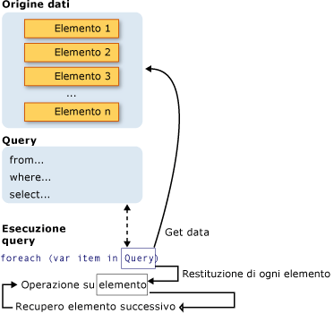

# Introduction to LINQ Queries (C#)
Una *query* è un'espressione che recupera dati da un'origine dati.  Le query sono espresse generalmente in un linguaggio di query specializzato.  Nel tempo sono stati sviluppati diversi linguaggi per i vari tipi di origini dati, ad esempio SQL per database relazionali e XQuery per XML.  Gli sviluppatori hanno dovuto pertanto imparare un nuovo linguaggio di query per ogni tipo di origine dati o formato dati supportato.  [!INCLUDE[vbteclinq](../../../../csharp/includes/vbteclinq-md.md)] semplifica questa situazione offrendo un modello coerente per l'utilizzo dei dati con tutti i diversi tipi di origini e formati dati.  In una query [!INCLUDE[vbteclinq](../../../../csharp/includes/vbteclinq-md.md)] vengono utilizzati sempre gli oggetti.  Vengono utilizzati gli stessi modelli di codifica di base per eseguire una query e trasformare i dati in documenti XML, database SQL, dataset [!INCLUDE[vstecado](../../../../csharp/programming-guide/concepts/linq/includes/vstecado-md.md)], raccolte .NET e qualsiasi altro formato per il quale sia disponibile un provider [!INCLUDE[vbteclinq](../../../../csharp/includes/vbteclinq-md.md)].  
  
## Tre parti di un'operazione di query  
 Tutte le operazioni di query [!INCLUDE[vbteclinq](../../../../csharp/includes/vbteclinq-md.md)] sono costituite da tre azioni distinte:  
  
1.  Ottenere l'origine dati.  
  
2.  Creare la query.  
  
3.  Eseguire la query.  
  
 Nell'esempio seguente viene illustrato come le tre parti di un'operazione di query vengono espresse nel codice sorgente.  Nell'esempio viene utilizzata una matrice di valori interi come origine dati per motivi di praticità. Gli stessi concetti si applicano però anche ad altre origini dati.  In questo argomento si fa riferimento sempre a tale esempio.  
  
 [!code-cs[CsLINQGettingStarted#1](../../../../csharp/programming-guide/concepts/linq/codesnippet/CSharp/introduction-to-linq-queries_1.cs)]  
  
 Nella figura seguente viene illustrata l'operazione di query completa.  In [!INCLUDE[vbteclinq](../../../../csharp/includes/vbteclinq-md.md)] l'esecuzione della query è distinta dalla query stessa; in altre parole i dati non vengono recuperati solo creando una variabile di query.  
  
   
  
## Origine dati  
 Poiché nell'esempio precedente è stata utilizzata una matrice come origine dati, viene supportata implicitamente l'interfaccia generica <xref:System.Collections.Generic.IEnumerable%601>,  ed è pertanto possibile eseguire una query con [!INCLUDE[vbteclinq](../../../../csharp/includes/vbteclinq-md.md)].  Viene eseguita una query in un'istruzione `foreach` e `foreach` richiede <xref:System.Collections.IEnumerable> o <xref:System.Collections.Generic.IEnumerable%601>.  I tipi che supportano <xref:System.Collections.Generic.IEnumerable%601> o un'interfaccia derivata, ad esempio l'interfaccia generica <xref:System.Linq.IQueryable%601>, sono denominati *queryable types*.  
  
 Un tipo queryable non richiede alcuna modifica o trattamento speciale per essere utilizzato come origine dati [!INCLUDE[vbteclinq](../../../../csharp/includes/vbteclinq-md.md)].  Se i dati di origine non sono già in memoria come tipi queryable, il provider [!INCLUDE[vbteclinq](../../../../csharp/includes/vbteclinq-md.md)] deve rappresentarli come tali.  Ad esempio, [!INCLUDE[sqltecxlinq](../../../../csharp/programming-guide/concepts/linq/includes/sqltecxlinq-md.md)] carica un documento XML in un tipo <xref:System.Xml.Linq.XElement> queryable:  
  
 [!code-cs[CsLINQGettingStarted#2](../../../../csharp/programming-guide/concepts/linq/codesnippet/CSharp/introduction-to-linq-queries_2.cs)]  
  
 Con [!INCLUDE[vbtecdlinq](../../../../csharp/includes/vbtecdlinq-md.md)] è necessario creare prima un mapping relazionale a oggetti in fase di progettazione, manualmente o utilizzando [Progettazione relazionale oggetti](/visual-studio/data-tools/linq-to-sql-tools-in-visual-studio2).  È possibile quindi scrivere le query sugli oggetti e in fase di esecuzione [!INCLUDE[vbtecdlinq](../../../../csharp/includes/vbtecdlinq-md.md)] gestisce la comunicazione con il database.  Nell'esempio seguente `Customers` rappresenta una tabella specifica nel database e il tipo del risultato della query, <xref:System.Linq.IQueryable%601>, deriva da <xref:System.Collections.Generic.IEnumerable%601>.  
  
```c#  
Northwnd db = new Northwnd(@"c:\northwnd.mdf");  
  
// Query for customers in London.  
IQueryable<Customer> custQuery =  
    from cust in db.Customers  
    where cust.City == "London"  
    select cust;  
  
```  
  
 Per ulteriori informazioni sulla creazione di tipi specifici di origini dati, vedere la documentazione dei diversi provider [!INCLUDE[vbteclinq](../../../../csharp/includes/vbteclinq-md.md)].  La regola di base è comunque molto semplice: un'origine dati [!INCLUDE[vbteclinq](../../../../csharp/includes/vbteclinq-md.md)] è rappresentata da qualsiasi oggetto che supporti l'interfaccia generica <xref:System.Collections.Generic.IEnumerable%601> o un'interfaccia da essa ereditata.  
  
> [!NOTE]
>  È inoltre possibile utilizzare come origine dati [!INCLUDE[vbteclinq](../../../../csharp/includes/vbteclinq-md.md)] i tipi quali <xref:System.Collections.ArrayList>, che supportano l'interfaccia non generica <xref:System.Collections.IEnumerable>.  Per ulteriori informazioni, vedere [How to: Query an ArrayList with LINQ](../Topic/How%20to:%20Query%20an%20ArrayList%20with%20LINQ.md).  
  
##  <a name="query"></a> Query  
 La query specifica le informazioni da recuperare dall'origine o dalle origini dati.  Una query può anche specificare il modo in cui ordinare, raggruppare e definire le informazioni prima che vengano restituite.  Una query viene archiviata in una variabile di query e inizializzata con un'espressione di query.  Per semplificare la scrittura delle query, in C\# è stata introdotta una nuova sintassi della query.  
  
 La query nell'esempio precedente restituisce tutti i numeri pari dalla matrice di valori interi.  L'espressione di query contiene tre clausole: `from`, `where` e `select`. Se si ha dimestichezza con SQL, si sarà notato che l'ordine delle clausole è inverso rispetto all'ordine in SQL. La clausola `from` specifica l'origine dati, la clausola `where` applica il filtro e la clausola `select` specifica il tipo degli elementi restituiti.  Queste e le altre clausole di query vengono illustrate dettagliatamente nella sezione [Espressioni di query LINQ](../../../../csharp/programming-guide/linq-query-expressions/index.md).  L'aspetto importante per il momento è che in [!INCLUDE[vbteclinq](../../../../csharp/includes/vbteclinq-md.md)] la variabile di query stessa non effettua alcuna azione e non restituisce dati.  Archivia solo le informazioni richieste per generare i risultati quando successivamente viene eseguita la query.  Per ulteriori informazioni sul modo in cui le query vengono costruite automaticamente, vedere [Standard Query Operators Overview](../../../../visual-basic/programming-guide/concepts/linq/standard-query-operators-overview.md).  
  
> [!NOTE]
>  Le query possono inoltre essere espresse utilizzando la sintassi del metodo.  Per ulteriori informazioni, vedere [Query Syntax and Method Syntax in LINQ](../../../../csharp/programming-guide/concepts/linq/query-syntax-and-method-syntax-in-linq.md).  
  
## Esecuzione della query  
  
### Esecuzione posticipata  
 Come indicato in precedenza, la variabile di query stessa archivia solo i comandi della query.  L'esecuzione effettiva della query è rinviata finché non si scorre la variabile di query in un'istruzione `foreach`.  Questo concetto è denominato *esecuzione rinviata* e viene illustrato nell'esempio seguente:  
  
 [!code-cs[csLinqGettingStarted#4](../../../../csharp/programming-guide/concepts/linq/codesnippet/CSharp/introduction-to-linq-queries_3.cs)]  
  
 Dall'istruzione `foreach` vengono inoltre recuperati i risultati della query.  Ad esempio, nella query precedente la variabile di iterazione `num` contiene ogni valore \(uno alla volta\) della sequenza restituita.  
  
 Poiché la variabile di query stessa non contiene mai i risultati della query, è possibile eseguirla un numero illimitato di volte.  Ad esempio, è possibile avere un database che viene aggiornato continuamente mediante un'applicazione separata.  Nell'applicazione è possibile creare una query che recupera i dati più recenti ed eseguirla ripetutamente a determinati intervalli per recuperare ogni volta risultati diversi.  
  
### Esecuzione immediata  
 Le query che eseguono funzioni di aggregazione su un intervallo di elementi di origine devono prima scorrere tali elementi.  Esempi di tali query sono `Count`, `Max`, `Average` e `First`.  Queste query vengono eseguite senza un'istruzione `foreach` esplicita perché la query stessa deve utilizzare `foreach` per poter restituire un risultato.  Tenere inoltre presente che questi tipi di query restituiscono un solo valore, non una raccolta `IEnumerable`.  Nella query seguente viene restituito un conteggio dei numeri pari nella matrice di origine:  
  
 [!code-cs[csLinqGettingStarted#5](../../../../csharp/programming-guide/concepts/linq/codesnippet/CSharp/introduction-to-linq-queries_4.cs)]  
  
 Per forzare l'esecuzione immediata di una query e memorizzarne nella cache i risultati, è possibile chiamare i metodi <xref:System.Linq.Enumerable.ToList%2A> o <xref:System.Linq.Enumerable.ToArray%2A>.  
  
 [!code-cs[csLinqGettingStarted#6](../../../../csharp/programming-guide/concepts/linq/codesnippet/CSharp/introduction-to-linq-queries_5.cs)]  
  
 È inoltre possibile forzare l'esecuzione inserendo il ciclo `foreach` immediatamente dopo l'espressione di query.  Tuttavia, chiamando `ToList` o `ToArray` vengono memorizzati nella cache anche tutti i dati di un singolo oggetto della raccolta.  
  
## Vedere anche  
 [Getting Started with LINQ in C\#](../../../../csharp/programming-guide/concepts/linq/getting-started-with-linq.md)   
 [Walkthrough: Writing Queries in C\#](../../../../csharp/programming-guide/concepts/linq/walkthrough-writing-queries-linq.md)   
 [Esempi LINQ](../Topic/LINQ%20Samples.md)   
 [Cenni preliminari su Progettazione relazionale oggetti](../Topic/LINQ%20to%20SQL%20Tools%20in%20Visual%20Studio1.md)   
 [Espressioni di query LINQ](../../../../csharp/programming-guide/linq-query-expressions/index.md)   
 [foreach, in](../../../../csharp/language-reference/keywords/foreach-in.md)   
 [Parole chiave di query \(LINQ\)](../../../../csharp/language-reference/keywords/query-keywords.md)   
 [Video su LINQ ed esecuzione posticipata](http://go.microsoft.com/fwlink/?LinkId=112414)