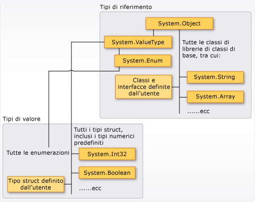

# Tipi (Guida per programmatori C#)
## Tipi, variabili e valori  
 C\# è un linguaggio fortemente tipizzato.  Ogni variabile e costante dispone di un tipo, così come ogni espressione che restituisce un valore.  Ogni firma del metodo specifica un tipo per ogni parametro di input e per il valore restituito.  La libreria di classi .NET Framework definisce un set di tipi numerici incorporati e di tipi più complessi che rappresentano un'ampia varietà di costrutti logici, ad esempio il file system, le connessioni di rete, le raccolte e le matrici di oggetti e le date.  Un tipico programma C\# utilizza tipi della libreria di classi e tipi definiti dall'utente che modellano i concetti specifici del dominio del problema del programma.  
  
 Le informazioni archiviate in un tipo possono includere:  
  
-   Spazio di archiviazione eventualmente richiesto da una variabile del tipo.  
  
-   Valori massimo e minimo che può rappresentare.  
  
-   I membri \(metodi, campi, eventi e così via\) che contiene.  
  
-   Tipo di base da cui eredita.  
  
-   Posizione in cui verrà allocata la memoria per le variabili in fase di esecuzione.  
  
-   Tipi di operazioni consentite.  
  
 Il compilatore utilizza le informazioni sui tipi per garantire che tutte le operazioni eseguite nel codice siano *indipendenti dai tipi*.  Ad esempio, se si dichiara una variabile di tipo [int](../../../csharp/language-reference/keywords/int.md), il compilatore consente di utilizzare la variabile in operazioni di addizione e sottrazione.  Se si tenta di eseguire quelle stesse operazioni su una variabile di tipo [bool](../../../csharp/language-reference/keywords/bool.md), il compilatore genera un errore, come mostrato nell'esempio seguente:  
  
 [!code-cs[csProgGuideTypes#42](../../../csharp/programming-guide/nullable-types/codesnippet/CSharp/index_1.cs)]  
  
> [!NOTE]
>  Gli sviluppatori che utilizzano C e C\+\+ devono tenere presente che in C\#, [bool](../../../csharp/language-reference/keywords/bool.md) non è convertibile in [int](../../../csharp/language-reference/keywords/int.md).  
  
 Il compilatore incorpora le informazioni sui tipi nel file eseguibile in forma di metadati.  Common Language Runtime \(CLR\) utilizza tali metadati in fase di esecuzione a ulteriore garanzia dell'indipendenza dai tipi quando alloca e recupera memoria.  
  
### Specifica di tipi nelle dichiarazioni di variabile  
 Quando si dichiara una variabile o una costante in un programma, è necessario specificarne il tipo o utilizzare la parola chiave [var](../../../csharp/language-reference/keywords/var.md) per consentire al compilatore di dedurre il tipo.  Nell'esempio seguente vengono mostrate alcune dichiarazioni di variabile che utilizzano sia tipi numerici incorporati che tipi complessi definiti dall'utente:  
  
 [!code-cs[csProgGuideTypes#36](../../../csharp/programming-guide/nullable-types/codesnippet/CSharp/index_2.cs)]  
  
 I tipi dei parametri e dei valori restituiti di un metodo vengono specificati nella firma del metodo.  Nella firma seguente viene mostrato un metodo che richiede [int](../../../csharp/language-reference/keywords/int.md) come argomento di input e restituisce una stringa:  
  
 [!code-cs[csProgGuideTypes#35](../../../csharp/programming-guide/nullable-types/codesnippet/CSharp/index_3.cs)]  
  
 Una volta dichiarata, una variabile non può essere dichiarata nuovamente con un nuovo tipo e non le può venire assegnato un valore non compatibile con il tipo dichiarato.  Ad esempio, non è possibile dichiarare [int](../../../csharp/language-reference/keywords/int.md) e assegnare ad esso il valore booleano [true](../../../csharp/language-reference/keywords/true-literal.md).  È tuttavia possibile convertire i valori in altri tipi, ad esempio quando vengono assegnati a nuove variabili o passati come argomenti di metodo.  Una *conversione del tipo* che non causa la perdita di dati viene eseguita automaticamente dal compilatore.  Una conversione che potrebbe causare la perdita di dati richiede un *cast* nel codice sorgente.  
  
 Per ulteriori informazioni, vedere [Cast e conversioni di tipi \(C\#\)](../../../csharp/programming-guide/types/casting-and-type-conversions.md).  
  
## Tipi incorporati  
 C\# fornisce un insieme standard di tipi numerici incorporati per rappresentare numeri interi, valori in virgola mobile, espressioni booleane, caratteri di testo, valori decimali e altri tipi di dati.  Sono inoltre disponibili tipi `string` e `object`,  utilizzabili in qualsiasi programma C\#.  Per ulteriori informazioni sui tipi incorporati, vedere [Tabelle di riferimento per i tipi](../../../csharp/language-reference/keywords/reference-tables-for-types.md).  
  
## Tipi personalizzati  
 Per creare tipi personalizzati si utilizzano i costrutti [struct](../../../csharp/language-reference/keywords/struct.md), [class](../../../csharp/language-reference/keywords/class.md), [interface](../../../csharp/language-reference/keywords/interface.md) ed [enum](../../../csharp/language-reference/keywords/enum.md).  La stessa libreria di classi .NET Framework è una raccolta di tipi personalizzati forniti da Microsoft che è possibile utilizzare nelle applicazioni.  Per impostazione predefinita, i tipi utilizzati con maggiore frequenza nella libreria di classi sono disponibili in qualsiasi programma C\#.  Altri diventano disponibili solo quando si aggiunge in modo esplicito un riferimento al progetto all'assembly in cui sono definiti.  Quando il compilatore dispone di un riferimento all'assembly, è possibile dichiarare variabili \(e costanti\) dei tipi dichiarati in quell'assembly nel codice sorgente.  Per ulteriori informazioni, vedere [Libreria di classi .NET Framework](http://go.microsoft.com/fwlink/?LinkID=217856).  
  
## Common Type System  
 È importante comprendere due punti fondamentali sul sistema dei tipi in [!INCLUDE[dnprdnshort](../../../csharp/getting-started/includes/dnprdnshort-md.md)]:  
  
-   Esso supporta il principio di ereditarietà.  I tipi possono derivare da altri tipi, i cosiddetti *tipi di base*.  Il tipo derivato eredita, con alcune restrizioni, i metodi, le proprietà e altri membri del tipo di base.  Il tipo di base può a sua volta derivare da un altro tipo, nel qual caso il tipo derivato eredita i membri di entrambi i tipi di base nella gerarchia di ereditarietà.  Tutti i tipi, inclusi i tipi numerici incorporati come <xref:System.Int32?displayProperty=fullName> \(parola chiave C\#: [int](../../../csharp/language-reference/keywords/int.md)\), derivano in definitiva da un solo tipo di base che è <xref:System.Object?displayProperty=fullName> \(parola chiave C\#: [object](../../../csharp/language-reference/keywords/object.md)\).  Questa gerarchia di tipi unificata viene chiamata [Common Type System](../../../standard/base-types/common-type-system.md) \(CTS\).  Per ulteriori informazioni sull'ereditarietà in C\#, vedere [Ereditarietà](../../../csharp/programming-guide/classes-and-structs/inheritance.md).  
  
-   Ogni tipo in CTS è definito come *tipo valore* o *tipo riferimento*.  Sono inclusi tutti i tipi personalizzati nella libreria di classi .NET Framework, nonché i tipi definiti dall'utente.  I tipi definiti tramite la parola chiave [struct](../../../csharp/language-reference/keywords/struct.md) sono tipi valore; tutti i tipi numerici incorporati sono `structs`.  I tipi definiti tramite la parola chiave [class](../../../csharp/language-reference/keywords/class.md) sono tipi riferimento.  I tipi riferimento e i tipi valore hanno regole della fase di compilazione diverse e comportamento in fase di esecuzione diverso.  
  
 Nell'illustrazione seguente è mostrata la relazione tra tipi valore e tipi riferimento in CTS.  
  
   
Tipi valore e tipi riferimento in CTS  
  
> [!NOTE]
>  È possibile vedere che i tipi utilizzati con maggiore frequenza sono tutti organizzati nello spazio dei nomi <xref:System>.  Tuttavia, l'inclusione di un tipo in uno spazio dei nomi è indipendente dal fatto che il tipo sia un tipo valore o un tipo riferimento.  
  
### Tipi valore  
 I tipi valore derivano da <xref:System.ValueType?displayProperty=fullName>, che deriva da <xref:System.Object?displayProperty=fullName>.  I tipi che derivano da <xref:System.ValueType?displayProperty=fullName> hanno un comportamento speciale in CLR.  Le variabili dei tipi valore contengono direttamente i relativi valori, ovvero la memoria viene allocata inline nel contesto in cui è dichiarata la variabile.  Non esiste un'allocazione heap o un overhead di Garbage Collection separato per le variabili dei tipi valore.  
  
 Esistono due categorie di tipi valore: [struct](../../../csharp/language-reference/keywords/struct.md) e [enum](../../../csharp/language-reference/keywords/enum.md).  
  
 I tipi numerici incorporati sono struct i cui metodi e proprietà sono accessibili:  
  
```c#  
// Static method on type Byte.  
byte b = Byte.MaxValue;  
```  
  
 Tuttavia, si dichiarano e si assegnano ad essi i valori come se si trattasse di tipi non aggregati semplici:  
  
```c#  
byte num = 0xA;  
int i = 5;  
char c = 'Z';  
```  
  
 I tipi valore sono *sealed*, ciò significa, ad esempio, che non è possibile derivare un tipo da <xref:System.Int32?displayProperty=fullName> e non è possibile definire una struttura da ereditare da qualsiasi struttura o classe definita dall'utente perché una struttura può ereditare solo da <xref:System.ValueType?displayProperty=fullName>.  Una struttura può tuttavia implementare una o più interfacce.  È possibile eseguire il cast di un tipo struct in un tipo interface, ma in tal caso è necessaria un'operazione di *conversione boxing* per eseguire il wrapping della struttura in un oggetto tipo riferimento sull'heap gestito.  Le operazioni di conversione boxing si verificano anche quando si passa un tipo valore a un metodo che accetta <xref:System.Object?displayProperty=fullName> come parametro di input.  Per ulteriori informazioni, vedere [Boxing e unboxing](../../../csharp/programming-guide/types/boxing-and-unboxing.md).  
  
 Per creare tipi valore personalizzati si utilizza la parola chiave [struct](../../../csharp/language-reference/keywords/struct.md).  In genere, una struttura viene utilizzata come contenitore per un piccolo insieme di variabili correlate, come mostrato nell'esempio seguente:  
  
 [!code-cs[csProgGuideObjects#1](../../../csharp/programming-guide/classes-and-structs/codesnippet/CSharp/index_4.cs)]  
  
 Per ulteriori informazioni sulle strutture, vedere [Struct](../../../csharp/programming-guide/classes-and-structs/structs.md).  Per ulteriori informazioni sui tipi valore in [!INCLUDE[dnprdnshort](../../../csharp/getting-started/includes/dnprdnshort-md.md)], vedere [Common Type System](../../../standard/base-types/common-type-system.md).  
  
 L'altra categoria di tipi valore è [enum](../../../csharp/language-reference/keywords/enum.md).  Un tipo enum definisce un insieme di costanti integrali denominate.  Ad esempio, l'enumerazione <xref:System.IO.FileMode?displayProperty=fullName> nella libreria di classi .NET Framework contiene un insieme di interi costanti denominati che specificano come deve essere aperto un file.  La relativa definizione viene mostrata nell'esempio seguente:  
  
 [!code-cs[csProgGuideTypes#44](../../../csharp/programming-guide/nullable-types/codesnippet/CSharp/index_5.cs)]  
  
 Il valore della costante `System.IO.FileMode.Create` è 2.  Tuttavia, un nome è molto più significativo nella lettura del codice sorgente; per questa ragione è preferibile utilizzare enumerazioni anziché valori letterali numerici costanti.  Per ulteriori informazioni, vedere <xref:System.IO.FileMode?displayProperty=fullName>.  
  
 Tutte le enumerazioni ereditano da <xref:System.Enum?displayProperty=fullName>, che eredita da <xref:System.ValueType?displayProperty=fullName>.  Tutte le regole che si applicano alle strutture si applicano anche alle enumerazioni.  Per ulteriori informazioni sulle enumerazioni, vedere [Tipi di enumerazione](../../../csharp/programming-guide/enumeration-types.md).  
  
### Tipi di riferimento  
 Un tipo definito come [classe](../../../csharp/language-reference/keywords/class.md), [delegato](../../../csharp/language-reference/keywords/delegate.md), matrice o [interfaccia](../../../csharp/language-reference/keywords/interface.md) è un *tipo riferimento*.  Quando si dichiara una variabile di un tipo riferimento in fase di esecuzione, la variabile contiene il valore [null](../../../csharp/language-reference/keywords/null.md) finché non si crea in modo esplicito un'istanza dell'oggetto tramite l'operatore [new](../../../csharp/language-reference/keywords/new.md) o lo si assegna a un oggetto creato altrove tramite `new, as shown in the following example:`  
  
```c#  
MyClass mc = new MyClass();  
MyClass mc2 = mc;  
```  
  
 Un'interfaccia deve essere inizializzata insieme a un oggetto classe che la implementa.  Se `MyClass` implementa `IMyInterface`, si crea un'istanza di `IMyInterface` come illustrato nell'esempio riportato di seguito:  
  
```c#  
IMyInterface iface = new MyClass();  
```  
  
 Quando l'oggetto viene creato, la memoria viene allocata sull'heap gestito e la variabile contiene solo un riferimento alla posizione dell'oggetto.  I tipi sull'heap gestito richiedono un overhead sia quando vengono allocati sia quando vengono recuperati dalla funzionalità di gestione automatica della memoria di CLR, nota come *Garbage Collection*.  Tuttavia, anche la funzionalità Garbage Collection è altamente ottimizzata e nella maggior parte degli scenari non crea problemi di prestazioni.  Per ulteriori informazioni su Garbage Collection, vedere [Gestione automatica della memoria](../Topic/Automatic%20Memory%20Management.md).  
  
 Anche tutte le matrici sono tipi riferimento, anche se i relativi elementi sono tipi valore.  Le matrici derivano in modo implicito dalla classe <xref:System.Array?displayProperty=fullName>, ma vengono dichiarate e utilizzate con la sintassi semplificata fornita da C\#, come illustrato nell'esempio seguente:  
  
 [!code-cs[csProgGuideTypes#45](../../../csharp/programming-guide/nullable-types/codesnippet/CSharp/index_6.cs)]  
  
 I tipi riferimento supportano completamente l'ereditarietà.  Quando si crea una classe, è possibile ereditare da qualsiasi altra interfaccia o classe che non è definita come [sealed](../../../csharp/language-reference/keywords/sealed.md) e le altre classi possono ereditare dalla classe e possono eseguire l'override dei metodi virtuali.  Per ulteriori informazioni sulla creazione di classi personalizzate, vedere [Classi e struct](../../../csharp/programming-guide/classes-and-structs/index.md).  Per ulteriori informazioni sull'ereditarietà e sui metodi virtuali, vedere [Ereditarietà](../../../csharp/programming-guide/classes-and-structs/inheritance.md).  
  
## Tipi di valori letterali  
 In C\#, i valori letterali ricevono un tipo dal compilatore.  È possibile specificare come un valore letterale numerico deve essere tipizzato aggiungendo una lettera alla fine del numero.  Ad esempio, per specificare che il valore 4.56 deve essere considerato come un tipo float, aggiungere una "f" o una "F" dopo il numero: `4.56f`.  Se non viene aggiunta alcuna lettera, il compilatore dedurrà un tipo per il valore letterale.  Per ulteriori informazioni su quali tipi possono essere specificati con suffissi letterali, vedere le pagine di riferimento per i tipi singoli in [Tipi valore](../../../csharp/language-reference/keywords/value-types.md).  
  
 Poiché i valori letterali sono tipizzati e tutti i tipi derivano da <xref:System.Object?displayProperty=fullName>, è possibile scrivere e compilare codice come il seguente:  
  
 [!code-cs[csProgGuideTypes#37](../../../csharp/programming-guide/nullable-types/codesnippet/CSharp/index_7.cs)]  
  
## Tipi generici  
 Un tipo può essere dichiarato con uno o più *parametri di tipo* che fungono da segnaposto del tipo vero o proprio \(*tipo concreto*\) che il codice client fornirà alla creazione di un'istanza del tipo.  Tali tipi sono definiti *tipi generici*.  Ad esempio, il tipo .NET Framework <xref:System.Collections.Generic.List%601?displayProperty=fullName> dispone di un parametro di tipo che per convenzione gli viene assegnato il nome *T*.  Quando si crea un'istanza del tipo, si specifica il tipo degli oggetti che conterrà l'elenco, ad esempio, stringa:  
  
<CodeContentPlaceHolder>4</CodeContentPlaceHolder>  
 L'utilizzo del parametro di tipo rende possibile il riutilizzo della stessa classe per contenere qualsiasi tipo di elemento, senza dover convertire ogni elemento in [oggetto](../../../csharp/language-reference/keywords/object.md).  Le classi di raccolte generici sono definite *raccolte fortemente tipizzate* perché il compilatore conosce il tipo specifico degli elementi della raccolta e può generare un errore in fase di compilazione se, ad esempio, si tenta di aggiungere un intero all'oggetto `strings` nell'esempio precedente.  Per ulteriori informazioni, vedere [Generics](../../../csharp/programming-guide/generics/index.md).  
  
## Tipi impliciti, tipi anonimi e tipi nullable  
 Come indicato precedentemente, è possibile tipizzare in modo implicito una variabile locale \(ma non membri di classe\) tramite la parola chiave [var](../../../csharp/language-reference/keywords/var.md).  La variabile riceve comunque un tipo in fase di compilazione, fornito dal compilatore.  Per ulteriori informazioni, vedere [Variabili locali tipizzate in modo implicito](../../../csharp/programming-guide/classes-and-structs/implicitly-typed-local-variables.md).  
  
 In alcuni casi è difficile o impossibile creare un tipo denominato per insiemi semplici di valori correlati che non si intende archiviare o passare all'esterno dei limiti del metodo.  A tale scopo è possibile creare *tipi anonimi*.  Per ulteriori informazioni, vedere [Tipi anonimi](../../../csharp/programming-guide/classes-and-structs/anonymous-types.md).  
  
 Tipi valore comuni non possono avere un valore [null](../../../csharp/language-reference/keywords/null.md).  Tuttavia, è possibile creare tipi valore nullable aggiungendo `?` dopo il tipo.  Ad esempio, `int?` è un tipo `int` che può avere anche il valore [null](../../../csharp/language-reference/keywords/null.md).  In CTS i tipi nullable sono istanze del tipo di struttura generico <xref:System.Nullable%601?displayProperty=fullName>.  I tipi nullable sono particolarmente utili quando si passano dati da e verso database nei quali i valori numerici potrebbero essere null.  Per ulteriori informazioni, vedere [Tipi nullable](../../../csharp/programming-guide/nullable-types/index.md).  
  
## Sezioni correlate  
 Per ulteriori informazioni, vedere i seguenti argomenti:  
  
-   [Cast e conversioni di tipi \(C\#\)](../../../csharp/programming-guide/types/casting-and-type-conversions.md)  
  
-   [Boxing e unboxing](../../../csharp/programming-guide/types/boxing-and-unboxing.md)  
  
-   [Utilizzo del tipo dinamico](../../../csharp/programming-guide/types/using-type-dynamic.md)  
  
-   [Tipi valore](../../../csharp/language-reference/keywords/value-types.md)  
  
-   [Tipi di riferimento](../../../csharp/language-reference/keywords/reference-types.md)  
  
-   [Classi e struct](../../../csharp/programming-guide/classes-and-structs/index.md)  
  
-   [Tipi anonimi](../../../csharp/programming-guide/classes-and-structs/anonymous-types.md)  
  
-   [Generics](../../../csharp/programming-guide/generics/index.md)  
  
-   [Variabili ed espressioni](http://go.microsoft.com/fwlink/?LinkId=221228) in [Avvio a Visual C\# 2010](http://go.microsoft.com/fwlink/?LinkId=221214)  
  
## Specifiche del linguaggio C\#  
 [!INCLUDE[CSharplangspec](../../../csharp/language-reference/keywords/includes/csharplangspec-md.md)]  
  
## Vedere anche  
 [Riferimenti per C\#](../../../csharp/language-reference/index.md)   
 [Guida per programmatori C\#](../../../csharp/programming-guide/index.md)   
 [Conversione dei tipi di dati XML](../Topic/Conversion%20of%20XML%20Data%20Types.md)   
 [Tabella dei tipi integrali](../../../csharp/language-reference/keywords/integral-types-table.md)