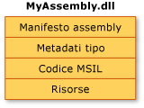
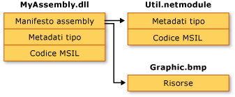

# Contenuto degli assembly
Per grandi linee, un assembly statico è costituito da quattro elementi:  
  
-   Il [manifesto dell'assembly](../../../docs/framework/app-domains/assembly-manifest.md), che contiene i metadati dell'assembly.  
  
-   I metadati dei tipi.  
  
-   Il codice Microsoft Intermediate Language \(MSIL\) che implementa i tipi.  
  
-   Un insieme di risorse.  
  
 Il manifesto dell'assembly è il solo elemento obbligatorio, ma il corretto funzionamento dell'assembly dipende anche dalla presenza di tipi o risorse.  
  
 Tali elementi possono essere raggruppati in un assembly in più modi.  È possibile raggruppare tutti gli elementi in un unico file fisico, come illustrato nella figura che segue.  
  
   
Assembly a file singolo  
  
 In alternativa, è possibile distribuire gli elementi di un assembly in più file.  Questi file possono essere moduli di codice compilato \(con estensione netmodule\), risorse \(ad esempio file con estensione jpg o bmp\) o altri file richiesti dall'applicazione.  Si opta per un assembly su più file quando si desidera combinare moduli scritti in diversi linguaggi e ottimizzare il download di un'applicazione inserendo i tipi utilizzati più raramente in un modulo che verrà scaricato solo se necessario.  
  
 Nella figura riportata di seguito lo sviluppatore di un'ipotetica applicazione ha scelto di inserire il codice di alcune utilità in un modulo diverso e di includere un file di risorse di grandi dimensioni \(in questo caso si tratta di un'immagine BMP\) nel file originale.  L'ambiente .NET Framework provvede al download di un file solo quando vi si fa riferimento. Tenere in un file separato dall'applicazione il codice a cui si fa riferimento più raramente consente di ottimizzare il download del codice.  
  
   
Assembly su più file  
  
> [!NOTE]
>  I file che compongono un assembly su più file non vengono inclusi nel collegamento fisico operato dal file system.  Essi vengono invece collegati tramite il manifesto dell'assembly e Common Language Runtime li gestisce come un unico componente.  
  
 Nella figura riportata di seguito tutti e tre i file appartengono a un assembly, come descritto nel manifesto dell'assembly contenuto in MyAssembly.dll.  Tali file vengono gestiti dal file system come tre file distinti.  Si noti che il file Util.netmodule è stato compilato come modulo perché in esso non sono contenute informazioni sull'assembly.  Quando è stato creato l'assembly, il relativo manifesto è stato aggiunto a MyAssembly.dll, indicandone la relazione con Util.netmodule e Graphic.bmp.  
  
 Oggi nella progettazione del codice sorgente si prendono decisioni esplicite su come partizionare le funzionalità della propria applicazione in uno o più file.  Nel progettare codice .NET Framework, si prenderanno decisioni simili riguardo a come partizionare le funzionalità in uno o più assembly.  
  
## Vedere anche  
 [Assembly in Common Language Runtime](../../../docs/framework/app-domains/assemblies-in-the-common-language-runtime.md)   
 [Manifesto dell'assembly](../../../docs/framework/app-domains/assembly-manifest.md)   
 [Considerazioni sulla sicurezza degli assembly](../../../docs/framework/app-domains/assembly-security-considerations.md)