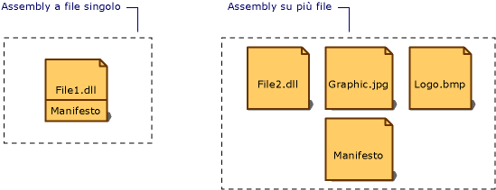

# Manifesto dell&#39;assembly
Ogni assembly, sia esso statico o dinamico, include una raccolta di dati che descrivono le relazioni tra i diversi elementi che lo compongono.  Tali metadati sono contenuti nel manifesto dell'assembly.  Il manifesto dell'assembly contiene tutti i metadati necessari per specificare l'identità di sicurezza e i requisiti di versione dell'assembly e tutti i metadati necessari per definire l'ambito dell'assembly e risolvere i riferimenti a classi e risorse.  Il manifesto dell'assembly può essere memorizzato in un file PE, che avrà estensione EXE o DLL e ospiterà anche codice Microsoft Intermediate Language \(MSIL\), oppure in un file PE autonomo che conterrà solo le informazioni del manifesto dell'assembly.  
  
 Nella figura che segue vengono illustrati i diversi modi in cui è possibile memorizzare il manifesto.  
  
   
Tipi di assembly  
  
 Nel caso di un assembly con un solo file associato, il manifesto viene incorporato nel file PE per formare un assembly a file singolo.  È possibile creare un assembly su più file con un manifesto autonomo o con il manifesto incorporato in uno dei file PE dell'assembly.  
  
 Il manifesto dell'assembly svolge le seguenti funzioni:  
  
-   Enumera i file che compongono l'assembly.  
  
-   Determina in che modo i riferimenti ai tipi e alle risorse dell'assembly vengono collegati ai file che contengono le relative dichiarazioni e implementazioni.  
  
-   Enumera altri assembly da cui l'assembly dipende.  
  
-   Fornisce un livello di riferimenti indiretti tra i consumatori dell'assembly e i dettagli di implementazione dell'assembly.  
  
-   Conferisce all'assembly la capacità di descrivere se stesso.  
  
## Contenuto del manifesto dell'assembly  
 Nella tabella che segue vengono mostrate le informazioni contenute nel manifesto dell'assembly.  I primi quattro elementi \(le informazioni sul nome, il numero di versione, le impostazioni cultura e il nome sicuro dell'assembly\) costituiscono l'identità dell'assembly.  
  
|Informazioni|Descrizione|  
|------------------|-----------------|  
|Nome assembly|Una stringa di testo che specifica il nome dell'assembly.|  
|Numero di versione|Un numero di versione principale e secondario e un numero di revisione e di build.  Common Language Runtime utilizza tali numeri per assicurare l'applicazione dei criteri per la gestione delle versioni.|  
|Impostazioni cultura|Informazioni sulla lingua o sulle impostazioni cultura supportate dall'assembly.  Questa informazione deve essere utilizzata solo per designare un assembly come assembly satellite contenente informazioni specifiche della lingua o delle impostazioni cultura. Un assembly con informazioni relative alle impostazioni cultura viene automaticamente considerato come assembly satellite.|  
|Informazioni sul nome sicuro|La chiave pubblica rilasciata dall'editore se all'assembly è stato assegnato un nome sicuro.|  
|Elenco di tutti i file dell'assembly|Un elenco di tutti i file contenuti nell'assembly e un nome di file.  Si noti che tutti i file che compongono l'assembly devono essere contenuti nella stessa directory del file che contiene il manifesto dell'assembly.|  
|Informazioni per il riferimento ai tipi|Informazioni utilizzate dal runtime per collegare il riferimento a un tipo al file che ne contiene la dichiarazione e l'implementazione.  Vengono utilizzate per i tipi esportati dall'assembly.|  
|Informazioni sugli assembly a cui si fa riferimento|Un elenco di tutti gli assembly a cui questo assembly fa riferimento in modo statico.  Ciascun riferimento include il nome, i metadati \(versione, impostazioni cultura, sistema operativo e così via\) e la chiave pubblica dell'assembly, se questo ha un nome sicuro.|  
  
 È possibile aggiungere o modificare alcune informazioni del manifesto dell'assembly utilizzando gli attributi dell'assembly nel proprio codice.  È anche possibile modificare le informazioni sulla versione e alcuni attributi informativi, tra cui marchio, copyright, prodotto, società e versione informativa.  Per un elenco completo degli attributi degli assembly, vedere [Impostazione degli attributi di un assembly](../../../docs/framework/app-domains/set-assembly-attributes.md).  
  
## Vedere anche  
 [Contenuto degli assembly](../../../docs/framework/app-domains/assembly-contents.md)   
 [Controllo delle versioni degli assembly](../../../docs/framework/app-domains/assembly-versioning.md)   
 [Creazione di assembly satellite](../../../docs/framework/resources/creating-satellite-assemblies-for-desktop-apps.md)   
 [Assembly con nomi sicuri](../../../docs/framework/app-domains/strong-named-assemblies.md)