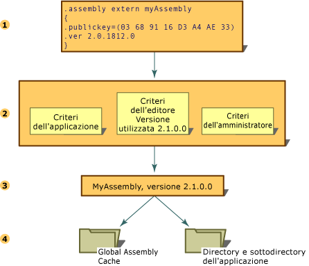

# Controllo delle versioni degli assembly
Il controllo delle versioni degli assembly che utilizzano Common Language Runtime viene svolto interamente a livello dell'assembly.  La specifica versione di un assembly e le versioni degli assembly dipendenti sono memorizzate nel manifesto dell'assembly.  I criteri di versione predefiniti del runtime prevedono che l'applicazione venga eseguita solo con le versioni con cui è stata compilata e testata. Per modificare il comportamento predefinito, è possibile esprimere esplicitamente criteri di versione diversi nei file di configurazione \(il file di configurazione dell'applicazione, il file dei criteri dell'autore e il file di configurazione dell'amministratore del computer\).  
  
> [!NOTE]
>  Il controllo delle versioni viene svolto solo su assembly con nomi sicuri.  
  
 Per risolvere una richiesta di associazione di un assembly, il runtime compie diverse operazioni:  
  
1.  Controlla il riferimento originale dell'assembly per determinare a quale versione dell'assembly effettuare l'associazione.  
  
2.  Controlla tutti i file di configurazione interessati per adottare i criteri di versione prescritti.  
  
3.  Sulla base del riferimento originale e di eventuali reindirizzamenti specificati nei file di configurazione, determina la versione dell'assembly da collegare all'assembly che ha effettuato la chiamata.  
  
4.  Controlla la Global Assembly Cache e le basi di codice specificate nei file di configurazione, quindi controlla la directory dell'applicazione e le sottodirectory che utilizzano le regole di controllo descritte in [Come il runtime individua gli assembly](../../../docs/framework/deployment/how-the-runtime-locates-assemblies.md).  
  
 Nella figura che segue vengono illustrati tali passaggi.  
  
   
Risoluzione della richiesta di associazione di un assembly  
  
 Per ulteriori informazioni sulla configurazione di applicazioni, vedere [Configurazione di app](../../../docs/framework/configure-apps/index.md).  Per ulteriori informazioni sui criteri di associazione, vedere [Come il runtime individua gli assembly](../../../docs/framework/deployment/how-the-runtime-locates-assemblies.md).  
  
## Informazioni sulla versione  
 In ciascun assembly le informazioni sulla versione sono espresse in due modi:  
  
-   Il numero di versione dell'assembly, che insieme al nome dell'assembly e alle informazioni sulle impostazioni cultura è parte dell'identità dell'assembly.  Tale numero viene utilizzato dal runtime per applicare i criteri di versione e gioca un ruolo determinante nel processo per la risoluzione dei tipi in fase di esecuzione.  
  
-   Una versione informativa, cioè una stringa che riporta informazioni aggiuntive sulla versione a fini esclusivamente informativi.  
  
### Numero di versione dell'assembly  
 Tutti gli assembly hanno un numero di versione che concorre a definirne l'identità.  Di conseguenza, due assembly che hanno numeri di versione differenti sono considerati dal runtime come due assembly distinti.  Il numero di versione è rappresentato fisicamente da una stringa divisa in quattro parti, come indicato di seguito:  
  
 \<*versione principale*\>.\<*versione secondaria*\>.\<*numero build*\>.\<*revisione*\>  
  
 Versione 1.5.1254.0 indica ad esempio 1 come numero di versione principale, 5 come numero di versione secondario, 1254 come numero di build e 0 come numero di revisione.  
  
 Il numero di versione viene memorizzato nel manifesto dell'assembly insieme ad altre informazioni che contribuiscono a definire l'identità dell'assembly, tra cui il nome e la chiave pubblica, le informazioni sulle relazioni e le identità di altri assembly connessi all'applicazione.  
  
 Quando si compila un assembly, lo strumento di sviluppo memorizza informazioni sulle dipendenze che riguardano ciascun assembly a cui si fa riferimento nel manifesto dell'assembly.  Il runtime utilizza tali numeri di versione, insieme alle informazioni di configurazione impostate da un amministratore, un'applicazione o un autore, per caricare la versione corretta dell'assembly a cui si fa riferimento.  
  
 Ai fini del controllo di versione, il runtime distingue tra assembly dotati o meno di nome sicuro.  Il controllo di versione viene effettuato solo con assembly con nome sicuro.  
  
 Per informazioni su come specificare i criteri di associazione di versione, vedere [Configurazione di app](../../../docs/framework/configure-apps/index.md).  Per informazioni su come il runtime utilizza le informazioni sulla versione per trovare un particolare assembly, vedere [Come il runtime individua gli assembly](../../../docs/framework/deployment/how-the-runtime-locates-assemblies.md).  
  
### Versione informativa degli assembly  
 La versione informativa è una stringa che specifica ulteriori informazioni sulla versione di un assembly a fini esclusivamente informativi. Tali informazioni non vengono utilizzate in fase di esecuzione.  La versione informativa espressa in testo semplice riporta informazioni commerciali, informazioni sul pacchetto o il nome del prodotto e non viene utilizzata dal runtime.  Una versione informativa può ad esempio essere "Common Language Runtime, versione 1.0" o "NET Control SP 2".  Nella scheda Versione della finestra di dialogo delle Proprietà file in Microsoft Windows queste informazioni sono visualizzate alla voce "Versione prodotto".  
  
> [!NOTE]
>  Sebbene sia possibile specificare qualsiasi testo, se il formato della stringa non è quello utilizzato dal numero di versione dell'assembly o se il formato è corretto ma il testo contiene caratteri jolly, viene visualizzato un messaggio di avviso.  L'avviso è puramente informativo.  
  
 La versione informativa viene espressa utilizzando l'attributo personalizzato <xref:System.Reflection.AssemblyInformationalVersionAttribute?displayProperty=fullName>.  Per ulteriori informazioni sull'attributo utilizzato dalla versione informativa, vedere [Impostazione degli attributi di un assembly](../../../docs/framework/app-domains/set-assembly-attributes.md).  
  
## Vedere anche  
 [Come il runtime individua gli assembly](../../../docs/framework/deployment/how-the-runtime-locates-assemblies.md)   
 [Configurazione di app](../../../docs/framework/configure-apps/index.md)   
 [Impostazione degli attributi dell'assembly](../../../docs/framework/app-domains/set-assembly-attributes.md)   
 [Assembly in Common Language Runtime](../../../docs/framework/app-domains/assemblies-in-the-common-language-runtime.md)