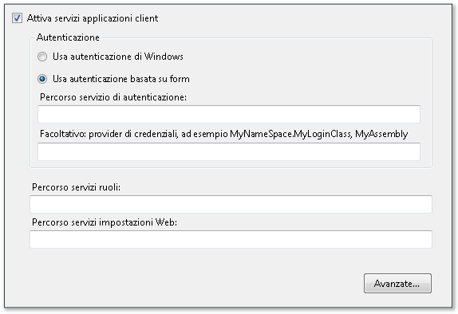
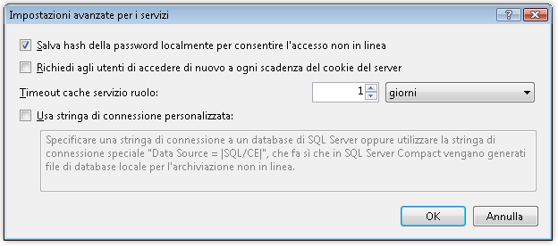

# Procedura: configurare i servizi delle applicazioni client
In questo argomento viene descritto come usare [!INCLUDE[vsprvs](../../../includes/vsprvs-md.md)] **Creazione progetti** per attivare e configurare i servizi delle applicazioni client.  È possibile usare i servizi delle applicazioni client per convalidare gli utenti e recuperare i ruoli utente e le impostazioni da un servizio dell'applicazione [!INCLUDE[ajax_current_short](../../../includes/ajax-current-short-md.md)] esistente.  Dopo la configurazione, è possibile accedere ai servizi abilitati nel codice dell'applicazione come descritto in [Cenni preliminari sui servizi delle applicazioni client](../../../docs/framework/common-client-technologies/client-application-services-overview.md).  Per altre informazioni sui servizi delle applicazioni [!INCLUDE[ajax_current_short](../../../includes/ajax-current-short-md.md)], vedere l'argomento relativo ai [ASP.NET Application Services Overview](../Topic/ASP.NET%20Application%20Services%20Overview.md).  
  
 È possibile abilitare e configurare i servizi delle applicazioni client nella pagina **Servizi** pagina di **Creazione progetti**.  La pagina **Servizi** aggiorna i valori nel file app. config del progetto.  Per accedere a **Creazione progetti**, usare il comando **Proprietà** nel menu **Progetto**.  Per altre informazioni sulla pagina **Servizi**, vedere [Pagina Servizi, Progettazione progetti](../Topic/Services%20Page,%20Project%20Designer.md).  
  
 La procedura seguente descrive come eseguire la configurazione di base per i servizi delle applicazioni client.  Le opzioni di configurazione avanzata sono descritte nelle sezioni successive.  
  
### Per configurare i servizi delle applicazioni client  
  
1.  In **Esplora soluzioni**, selezionare un nodo di progetto e quindi, nel menu **Progetto**, fare clic su **Proprietà**.  
  
     Verrà visualizzata la finestra **Creazione progetti**.  
  
2.  Fare clic sulla scheda **Servizi**.  Viene visualizzata la pagina **Servizi**, come illustrato nella figura seguente.  
  
       
  
3.  Nella pagina **Servizi** selezionare **Attiva servizi applicazioni client**.  
  
    > [!NOTE]
    >  I servizi delle applicazioni client richiedono la versione completa di.NET Framework e non sono supportati in .NET Framework Client Profile.  Se la casella di controllo **Attiva servizi applicazioni client** è disattivata, verificare che il **Framework di destinazione** sia impostato su.NET Framework 3.5 o versione successiva.  Per visualizzare l'impostazione **Framework di destinazione** in C\#, aprire la finestra Creazione progetti e quindi fare clic sulla pagina **Applicazione**.  Per visualizzare l'impostazione **Framework di destinazione** in Visual Basic, aprire Creazione progetti, fare clic sulla pagina **Compilazione**, quindi fare clic su **Opzioni di compilazione avanzate**.  
  
4.  Selezionare **Usa autenticazione basata su form** se si intende fornire i propri controlli di accesso o la finestra di dialogo, selezionare **Usa autenticazione di Windows** per usare l'identità fornita dal sistema operativo.  Per altre informazioni, vedere [Cenni preliminari sui servizi delle applicazioni client](../../../docs/framework/common-client-technologies/client-application-services-overview.md).  
  
    > [!NOTE]
    >  Se si seleziona **Usa autenticazione di Windows**, i servizi delle applicazioni client verranno configurati automaticamente in modo da usare un database di SQL Server Compact.  Ciò viene indicato nella finestra di dialogo **Impostazioni avanzate per i servizi** come descritto nella sezione successiva.  Se si seleziona **Autenticazione basata su form**, l'impostazione **Usa stringa di connessione personalizzata** non verrà deselezionata automaticamente.  Ciò potrebbe causare errori se il database [!INCLUDE[ssEW](../../../includes/ssew-md.md)] è già stato generato per l'utilizzo con l'autenticazione di Windows.  Per risolvere gli errori, deselezionare l'impostazione **Usa stringa di connessione personalizzata** nella finestra di dialogo **Impostazioni avanzate per i servizi**.  
  
5.  Se è stata selezionata l'opzione **Autenticazione basata su form**, nel campo **Percorso servizio di autenticazione** specificare l'URL dell'host del servizio, escluso il nome file.  La finestra di progettazione aggiunge automaticamente il nome di file standard \(Authentication\_JSON\_AppService.axd\) quando scrive il valore nel file di configurazione.  
  
6.  Facoltativamente, se è stata selezionata l'opzione **Autenticazione basata su form**, è possibile specificare un valore nel campo **Provider di credenziali**.  Il provider di credenziali deve implementare l'interfaccia <xref:System.Web.ClientServices.Providers.IClientFormsAuthenticationCredentialsProvider>.  Usando un provider di credenziali, è possibile separare l'interfaccia utente di accesso dal codice dell'applicazione.  Consente di creare un'unica finestra di dialogo di accesso da usare in più applicazioni.  Per altre informazioni, vedere [Procedura: implementare l'accesso utente con i servizi dell'applicazione client](../../../docs/framework/common-client-technologies/how-to-implement-user-login-with-client-application-services.md).  
  
     Se si specifica un provider di credenziali, è necessario specificarlo come nome di tipo qualificato dall'assembly.  Per altre informazioni, vedere <xref:System.Type.AssemblyQualifiedName%2A?displayProperty=fullName> e [Nomi degli assembly](../../../docs/framework/app-domains/assembly-names.md).  Nella sua forma più semplice, un nome di tipo qualificato dall'assembly è simile all'esempio seguente:  
  
    ```  
    MyNamespace.MyLoginClass, MyAssembly  
    ```  
  
7.  Nelle caselle di testo **Percorso servizi ruoli** e **Percorso servizi impostazioni Web**, specificare il percorso del servizio per ogni servizio, escluso il nome file.  La finestra di progettazione aggiungerà automaticamente i nomi di file standard \(Role\_JSON\_AppService.axd e Profile\_JSON\_AppService.axd\) quando scrive il valore nel file di configurazione.  
  
8.  Facoltativamente, fare clic su **Avanzate** per modificare le impostazioni avanzate, ad esempio il comportamento di memorizzazione nella cache locale.  Per altre informazioni, vedere la procedura successiva.  
  
## Configurazione avanzata  
 Nelle procedure seguenti viene descritto come configurare i servizi delle applicazioni client per scenari meno comuni.  Ad esempio, è possibile usare queste opzioni di configurazione per le applicazioni distribuite nei percorsi pubblici, oppure usare un database di SQL Server Compact crittografato come cache di dati locale.  
  
#### Per configurare impostazioni avanzate per i servizi delle applicazioni client  
  
1.  Nella pagina **Servizi** di **Creazione progetti**, fare clic su **Avanzate**.  
  
     Viene visualizzata la finestra di dialogo **Impostazioni avanzate per i servizi**, come illustrato nella figura seguente.  Per altre informazioni su questa finestra di dialogo, vedere [Finestra di dialogo Impostazioni avanzate per i servizi](../Topic/Advanced%20Settings%20for%20Services%20Dialog%20Box.md).  
  
       
  
2.  Selezionare o deselezionare **Salva hash della password localmente per consentire l'accesso offline**.  Quando si seleziona questa opzione, verrà memorizzato localmente un modulo crittografato della password dell'utente.  Ciò risulta utile se si implementa la modalità non in linea dell'applicazione.  Con questa opzione selezionata è possibile convalidare gli utenti anche quando la proprietà <xref:System.Web.ClientServices.ConnectivityStatus.IsOffline%2A> è impostata su `true`.  
  
3.  Selezionare o deselezionare **Richiedi agli utenti di accedere di nuovo a ogni scadenza del cookie del server**.  Il cookie di autenticazione viene configurato nel servizio remoto e indica quanto tempo rimarrà attivo un accesso dell'utente.  Per altre informazioni su come configurare il cookie, vedere l'attributo `timeout` in [Elemento forms per authentication \(schema delle impostazioni ASP.NET\)](http://msdn.microsoft.com/it-it/8163b8b5-ea6c-46c8-b5a9-c4c3de31c0b3).  
  
     Se si seleziona questa opzione, il tentativo di accedere ai ruoli remoti o servizi di impostazioni Web dopo la scadenza del cookie di autenticazione genererà un <xref:System.Net.WebException>.  È possibile gestire questa eccezione e visualizzare una finestra di dialogo di accesso per riconvalidare gli utenti.  Per un esempio di questo comportamento, vedere [Procedura dettagliata: utilizzo di servizi delle applicazioni client](../../../docs/framework/common-client-technologies/walkthrough-using-client-application-services.md).  Questa opzione è utile per le applicazioni distribuite nei percorsi pubblici per assicurarsi che gli utenti che escono dall'applicazione non rimangano autenticati a tempo indeterminato.  
  
     Se si deseleziona questa opzione e si prova ad accedere ai servizi remoti dopo la scadenza del cookie di autenticazione, gli utenti verranno riconvalidati automaticamente.  
  
4.  Specificare un valore per **Timeout cache servizio ruolo**.  Impostare questo intervallo di tempo su un valore basso quando i ruoli vengono aggiornati di frequente o su un valore più alto quando i ruoli vengono aggiornati di rado.  Se si implementa la modalità non in linea, è possibile impostare l'intervallo di tempo su un valore elevato per impedire che le informazioni sui ruoli scadano mentre l'applicazione è offline.  
  
     Il provider di ruoli accede ai valori del ruolo memorizzati nella cache o al servizio dei ruoli quando si chiama il metodo <xref:System.Web.Security.RolePrincipal.IsInRole%2A>.  Per ripristinare la cache a livello di codice e forzare l'accesso di questo metodo al servizio remoto, chiamare il metodo <xref:System.Web.ClientServices.Providers.ClientRoleProvider.ResetCache%2A>.  
  
5.  Selezionare o deselezionare **Usa stringa di connessione personalizzata**.  Per altre informazioni, vedere la procedura successiva.  
  
#### Per configurare i servizi delle applicazioni client in modo da usare un database per la cache locale  
  
1.  Nella pagina **Servizi** di **Creazione progetti**, fare clic su **Avanzate**.  
  
     Verrà visualizzata la finestra di dialogo **Impostazioni avanzate per i servizi**.  
  
2.  Selezionare **Usa stringa di connessione personalizzata**.  
  
     Il valore predefinito di `Data Source = |SQL/CE|` viene visualizzato nella casella di testo.  
  
3.  Per generare e usare un database di SQL Server Compact, mantenere il valore di stringa di connessione predefinito. [!INCLUDE[vsprvs](../../../includes/vsprvs-md.md)] genererà un file di database che verrà inserito nella directory indicata dalla proprietà <xref:System.Windows.Forms.Application.UserAppDataPath%2A?displayProperty=fullName>.  
  
4.  Per generare e usare un database [!INCLUDE[ssEW](../../../includes/ssew-md.md)] crittografato, aggiungere i valori `password` e `encrypt database` alla stringa di connessione, come illustrato nell'esempio seguente.  
  
    > [!NOTE]
    >  Assicurarsi di specificare una password complessa.  Non è possibile modificare la password dopo che il database è stato generato.  
  
    ```  
    Data Source = |SQL/CE|;password=<password>;encrypt database=true  
    ```  
  
5.  Per usare il proprio database [!INCLUDE[ssNoVersion](../../../includes/ssnoversion-md.md)], specificare una stringa di connessione personalizzata.  Per informazioni sui formati di stringa di connessione validi, vedere la documentazione [!INCLUDE[ssNoVersion](../../../includes/ssnoversion-md.md)].  Questo database non viene generato automaticamente.  La stringa di connessione deve fare riferimento a un database esistente che è possibile creare usando le seguenti istruzioni SQL.  
  
    ```  
    CREATE TABLE ApplicationProperties (PropertyName nvarchar(256),  
        PropertyValue nvarchar(256))  
    CREATE TABLE UserProperties (PropertyName nvarchar(256),  
        PropertyValue nvarchar(256))  
    CREATE TABLE Roles (UserName nvarchar(256),   
        RoleName nvarchar(256))  
    CREATE TABLE Settings (PropertyName nvarchar(256),   
        PropertyStoredAs nvarchar(1), PropertyValue nvarchar(2048))  
    ```  
  
## Utilizzo di provider personalizzati  
 Per impostazione predefinita, la funzionalità dei servizi delle applicazioni client usa i provider nello spazio dei nomi <xref:System.Web.ClientServices.Providers?displayProperty=fullName>.  Quando si configura l'applicazione usando la pagina **Servizi** di **Creazione progetti**, i riferimenti ai provider specificati vengono aggiunti al file App.config.  Questi provider predefiniti accedono ai provider corrispondenti sul server.  I servizi Web sono spesso configurati in modo da accedere ai dati utente tramite provider come <xref:System.Web.Security.SqlMembershipProvider> e <xref:System.Web.Security.SqlRoleProvider>.  
  
 Per usare i provider di servizi personalizzati, in genere è necessario modificare i provider sul lato server in modo che influiscano su tutte le applicazioni client che accedono al server.  Tuttavia, è possibile usare i provider non predefiniti sul lato client.  È possibile specificare l'autenticazione o i provider di ruoli personalizzati nel file App.config del progetto, come illustrato nella procedura seguente.  Per informazioni sulla creazione di autenticazione e provider di ruoli personalizzati, vedere [Implementing a Membership Provider](../Topic/Implementing%20a%20Membership%20Provider.md) e [Implementing a Role Provider](../Topic/Implementing%20a%20Role%20Provider.md).  È anche possibile usare un provider di impostazioni personalizzato modificando la classe `Settings` del proprio progetto \(accessibile come `Properties.Settings.Default` in C\# e `My.Settings` in [!INCLUDE[vbprvb](../../../includes/vbprvb-md.md)]\).  Per altre informazioni, vedere [Application Settings Architecture](../../../docs/framework/winforms/advanced/application-settings-architecture.md).  
  
#### Per configurare i servizi delle applicazioni client in modo da usare provider non predefiniti  
  
1.  Per usare un'autenticazione o il provider di servizi di ruoli non predefiniti, completare innanzitutto tutte le altre impostazioni di configurazione nella pagina **Servizi**.  
  
2.  Chiudere **Creazione progetti**.  Questa operazione è necessaria perché la pagina **Servizi** aggiornerà automaticamente il file App.config anche se non si modificano le impostazioni.  Se si modifica manualmente il file App.config come descritto in questa procedura e quindi si torna alla pagina **Servizi**, le modifiche verranno reimpostate.  
  
3.  In **Esplora soluzioni** fare doppio clic su App.config.  
  
     Il file di configurazione dell'applicazione verrà aperto nell'editor di testo.  
  
4.  Trovare l'elemento `<providers>` all'interno dell'elemento `<membership>` o `<roleManager>`.  Questi elementi sono figli dell'elemento `<system.web>`.  L'elemento `<membership>` viene usato per specificare i provider di autenticazione, mentre l'elemento `<roleManager>` viene usato per specificare i provider di ruoli.  
  
5.  Aggiungere un elemento `<add>` come figlio dell'elemento `<providers>`.  È necessario specificare gli attributi `name` e `type`, come illustrato nell'esempio seguente.  Il valore dell'attributo `type` deve essere un nome di tipo qualificato dall'assembly.  Per altre informazioni, vedere <xref:System.Type.AssemblyQualifiedName%2A?displayProperty=fullName> e [Nomi degli assembly](../../../docs/framework/app-domains/assembly-names.md).  
  
    ```  
    <add name="MyCustomRoleProvider" type="MyNamespace.MyRoleProvider, MyAssembly" />  
    ```  
  
6.  Modificare l'attributo `defaultProvider` dell'elemento `<membership>` o `<roleManager>` in modo da specificare il valore del nome dall'elemento `<add>` aggiunto al passaggio precedente.  
  
    ```  
    <roleManager enabled="true" defaultProvider="MyCustomRoleProvider">  
    ```  
  
## Vedere anche  
 [Servizi applicazioni client](../../../docs/framework/common-client-technologies/client-application-services.md)   
 [Cenni preliminari sui servizi delle applicazioni client](../../../docs/framework/common-client-technologies/client-application-services-overview.md)   
 [Pagina Servizi, Progettazione progetti](../Topic/Services%20Page,%20Project%20Designer.md)   
 [Finestra di dialogo Impostazioni avanzate per i servizi](../Topic/Advanced%20Settings%20for%20Services%20Dialog%20Box.md)   
 [Procedura: implementare l'accesso utente con i servizi dell'applicazione client](../../../docs/framework/common-client-technologies/how-to-implement-user-login-with-client-application-services.md)   
 [Procedura dettagliata: utilizzo di servizi delle applicazioni client](../../../docs/framework/common-client-technologies/walkthrough-using-client-application-services.md)   
 [Implementing a Membership Provider](../Topic/Implementing%20a%20Membership%20Provider.md)   
 [Implementing a Role Provider](../Topic/Implementing%20a%20Role%20Provider.md)   
 [Application Settings Architecture](../../../docs/framework/winforms/advanced/application-settings-architecture.md)   
 [Creating and Configuring the Application Services Database for SQL Server](../Topic/Creating%20and%20Configuring%20the%20Application%20Services%20Database%20for%20SQL%20Server.md)