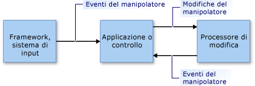

# Manipulations and Inertia Overview
Le *modifiche* consentono agli utenti di spostare, ruotare e ridimensionare gli elementi dell'interfaccia utente usando i *manipolatori*.  Un manipolatore può essere un mouse, uno stilo \(in uno scenario abilitato per il tocco\) o un dito.  
  
 L'*inerzia* emula il comportamento reale per gli elementi dell'interfaccia utente in movimento simulando le forze di attrito agenti sugli elementi.  Ciò consente di rallentare gradualmente il movimento \(lineare e angolare\) degli elementi prima dell'arresto completo.  Questo articolo fornisce un'introduzione alle modifiche e all'inerzia per .NET Framework.  
  
## Modifiche  
 Una modifica considera una raccolta di manipolatori come un oggetto composito.  Un'applicazione può rilevare le modifiche all'oggetto composito anziché ai singoli componenti.  
  
 Prendere in considerazione l'immagine nella figura seguente.  Un utente può usare due manipolatori per spostare, ruotare e ridimensionare l'immagine.  Le modifiche apportate a ogni manipolatore vengono interpretate insieme agli altri manipolatori.  
  
 Ad esempio, se si hanno due manipolatori \(1 e 2\) nell'immagine e si sposta il manipolatore 1 in una direzione \+Y \(in basso\), la modifica all'immagine dipende dalle azioni del manipolatore 2.  Se anche il manipolatore 2 viene spostato in direzione \+Y \(in basso\), l'immagine viene semplicemente spostata in direzione \+Y.  Tuttavia, se il manipolatore 2 non viene modificato o viene spostato in direzione \-Y \(in alto\), l'immagine viene ridotta o ruotata.  
  
   
  
 Immagine modificata da due manipolatori  
  
 L'elaborazione delle modifiche fornisce un framework che consente di monitorare un subset di manipolatori e di interpretarli collettivamente, anziché in modo indipendente.  È possibile creare diversi oggetti del processore di modifica contemporaneamente, uno per ogni elemento dell'interfaccia utente da modificare in un'applicazione.  Un processore di modifica viene impostato in modo da individuare i dispositivi di input da osservare e da segnalare le modifiche tramite [Eventi .NET](http://msdn.microsoft.com/library/17sde2xt.aspx).  
  
 Un processore di modifica non dispone di informazioni sul particolare elemento modificato.  Un'applicazione applica separatamente le modifiche a un elemento specifico dell'applicazione.  Ad esempio, un'applicazione applica le trasformazioni a un'immagine o la ridisegna per visualizzarla in una nuova posizione oppure con una nuova dimensione o orientamento.  
  
 Le modifiche sono progettate per le [trasformazioni affini](http://msdn.microsoft.com/library/ms533810\(VS.85\).aspx) bidimensionali \(2D\).  Queste trasformazioni includono la traslazione, la rotazione e il ridimensionamento.  
  
### Parti di una modifica  
 Una modifica è una raccolta di oggetti <xref:System.Windows.Input.Manipulations.Manipulator2D>.  Questa modifica aggregata è rappresentata da un punto di origine e da un'ellisse.  Il punto di origine è la posizione media di tutti i manipolatori che stanno modificando un elemento.  L'ellisse ha un raggio che corrisponde alla distanza media tra l'origine e ciascuno degli oggetti <xref:System.Windows.Input.Manipulations.Manipulator2D>.  
  
   
  
 Due manipolatori \(1 e 2\), un'origine e un'ellisse specificano una modifica  
  
 Quando i manipolatori vengono aggiunti, spostati o rimossi in un elemento dell'interfaccia utente, un'applicazione aggiorna l'oggetto <xref:System.Windows.Input.Manipulations.ManipulationProcessor2D> chiamando il metodo <xref:System.Windows.Input.Manipulations.ManipulationProcessor2D.ProcessManipulators%2A>.  Quando la modifica viene avviata per prima volta, viene generato l'evento <xref:System.Windows.Input.Manipulations.ManipulationProcessor2D.Started>.  
  
> [!NOTE]
>  L'elaborazione delle modifiche è più efficace se usata in un ambiente di aggiornamento basato su frame.  L'uso dell'elaborazione delle modifiche in un'applicazione Microsoft XNA non presenta problemi perché il framework XNA fornisce gli aggiornamenti basati su frame mediante il metodo [Game.Update](http://msdn.microsoft.com/library/microsoft.xna.framework.game.update.aspx).  In un altro ambiente \(ad esempio Windows Form\) potrebbe essere necessario fornire una propria logica basata su frame per raccogliere le modifiche e inviarle periodicamente in batch al metodo <xref:System.Windows.Input.Manipulations.ManipulationProcessor2D.ProcessManipulators%2A>.  
  
 Quando cambia il numero o la posizione dei manipolatori, viene generato l'evento <xref:System.Windows.Input.Manipulations.ManipulationProcessor2D.Delta>.  Le proprietà dell'oggetto <xref:System.Windows.Input.Manipulations.Manipulation2DDeltaEventArgs> passato al gestore dell'evento <xref:System.Windows.Input.Manipulations.ManipulationProcessor2D.Delta> specificano le modifiche apportate a origine, scala, rotazione e conversione dopo l'ultimo evento.  L'origine della modifica cambia in caso di spostamento, aggiunta o rimozione dei manipolatori.  I valori di conversione specificano l'entità del movimento di X o Y inclusa nella modifica.  
  
 Un'applicazione ridisegna l'elemento dell'interfaccia utente usando i nuovi valori.  
  
   
  
 Il manipolatore 1 si sposta e causa la modifica dell'origine  
  
 Quando l'ultimo manipolatore associato alla modifica viene rimosso dall'oggetto <xref:System.Windows.Input.Manipulations.ManipulationProcessor2D>, viene generato l'evento <xref:System.Windows.Input.Manipulations.ManipulationProcessor2D.Completed>.  
  
### Modello di elaborazione delle modifiche  
 Un processore di modifica usa un modello a utilizzo diretto.  Con questo semplice modello, un'applicazione deve passare tutti i dettagli dell'evento di input al processore di modifica.  Un evento di input può essere generato da qualsiasi primitiva di input, ad esempio un dispositivo mouse, uno stilo o un dito.  Questo processo fornisce un meccanismo di filtro diretto e un modello di utilizzo semplice che consentono all'applicazione di raggruppare in batch gli eventi di input quando necessario.  
  
 Per includere una primitiva di input nel processo di modifica, l'applicazione crea una struttura <xref:System.Windows.Input.Manipulations.Manipulator2D> dai dettagli della primitiva di input e la passa al processore di modifica usando il metodo <xref:System.Windows.Input.Manipulations.ManipulationProcessor2D.ProcessManipulators%2A>.  Il processore di modifica genera quindi gli eventi che l'applicazione deve gestire per aggiornare il componente visivo nel modo appropriato.  
  
   
  
 Modello di elaborazione delle modifiche  
  
## Inerzia  
 Il processore di inerzia consente alle applicazioni di estrapolare percorso, orientamento e altre proprietà di un elemento dell'interfaccia utente simulando un comportamento reale.  
  
 Ad esempio, quando un utente applica dei gesti rapidi a un elemento, questo continua a spostarsi per poi rallentare gradualmente fino ad arrestarsi.  Il processore di inerzia implementa questo comportamento facendo in modo che i valori 2D affini \(origine, scala, traslazione e rotazione\) vengano modificati in un tempo specificato con una velocità di decelerazione specificata.  
  
 Come per l'elaborazione delle modifiche, anche un processore di inerzia non dispone di informazioni su un determinato elemento dell'interfaccia utente.  In risposta a eventi generati in un oggetto <xref:System.Windows.Input.Manipulations.InertiaProcessor2D>, un'applicazione applica separatamente le modifiche a un elemento specifico dell'applicazione.  
  
 L'elaborazione dell'inerzia e quella delle modifiche vengono spesso usate insieme.  Le interfacce sono simili e gli eventi che generano in alcuni casi sono identici.  In generale, l'elaborazione dell'inerzia inizia quando viene completata la modifica dell'elemento dell'interfaccia utente.  Questa operazione viene eseguita ascoltando l'evento <xref:System.Windows.Input.Manipulations.ManipulationProcessor2D.Completed> e avviando l'elaborazione dell'inerzia da questo gestore dell'evento.  
  
## Vedere anche  
 <xref:System.Windows.Input.Manipulations>