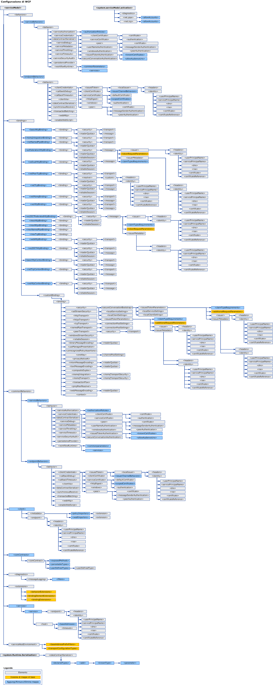

# Schema di configurazione di WCF
Gli elementi di configurazione di [!INCLUDE[indigo1](../../../../../includes/indigo1-md.md)] consentono di configurare applicazioni [!INCLUDE[indigo2](../../../../../includes/indigo2-md.md)] server e client.  È possibile usare l'[Strumento Editor di configurazione \(SvcConfigEditor.exe\)](../../../../../docs/framework/wcf/configuration-editor-tool-svcconfigeditor-exe.md) per creare e modificare i file di configurazione di client e servizi.  Poiché i file di configurazione sono in formato XML, per modificarli manualmente usando un editor di testo è necessario avere familiarità con il linguaggio XML.  In caso contrario, è possibile che si verifichino problemi. È ad esempio possibile che un tag di elemento XML o un attributo venga digitato in modo errato.  Per i tag di elemento XML e gli attributi viene applicata la distinzione tra maiuscole e minuscole.  
  
 Il sistema di configurazione di [!INCLUDE[indigo2](../../../../../includes/indigo2-md.md)] si basa sullo spazio dei nomi <xref:System.Configuration>.  È pertanto possibile usare tutte le funzionalità standard fornite dallo spazio dei nomi <xref:System.Configuration>, ad esempio il blocco, la crittografia e l'unione delle impostazioni di configurazione, allo scopo di aumentare la sicurezza dell'applicazione e della relativa configurazione.  Per altre informazioni su questi concetti, vedere gli argomenti seguenti.  
  
 [Crittografia delle informazioni di configurazione](http://go.microsoft.com/fwlink/?LinkId=95337)  
  
 [Blocco delle impostazioni di configurazione](http://go.microsoft.com/fwlink/?LinkId=95338)  
  
 Questa sezione descrive tutti i valori possibili di ogni elemento di configurazione e le relative interazioni con gli altri elementi di configurazione di WCF.  Nella mappa seguente viene illustrato lo schema di configurazione di WCF.  
  
   
  
> [!CAUTION]
>  Per evitare qualsiasi possibile rischio di sicurezza, è necessario usare gli elenchi di controllo di accesso \(ACL, Access Control List\) appropriati per proteggere le sezioni di configurazione di [!INCLUDE[indigo2](../../../../../includes/indigo2-md.md)] nei file di configurazione dell'applicazione \(app.config\).  Ad esempio, è necessario garantire che solo gli utenti appropriati siano in grado di accedere o apportare modifiche alla sezione del modello dei servizi del file di configurazione di un servizio o alle impostazioni di sicurezza relative alle associazioni dell'applicazione.  
  
## In questa sezione  
 [\<system.serviceModel\>](../../../../../docs/framework/configure-apps/file-schema/wcf/system-servicemodel.md)  
 Descrive l'elemento `ServiceModel`.  
  
 [\<system.serviceModel.activation\>](../../../../../docs/framework/configure-apps/file-schema/wcf/system-servicemodel-activation.md)  
 Configura lo strumento SMSvcHost.exe.  
  
 [\<system.runtime.serialization\>](../../../../../docs/framework/configure-apps/file-schema/wcf/system-runtime-serialization.md)  
 Descrive l'elemento di livello superiore per l'impostazione delle opzioni quando si usano serializzatori quali <xref:System.Runtime.Serialization.DataContractSerializer>.  
  
## Sezioni correlate  
 [Configuring Windows Communication Foundation Applications](http://msdn.microsoft.com/it-it/13cb368e-88d4-4c61-8eed-2af0361c6d7a)  
 Descrive come configurare i servizi e i client [!INCLUDE[indigo2](../../../../../includes/indigo2-md.md)].