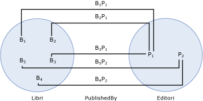

# entit&#224; finale del set di associazioni
Un'*entità finale del set di associazioni* identifica il [tipo di entità](../../../../docs/framework/data/adonet/entity-type.md) e il [set di entità](../../../../docs/framework/data/adonet/entity-set.md) nell'entità finale di un [set di associazioni](../../../../docs/framework/data/adonet/association-set.md).  Le entità finali del set di associazioni sono definite come parte di un set di associazioni. Un set di associazioni deve disporre esattamente di due entità finali.  
  
 Una definizione di entità finale del set di associazioni contiene le informazioni seguenti:  
  
-   Uno dei tipi di entità coinvolti nel set di associazioni  \(obbligatorio\).  
  
-   Il set di entità per il tipo di entità coinvolto nel set di associazioni  \(obbligatorio\).  
  
## Esempio  
 Nel diagramma seguente viene illustrato un modello concettuale con due associazioni: `WrittenBy` e `PublishedBy`.  
  
   
  
 Nel diagramma seguente vengono illustrati un set di associazioni \(`PublishedBy`\) e due set di entità \(`Books` e `Publishers`\) basati sul modello concettuale illustrato in precedenza.  Le fini del set di associazioni sono i set di entità `Books` e `Publishers`.  Bi nel set di entità `Books` rappresenta un'istanza del tipo di entità `Book` in fase di esecuzione.  Analogamente, Pj rappresenta un'istanza di `Publisher` nel set di entità `Publishers`.  BiPj rappresenta un'istanza dell'associazione `PublishedBy` nel set di associazioni `PublishedBy`.  
  
   
  
 [ADO.NET Entity Framework](../../../../docs/framework/data/adonet/ef/index.md) usa un linguaggio specifico di dominio detto [CSDL](../../../../docs/framework/data/adonet/ef/language-reference/csdl-specification.md) \(Conceptual Schema Definition Language\) per definire i modelli concettuali.  Il linguaggio CSDL seguente definisce un contenitore di entità con un set di associazioni per ogni associazione nel diagramma precedente.  Si noti che le entità finali del set di associazioni sono definite come parte di ogni definizione di set di associazioni.  
  
 [!code-xml[EDM_Example_Model#EntityContainerExample](../../../../samples/snippets/xml/VS_Snippets_Data/edm_example_model/xml/books.edmx#entitycontainerexample)]  
  
## Vedere anche  
 [Concetti chiave di Entity Data Model](../../../../docs/framework/data/adonet/entity-data-model-key-concepts.md)   
 [Entity Data Model](../../../../docs/framework/data/adonet/entity-data-model.md)