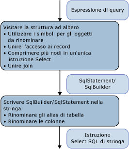

# Architettura e progettazione
Il modulo di generazione SQL nel [provider di esempio](http://go.microsoft.com/fwlink/?LinkId=180616) viene implementato come un visitatore dell'albero delle espressioni che rappresenta l'albero dei comandi.  La generazione viene eseguita in un unico passaggio sull'albero delle espressioni.  
  
 I nodi dell'albero vengono elaborati dal basso verso l'alto.  Prima viene prodotta una struttura intermedia: SqlSelectStatement o SqlBuilder. Entrambe implementano ISqlFragment.  Successivamente da tale struttura viene prodotta l'istruzione SQL della stringa.  Esistono due motivi per cui viene prodotta la struttura intermedia:  
  
-   Un'istruzione SQL SELECT viene popolata in modo non corretto da un punto di vista logico.  I nodi che partecipano alla clausola FROM vengono visitati prima di quelli che partecipano alla clausola WHERE, GROUP BY e ORDER BY.  
  
-   Per evitare conflitti durante la ridenominazione degli alias, è necessario identificare tutti gli alias usati.  È possibile rinviare le scelte di ridenominazione in SqlBuilder, usando gli oggetti Symbol per rappresentare le colonne candidate per la ridenominazione.  
  
   
  
 Nella prima fase, durante la visita dell'albero delle espressioni, le espressioni vengono raggruppate in oggetti SqlSelectStatements e i join e gli alias di join vengono resi bidimensionali.  Durante questo passaggio, gli oggetti Symbol rappresentano colonne o alias di input che possono essere rinominati.  
  
 Nella seconda fase, durante la produzione della stringa effettiva, gli alias vengono rinominati.  
  
## Strutture di dati  
 Questa sezione illustra i tipi usati nel [provider di esempio](http://go.microsoft.com/fwlink/?LinkId=180616) che consentono di compilare un'istruzione SQL.  
  
### ISqlFragment  
 Questa sezione analizza le classi che implementano l'interfaccia ISqlFragment che ha una duplice funzione:  
  
-   Un tipo restituito comune per tutti i metodi del visitatore.  
  
-   Fornisce un metodo per scrivere la stringa SQL finale.  
  
```  
internal interface ISqlFragment {  
   void WriteSql(SqlWriter writer, SqlGenerator sqlGenerator);  
}  
```  
  
#### SqlBuilder  
 SqlBuilder è un dispositivo di raccolta per la stringa SQL finale, simile a StringBuilder.  È formato dalle stringhe che costituiscono l'SQL finale, insieme all'oggetto ISqlFragments che può essere convertito in stringhe.  
  
```  
internal sealed class SqlBuilder : ISqlFragment {  
   public void Append(object s)  
   public void AppendLine()  
   public bool IsEmpty  
}  
```  
  
#### SqlSelectStatement  
 SqlSelectStatement rappresenta un'istruzione SQL SELECT canonica dalla forma "SELECT … FROM  ..  WHERE … GROUP BY … ORDER BY".  
  
 Ognuna delle clausole SQL viene rappresentata da un oggetto StringBuilder  e inoltre rileva se è stato specificato Distinct e se l'istruzione è al livello più alto.  Se l'istruzione non è al livello più alto, la clausola ORDER BY viene omessa, a meno che nell'istruzione non sia inclusa anche una clausola TOP.  
  
 FromExtents contiene l'elenco di input per l'istruzione SELECT.  Generalmente è presente un solo elemento.  È possibile che le istruzioni SELECT per i join contengano temporaneamente più di un elemento.  
  
 Se l'istruzione SELECT viene creata da un nodo di join, SqlSelectStatement gestisce un elenco di tutti gli extent che sono stati resi bidimensionali nel join in AllJoinExtents.  OuterExtents rappresenta i riferimenti esterni di SqlSelectStatement e viene usato per la ridenominazione degli alias di input.  
  
```  
internal sealed class SqlSelectStatement : ISqlFragment {  
   internal bool IsDistinct { get, set };  
   internal bool IsTopMost  
  
   internal List<Symbol> AllJoinExtents { get, set };  
   internal List<Symbol> FromExtents { get};  
   internal Dictionary<Symbol, bool> OuterExtents { get};  
  
   internal TopClause Top { get, set };  
  
   internal SqlBuilder Select {get};  
   internal SqlBuilder From  
   internal SqlBuilder Where  
   internal SqlBuilder GroupBy  
   public SqlBuilder OrderBy  
}  
```  
  
#### TopClause  
 TopClause rappresenta l'espressione TOP in un oggetto SqlSelectStatement.  La proprietà TopCount indica il numero di righe TOP che devono essere selezionate.  Se WithTies è true, TopClause è stato compilato da un oggetto DbLimitExpession.  
  
```  
class TopClause : ISqlFragment {  
   internal bool WithTies {get}  
   internal ISqlFragment TopCount {get}  
   internal TopClause(ISqlFragment topCount, bool withTies)  
   internal TopClause(int topCount, bool withTies)  
}  
```  
  
### Symbols  
 Le classi correlate ai simboli e la tabella dei simboli eseguono la ridenominazione degli alias di input, la bidimensionalità degli alias di join e la ridenominazione degli alias di colonna.  
  
 La classe Symbol rappresenta un extent, un'istruzione SELECT annidata o una colonna.  Viene usata in sostituzione di un alias effettivo per consentire che venga rinominato dopo essere stato usato e contiene inoltre informazioni aggiuntive relative all'elemento che rappresenta \(come il tipo\).  
  
```  
class Symbol : ISqlFragment {  
   internal Dictionary<string, Symbol> Columns {get}  
   internal bool NeedsRenaming {get, set}  
   internal bool IsUnnest {get, set}   //not used  
  
   public string Name{get}  
   public string NewName {get,set}  
   internal TypeUsage Type {get, set}  
  
   public Symbol(string name, TypeUsage type)  
}  
```  
  
 Name archivia l'alias originale per l'extent rappresentato, l'istruzione SELECT annidata o una colonna.  
  
 NewName archivia l'alias che verrà usato nell'istruzione SQL SELECT.  Viene originariamente impostato su Name e rinominato solo se necessario quando viene generata la query della stringa finale.  
  
 Type è utile solo per i simboli che rappresentano extent e istruzioni SELECT annidate.  
  
#### SymbolPair  
 La classe SymbolPair viene usata per rendere bidimensionali i record.  
  
 Si consideri un'espressione di proprietà D \(v, "j3.j2.j1.a.x"\) in cui v è un VarRef v, j1, j2 j3 sono join, a è un extent e x è una colonna.  
  
 Tale espressione dovrà essere convertita in {j'}.{x'}.  Il campo di origine rappresenta l'oggetto SqlStatement più esterno che rappresenta un'espressione di join, ad esempio j2. Si tratta sempre di un simbolo Join.  Il campo di colonna si sposta da un simbolo di join al successivo, fino ad arrestarsi in corrispondenza di un simbolo non di join.  Tale simbolo viene restituito quando viene visitato un oggetto DbPropertyExpression ma non viene mai aggiunto a un oggetto SqlBuilder.  
  
```  
class SymbolPair : ISqlFragment {  
   public Symbol Source;  
   public Symbol Column;  
   public SymbolPair(Symbol source, Symbol column)  
}  
```  
  
#### JoinSymbol  
 Un simbolo Join è un simbolo che rappresenta un'istruzione SELECT annidata con un join o un input di join.  
  
```  
internal sealed class JoinSymbol : Symbol {  
   internal List<Symbol> ColumnList {get, set}  
   internal List<Symbol> ExtentList {get}  
   internal List<Symbol> FlattenedExtentList {get, set}  
   internal Dictionary<string, Symbol> NameToExtent {get}  
   internal bool IsNestedJoin {get, set}  
  
   public JoinSymbol(string name, TypeUsage type, List<Symbol> extents)  
}  
```  
  
 ColumnList rappresenta l'elenco di colonne della clausola SELECT quando questo simbolo rappresenta un'istruzione SQL SELECT.  ExtentList è l'elenco degli extent inclusi nella clausola SELECT.  Se il join presenta più extent resi bidimensionali al livello superiore, FlattenedExtentList rileva gli extent per assicurarsi che i rispettivi alias vengano rinominati correttamente.  
  
 NameToExtent include in ExtentList tutti gli extent di un dizionario.  IsNestedJoin viene usato per determinare se un oggetto JoinSymbol è un normale simbolo di join oppure un simbolo con un oggetto SqlSelectStatement corrispondente.  
  
 Tutti gli elenchi vengono impostati esattamente una volta e quindi usati per ricerche o enumerazione.  
  
#### SymbolTable  
 SymbolTable viene usato per risolvere i nomi di variabile in simboli.  SymbolTable viene implementato come stack con una nuova voce per ogni ambito.  Le ricerche vengono eseguite dalla parte superiore alla parte inferiore dello stack, fino a che non viene trovata una voce.  
  
```  
internal sealed class SymbolTable {  
   internal void EnterScope()  
   internal void ExitScope()  
   internal void Add(string name, Symbol value)  
   internal Symbol Lookup(string name)  
}  
```  
  
 Esiste un solo oggetto SymbolTable per un'istanza del modulo di generazione SQL.  Per ogni nodo relazionale vengono immessi e terminati ambiti.  Tutti i simboli inclusi nei primi ambiti sono visibili agli ambiti successivi, a meno che non siano nascosti dagli altri simboli con lo stesso nome.  
  
### Stato globale per il visitatore  
 Come supporto nelle operazioni di ridenominazione di alias e colonne, è utile tenere un elenco di tutti i nomi di colonna \(AllColumnNames\) e degli alias degli extent \(AllExtentNames\) usati nel primo passaggio sull'albero della query.  La tabella dei simboli consente di risolvere i nomi di variabile in simboli.  IsVarRefSingle viene usato solo a scopo di verifica e non è strettamente necessario.  
  
 I due stack usati tramite CurrentSelectStatement e IsParentAJoin vengono usati per passare i "parametri" dai nodi padre ai nodi figlio, dal momento che il modello di visitatore non consente di passare i parametri.  
  
```  
internal Dictionary<string, int> AllExtentNames {get}  
internal Dictionary<string, int> AllColumnNames {get}  
SymbolTable symbolTable = new SymbolTable();  
bool isVarRefSingle = false;  
  
Stack<SqlSelectStatement> selectStatementStack;  
private SqlSelectStatement CurrentSelectStatement{get}  
  
Stack<bool> isParentAJoinStack;  
private bool IsParentAJoin{get}  
```  
  
## Scenari comuni  
 Questa sezione illustra gli scenari comuni del provider.  
  
### Raggruppamento di nodi di espressione in Istruzioni SQL  
 Quando si incontra il primo nodo relazionale \(in genere un extent DbScanExpression\) durante la visita dell'albero dal basso verso l'alto, viene creato un oggetto SqlSelectStatement.  Per produrre un'istruzione SQL SELECT con il minor numero possibile di query annidate, aggregare in tale oggetto SqlSelectStatement il maggior numero possibile di nodi padre.  
  
 La decisione relativa alla possibilità di aggiungere un nodo specificato \(relazionale\) all'oggetto SqlSelectStatement corrente \(quello restituito durante la visita dell'input\) o alla necessità di avviare una nuova istruzione viene elaborata dal metodo IsCompatible e dipende dagli elementi già inclusi in SqlSelectStatement, ovvero dai nodi che si trovano al di sotto del nodo specificato.  
  
 In genere, se le clausole dell'istruzione SQL vengono valutate dopo le clausole in cui i nodi considerati per l'unione non sono vuoti, non è possibile aggiungere il nodo all'istruzione corrente.  Se ad esempio il nodo successivo è un filtro, tale nodo può essere incorporato nell'oggetto SqlSelectStatement corrente solo se si verificano le condizioni seguenti:  
  
-   L'elenco SELECT è vuoto.  Se l'elenco SELECT non è vuoto, l'elenco di selezione è stato prodotto da un nodo che precede il filtro e il predicato può fare riferimento alle colonne prodotte dall'elenco SELECT.  
  
-   La classe GROUPBY è vuota.  Se GROUPBY non è vuota, l'aggiunta del filtro comporterebbe l'applicazione di filtri prima del raggruppamento e tale procedura non è corretta.  
  
-   La clausola TOP è vuota.  Se la clausola TOP non è vuota, l'aggiunta del filtro comporterebbe l'applicazione di filtri prima dell'esecuzione di TOP e tale procedura non è corretta.  
  
 Queste indicazioni non valgono per i nodi non relazionali come DbConstantExpression o le espressioni aritmetiche, poiché questi sono sempre inclusi come parte di un oggetto SqlSelectStatement esistente.  
  
 Quando inoltre si incontra la radice dell'albero dei join \(un nodo join privo di join padre\), viene avviato un nuovo oggetto SqlSelectStatement.  Tutti i rispettivi join figlio del lato sinistro vengono aggregati nell'oggetto SqlSelectStatement.  
  
 Ogni qualvolta viene avviato un nuovo oggetto SqlSelectStatement e quello corrente viene aggiunto all'input, può essere necessario completare l'oggetto SqlSelectStatement corrente aggiungendo colonne di proiezione \(una clausola SELECT\), se non ne esiste già una.  È possibile eseguire questa operazione con il metodo AddDefaultColumns che analizza FromExtents di SqlSelectStatement e aggiunge all'elenco delle colonne previste tutte le colonne che rientrano nell'ambito dell'elenco di extent rappresentato da FromExtents.  Ciò accade in quanto a questo punto non è noto a quali colonne fanno riferimento gli altri nodi.  È possibile ottimizzare la procedura includendo nella proiezione le sole colonne che possono essere usate in un momento successivo.  
  
### Bidimensionalità del join  
 La proprietà IsParentAJoin consente di stabilire se è possibile rendere bidimensionale un join specificato.  In particolare, IsParentAJoin restituisce `true` solo per il figlio sinistro di un join e per ogni oggetto DbScanExpression che costituisce un input immediato per un join. In questo caso, il nodo figlio riusa lo stesso oggetto SqlSelectStatement che verrà successivamente usato dal padre.  Per altre informazioni, vedere "Unione di espressioni".  
  
### Reindirizzamento degli alias di input  
 È possibile ottenere il reindirizzamento degli alias di input usando la tabella dei simboli.  
  
 Il reindirizzamento degli alias di input viene illustrato nel primo esempio in [Procedure consigliate per la generazione di SQL dagli alberi dei comandi](../../../../../docs/framework/data/adonet/ef/generating-sql-from-command-trees-best-practices.md).  In questo esempio "a" deve essere reindirizzato in "b" nella proiezione.  
  
 Quando viene creato un oggetto SqlSelectStatement, l'extent che costituisce l'input per il nodo viene inserito nella proprietà From dell'oggetto SqlSelectStatement.  Per rappresentare tale extent, viene creato un oggetto Symbol \(\<simbolo\_b\>\) in base al nome dell'associazione di input \("b"\) e "AS " \+  \<simbolo\_b\> viene aggiunto alla clausola FROM.  Il simbolo viene inoltre aggiunto alla proprietà FromExtents.  
  
 Il simbolo viene aggiunto anche alla tabella dei simboli per consentire il collegamento al nome dell'associazione di input \("b", \<symbol\_b\>\).  
  
 Se un nodo successivo riusa lo stesso oggetto SqlSelectStatement, viene aggiunta una voce alla tabella dei simboli per collegare il rispettivo nome dell'associazione di input al simbolo.  Nel nostro esempio DbProjectExpression con il nome dell'associazione di input "a" riutilizzerebbe SqlSelectStatement e aggiungerebbe \("a", \< symbol\_b\>\) alla tabella.  
  
 Quando le espressioni fanno riferimento al nome dell'associazione di input del nodo che sta riusando l'oggetto SqlSelectStatement, tale riferimento viene risolto usando la tabella dei simboli nel simbolo reindirizzato corretto.  Quando "a" da "a.x" viene risolto durante la visita dell'oggetto DbVariableReferenceExpression che rappresenta "a", verrà risolto nell'oggetto Symbol \<symbol\_b\>.  
  
### Bidimensionalità degli alias di join  
 Il bidimensionalità degli alias di join viene realizzata durante la visita di un oggetto DbPropertyExpression, come descritto nella sezione intitolata DbPropertyExpression.  
  
### Ridenominazione dei nomi di colonna e degli alias degli extent  
 È possibile risolvere il problema della ridenominazione dei nomi di colonna e degli alias degli extent mediante l'uso di simboli che vengono semplicemente sostituiti dagli alias nella seconda fase della generazione, descritta nella sezione intitolata Seconda fase della generazione SQL: generazione della stringa di comando.  
  
## Prima fase della generazione SQL: visita dell'albero delle espressioni  
 Questa sezione descrive la prima fase di generazione SQL, quando viene visitata l'espressione che rappresenta la query e viene prodotta una struttura intermedia, ovvero un oggetto SqlSelectStatement o un oggetto SqlBuilder.  
  
 Questa sezione descrive i principi su cui si basa la visita di diverse categorie del nodo di espressione e vengono forniti dettagli relativi alla visita di tipi di espressione specifici.  
  
### Nodi relazionali \(non join\)  
 Di seguito vengono indicati i tipi di espressione che supportano nodi non join:  
  
-   DbDistinctExpression  
  
-   DbFilterExpression  
  
-   DbGroupByExpression  
  
-   DbLimitExpession  
  
-   DbProjectExpression  
  
-   DbSkipExpression  
  
-   DbSortExpression  
  
 Il modello che viene seguito per la visita di questi nodi è il seguente:  
  
1.  Visitare l'input relazionale e ottenere l'oggetto SqlSelectStatement risultante.  L'input in un nodo relazionale potrebbe essere uno degli elementi seguenti:  
  
    -   Un nodo relazionale che include un extent, ad esempio un oggetto DbScanExpression.  Quando si visita un nodo di questo tipo, viene restituito un oggetto SqlSelectStatement.  
  
    -   Un'espressione dell'operazione di impostazione, ad esempio UNION ALL.  Il risultato deve essere racchiuso tra parentesi e inserito nella clausola FROM di un nuovo oggetto SqlSelectStatement.  
  
2.  Controllare se il nodo corrente può essere aggiunto all'oggetto SqlSelectStatement prodotto dall'input.  Questa procedura viene descritta nella sezione intitolata Raggruppamento di espressioni nelle istruzioni SQL.  Se non può essere aggiunto,  
  
    -   Visualizzare l'oggetto SqlSelectStatement corrente.  
  
    -   Creare un nuovo oggetto SqlSelectStatement e aggiungere l'oggetto SqlSelectStatement visualizzato come FROM del nuovo oggetto SqlSelectStatement.  
  
    -   Inserire il nuovo oggetto in cima allo stack.  
  
3.  Reindirizzare l'associazione di espressioni di input nel simbolo corretto dall'input.  Queste informazioni si trovano nell'oggetto SqlSelectStatement.  
  
4.  Aggiungere un nuovo ambito SymbolTable.  
  
5.  Visitare la parte non di input dell'espressione, ad esempio Projection e Predicate.  
  
6.  Visualizzare tutti gli oggetti aggiunti agli stack globali.  
  
 Non esiste un diretto equivalente di DbSkipExpression in SQL.  Logicamente viene convertito in:  
  
```  
SELECT Y.x1, Y.x2, ..., Y.xn  
FROM (  
   SELECT X.x1, X.x2, ..., X.xn, row_number() OVER (ORDER BY sk1, sk2, ...) AS [row_number]   
   FROM input as X   
   ) as Y  
WHERE Y.[row_number] > count   
ORDER BY sk1, sk2, ...  
```  
  
### Espressioni di join  
 Gli elementi seguenti sono considerati espressioni di join e vengono elaborati come di consueto, ovvero mediante il metodo VisitJoinExpression:  
  
-   DbApplyExpression  
  
-   DbJoinExpression  
  
-   DbCrossJoinExpression  
  
 I passaggi della visita sono i seguenti:  
  
 Prima di visitare i figli, viene chiamato il metodo IsParentAJoin per controllare se il nodo di join è un figlio di un join su un lato sinistro.  Se viene restituito False, viene avviato un nuovo oggetto SqlSelectStatement.  In questo caso, i join vengono visitati in modo diverso dal resto dei nodi, in quanto il padre \(il nodo di join\) crea l'oggetto SqlSelectStatement per consentirne l'uso da parte dei figli.  
  
 Elaborare quindi gli input uno alla volta.  Per ogni input:  
  
1.  Visitare l'input.  
  
2.  Completare l'elaborazione del risultato della visita dell'input chiamando il metodo ProcessJoinInputResult, responsabile della gestione della tabella dei simboli, dopo aver visitato un figlio di un'espressione di join e possibilmente aver completato l'oggetto SqlSelectStatement prodotto dal figlio.  Il risultato del figlio potrebbe essere uno dei seguenti:  
  
    -   Un oggetto SqlSelectStatement diverso da quello al quale verrà aggiunto il padre.  In questo caso, può essere necessario completarlo aggiungendo colonne predefinite.  Se l'input è un join, è necessario creare un nuovo simbolo di join.  In caso contrario, creare un simbolo normale.  
  
    -   Un extent, ad esempio un oggetto DbScanExpression, nel qual caso viene semplicemente aggiunto all'elenco di input dell'oggetto SqlSelectStatement del padre.  
  
    -   Un oggetto diverso da SqlSelectStatement, nel qual caso viene racchiuso tra parentesi.  
  
    -   Lo stesso oggetto SqlSelectStatement al quale viene aggiunto il padre.  In questo caso, i simboli dell'elenco FromExtents devono essere sostituiti da un unico nuovo oggetto JoinSymbol che li rappresenta tutti.  
  
    -   Per i primi tre casi viene chiamato il metodo AddFromSymbol per aggiungere la clausola AS e aggiornare la tabella dei simboli.  
  
 Il terzo passaggio è costituito dalla visita della condizione di join \(se presente\).  
  
### Operazioni sui set  
 Le operazioni di impostazione DbUnionAllExpression, DbExceptExpression e DbIntersectExpression vengono elaborate dal metodo VisitSetOpExpression.  Tale metodo crea un SqlBuilder della forma  
  
```  
<leftSqlSelectStatement> <setOp> <rightSqlSelectStatement>  
```  
  
 In cui \<leftSqlSelectStatement\> e \<rightSqlSelectStatement\> sono oggetti SqlSelectStatements ottenuti mediante la visita di ognuno degli input e \<setOp\> è l'operazione corrispondente, ad esempio UNION ALL.  
  
### DbScanExpression  
 Se viene visitato in un contesto di join \(come un input in un join che è un figlio del lato sinistro di un altro join\), DbScanExpression restituisce un SqlBuilder con l'SQL di destinazione per la destinazione corrispondente, ovvero una visualizzazione, una tabella o una query di definizione.  In caso contrario, viene creato un nuovo SqlSelectStatement con il campo FROM impostato in modo da corrispondere alla destinazione corrispondente.  
  
### DbVariableReferenceExpression  
 La visita di un oggetto DbVariableReferenceExpression restituisce l'oggetto Symbol che corrisponde all'espressione di riferimento della variabile in base a una ricerca nella tabella dei simboli.  
  
### DbPropertyExpression  
 La bidimensionalità degli alias di join viene identificata ed elaborata durante la visita di un oggetto DbPropertyExpression.  
  
 Viene prima visitata la proprietà Instance e il risultato è un oggetto Symbol, JoinSymbol o SymbolPair.  I tre casi vengono gestiti nel modo seguente:  
  
-   Se viene restituito un oggetto JoinSymbol, la rispettiva proprietà NameToExtent contiene un simbolo per la proprietà necessaria.  Se il simbolo di join rappresenta un join annidato, viene restituita una nuova coppia di simboli con il simbolo di join per rilevare il simbolo che verrebbe usato come alias dell'istanza e il simbolo che rappresenta la proprietà effettiva per l'altre risoluzione.  
  
-   Se viene restituito un oggetto SymbolPair e la parte della colonna è un simbolo di join, viene restituito nuovamente un simbolo di join, ma in questo caso la proprietà della colonna viene aggiornata in modo da puntare alla proprietà rappresentata dall'espressione della proprietà corrente.  In caso contrario, viene restituito un SqlBuilder con l'origine SymbolPair come alias e il simbolo per la proprietà corrente come colonna.  
  
-   Se viene restituito un oggetto Symbol, il metodo Visit restituisce un metodo SqlBuilder con l'istanza specifica come alias e il nome di proprietà come nome di colonna.  
  
### DbNewInstanceExpression  
 Se viene usato come proprietà Projection di DbProjectExpression, DbNewInstanceExpression produce un elenco delimitato da virgole degli argomenti per rappresentare le colonne previste.  
  
 Quando DbNewInstanceExpression presenta un tipo restituito di raccolta e definisce una nuova raccolta delle espressioni fornite come argomenti, i tre casi seguenti vengono gestiti separatamente:  
  
-   Se l'unico argomento di DbNewInstanceExpression è DbElementExpression, viene convertito come segue:  
  
    ```  
    NewInstance(Element(X)) =>  SELECT TOP 1 …FROM X  
    ```  
  
 Se in DbNewInstanceExpression non sono presenti argomenti \(rappresenta una tabella vuota\), DbNewInstanceExpression viene convertito in:  
  
```  
SELECT CAST(NULL AS <primitiveType>) as X  
FROM (SELECT 1) AS Y WHERE 1=0  
```  
  
 In caso contrario, DbNewInstanceExpression compila una scala union all degli argomenti:  
  
```  
SELECT <visit-result-arg1> as X  
UNION ALL SELECT <visit-result-arg2> as X  
UNION ALL …  
UNION ALL SELECT <visit-result-argN> as X  
```  
  
### DbFunctionExpression  
 Le funzioni canoniche e quelle predefinite vengono elaborate allo stesso modo: se è necessaria una gestione speciale, ad esempio TRIM\(string\) in LTRIM\(RTRIM\(string\), viene richiamato il gestore appropriato.  In caso contrario vengono convertite in FunctionName\(arg1, arg2, ..., argn\).  
  
 Vengono usati i dizionari per tenere traccia delle funzioni per cui è necessaria una gestione speciale e dei rispettivi gestori appropriati.  
  
 Le funzioni definite dall'utente vengono convertite in NamespaceName.FunctionName\(arg1, arg2, ..., argn\).  
  
### DbElementExpression  
 Il metodo che visita DbElementExpression viene richiamato solo per visitare un oggetto DbElementExpression quando viene usato per rappresentare una sottoquery scalare.  Pertanto, DbElementExpression viene convertito in un oggetto SqlSelectStatement completo e viene racchiuso tra parentesi.  
  
### DbQuantifierExpression  
 A seconda del tipo di espressione \(Any o All\), DbQuantifierExpression viene convertito come:  
  
```  
Any(input, x) => Exists(Filter(input,x))  
All(input, x) => Not Exists(Filter(input, not(x))  
```  
  
### DbNotExpression  
 In alcuni casi è possibile comprimere la conversione di DbNotExpression con la rispettiva espressione di input.  Ad esempio:  
  
```  
Not(IsNull(a)) =>  "a IS NOT NULL"  
Not(All(input, x) => Not (Not Exists(Filter(input, not(x))) => Exists(Filter(input, not(x))  
```  
  
 Il motivo per cui viene eseguita la seconda compressione è che sono state introdotte inefficienze dal provider durante la conversione dell'oggetto DbQuantifierExpression di tipo All.  Ciò non ha consentito a Entity Framework di eseguire la semplificazione.  
  
### DbIsEmptyExpression  
 DbIsEmptyExpression viene convertito come:  
  
```  
IsEmpty(inut) = Not Exists(input)  
```  
  
## Seconda fase della generazione SQL: generazione della stringa di comando  
 In caso di generazione di una stringa di comando SQL, SqlSelectStatement produce alias effettivi per i simboli che risolvono il problema della ridenominazione dei nomi di colonna e degli alias degli extent.  
  
 La ridenominazione degli alias degli extent si verifica durante la scrittura dell'oggetto SqlSelectStatement in una stringa.  Prima si crea un elenco di tutti gli alias usati dagli extent esterni.  Ogni simbolo incluso in FromExtents \(o AllJoinExtents se è non Null\), viene rinominato se collide con alcuni degli extent esterni.  Se la ridenominazione è necessaria, non creerà conflitti con nessun extent raccolto in AllExtentNames.  
  
 La ridenominazione delle colonne si verifica durante la scrittura di un oggetto Symbol in una stringa.  AddDefaultColumns nella prima fase ha determinato se è necessario rinominare un simbolo specifico di una colonna.  Nella seconda fase viene eseguita solo la ridenominazione con la verifica che il nome prodotto non crei conflitti con uno dei nomi usati in AllColumnNames  
  
 Per produrre nomi univoci sia per gli alias degli extent che per le colonne, usare \<existing\_name\>\_n, in cui n è l'alias più piccolo che non è stato ancora usato.  L'elenco globale di tutti gli alias aumenta la necessità di eseguire ridenominazioni a catena.  
  
## Vedere anche  
 [Generazione di comandi SQL nel provider di esempio](../../../../../docs/framework/data/adonet/ef/sql-generation-in-the-sample-provider.md)