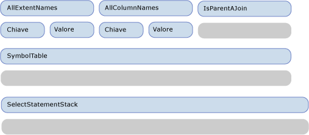
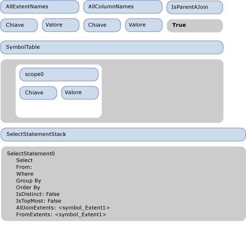
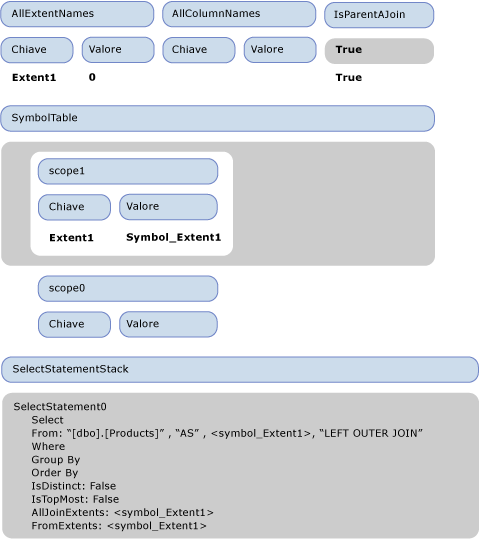
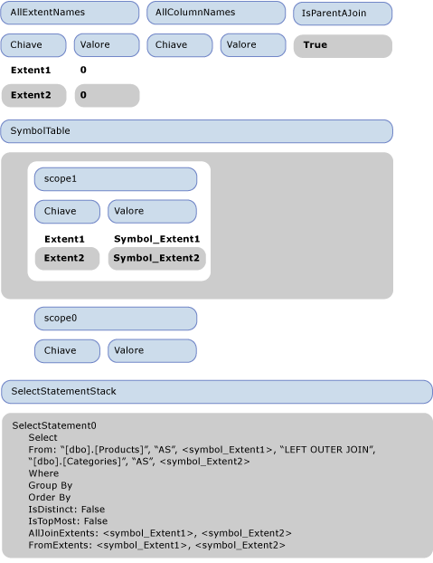
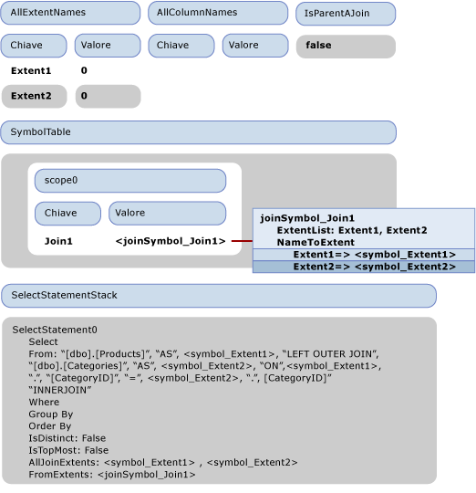
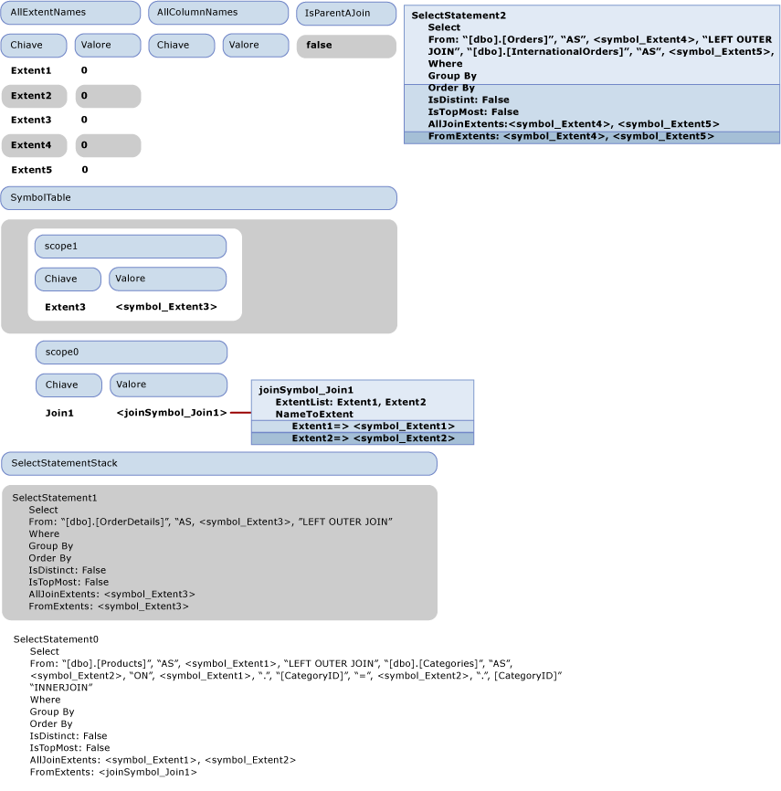
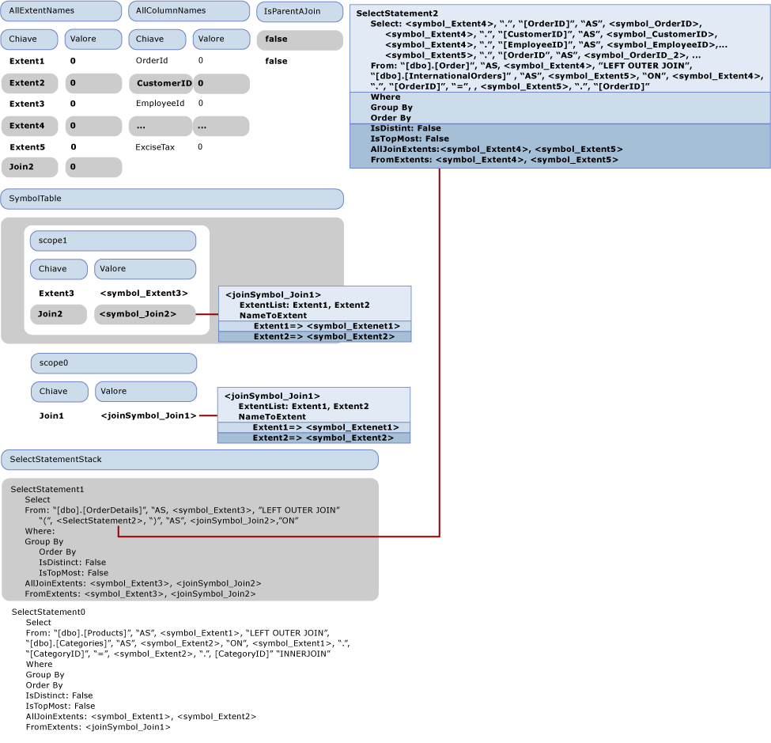

# Procedura dettagliata: generazione SQL
In questo argomento viene illustrata la procedura di generazione SQL nel [provider di esempio](http://go.microsoft.com/fwlink/?LinkId=180616).  Nella query Entity SQL seguente viene usato il modello incluso nel provider di esempio:  
  
```  
SELECT  j1.ProductId, j1.ProductName, j1.CategoryName, j2.ShipCountry, j2.ProductId  
FROM (  SELECT P.ProductName, P.ProductId, P.Category.CategoryName  
        FROM NorthwindEntities.Products AS P) as j1  
INNER JOIN (SELECT OD.ProductId, OD.Order.ShipCountry as ShipCountry  
            FROM NorthwindEntities.OrderDetails AS OD) as j2  
            ON j1.ProductId == j2.ProductId   
```  
  
 La query produce il seguente albero dei comandi di output passato al provider:  
  
```  
DbQueryCommandTree  
|_Parameters  
|_Query : Collection{Record['C1'=Edm.Int32, 'ProductID'=Edm.Int32, 'ProductName'=Edm.String, 'CategoryName'=Edm.String, 'ShipCountry'=Edm.String, 'ProductID1'=Edm.Int32]}  
  |_Project  
    |_Input : 'Join4'  
    | |_InnerJoin  
    |   |_Left : 'Join1'  
    |   | |_LeftOuterJoin  
    |   |   |_Left : 'Extent1'  
    |   |   | |_Scan : dbo.Products  
    |   |   |_Right : 'Extent2'  
    |   |   | |_Scan : dbo.Categories  
    |   |   |_JoinCondition  
    |   |     |_  
    |   |       |_Var(Extent1).CategoryID  
    |   |       |_=  
    |   |       |_Var(Extent2).CategoryID  
    |   |_Right : 'Join3'  
    |   | |_LeftOuterJoin  
    |   |   |_Left : 'Extent3'  
    |   |   | |_Scan : dbo.OrderDetails  
    |   |   |_Right : 'Join2'  
    |   |   | |_LeftOuterJoin  
    |   |   |   |_Left : 'Extent4'  
    |   |   |   | |_Scan : dbo.Orders  
    |   |   |   |_Right : 'Extent5'  
    |   |   |   | |_Scan : dbo.InternationalOrders  
    |   |   |   |_JoinCondition  
    |   |   |     |_  
    |   |   |       |_Var(Extent4).OrderID  
    |   |   |       |_=  
    |   |   |       |_Var(Extent5).OrderID  
    |   |   |_JoinCondition  
    |   |     |_  
    |   |       |_Var(Extent3).OrderID  
    |   |       |_=  
    |   |       |_Var(Join2).Extent4.OrderID  
    |   |_JoinCondition  
    |     |_  
    |       |_Var(Join1).Extent1.ProductID  
    |       |_=  
    |       |_Var(Join3).Extent3.ProductID  
    |_Projection  
      |_NewInstance : Record['C1'=Edm.Int32, 'ProductID'=Edm.Int32, 'ProductName'=Edm.String, 'CategoryName'=Edm.String, 'ShipCountry'=Edm.String, 'ProductID1'=Edm.Int32]  
        |_Column : 'C1'  
        | |_1  
        |_Column : 'ProductID'  
        | |_Var(Join4).Join1.Extent1.ProductID  
        |_Column : 'ProductName'  
        | |_Var(Join4).Join1.Extent1.ProductName  
        |_Column : 'CategoryName'  
        | |_Var(Join4).Join1.Extent2.CategoryName  
        |_Column : 'ShipCountry'  
        | |_Var(Join4).Join3.Join2.Extent4.ShipCountry  
        |_Column : 'ProductID1'  
          |_Var(Join4).Join3.Extent3.ProductID  
```  
  
 In questo argomento viene descritto come convertire l'albero dei comandi di output nelle istruzioni SQL riportate di seguito.  
  
```  
SELECT   
1 AS [C1],   
[Extent1].[ProductID] AS [ProductID],   
[Extent1].[ProductName] AS [ProductName],   
[Extent2].[CategoryName] AS [CategoryName],   
[Join3].[ShipCountry] AS [ShipCountry],   
[Join3].[ProductID] AS [ProductID1]  
FROM   [dbo].[Products] AS [Extent1]  
LEFT OUTER JOIN [dbo].[Categories] AS [Extent2] ON [Extent1].[CategoryID] = [Extent2].[CategoryID]  
INNER JOIN    
(SELECT [Extent3].[OrderID] AS [OrderID1], [Extent3].[ProductID] AS [ProductID], [Extent3].[UnitPrice] AS [UnitPrice], [Extent3].[Quantity] AS [Quantity], [Extent3].[Discount] AS [Discount], [Join2].[OrderID2], [Join2].[CustomerID], [Join2].[EmployeeID], [Join2].[OrderDate], [Join2].[RequiredDate], [Join2].[ShippedDate], [Join2].[Freight], [Join2].[ShipName], [Join2].[ShipAddress], [Join2].[ShipCity], [Join2].[ShipRegion], [Join2].[ShipPostalCode], [Join2].[ShipCountry], [Join2].[OrderID3], [Join2].[CustomsDescription], [Join2].[ExciseTax]  
FROM  [dbo].[OrderDetails] AS [Extent3]  
LEFT OUTER JOIN    
      (SELECT [Extent4].[OrderID] AS [OrderID2], [Extent4].[CustomerID] AS [CustomerID], [Extent4].[EmployeeID] AS [EmployeeID], [Extent4].[OrderDate] AS [OrderDate], [Extent4].[RequiredDate] AS [RequiredDate], [Extent4].[ShippedDate] AS [ShippedDate], [Extent4].[Freight] AS [Freight], [Extent4].[ShipName] AS [ShipName], [Extent4].[ShipAddress] AS [ShipAddress], [Extent4].[ShipCity] AS [ShipCity], [Extent4].[ShipRegion] AS [ShipRegion], [Extent4].[ShipPostalCode] AS [ShipPostalCode], [Extent4].[ShipCountry] AS [ShipCountry], [Extent5].[OrderID] AS [OrderID3], [Extent5].[CustomsDescription] AS [CustomsDescription], [Extent5].[ExciseTax] AS [ExciseTax]  
FROM  [dbo].[Orders] AS [Extent4]  
LEFT OUTER JOIN [dbo].[InternationalOrders] AS [Extent5] ON [Extent4].[OrderID] = [Extent5].[OrderID]   
      ) AS [Join2] ON [Extent3].[OrderID] = [Join2].[OrderID2]   
   ) AS [Join3] ON [Extent1].[ProductID] = [Join3].[ProductID]  
```  
  
## Prima fase della generazione SQL: visita dell'albero delle espressioni  
 Nella figura seguente viene illustrato lo stato vuoto iniziale del visitatore.  Nell'argomento vengono illustrate solo le proprietà che si riferiscono alla descrizione della procedura dettagliata.  
  
   
  
 Quando si visita il nodo Project, viene effettuata la chiamata a VisitInputExpression sul relativo input \(Join4\), che attiva la visita di Join4 mediante il metodo VisitJoinExpression.  Poiché si tratta di un join di livello superiore, IsParentAJoin restituisce false e un nuovo oggetto SqlSelectStatement \(SelectStatement0\) viene creato e inserito nello stack di istruzioni SELECT.  Viene inoltre inserito un nuovo ambito \(scope0\) nella tabella dei simboli.  Prima della visita del primo input di sinistra \(Left\) del join, nello stack IsParentAJoin viene inserito "true".  Prima della visita di Join1, ovvero l'input di sinistra di Join4, lo stato del visitatore corrisponde a quello illustrato nella figura che segue.  
  
   
  
 Quando il metodo di visita del join viene richiamato su Join4, IsParentAJoin è true e pertanto riusa l'istruzione Select corrente SelectStatement0.  Viene immesso un nuovo ambito \(scope1\).  Prima di visitare l'elemento figlio di sinistra, Extent1, nello stack IsParentAJoin viene inserito un altro valore true.  
  
 Poiché IsParentAJoin restituisce true, quando viene visitato Extent1 restituisce un oggetto SqlBuilder contenente "\[dbo\].\[Products\]".  Il controllo viene restituito al metodo che visita Join4.  Viene estratta una voce da IsParentAJoin e viene chiamato l'oggetto ProcessJoinInputResult, con la conseguente aggiunta del risultato della visita di Extent1 alla clausola From di SelectStatement0.  Un nuovo simbolo from, symbol\_Extent1, per il nome dell'associazione di input "Extent1" viene creato e aggiunto all'oggetto FromExtents di SelectStatement0. "As" e symbol\_Extent1 vengono inoltre aggiunti alla clausola from.  Una nuova voce viene aggiunta a AllExtentNames per "Extent1" con il valore 0.  Una nuova voce viene aggiunta all'ambito corrente nella tabella dei simboli per associare "Extent1" al relativo simbolo symbol\_Extent1.  Symbol\_Extent1 viene inoltre aggiunto all'oggetto AllJoinExtents di SqlSelectStatement.  
  
 Prima della visita dell'input di destra \(Right\) di Join1, "LEFT OUTER JOIN" viene aggiunto alla clausola From di SelectStatement0.  Poiché l'input di destra è un'espressione Scan, nello stack IsParentAJoin viene nuovamente inserito il valore true.  Lo stato prima della visita dell'input di destra viene illustrato nella figura che segue.  
  
   
  
 L'input di destra viene elaborato esattamente come l'input di sinistra.  Lo stato dopo la visita dell'input di destra viene illustrato nella figura che segue.  
  
   
  
 Il valore "false" successivo viene inserito nello stack IsParentAJoin e la condizione di join Var\(Extent1\).CategoryID \=\= Var\(Extent2\).CategoryID viene elaborata.  Var\(Extenent1\) viene risolto in \<symbol\_Extent1\> dopo una ricerca nella tabella dei simboli.  Poiché l'istanza viene risolta in un simbolo semplice, in seguito all'elaborazione di Var\(Extent1\).CategoryID, viene restituito un oggetto SqlBuilder con \<symbol1\>."CategoryID".  Analogamente, viene elaborato l'altro lato del confronto e il risultato della visita della condizione di join viene aggiunto alla clausola FROM di SelectStatement1 e il valore "false" viene estratto dallo stack IsParentAJoin.  
  
 A questo punto, l'elaborazione di Join1 è completa e viene estratto un ambito dalla tabella dei simboli.  
  
 Il controllo viene restituito all'elaborazione di Join4, ovvero l'elemento padre di Join1.  Poiché l'elemento figlio ha riutilizzato l'istruzione Select, gli extent di Join1 vengono sostituiti con un singolo simbolo di Join \<joinSymbol\_Join1\>.  Viene inoltre aggiunta una nuova voce alla tabella dei simboli per associare Join1 con \<joinSymbol\_Join1\>.  
  
 Il successivo nodo da elaborare è Join3, il secondo elemento figlio di Join4.  Poiché è un elemento figlio di destra, viene inserito il valore "false" nello stack IsParentAJoin.  Lo stato del visitatore in questa fase viene illustrato nella figura che segue.  
  
   
  
 Per Join3, IsParentAJoin restituisce false e deve avviare un nuovo oggetto SqlSelectStatement \(SelectStatement1\) e inserirlo nello stack.  L'elaborazione continua come per i join precedenti, viene inserito un nuovo ambito nello stack e gli elementi figlio vengono elaborati.  L'elemento figlio di sinistra è un extent \(Extent3\) mentre l'elemento figlio di destra è un join \(Join2\) che deve inoltre avviare un nuovo oggetto SqlSelectStatement: SelectStatement2.  Anche gli elementi figlio di Join2 sono extent e vengono aggregati in SelectStatement2.  
  
 Lo stato del visitatore subito dopo la visita di Join2, ma prima che ne venga eseguita la post\-elaborazione \(ProcessJoinInputResult\), viene illustrato nella figura che segue:  
  
   
  
 Nella figura precedente SelectStatement2 viene illustrato come oggetto mobile in quanto è stato estratto dallo stack, ma non ancora sottoposto alla post\-elaborazione da parte dell'elemento padre.  Deve essere aggiunto alla parte FROM dell'elemento padre, ma non è un'istruzione SQL completa se non include una clausola SELECT.  A questo punto le colonne predefinite, ovvero tutte le colonne prodotte dai relativi input, vengono aggiunte all'elenco di selezione mediante il metodo AddDefaultColumns.  AddDefaultColumns scorre i simboli in FromExtents e per ogni simbolo aggiunge tutte le colonne incluse nell'ambito.  Per un simbolo semplice, analizza il tipo di simbolo per recuperarne tutte le proprietà da aggiungere.  Popola inoltre il dizionario AllColumnNames con i nomi di colonna.  L'oggetto SelectStatement2 completo viene aggiunto alla clausola FROM di SelectStatement1.  
  
 Successivamente, viene creato un nuovo simbolo di join per rappresentare Join2. Tale simbolo viene contrassegnato come join annidato, aggiunto all'oggetto AllJoinExtents di SelectStatement1 e infine alla tabella dei simboli.  È ora necessario elaborare la condizione di join di Join3, Var\(Extent3\).OrderID \= Var\(Join2\).Extent4.OrderID.  L'elaborazione del lato sinistro è simile alla condizione di join di Join1.  L'elaborazione del lato destro "Var\(Join2\).Extent4.OrderID" è tuttavia diversa in quanto è richiesta la bidimensionalità del join.  
  
 Nella figura che segue viene illustrato lo stato del visitatore prima dell'elaborazione dell'oggetto DbPropertyExpression "Var\(Join2\).Extent4.OrderID".  
  
 Si consideri il modo in cui viene visitato "Var\(Join2\).Extent4.OrderID".  Viene innanzitutto visitata la proprietà dell'istanza "Var\(Join2\).Extent4", che rappresenta un altro oggetto DbPropertyExpression che visita prima la propria istanza "Var\(Join2\)".  Nell'ambito superiore della tabella dei simboli "Join2" viene risolto in \<joinSymbol\_join2\>.  Nel metodo di visita per l'oggetto DbPropertyExpression che elabora "Var\(Join2\).Extent4" si noterà che è stato restituito un simbolo di join durante la visita dell'istanza e che è necessaria la bidimensionalità.  
  
 Poiché si tratta di un join annidato, viene cercata la proprietà "Extent4" nel dizionario NameToExtent del simbolo di join, che viene risolta in \<symbol\_Extent4\>, e viene restituito un nuovo oggetto SymbolPair\(\<joinSymbol\_join2\>, \<symbol\_Extent4\>\).  Poiché viene restituita una coppia di simboli dall'elaborazione dell'istanza di "Var\(Join2\).Extent4.OrderID", la proprietà "OrderID" viene risolta dall'oggetto ColumnPart di tale coppia di simboli \(\<symbol\_Extent4\>\), che include un elenco di colonne dell'extent che rappresenta.  "Var\(Join2\).Extent4.OrderID" viene pertanto risolto in { \<joinSymbol\_Join2\>, ".", \<symbol\_OrderID\>}.  
  
 La condizione di join di Join4 viene elaborata in modo analogo.  Il controllo viene restituito al metodo VisitInputExpression che ha elaborato il progetto di livello superiore.  Analizzando FromExtents dell'oggetto SelectStatement0 restituito, si noterà che l'input viene identificato come un join e rimuove gli extent originali sostituendoli con un nuovo extent che include solo il simbolo di join.  Viene aggiornata anche la tabella dei simboli e viene quindi elaborata la parte relativa alla proiezione del progetto.  La risoluzione delle proprietà e la bidimensionalità degli extent del join corrispondono a quanto descritto in precedenza.  
  
   
  
 Viene infine prodotto l'oggetto SqlSelectStatement seguente:  
  
```  
SELECT:   
  "1", " AS ", "[C1]",  
  <symbol_Extent1>, ".", "[ProductID]", " AS ", "[ProductID]",   
  <symbol_Extent1>, ".", "[ProductName]", " AS ", "[ProductName]",  
  <symbol_Extent2>, ".", "[CategoryName]", " AS ", "[CategoryName]",  
  <joinSymbol_Join3>, ".", <symbol_ShipCountry>, " AS ", "[ShipCountry]",   
  <joinSymbol_Join3>, ".", <symbol_ProductID>, " AS ", "[ProductID1]"  
FROM: "[dbo].[Products]", " AS ", <symbol_Extent1>,   
        "LEFT OUTER JOIN ""[dbo].[Categories]", " AS ", <symbol_Extent2>, " ON ", <symbol_Extent1>, ".", "[CategoryID]", " = ", <symbol_Extent2>, ".", "[CategoryID]",   
        "INNER JOIN ",   
        " (", SELECT:   
           <symbol_Extent3>, ".", "[OrderID]", " AS ", <symbol_OrderID>, ",   
              <symbol_Extent3>, ".", "[ProductID]", " AS ", <symbol_ProductID>, ...,  
         <joinSymbol_Join2>, ".", <symbol_OrderID_2>, ", ",   
           <joinSymbol_Join2>, ".", <symbol_CustomerID>, ....,    
        <joinSymbol_Join2>, ".", <symbol_OrderID_3>,   
<joinSymbol_Join2>, ".", <symbol_CustomsDescription>,   
<joinSymbol_Join2>, ".", <symbol_ExciseTax>  
FROM: "[dbo].[OrderDetails]", " AS ", <symbol_Extent3>,   
"LEFT OUTER JOIN ",   
" (", SELECT:   
<symbol_Extent4>, ".", "[OrderID]", " AS ", <symbol_OrderID_2>,   
<symbol_Extent4>, ".", "[CustomerID]", " AS ", <symbol_CustomerID>, ...  
<symbol_Extent5>, ".", "[OrderID]", " AS ", <symbol_OrderID_3>,  
<symbol_Extent5>, ".", "[CustomsDescription]", " AS ", <symbol_CustomsDescription>,  
<symbol_Extent5>, ".", "[ExciseTax]", " AS ", <symbol_ExciseTax>  
FROM: "[dbo].[Orders]", " AS ", <symbol_Extent4>,  
"LEFT OUTER JOIN ", , "[dbo].[InternationalOrders]", " AS ", <symbol_Extent5>,   
" ON ", <symbol_Extent4>, ".", "[OrderID]", " = ", , <symbol_Extent5>, ".", "[OrderID]"  
" )", " AS ", <joinSymbol_Join2>, " ON ", , , <symbol_Extent3>, ".", "[OrderID]", " = ", , <joinSymbol_Join2>, ".", <symbol_OrderID_2>  
" )", " AS ", <joinSymbol_Join3>, " ON ", , , <symbol_Extent1>, ".", "[ProductID]", " = ", , <joinSymbol_Join3>, ".", <symbol_ProductID>  
```  
  
### Seconda fase della generazione SQL: generazione della stringa di comando  
 Nella seconda fase vengono prodotti i nomi effettivi dei simboli e vengono descritti solo i simboli che rappresentano le colonne denominate "OrderID", in quanto in questo caso è necessario risolvere un conflitto.  Tali nomi sono evidenziati in SqlSelectStatement.  Si noti che i suffissi usati nella figura servono solo a indicare che si tratta di istanze differenti e non per rappresentare nuovi nomi, poiché in questa fase i nomi finali \(probabilmente diversi da quelli originali\) non sono stati ancora assegnati.  
  
 Il primo simbolo da rinominare è \<symbol\_OrderID\>.  Il nuovo nome assegnato è "OrderID1", dove 1 è contrassegnato come ultimo suffisso usato per "OrderID" e il simbolo è contrassegnato come da non rinominare.  Viene quindi individuato il primo utilizzo di \<symbol\_OrderID\_2\>.  Quest'ultimo viene rinominato in modo da usare il successivo suffisso disponibile \("OrderID2"\) e nuovamente contrassegnato come da non rinominare, in modo che non venga rinominato al successivo utilizzo.  Questa stessa procedura viene eseguita anche per \<symbol\_OrderID\_3\>.  
  
 Alla fine della seconda fase viene generata l'istruzione SQL finale.  
  
## Vedere anche  
 [Generazione di comandi SQL nel provider di esempio](../../../../../docs/framework/data/adonet/ef/sql-generation-in-the-sample-provider.md)