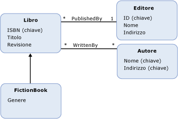

# Entity Data Model: ereditariet&#224;
Entity Data Model \(EDM\) supporta l'ereditarietà per i [tipi di entità](../../../../docs/framework/data/adonet/entity-type.md).  L'ereditarietà in EDM è analoga all'ereditarietà per le classi nei linguaggi di programmazione orientati a oggetti.  Come con le classi nei linguaggi orientati a oggetti, in un modello concettuale è possibile definire un tipo di entità \(un *tipo derivato*\) che eredita da un altro tipo di entità \(il *tipo di base*\).  Tuttavia, a differenza delle classi nella programmazione orientata a oggetti, in un modello concettuale il tipo derivato eredita sempre tutte le [proprietà](../../../../docs/framework/data/adonet/property.md) e le [proprietà di navigazione](../../../../docs/framework/data/adonet/navigation-property.md) del tipo di base.  Non è possibile eseguire l'override delle proprietà ereditate in un tipo derivato.  
  
 In un modello concettuale è possibile compilare gerarchie di ereditarietà nelle quali un tipo derivato eredita da un altro tipo derivato.  Il tipo all'inizio della gerarchia \(il tipo nella gerarchia che non è un tipo derivato\) viene detto *tipo radice*.  In una gerarchia di ereditarietà, la [chiave di entità](../../../../docs/framework/data/adonet/entity-key.md) deve essere definita sul tipo radice.  
  
 Non è possibile compilare gerarchie di ereditarietà nelle quali un tipo derivato eredita da più di un tipo.  In un modello concettuale con un tipo di entità `Book`, ad esempio, è possibile definire i tipi derivati `FictionBook` e `NonFictionBook` che ereditano ognuno da `Book`.  Non è quindi possibile, tuttavia, definire un tipo che eredita sia dal tipo `FictionBook` che dal tipo `NonFictionBook`.  
  
## Esempio  
 Nel diagramma seguente viene illustrato un modello concettuale con quattro tipi di entità: `Book`, `FictionBook`, `Publisher` e `Author`.  Il tipo di entità `FictionBook` è un tipo derivato, che eredita dal tipo di entità `Book`.  Il tipo `FictionBook` eredita le proprietà `ISBN (Key)`, `Title` e `Revision` e definisce una proprietà aggiuntiva chiamata `Genre`.  
  
   
  
 [ADO.NET Entity Framework](../../../../docs/framework/data/adonet/ef/index.md) usa un linguaggio specifico di dominio detto [CSDL](../../../../docs/framework/data/adonet/ef/language-reference/csdl-specification.md) \(Conceptual Schema Definition Language\) per definire i modelli concettuali.  Nel seguente linguaggio CSDL viene definito un tipo di entità, `FictionBook`, che eredita dal tipo `Book` \(come nel diagramma precedente\):  
  
 [!code-xml[EDM_Example_Model#DerivedType](../../../../samples/snippets/xml/VS_Snippets_Data/edm_example_model/xml/books5.edmx#derivedtype)]  
  
## Vedere anche  
 [Concetti chiave di Entity Data Model](../../../../docs/framework/data/adonet/entity-data-model-key-concepts.md)   
 [Entity Data Model](../../../../docs/framework/data/adonet/entity-data-model.md)