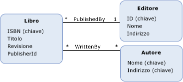

# propriet&#224; di chiave esterna
Una *proprietà di chiave esterna* in Entity Data Model \(EDM\) è una [proprietà](../../../../docs/framework/data/adonet/property.md) di tipo primitivo \(o un set di proprietà di tipo primitivo\) in un [tipo di entità](../../../../docs/framework/data/adonet/entity-type.md) che contiene la [chiave di entità](../../../../docs/framework/data/adonet/entity-key.md) di un altro tipo di entità.  
  
 Una proprietà di chiave esterna è analoga a una colonna di chiave esterna in un database relazionale.  Nello stesso modo in cui le colonne di chiave esterna vengono usate in un database relazionale per creare relazioni tra le righe nelle tabelle, le proprietà di chiave esterna in un modello concettuale vengono usate per stabilire [associazioni](../../../../docs/framework/data/adonet/association-type.md) tra tipi di entità.  Un [vincolo di integrità referenziale](../../../../docs/framework/data/adonet/referential-integrity-constraint.md) viene usato per definire un'associazione tra due tipi di entità quando uno dei tipi dispone di una proprietà di chiave esterna.  
  
## Esempio  
 Nel diagramma seguente viene illustrato un modello concettuale con tre tipi di entità: `Book`, `Publisher` e `Author`.  Il tipo di entità `Book` dispone di una proprietà, `PublisherId`, che fa riferimento alla chiave di entità del tipo di entità `Publisher` quando si definisce un vincolo di integrità referenziale sull'associazione `PublishedBy`.  
  
   
  
 [ADO.NET Entity Framework](../../../../docs/framework/data/adonet/ef/index.md) usa un linguaggio specifico di dominio detto [CSDL](../../../../docs/framework/data/adonet/ef/language-reference/csdl-specification.md) \(Conceptual Schema Definition Language\) per definire i modelli concettuali.  Il linguaggio CSDL seguente usa la proprietà di chiave esterna `PublisherId` per definire un vincolo di integrità referenziale sull'associazione `PublishedBy` illustrata nel modello concettuale precedente.  
  
 [!code-xml[EDM_Example_Model#RefConstraint](../../../../samples/snippets/xml/VS_Snippets_Data/edm_example_model/xml/books4.edmx#refconstraint)]  
  
## Vedere anche  
 [Concetti chiave di Entity Data Model](../../../../docs/framework/data/adonet/entity-data-model-key-concepts.md)   
 [Entity Data Model](../../../../docs/framework/data/adonet/entity-data-model.md)