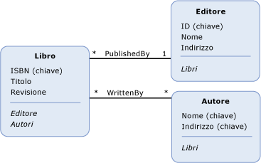

# propriet&#224; di navigazione
Una *proprietà di navigazione* è una proprietà facoltativa su un [tipo di entità](../../../../docs/framework/data/adonet/entity-type.md) che consente la navigazione da un'[entità finale](../../../../docs/framework/data/adonet/association-end.md) di un'[associazione](../../../../docs/framework/data/adonet/association-type.md) all'altra.  A differenza di altre [proprietà](../../../../docs/framework/data/adonet/property.md), le proprietà di navigazione non contengono dati.  
  
 Una definizione di proprietà di navigazione include quanto segue:  
  
-   Un nome  \(obbligatorio\).  
  
-   L'associazione all'interno della quale naviga  \(obbligatorio\).  
  
-   Le entità finali dell'associazione all'interno della quale naviga  \(obbligatorio\).  
  
 Si noti che le proprietà di navigazione sono facoltative in entrambi tipi di entità nelle entità finali di un'associazione.  Se si definisce una proprietà di navigazione su un tipo di entità nell'entità finale di un'associazione, non è necessario definire una proprietà di navigazione sul tipo di entità nell'altra entità finale dell'associazione.  
  
 Il tipo di dati di una proprietà di navigazione è determinato dalla [molteplicità](../../../../docs/framework/data/adonet/association-end-multiplicity.md) della relativa [entità finale dell'associazione](../../../../docs/framework/data/adonet/association-end.md) remota.  Si supponga ad esempio che esista una proprietà di navigazione, `OrdersNavProp`, in un tipo di entità `Customer` e che tale proprietà navighi in un'associazione uno\-a\-molti tra `Customer` e `Order`.  Poiché l'entità finale dell'associazione remota per la proprietà di navigazione dispone della molteplicità molti \(\*\), il relativo tipo di dati è una raccolta \(di `Order`\).  Analogamente, se esiste una proprietà di navigazione `CustomerNavProp` nel tipo di entità `Order`, il relativo tipo di dati sarebbe `Customer`, perché la molteplicità dell'entità finale remota è uno \(1\).  
  
## Esempio  
 Nel diagramma seguente viene illustrato un modello concettuale con tre tipi di entità: `Book`, `Publisher` e `Author`.  Le proprietà di navigazione, `Publisher` e `Authors`, vengono definite nel tipo di entità Book.  La proprietà di navigazione `Books` viene definita sia nel tipo di entità Publisher che nel tipo di entità `Author`.  
  
   
  
 [ADO.NET Entity Framework](../../../../docs/framework/data/adonet/ef/index.md) usa un linguaggio specifico di dominio detto [CSDL](../../../../docs/framework/data/adonet/ef/language-reference/csdl-specification.md) \(Conceptual Schema Definition Language\) per definire i modelli concettuali.  Il linguaggio CSDL seguente definisce il tipo di entità `Book` illustrato nel diagramma precedente:  
  
 [!code-xml[EDM_Example_Model#EntityExample](../../../../samples/snippets/xml/VS_Snippets_Data/edm_example_model/xml/books.edmx#entityexample)]  
  
 Si noti che, per comunicare le informazioni necessarie per definire una proprietà di navigazione, vengono usati attributi XML: l'attributo `Name` contiene il nome della proprietà, `Relationship` contiene il nome dell'associazione all'interno della quale naviga e `FromRole` e `ToRole` contengono le entità finali dell'associazione.  
  
## Vedere anche  
 [Concetti chiave di Entity Data Model](../../../../docs/framework/data/adonet/entity-data-model-key-concepts.md)   
 [Entity Data Model](../../../../docs/framework/data/adonet/entity-data-model.md)