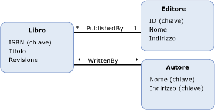

# propriet&#224;
Le *proprietà* sono i blocchi predefiniti fondamentali dei [tipi di entità](../../../../docs/framework/data/adonet/entity-type.md) e dei [tipi complessi](../../../../docs/framework/data/adonet/complex-type.md).  Le proprietà definiscono la forma e le caratteristiche dei dati che saranno contenuti in un'istanza di un tipo di entità o in un'istanza di un tipo complesso.  Le proprietà in un modello concettuale sono analoghe alle proprietà definite su una classe.  Nello stesso modo in cui le proprietà su una classe definiscono la forma della classe e forniscono informazioni su oggetti, le proprietà in un modello concettuale definiscono la forma di un tipo di entità e forniscono informazioni su istanze del tipo di entità.  
  
> [!NOTE]
>  Le proprietà descritte in questo argomento sono diverse dalle proprietà di navigazione.  Per altre informazioni, vedere [proprietà di navigazione](../../../../docs/framework/data/adonet/navigation-property.md).  
  
 Una definizione di proprietà contiene le informazioni seguenti:  
  
-   Un nome di proprietà  \(obbligatorio\).  
  
-   Un tipo di proprietà  \(obbligatorio\).  
  
-   Un set di [facet](../../../../docs/framework/data/adonet/facet.md) \(facoltativo\)  
  
 Una proprietà può contenere dati primitivi \(ad esempio una stringa, un Integer o un valore booleano\) o dati strutturati \(ad esempio un tipo complesso\).  Le proprietà di tipo primitivo sono dette anche proprietà scalari.  Per altre informazioni, vedere [Entity Data Model: tipi di dati primitivi](../../../../docs/framework/data/adonet/entity-data-model-primitive-data-types.md).  
  
> [!NOTE]
>  Un tipo complesso può, di per sé, disporre di proprietà che sono tipi complessi.  
  
## Esempio  
 Nel diagramma seguente viene illustrato un modello concettuale con tre tipi di entità: `Book`, `Publisher` e `Author`.  Ogni tipo di entità dispone di diverse proprietà, anche se nel diagramma non sono contenute informazioni sul tipo per ogni proprietà.  Le proprietà che sono [chiavi di entità](../../../../docs/framework/data/adonet/entity-key.md) vengono indicate con \(Key\).  
  
   
  
 [ADO.NET Entity Framework](../../../../docs/framework/data/adonet/ef/index.md) usa un linguaggio specifico di dominio detto [CSDL](../../../../docs/framework/data/adonet/ef/language-reference/csdl-specification.md) \(Conceptual Schema Definition Language\) per definire i modelli concettuali.  Il seguente linguaggio CSDL definisce il tipo di entità `Book` \(come illustrato nel diagramma precedente\) e indica il tipo e il nome di ogni proprietà usando attributi XML.  Un facet facoltativo, `Nullable`, è definito anche tramite un attributo XML.  
  
 [!code-xml[EDM_Example_Model#EntityExample](../../../../samples/snippets/xml/VS_Snippets_Data/edm_example_model/xml/books.edmx#entityexample)]  
  
 È possibile che una delle proprietà illustrate nel diagramma sia una proprietà di tipo complesso.  La proprietà `Address` sul tipo di entità `Publisher`, ad esempio, potrebbe essere una proprietà di tipo complesso costituita da diverse proprietà scalari, quali `StreetAddress`, `City`, `StateOrProvince`, `Country` e `PostalCode`.  La rappresentazione CSDL di tale tipo complesso sarà come segue:  
  
 [!code-xml[EDM_Example_Model#ComplexTypeExample](../../../../samples/snippets/xml/VS_Snippets_Data/edm_example_model/xml/books2.edmx#complextypeexample)]  
  
## Vedere anche  
 [Concetti chiave di Entity Data Model](../../../../docs/framework/data/adonet/entity-data-model-key-concepts.md)   
 [Entity Data Model](../../../../docs/framework/data/adonet/entity-data-model.md)