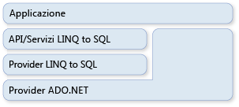

# ADO.NET e LINQ to SQL
[!INCLUDE[vbtecdlinq](../../../../../../includes/vbtecdlinq-md.md)] fa parte della famiglia di tecnologie [!INCLUDE[vstecado](../../../../../../includes/vstecado-md.md)] e si basa sui servizi forniti dal modello provider [!INCLUDE[vstecado](../../../../../../includes/vstecado-md.md)].  È pertanto possibile combinare codice [!INCLUDE[vbtecdlinq](../../../../../../includes/vbtecdlinq-md.md)] con le applicazioni [!INCLUDE[vstecado](../../../../../../includes/vstecado-md.md)] esistenti ed eseguire la migrazione delle soluzioni [!INCLUDE[vstecado](../../../../../../includes/vstecado-md.md)] correnti a [!INCLUDE[vbtecdlinq](../../../../../../includes/vbtecdlinq-md.md)].  Nell'illustrazione seguente viene fornita una panoramica della relazione.  
  
   
  
## Connessioni  
 Quando si crea un oggetto [!INCLUDE[vbtecdlinq](../../../../../../includes/vbtecdlinq-md.md)]<xref:System.Data.Linq.DataContext>, è possibile specificare una connessione [!INCLUDE[vstecado](../../../../../../includes/vstecado-md.md)] esistente.  Per tutte le operazioni relative a <xref:System.Data.Linq.DataContext>, incluse le query, verrà usata la connessione specificata.  Se la connessione è già aperta, al termine della sessione verrà lasciata da [!INCLUDE[vbtecdlinq](../../../../../../includes/vbtecdlinq-md.md)] nello stato in cui si trova.  
  
 [!code-csharp[DLinqCommunicatingWithDatabase#4](../../../../../../samples/snippets/csharp/VS_Snippets_Data/DLinqCommunicatingWithDatabase/cs/Program.cs#4)]
 [!code-vb[DLinqCommunicatingWithDatabase#4](../../../../../../samples/snippets/visualbasic/VS_Snippets_Data/DLinqCommunicatingWithDatabase/vb/Module1.vb#4)]  
  
 È comunque possibile accedere alla connessione e chiuderla usando la proprietà <xref:System.Data.Linq.DataContext.Connection%2A>, come nel codice seguente:  
  
 [!code-csharp[DLinqAdoNet#1](../../../../../../samples/snippets/csharp/VS_Snippets_Data/DLinqAdoNet/cs/Program.cs#1)]
 [!code-vb[DLinqAdoNet#1](../../../../../../samples/snippets/visualbasic/VS_Snippets_Data/DLinqAdoNet/vb/Module1.vb#1)]  
  
## Transazioni  
 È possibile fornire l'oggetto <xref:System.Data.Linq.DataContext> con la transazione di database personalizzata qualora l'applicazione abbia già avviato la transazione e si desideri che venga usato anche <xref:System.Data.Linq.DataContext>.  
  
 Il metodo preferito per creare transazioni con [!INCLUDE[dnprdnshort](../../../../../../includes/dnprdnshort-md.md)] consiste nell'usare l'oggetto <xref:System.Transactions.TransactionScope>.  Usando questo approccio, è possibile creare transazioni distribuite che potranno essere usate sia con database che con altri gestori di risorse residenti in memoria.  Gli ambiti della transazione possono essere avviati con risorse limitate.  Vengono promossi a transazioni distribuite quando all'interno dell'ambito della transazione sono attive più connessioni.  
  
 [!code-csharp[DLinqAdoNet#2](../../../../../../samples/snippets/csharp/VS_Snippets_Data/DLinqAdoNet/cs/Program.cs#2)]
 [!code-vb[DLinqAdoNet#2](../../../../../../samples/snippets/visualbasic/VS_Snippets_Data/DLinqAdoNet/vb/Module1.vb#2)]  
  
 Non è possibile usare questo approccio per tutti i database.  Ad esempio, la connessione di SqlClient non consente di promuovere transazioni di sistema quando viene usata con un server [!INCLUDE[ss2k](../../../../../../includes/ss2k-md.md)].  Al contrario, viene inserita automaticamente in una transazione distribuita completa quando viene rilevato l'uso di un ambito della transazione.  
  
## Comandi SQL diretti  
 In alcune situazioni la capacità di <xref:System.Data.Linq.DataContext> di eseguire query o inviare modifiche è insufficiente per l'attività specifica che si desidera eseguire.  In queste circostanze è possibile usare il metodo <xref:System.Data.Linq.DataContext.ExecuteQuery%2A> per inviare comandi SQL al database e convertire i risultati della query in oggetti.  
  
 Ad esempio, si supponga che i dati per la classe `Customer` siano distribuiti in due tabelle \(customer1 e customer2\).  La query seguente consente di restituire una sequenza di oggetti `Customer`:  
  
 [!code-csharp[DLinqAdoNet#3](../../../../../../samples/snippets/csharp/VS_Snippets_Data/DLinqAdoNet/cs/Program.cs#3)]
 [!code-vb[DLinqAdoNet#3](../../../../../../samples/snippets/visualbasic/VS_Snippets_Data/DLinqAdoNet/vb/Module1.vb#3)]  
  
 A condizione che i nomi di colonna nei risultati tabulari corrispondano alle proprietà di colonna della classe di entità, in [!INCLUDE[vbtecdlinq](../../../../../../includes/vbtecdlinq-md.md)] verranno creati oggetti da qualsiasi query SQL.  
  
### Parametri  
 Il metodo <xref:System.Data.Linq.DataContext.ExecuteQuery%2A> accetta l'uso di parametri.  Nel codice seguente viene eseguita una query con parametri:  
  
 [!code-csharp[DlinqAdoNet#4](../../../../../../samples/snippets/csharp/VS_Snippets_Data/DLinqAdoNet/cs/Program.cs#4)]
 [!code-vb[DlinqAdoNet#4](../../../../../../samples/snippets/visualbasic/VS_Snippets_Data/DLinqAdoNet/vb/Module1.vb#4)]  
  
> [!NOTE]
>  I parametri sono espressi nel testo della query usando la stessa notazione con parentesi graffe usata da `Console.WriteLine()` e `String.Format()`.  `String.Format()` sostituisce quindi i parametri con parentesi graffe presenti nella stringa fornita con nomi di parametro generati, ad esempio `@p0`, `@p1` …, `@p(n)`.  
  
## Vedere anche  
 [Informazioni complementari](../../../../../../docs/framework/data/adonet/sql/linq/background-information.md)   
 [Procedura: riutilizzare una connessione tra un comando ADO.NET e DataContext](../../../../../../docs/framework/data/adonet/sql/linq/how-to-reuse-a-connection-between-an-ado-net-command-and-a-datacontext.md)