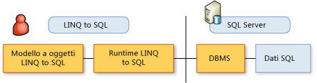

# Il modello a oggetti LINQ to SQL
In [!INCLUDE[vbtecdlinq](../../../../../../includes/vbtecdlinq-md.md)] viene eseguito il mapping di un modello a oggetti espresso nel linguaggio di programmazione dello sviluppatore al modello dati di un database relazionale.  Le operazioni sui dati vengono quindi eseguite in base al modello a oggetti.  
  
 In questo scenario non vengono eseguiti comandi di database, ad esempio `INSERT`, sul database,  bensì vengono modificati valori ed eseguiti metodi all'interno del modello a oggetti.  Quando si desidera eseguire una query sul database o inviare modifiche al database, [!INCLUDE[vbtecdlinq](../../../../../../includes/vbtecdlinq-md.md)] converte le richieste in comandi SQL corretti che vengono quindi inviati al database.  
  
   
  
 Nella tabella seguente sono riepilogati gli elementi più importanti nel modello a oggetti di [!INCLUDE[vbtecdlinq](../../../../../../includes/vbtecdlinq-md.md)] e le relative relazioni con gli elementi nel modello dati relazionale:  
  
|Modello a oggetti LINQ to SQL|Modello dati relazionale|  
|-----------------------------------|------------------------------|  
|Classe di entità|Tabella|  
|Membro di classe|Colonna|  
|Associazione|Relazione di chiave esterna|  
|Metodo|Stored procedure o funzione|  
  
> [!NOTE]
>  Nelle descrizioni seguenti si presuppone una conoscenza di base del modello dati relazionale e delle regole.  
  
## Classi di entità LINQ to SQL e tabelle di database  
 In [!INCLUDE[vbtecdlinq](../../../../../../includes/vbtecdlinq-md.md)] una tabella di database è rappresentata da una *classe di entità*.  Una classe di entità è analoga a qualsiasi altra classe creata dallo sviluppatore, con l'eccezione che per annotare la classe vengono usate informazioni speciali che associano la classe a una tabella di database.  Per creare tale annotazione, aggiungere un attributo personalizzato \(<xref:System.Data.Linq.Mapping.TableAttribute>\) alla dichiarazione della classe, come nell'esempio seguente:  
  
### Esempio  
 [!code-csharp[DLinqObjectModel#1](../../../../../../samples/snippets/csharp/VS_Snippets_Data/DLinqObjectModel/cs/Program.cs#1)]
 [!code-vb[DLinqObjectModel#1](../../../../../../samples/snippets/visualbasic/VS_Snippets_Data/DLinqObjectModel/vb/Module1.vb#1)]  
  
 Solo le istanze delle classi dichiarate come tabelle, ovvero le classi di entità, possono essere salvate nel database.  
  
 Per altre informazioni, vedere la sezione relativa all'attributo Table in [Mapping basato su attributi](../../../../../../docs/framework/data/adonet/sql/linq/attribute-based-mapping.md).  
  
## Membri di classe LINQ to SQL e colonne di database  
 Oltre all'associazione delle classi con le tabelle, è necessario definire i campi o le proprietà per rappresentare le colonne del database.  A questo scopo in [!INCLUDE[vbtecdlinq](../../../../../../includes/vbtecdlinq-md.md)] viene definito l'attributo <xref:System.Data.Linq.Mapping.ColumnAttribute>, come nell'esempio seguente:  
  
### Esempio  
 [!code-csharp[DLinqObjectModel#2](../../../../../../samples/snippets/csharp/VS_Snippets_Data/DLinqObjectModel/cs/Program.cs#2)]
 [!code-vb[DLinqObjectModel#2](../../../../../../samples/snippets/visualbasic/VS_Snippets_Data/DLinqObjectModel/vb/Module1.vb#2)]  
  
 Solo i campi e le proprietà di cui è stato eseguito il mapping alle colonne vengono salvati in modo permanente o recuperati dal database.  Quelli non dichiarati come colonne vengono considerati parti temporanee della logica dell'applicazione.  
  
 All'attributo <xref:System.Data.Linq.Mapping.ColumnAttribute> sono associate diverse proprietà che è possibile usare per personalizzare i membri che rappresentano colonne, ad esempio definendo un membro che rappresenta una colonna di chiave primaria.  Per altre informazioni, vedere la sezione relativa all'attributo Column in [Mapping basato su attributi](../../../../../../docs/framework/data/adonet/sql/linq/attribute-based-mapping.md).  
  
## Associazioni LINQ to SQL e relazioni di chiave esterna del database  
 In [!INCLUDE[vbtecdlinq](../../../../../../includes/vbtecdlinq-md.md)] per rappresentare associazioni di database, ad esempio relazioni da chiave esterna a chiave primaria, viene applicato l'attributo <xref:System.Data.Linq.Mapping.AssociationAttribute>.  Nel segmento di codice seguente la classe `Order` contiene una proprietà `Customer` con un attributo <xref:System.Data.Linq.Mapping.AssociationAttribute>.  Questa proprietà e il relativo attributo forniscono la classe `Order` con una relazione alla classe `Customer`.  
  
 Nell'esempio di codice riportato di seguito viene illustrata la proprietà `Customer` della classe `Order`.  
  
### Esempio  
 [!code-csharp[DLinqObjectModel#3](../../../../../../samples/snippets/csharp/VS_Snippets_Data/DLinqObjectModel/cs/northwind.cs#3)]
 [!code-vb[DLinqObjectModel#3](../../../../../../samples/snippets/visualbasic/VS_Snippets_Data/DLinqObjectModel/vb/northwind.vb#3)]  
  
 Per altre informazioni, vedere la sezione relativa all'attributo Association di [Mapping basato su attributi](../../../../../../docs/framework/data/adonet/sql/linq/attribute-based-mapping.md).  
  
## Metodi LINQ to SQL e stored procedure di database  
 [!INCLUDE[vbtecdlinq](../../../../../../includes/vbtecdlinq-md.md)] supporta stored procedure e funzioni definite dall'utente.  In [!INCLUDE[vbtecdlinq](../../../../../../includes/vbtecdlinq-md.md)] viene eseguito il mapping di queste astrazioni definite dal database agli oggetti client in modo che sia possibile accedervi in modo fortemente tipizzato dal codice client.  Le firme del metodo sono quanto più possibile simili alle firme delle procedure e delle funzioni definite nel database.  Per individuare questi metodi è possibile usare IntelliSense.  
  
 Un set di risultati restituito da una chiamata a una procedura con mapping è una raccolta fortemente tipizzata.  
  
 [!INCLUDE[vbtecdlinq](../../../../../../includes/vbtecdlinq-md.md)] esegue il mapping di stored procedure e funzioni ai metodi usando gli attributi <xref:System.Data.Linq.Mapping.FunctionAttribute> e <xref:System.Data.Linq.Mapping.ParameterAttribute>.  I metodi che rappresentano stored procedure si differenziano da quelli che rappresentano funzioni definite dall'utente per la proprietà <xref:System.Data.Linq.Mapping.FunctionAttribute.IsComposable%2A>.  Se questa proprietà è impostata su `false`, che corrisponde all'impostazione predefinita, il metodo rappresenta una stored procedure.  Se è impostata su `true`, il metodo rappresenta una funzione di database.  
  
> [!NOTE]
>  Se si usa [!INCLUDE[vs_current_short](../../../../../../includes/vs-current-short-md.md)], è possibile adoperare [!INCLUDE[vs_ordesigner_long](../../../../../../includes/vs-ordesigner-long-md.md)] per creare metodi con mapping a stored procedure e funzioni definite dall'utente.  
  
### Esempio  
 [!code-csharp[DLinqObjectModel#4](../../../../../../samples/snippets/csharp/VS_Snippets_Data/DLinqObjectModel/cs/northwind.cs#4)]
 [!code-vb[DLinqObjectModel#4](../../../../../../samples/snippets/visualbasic/VS_Snippets_Data/DLinqObjectModel/vb/northwind.vb#4)]  
  
 Per altre informazioni, vedere le sezioni relative agli attributi Function, Stored Procedure e Parameter in [Mapping basato su attributi](../../../../../../docs/framework/data/adonet/sql/linq/attribute-based-mapping.md) e [Stored procedure](../../../../../../docs/framework/data/adonet/sql/linq/stored-procedures.md).  
  
## Vedere anche  
 [Mapping basato su attributi](../../../../../../docs/framework/data/adonet/sql/linq/attribute-based-mapping.md)   
 [Informazioni complementari](../../../../../../docs/framework/data/adonet/sql/linq/background-information.md)