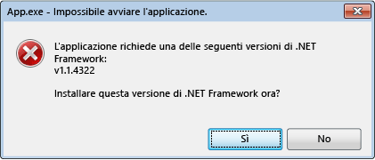
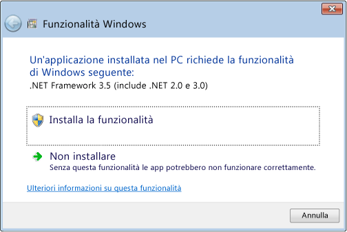

# Errori di inizializzazione di .NET Framework: gestione dell&#39;interfaccia utente
Il sistema di attivazione di Common Language Runtime \(CLR\) determina la versione di CLR che verrà utilizzato per eseguire il codice dell'applicazione gestito.  In alcuni casi, il sistema di attivazione potrebbe non essere in grado di trovare una versione di CLR da caricare.  Questa situazione si verifica in genere quando un'applicazione richiede una versione CLR non valida o non installata nel computer.  Se la versione richiesta non viene trovata, il sistema di attivazione CLR restituisce un codice di errore HRESULT dalla funzione o dall'interfaccia da cui è stato chiamato e può visualizzare un messaggio di errore all'utente che esegue l'applicazione.  In questo articolo sono presenti un elenco dei codici HRESULT e viene illustrato come sia possibile impedire la visualizzazione del messaggio di errore.  
  
 CLR fornisce un'infrastruttura di registrazione per eseguire il debug dei problemi di attivazione CLR, come descritto in [Procedura: debug dei problemi di attivazione CLR](../../../docs/framework/deployment/how-to-debug-clr-activation-issues.md).  Questa infrastruttura non deve essere confusa con i [log dell'associazione di assembly](../../../docs/framework/tools/fuslogvw-exe-assembly-binding-log-viewer.md), che sono completamente differenti.  
  
## Codici HRESULT di attivazione di CLR  
 Le API di attivazione CLR ritornano codici HRESULT per comunicare ad un host il risultato di un'operazione d'attivazione.  Gli host di CLR devono consultare sempre questi valori restituiti prima di procedere con le operazioni aggiuntive.  
  
-   CLR\_E\_SHIM\_RUNTIMELOAD  
  
-   CLR\_E\_SHIM\_RUNTIMEEXPORT  
  
-   CLR\_E\_SHIM\_INSTALLROOT  
  
-   CLR\_E\_SHIM\_INSTALLCOMP  
  
-   CLR\_E\_SHIM\_LEGACYRUNTIMEALREADYBOUND  
  
-   CLR\_E\_SHIM\_SHUTDOWNINPROGRESS  
  
## Interfaccia utente per gli errori di inizializzazione  
 Se il sistema di attivazione CLR non riesce a caricare la versione corretta del runtime richiesto da un'applicazione, viene visualizzato un messaggio di errore agli utenti per notificare loro che il computer non è correttamente configurato per eseguire l'applicazione e fornisce loro un'opzione per risolvere la situazione.  Il seguente messaggio di errore si presentata in genere in questa situazione.  L'utente può scegliere **Sì** per passare ad un sito Web Microsoft dove può scaricare la versione di .NET Framework corretta per l'applicazione.  
  
   
Messaggio di errore tipico per gli errori di inizializzazione  
  
## Correggere l'errore di inizializzazione  
 Lo sviluppatore ha a disposizione diverse opzioni per il controllo del messaggio di errore di inizializzazione di .NET Framework.  Ad esempio, è possibile utilizzare un flag di API per impedire che il messaggio venga visualizzato, come descritto nella sezione successiva.  Tuttavia, è ancora necessario risolvere il problema che ha impedito all'applicazione il caricamento del runtime richiesto.  In caso contrario, l'applicazione potrebbe non funzionare affatto, o alcune funzionalità potrebbero non essere disponibili.  
  
 Per risolvere i problemi sottostanti e garantire una migliore esperienza all'utente \(meno messaggi di errore\), raccomandiamo di seguire i seguenti punti:  
  
-   Per le applicazioni .NET Framework 3.5 \(e versioni precedenti\): Configurare l'applicazione in modo tale che supporti .NET Framework 4 o 4.5 \(vedere [istruzioni](../../../docs/framework/migration-guide/how-to-configure-an-app-to-support-net-framework-4-or-4-5.md)\).  
  
-   Per le applicazioni .NET Framework 4: Installare il pacchetto ridistribuibile di .NET Framework 4 come parte dell'impostazione dell'applicazione.  Vedere [Guida alla distribuzione per gli sviluppatori](../../../docs/framework/deployment/deployment-guide-for-developers.md).  
  
## Controllo del messaggio di errore  
 La visualizzazione del messaggio di errore il quale comunica che la versione di .NET Framework richiesta non è stata trovata può essere visualizzato agli utenti come servizio utile o come rumore secondario.  In entrambi i casi, è possibile controllare l'interfaccia utente passando i flag API dell'attivazione.  
  
 Il metodo [ICLRMetaHostPolicy::GetRequestedRuntime](../Topic/ICLRMetaHostPolicy::GetRequestedRuntime%20Method.md) accetta un membro di enumerazione [METAHOST\_POLICY\_FLAGS](../../../ocs/framework/unmanaged-api/hosting/metahost-policy-flags-enumeration.md) come input.  È possibile includere il flag di METAHOST\_POLICY\_SHOW\_ERROR\_DIALOG per richiedere un messaggio di errore se la versione richiesta di CLR non viene trovata.  Per impostazione predefinita, il messaggio di errore non viene visualizzato. \(Il metodo [ICLRMetaHost::GetRuntime](../Topic/ICLRMetaHost::GetRuntime%20Method.md) non accetta questo flag e non fornisce alcun altro modo per visualizzare il messaggio di errore.\)  
  
 Windows fornisce una funzione [SetErrorMode](http://go.microsoft.com/fwlink/p/?LinkID=255242) che può essere utilizzata per dichiarare se si desidera che i messaggi di errore siano visualizzati come conseguenza di codice in esecuzione all'interno del proprio processo.  È possibile specificare il flag SEM\_FAILCRITICALERRORS per impedire la visualizzazione del messaggio di errore.  
  
 In alcuni scenari, tuttavia, è importante eseguire l'override dell'impostazione SEM\_FAILCRITICALERRORS impostata mediante un processo dell'applicazione.  Ad esempio, se un componente COM nativo che ospita CLR è ospitato in un processo in cui è impostato SEM\_FAILCRITICALERRORS, è possibile eseguire l'override del flag, a seconda dell'impatto di visualizzazione dei messaggi di errore di tale processo.  In questo caso, è possibile utilizzare uno dei seguenti flag per eseguire l'override di SEM\_FAILCRITICALERRORS:  
  
-   Utilizzo METAHOST\_POLICY\_IGNORE\_ERROR\_MODE con il metodo [ICLRMetaHostPolicy::GetRequestedRuntime](../Topic/ICLRMetaHostPolicy::GetRequestedRuntime%20Method.md).  
  
-   Utilizzo RUNTIME\_INFO\_IGNORE\_ERROR\_MODE con la funzione [GetRequestedRuntimeInfo](../../../ocs/framework/unmanaged-api/hosting/getrequestedruntimeinfo-function.md).  
  
## Criteri dell'interfaccia utente per gli host forniti di CLR  
 CLR include un set di host per diversi scenari, quando si incontrano problemi nel caricamento della versione richiesta del runtime ognuno di questi host visualizzerà un messaggio di errore.  Nella tabella seguente viene fornito un elenco di host ed i relativi criteri del messaggio di errore.  
  
|Host CLR|Descrizione|Criteri del messaggio di errore|Può essere disabilitato il messaggio di errore?|  
|--------------|-----------------|-------------------------------------|-----------------------------------------------------|  
|Host EXE gestito|Avviare EXE gestiti.|Viene mostrato nel caso di una versione di .NET Framework mancante|No|  
|Host COM gestito|Carica componenti COM gestiti in un processo.|Viene mostrato nel caso di una versione di .NET Framework mancante|Sì, impostando il flag di SEM\_FAILCRITICALERRORS|  
|Host ClickOnce|Avvia applicazioni ClickOnce.|Viene mostrato nel caso di una versione di .NET Framework mancante, a partire da [!INCLUDE[net_v45](../../../includes/net-v45-md.md)]|No|  
|Host XBAP|Avviare applicazioni WPF XBAP.|Viene mostrato nel caso di una versione di .NET Framework mancante, a partire da [!INCLUDE[net_v45](../../../includes/net-v45-md.md)]|No|  
  
## Comportamento e interfaccia utente di [!INCLUDE[win8](../../../includes/win8-md.md)].  
 Il sistema di attivazione di CLR fornisce lo stesso comportamento ed interfaccia utente in [!INCLUDE[win8](../../../includes/win8-md.md)] e nelle altre versioni del sistema operativo Windows, ad eccezione di quando rileva i problemi nel caricare CLR 2.0.  [!INCLUDE[win8](../../../includes/win8-md.md)] include [!INCLUDE[net_v45](../../../includes/net-v45-md.md)], che utilizza CLR 4.5. Tuttavia, [!INCLUDE[win8](../../../includes/win8-md.md)] non include .NET Framework 2.0, 3.0, o 3.5, i quali utilizzano CLR 2.0.  Di conseguenza, le applicazioni che dipendono da CLR 2.0 non vengono eseguite su [!INCLUDE[win8](../../../includes/win8-md.md)] per impostazione predefinita.  Invece, viene visualizzata la seguente finestra di dialogo per consentire agli utenti di installare .NET Framework 3.5.  Gli utenti possono anche abilitare .NET Framework 3.5 dal Pannello di controllo.  Entrambe le opzioni sono descritte nell'articolo [Installazione di .NET Framework 3.5 in Windows 8 e versioni successive](../../../docs/framework/install/net-framework-3-5-on-windows-8-plus.md).  
  
   
Richiede l'installazione di .NET Framework 3.5 su richiesta  
  
> [!NOTE]
>  Il [!INCLUDE[net_v45](../../../includes/net-v45-md.md)] sostituisce .NET Framework 4 \(CLR 4\) nel computer dell'utente.  Di conseguenza, le applicazioni .NET Framework 4 vengono eseguite senza problemi, senza visualizzare questa finestra di dialogo, in [!INCLUDE[win8](../../../includes/win8-md.md)].  
  
 Quando è installato .NET Framework 3.5, gli utenti possono eseguire applicazioni che dipendono da .NET Framework 2.0, 3.0, o 3.5 nei computer [!INCLUDE[win8](../../../includes/win8-md.md)].  Possono inoltre eseguire applicazioni .NET Framework 1.0 e 1.1, a condizione che tali applicazioni non siano esplicitamente configurate per essere eseguite solo in .NET Framework 1.0 o 1.1.  Vedere [Migrazione da .NET Framework 1.1](../../../docs/framework/migration-guide/migrating-from-the-net-framework-1-1.md).  
  
 A partire da [!INCLUDE[net_v45](../../../includes/net-v45-md.md)], la registrazione di attivazione CLR è stata migliorata per includere le voci di registro che salvano le motivazioni della visualizzazione del messaggio di errore.  Per ulteriori informazioni, vedere [Procedura: debug dei problemi di attivazione CLR](../../../docs/framework/deployment/how-to-debug-clr-activation-issues.md).  
  
## Vedere anche  
 [Guida alla distribuzione per gli sviluppatori](../../../docs/framework/deployment/deployment-guide-for-developers.md)   
 [Procedura: configurare un'applicazione per supportare .NET Framework 4 o 4.5](../../../docs/framework/migration-guide/how-to-configure-an-app-to-support-net-framework-4-or-4-5.md)   
 [Procedura: debug dei problemi di attivazione CLR](../../../docs/framework/deployment/how-to-debug-clr-activation-issues.md)   
 [Installazione di .NET Framework 3.5 in Windows 8 e versioni successive](../../../docs/framework/install/net-framework-3-5-on-windows-8-plus.md)