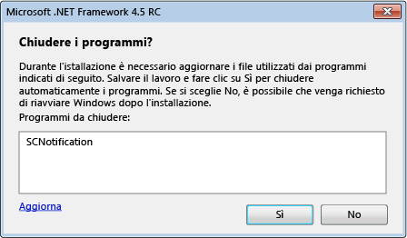

# Riduzione dei riavvii del sistema durante le installazioni di .NET Framework 4.5
Il programma di installazione di [!INCLUDE[net_v45](../../../includes/net-v45-md.md)] usa la [Gestione riavvio](http://go.microsoft.com/fwlink/?LinkId=231425) per impedire i riavvii del sistema quando possibile durante l'installazione.  Se il programma di installazione dell'applicazione installa .NET Framework, può interagire con Gestione Riavvio per utilizzare questa funzionalità.  Per ulteriori informazioni, vedere [Procedura: ottenere lo stato di avanzamento dal programma d'installazione di .NET Framework 4.5](../../../docs/framework/deployment/how-to-get-progress-from-the-dotnet-installer.md).  
  
## Motivi per un riavvio  
 L'installazione di [!INCLUDE[net_v45](../../../includes/net-v45-md.md)] richiede un riavvio del sistema se un'applicazione .NET Framework 4 viene utilizzata durante l'installazione.  Questo perché [!INCLUDE[net_v45](../../../includes/net-v45-md.md)] sostituisce i file di .NET Framework 4 e richiede che questi file siano disponibili durante l'installazione.  In molti casi, il riavvio può essere impedito mediante un preventivo rilevamento e la chiusura delle applicazioni .NET Framework 4 in uso.  Tuttavia, alcune applicazioni del sistema non devono essere chiuse.  In questi casi, un riavvio non può essere evitato.  
  
## Esperienza d'uso dell'Utente  
 Un utente che esegue l'installazione completa di [!INCLUDE[net_v45](../../../includes/net-v45-md.md)] ha l'opportunità di evitare il riavvio del sistema se il programma di installazione rileva applicazioni .NET Framework 4 in uso.  Un messaggio elenca tutte le applicazioni .NET Framework 4 in esecuzione e fornisce l'opzione di chiudere le applicazioni prima dell'installazione.  Se l'utente conferma, queste applicazioni vengono arrestate dal programma di installazione e il riavvio del sistema viene evitato.  Se l'utente non risponde al messaggio nei limiti di una certa quantità di tempo, l'installazione prosegue senza chiudere alcuna applicazione.  
  
 Se Gestione Riavvio rileva una situazione che richiede il riavvio del sistema anche se le applicazioni in esecuzione sono state chiuse, il messaggio non viene visualizzato.  
  
   
Mostra un messaggio di richiesta di chiusura delle applicazioni .NET Framework in esecuzione  
  
## Utilizzare un programma di installazione concatenato  
 Se si desidera ridistribuire .NET Framework con l'applicazione, ma si vuole utilizzare il proprio programma di installazione e la propria interfaccia utente, è possibile includere \(concatenare\) il processo di installazione di .NET Framework al proprio processo di installazione.  Per ulteriori informazioni sulle installazioni concatenate, vedere [Guida alla distribuzione per gli sviluppatori](../../../docs/framework/deployment/deployment-guide-for-developers.md).  Per ridurre i riavvii del sistema durante le installazioni concatenate, il programma di installazione di .NET Framework fornisce al proprio programma di installazione l'elenco delle applicazioni da chiudere.  Il programma di installazione deve fornire queste informazioni all'utente tramite un'interfaccia utente come una finestra di messaggio, ottenere la risposta dell'utente e passare la risposta al programma di installazione di .NET Framework.  Per un esempio di programma di installazione concatenato, vedere l'articolo [Procedura: ottenere lo stato di avanzamento dal programma d'installazione di .NET Framework 4.5](../../../docs/framework/deployment/how-to-get-progress-from-the-dotnet-installer.md).  
  
 Se si utilizza un programma di installazione concatenato, ma non si desidera fornire una finestra di messaggio per chiudere le applicazioni, è possibile utilizzare le opzioni `/passive` e `/showrmui` alla riga di comando quando si concatena il processo di installazione di .NET Framework.  Quando si utilizzano queste opzioni, il programma di installazione mostra la finestra di messaggio per chiudere le applicazioni, se è possibile chiuderle, per evitare il riavvio del sistema.  Questa finestra di messaggio si comporta allo stesso modo in modalità passiva e nell'interfaccia utente completa.  Vedere [Guida alla distribuzione per gli sviluppatori](../../../docs/framework/deployment/deployment-guide-for-developers.md) per il set completo di opzioni della riga di comando per il pacchetto ridistribuibile di .NET Framework.  
  
## Vedere anche  
 [Distribuzione](../../../docs/framework/deployment/net-framework-and-applications.md)   
 [Guida alla distribuzione per gli sviluppatori](../../../docs/framework/deployment/deployment-guide-for-developers.md)   
 [Procedura: ottenere lo stato di avanzamento dal programma d'installazione di .NET Framework 4.5](../../../docs/framework/deployment/how-to-get-progress-from-the-dotnet-installer.md)