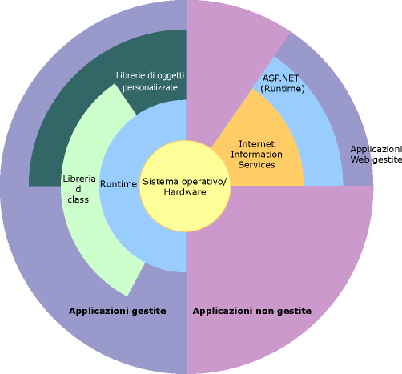

# Panoramica di .NET Framework
.NET Framework è una tecnologia che supporta la compilazione e l'esecuzione di applicazioni di ultima generazione e servizi Web XML. .NET Framework è progettata per ottenere gli obiettivi indicati di seguito:  
  
-   Fornire un ambiente di programmazione orientato agli oggetti coerente, sia che il codice degli oggetti sia memorizzato ed eseguito localmente, eseguito localmente ma distribuito su Internet oppure eseguito in modalità remota.  
  
-   Fornire un ambiente di esecuzione del codice che minimizzi la distribuzione del software e i conflitti di versioni.  
  
-   Fornire un ambiente di esecuzione del codice che permetta un'esecuzione sicura anche dei codici creati da produttori sconosciuti o semi-trusted.  
  
-   Fornire un ambiente di esecuzione del codice che elimini i problemi di prestazioni degli ambienti basati su script o interpretati.  
  
-   Rendere coerente l'esperienza dello sviluppatore attraverso tipi molto vari di applicazioni, quali applicazioni basate su Windows e applicazioni basate sul Web.  
  
-   Compilare tutte le comunicazioni in base agli standard industriali per assicurare che il codice basato su .NET Framework possa integrarsi con qualsiasi altro codice.  
  
> [!NOTE]
>  Per un'introduzione generale a .NET Framework per utenti e sviluppatori, vedere [Introduzione](../../../docs/framework/get-started/index.md). Per scaricare .NET Framework, vedere la [Guida all'installazione](../../../docs/framework/install/guide-for-developers.md).  
  
 .NET Framework è costituito da Common Language Runtime e dalla libreria di classi .NET Framework. Common Language Runtime rappresenta la base di .NET Framework e può essere considerato come un agente che gestisce il codice in fase di esecuzione, fornendo servizi di base quali gestione della memoria, gestione di thread e servizi remoti, attivando al contempo una rigida indipendenza dai tipi e altre forme di accuratezza del codice che permettano sicurezza ed efficienza. Il concetto di gestione del codice è infatti un principio fondamentale di runtime. Il codice destinato al runtime è definito codice gestito, mentre quello non destinato al runtime è definito codice non gestito. La libreria di classi è una raccolta completa orientata agli oggetti di tipi riutilizzabili che possono essere impiegati nello sviluppo delle applicazioni, da quelle tradizionali della riga di comando o con interfaccia utente grafica (GUI, Graphical User Interface) a quelle basate sulle più recenti innovazioni fornite da ASP.NET, quali Web Form e servizi Web XML.  
  
 .NET Framework può essere contenuto da componenti non gestiti che caricano Common Language Runtime nei processi e avviano l'esecuzione del codice gestito, creando così un ambiente software in grado di sfruttare funzionalità gestite e non gestite. .NET Framework non fornisce solo diversi host di runtime ma supporta anche lo sviluppo di host di runtime di altri produttori.  
  
 In ASP.NET è ad esempio disponibile il runtime per fornire un ambiente lato server scalabile per il codice gestito. È possibile utilizzare ASP.NET direttamente con il runtime per attivare applicazioni ASP.NET e servizi Web XLM, entrambi trattati più avanti in questo argomento.  
  
 Internet Explorer è un esempio di applicazione non gestita che contiene il runtime, in forma di estensione di tipo MIME. L'hosting del runtime tramite Internet Explorer consente di incorporare componenti gestiti o controlli Windows Form nei documenti HTML. Questo tipo di hosting rende possibile l'utilizzo del codice mobile gestito, ma con miglioramenti significativi che solo il codice gestito può offrire, ad esempio l'esecuzione parzialmente attendibile e l'archiviazione di file isolati.  
  
 Nella seguente illustrazione viene mostrata la relazione di Common Language Runtime e libreria di classi con le applicazioni e con l'intero sistema. Viene inoltre mostrato come opera il codice gestito all'interno di un'architettura più ampia.  
  
   
.NET Framework nel contesto  
  
 Nelle sezioni seguenti vengono descritte più dettagliatamente le principali funzionalità di .NET Framework.  
  
## Funzionalità di Common Language Runtime  
 Common Language Runtime gestisce la memoria, l'esecuzione di thread, l'esecuzione del codice, la verifica della sicurezza del codice, la compilazione e altri servizi di sistema. Queste funzionalità sono intrinseche al codice gestito che viene eseguito sul Common Language Runtime.  
  
 Per quanto riguarda la sicurezza, ai componenti gestiti vengono assegnati vari gradi di attendibilità in base a diversi fattori fra cui l'origine, ad esempio Internet, una rete aziendale o un computer locale. Un componente gestito quindi può essere o non essere in grado di eseguire operazioni di accesso a file, o al registro di sistema o altre funzioni riservate anche se utilizzato nella stessa applicazione attiva.  
  
 La sicurezza di accesso al codice è messa in atto dal runtime. Gli utenti possono ad esempio consentire a un eseguibile incorporato in una pagina Web di eseguire un'animazione sullo schermo o una canzone, ma non di accedere ai propri dati personali, al file system o alla rete. Le funzionalità di sicurezza del runtime consentono pertanto al software lecito distribuito su Internet di essere particolarmente ricco di funzionalità.  
  
 L'efficienza del codice è inoltre attivata dal runtime mediante l'implementazione di una rigida infrastruttura di verifica di tipi e codice denominata sistema di tipi comuni (CTS, Common Type System). CTS assicura che tutto il codice gestito sia auto descrittivo. I vari compilatori di linguaggio Microsoft e di terze parti generano codice gestito conforme a CTS. Questo significa che il codice gestito può utilizzare altre istanze e altri tipi gestiti, imponendo nel contempo, in modo rigoroso la fedeltà dei tipi e l'indipendenza dai tipi.  
  
 Inoltre l'ambiente gestito di runtime elimina molti problemi comuni di software. Nel runtime vengono ad esempio automaticamente gestiti il layout di oggetti e i riferimenti a oggetti, i quali vengono rilasciati quando non sono più utilizzati. Questa gestione automatica della memoria risolve i due errori più comuni delle applicazioni, ossia le perdite di memoria e i riferimenti a memoria non validi.  
  
 Grazie al runtime inoltre la produttività dello sviluppatore viene accelerata. I programmatori possono ad esempio scrivere applicazioni nel linguaggio di sviluppo scelto e sfruttare tutti i vantaggi del runtime, della libreria di classi e dei componenti scritti in altri linguaggi da altri sviluppatori. Questo risultato può essere raggiunto da qualsiasi fornitore di compilatori che sceglie di utilizzare il runtime. I compilatori di linguaggio destinati a .NET Framework rendono disponibili le funzionalità di .NET Framework al codice esistente scritto in tale linguaggio, facilitando notevolmente il processo di migrazione delle applicazioni esistenti.  
  
 Benché il runtime sia progettato per i programmi software futuri, supporta anche quelli attualmente disponibili e meno recenti. L'interoperabilità tra codice gestito e non gestito consente agli sviluppatori di continuare a utilizzare i componenti COM e le DLL che risultano necessari.  
  
 Il runtime è progettato per migliorare le prestazioni. Sebbene Common Language Runtime fornisca molti servizi runtime standard, il codice gestito non viene mai interpretato. Una funzionalità denominata compilazione JIT (Just In Time) consente a tutto il codice gestito di essere eseguito nel linguaggio macchina nativo del sistema su cui è in esecuzione. Contemporaneamente, il gestore di memoria impedisce la frammentazione della memoria e aumenta la rintracciabilità dei riferimenti della memoria per migliorare ulteriormente le prestazioni.  
  
 L'hosting del runtime può essere infine eseguito da applicazioni lato server a elevate prestazioni, quali Microsoft SQL Server e Internet Information Services (IIS). Questa infrastruttura consente di utilizzare il codice gestito per scrivere logica aziendale personalizzata, continuando a sfruttare le prestazioni superiori dei migliori server aziendali del settore che supportano l'hosting del runtime.  
  
## Libreria di classi .NET Framework  
 La libreria di classi .NET Framework è una raccolta di tipi riutilizzabili che si integrano strettamente con Common Language Runtime. La libreria di classi è orientata agli oggetti e fornisce tipi dai quali il codice gestito può derivare le funzionalità. In questo modo non solo viene semplificato l'utilizzo dei tipi .NET Framework ma viene anche ridotto il tempo necessario all'apprendimento delle nuove funzionalità di .NET Framework. È inoltre possibile integrare uniformemente i componenti di altri produttori nelle classi in .NET Framework.  
  
 Le classi di raccolte .NET Framework implementano ad esempio un set di interfacce che può essere utilizzato per sviluppare classi di raccolte personalizzate. Le classi di raccolte si mescoleranno in modo uniforme alle classi in .NET Framework.  
  
 Come ci si aspetta da una libreria di classi orientata agli oggetti, i tipi .NET Framework consentono di effettuare una gamma di attività comuni di programmazione, incluse operazioni quali la gestione di stringhe, la raccolta di dati, la connettività al database e l'accesso a file. Oltre a queste attività comuni, la libreria di classi include tipi che supportano vari scenari di sviluppo specializzati. È ad esempio possibile utilizzare .NET Framework per sviluppare i seguenti tipi di applicazioni e servizi:  
  
-   applicazioni console Vedere [Compilazione di applicazioni console](../../../docs/standard/building-console-apps.md).  
  
-   applicazioni GUI Windows (Windows Form) Vedere [Windows Form](../../../docs/framework/winforms/index.md).  
  
-   Applicazioni Windows Presentation Foundation (WPF). Vedere [Windows Presentation Foundation](../../../docs/framework/wpf/index.md).  
  
-   applicazioni ASP.NET Vedere [Applicazioni Web con ASP.NET](../../../docs/framework/develop-web-apps-with-aspnet.md).  
  
-   Servizi Windows. Vedere [Introduzione alle applicazioni di servizio Windows](../../../docs/framework/windows-services/introduction-to-windows-service-applications.md).  
  
-   Applicazioni orientate ai servizi che utilizzano Windows Communication Foundation (WCF). Vedere [Applicazioni orientate ai servizi con WCF](../../../docs/framework/wcf/index.md).  
  
-   Applicazioni basate sul flusso di lavoro che utilizzano Windows Workflow Foundation (WF). Vedere [Compilazione di flussi di lavoro in .NET Framework](http://msdn.microsoft.com/en-us/cbf3880f-dc7b-466d-b808-1109b1223f4a).  
  
 Le classi Windows Form ad esempio sono un insieme completo di tipi riutilizzabili che semplificano ampiamente lo sviluppo di GUI Windows. Se si scrive un'applicazione Web Form ASP.NET, è possibile utilizzare le classi Web Form.  
  
## Vedere anche  
 [Requisiti di sistema](../../../docs/framework/get-started/system-requirements.md)   
 [Guida all'installazione](../../../docs/framework/install/guide-for-developers.md)   
 [Guida di sviluppo](../../../docs/framework/development-guide.md)   
 [Strumenti](../../../docs/framework/tools/index.md)   
 [Esempi di .NET Framework](http://msdn.microsoft.com/en-us/177055f8-4a1f-43e7-aee6-995c196079b1)   
 [Libreria di classi .NET Framework](http://go.microsoft.com/fwlink/?LinkID=227195)
