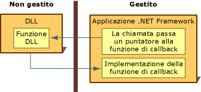

# Callback Functions
Una funzione di callback è il codice di una applicazione gestita che agevola una funzione di DLL non gestita nel completamento di un'attività.  Le chiamate di una funzione di callback passano indirettamente da un'applicazione gestita a una funzione di DLL, per tornare poi nuovamente all'implementazione gestita.  Alcune delle numerose funzioni di DLL a cui si accede tramite platform invoke richiedono, per essere eseguite in modo corretto, una funzione di callback nel codice gestito.  
  
 Nella maggior parte dei casi, per chiamare una funzione di DLL dal codice gestito, si crea e si utilizza una definizione gestita della funzione.  Il processo è semplice.  
  
 L'utilizzo di una funzione di DLL che richiede una funzione di callback prevede alcuni passaggi aggiuntivi.  In primo luogo è necessario determinare se la funzione richiede un callback, controllando la documentazione relativa alla funzione.  Successivamente occorre creare la funzione di callback nella propria applicazione gestita.  Infine si chiama la funzione di DLL passandole come argomento un puntatore alla funzione di callback.  Tali passaggi sono riepilogati nella figura che segue.  
  
   
Funzione di callback e implementazione  
  
 Le funzioni di callback sono ideali per i casi in cui un'attività viene eseguita ripetutamente.  Un altro utilizzo comune è quello con le funzioni di enumerazione, quali **EnumFontFamilies**, **EnumPrinters** e **EnumWindows**, contenute nell'API Win32.  La funzione **EnumWindows** esegue l'enumerazione di tutte le finestre esistenti nel computer, chiamando la funzione di callback per eseguire un'attività su ciascuna finestra.  Per istruzioni e per un esempio, vedere [Procedura: implementare funzioni di callback](../../../docs/framework/interop/how-to-implement-callback-functions.md).  
  
## Vedere anche  
 [How to: Implement Callback Functions](../../../docs/framework/interop/how-to-implement-callback-functions.md)   
 [Calling a DLL Function](../../../docs/framework/interop/calling-a-dll-function.md)