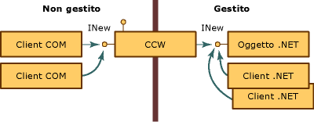
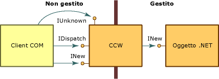

# COM Callable Wrapper
Quando un client COM chiama un oggetto .NET, Common Language Runtime crea l'oggetto gestito e un COM Callable Wrapper \(CCW\) per l'oggetto.  Incapaci di fare riferimento diretto a un oggetto .NET, i client COM usano il CCW come un proxy per l'oggetto gestito.  
  
 Il runtime crea esattamente un CCW per ciascun oggetto gestito, indipendentemente dal numero di client COM che ne richiedono i servizi.  Come mostrato nella figura seguente, più client COM possono mantenere un riferimento allo stesso CCW che espone l'interfaccia INew.  Il CCW mantiene a sua volta un solo riferimento all'oggetto gestito che implementa l'interfaccia ed è sottoposto alla procedura di Garbage Collection.  Sia i client COM che i client .NET possono effettuare contemporaneamente richieste sullo stesso oggetto gestito.  
  
   
Accesso a oggetti .NET tramite COM Callable Wrapper  
  
 I COM Callable Wrapper sono invisibili alle altre classi in esecuzione in .NET Framework.  Il loro scopo principale è effettuare il marshalling delle chiamate tra il codice gestito e quello non gestito. Tuttavia, i CCW gestiscono anche l'identità e la durata degli oggetti gestiti di cui eseguono il wrapping.  
  
## Identità dell'oggetto  
 Il runtime alloca per l'oggetto .NET memoria attinta dall'heap sottoposto a Garbage Collection. In tal modo si consente al runtime di spostare l'oggetto in memoria a seconda delle esigenze.  Al contrario, il runtime alloca per il CCW memoria attinta da un heap non soggetto a Garbage Collection, consentendo così ai client COM di fare riferimento al wrapper direttamente.  
  
## Durata dell'oggetto  
 Diversamente dal client .NET di cui esegue il wrapping, il CCW è destinatario di riferimenti conteggiati in modo tradizionale \(COM\).  Quando il conteggio dei riferimenti al CCW raggiunge lo zero, il wrapper rilascia il proprio riferimento all'oggetto gestito.  Gli oggetti gestiti senza più riferimenti vengono raccolti durante la successiva procedura di Garbage Collection.  
  
## Simulazione di interfacce COM  
 Il [COM Callable Wrapper](../../../docs/framework/interop/com-callable-wrapper.md) \(CCW\) espone ai client COM tutti i tipi di dati, i valori restituiti e le interfacce pubbliche visibili a COM in modo conforme al meccanismo di interazione COM basato sulle interfacce.  Per un client COM, richiamare i metodi di un oggetto .NET Framework non è diverso dal richiamare i metodi di un oggetto COM.  
  
 Per assicurare questo approccio naturale, il CCW crea interfacce COM tradizionali quali **IUnknown** e **IDispatch**.  Come mostrato nella figura seguente, il CCW mantiene un solo riferimento all'oggetto .NET di cui esegue il wrapping.  Il client COM e l'oggetto .NET interagiscono tramite il proxy e lo stub del CCW.  
  
   
Interfacce COM e COM Callable Wrapper  
  
 Oltre a esporre le interfacce che sono esplicitamente implementate da una classe dell'ambiente gestito, .NET Framework fornisce per l'oggetto un'implementazione delle interfacce COM elencate nella tabella che segue.  Una classe .NET può eseguire l'override del comportamento predefinito fornendo la propria implementazione di queste interfacce.  Il runtime tuttavia fornisce sempre l'implementazione delle interfacce **IUnknown** e **IDispatch**.  
  
|Interfaccia|Descrizione|  
|-----------------|-----------------|  
|**Idispatch**|Fornisce un meccanismo per l'associazione tardiva al tipo.|  
|**IErrorInfo**|Fornisce una descrizione testuale dell'errore, la relativa origine, un file della Guida, un contesto della Guida e il GUID dell'interfaccia che ha definito l'errore \(sempre **GUID\_NULL** per le classi .NET\).|  
|**IProvideClassInfo**|Consente ai client COM di ottenere l'accesso all'interfaccia **ITypeInfo** implementata da una classe gestita.|  
|**IsupportErrorInfo**|Consente a un client COM di determinare se l'oggetto gestito supporta l'interfaccia **IErrorInfo**.  Se sì, consente al client di ottenere un puntatore all'ultimo oggetto eccezione.  Tutti i tipi gestiti supportano l'interfaccia **IErrorInfo**.|  
|**ItypeInfo**|Fornisce per le classi le stesse informazioni sul tipo che fornisce Tlbexp.exe.|  
|**Iunknown**|Fornisce l'implementazione standard dell'interfaccia **IUnknown** con cui il client COM gestisce la durata del CCW e provvede alla coercizione dei tipi.|  
  
 Le classi gestite possono anche fornire le interfacce COM descritte nella tabella che segue.  
  
|Interfaccia|Descrizione|  
|-----------------|-----------------|  
|L'interfaccia della classe \(\_*nomeclasse*\)|Interfaccia, esposta dal runtime e non definita esplicitamente, che espone tutte le interfacce, i metodi, le proprietà e i campi pubblici esplicitamente esposti su un oggetto gestito.|  
|**IConnectionPoint** e **IconnectionPointContainer**|Interfaccia per oggetti che originano eventi basati su delegati \(un'interfaccia per la registrazione di sottoscrittori di eventi\).|  
|**IdispatchEx**|Interfaccia fornita dal runtime se la classe implementa **IExpando**.  L'interfaccia **IDispatchEx** è un'estensione dell'interfaccia **IDispatch** che, diversamente da **IDispatch**, abilita l'enumerazione, l'aggiunta, l'eliminazione e la chiamata dei membri con distinzione tra maiuscole e minuscole.|  
|**IEnumVARIANT**|Interfaccia per classi di tipo raccolta, che enumera gli oggetti della raccolta se la classe implementa **IEnumerable**.|  
  
## Introduzione all'interfaccia della classe  
 L'interfaccia della classe, che non è definita esplicitamente nel codice gestito, è un'interfaccia che espone tutte le proprietà, i campi, gli eventi e i metodi pubblici esplicitamente esposti dall'oggetto .NET.  Tale interfaccia può essere duale o solo dispatch.  L'interfaccia della classe riceve il nome dalla classe .NET stessa, preceduto da un carattere di sottolineatura.  Per la classe Mammal, ad esempio l'interfaccia della classe sarà \_Mammal.  
  
 Per le classi derivate, l'interfaccia della classe espone anche tutti i metodi, le proprietà e i campi pubblici della classe base.  La classe derivata espone anche un'interfaccia della classe per ciascuna classe base.  Se ad esempio la classe Mammal estende la classe MammalSuperclass, che a sua volta estende la classe System.Object, l'oggetto .NET esporrà ai client COM tre interfacce della classe denominate \_Mammal, \_MammalSuperclass e \_Object.  
  
 Si consideri ad esempio la classe .NET seguente:  
  
```vb  
' Applies the ClassInterfaceAttribute to set the interface to dual.  
<ClassInterface(ClassInterfaceType.AutoDual)> _  
' Implicitly extends System.Object.  
Public Class Mammal  
    Sub Eat()  
    Sub Breathe()  
    Sub Sleep()  
End Class  
  
```  
  
```csharp  
// Applies the ClassInterfaceAttribute to set the interface to dual.  
[ClassInterface(ClassInterfaceType.AutoDual)]  
// Implicitly extends System.Object.  
public class Mammal  
{  
    void  Eat();  
    void  Breathe():  
    void  Sleep();  
}  
```  
  
 Il client COM può ottenere un puntatore a un'interfaccia della classe denominata `_Mammal`, che è descritta nella libreria dei tipi generata dall'[utilità di esportazione della libreria dei tipi \(Tlbexp.exe\)](../../../docs/framework/tools/tlbexp-exe-type-library-exporter.md).  Se la classe `Mammal` implementa una o più interfacce, queste appariranno sotto la coclasse.  
  
```  
[odl, uuid(…), hidden, dual, nonextensible, oleautomation]  
interface _Mammal : IDispatch  
{  
    [id(0x00000000), propget] HRESULT ToString([out, retval] BSTR*  
        pRetVal);  
    [id(0x60020001)] HRESULT Equals([in] VARIANT obj, [out, retval]  
        VARIANT_BOOL* pRetVal);  
    [id(0x60020002)] HRESULT GetHashCode([out, retval] short* pRetVal);  
    [id(0x60020003)] HRESULT GetType([out, retval] _Type** pRetVal);  
    [id(0x6002000d)] HRESULT Eat();  
    [id(0x6002000e)] HRESULT Breathe();  
    [id(0x6002000f)] HRESULT Sleep();  
}  
[uuid(…)]  
coclass Mammal   
{  
    [default] interface _Mammal;  
}  
```  
  
 La generazione dell'interfaccia della classe è facoltativa.  Per impostazione predefinita, l'interoperabilità COM genera un'interfaccia solo dispatch per ogni classe esportata in una libreria dei tipi.  È possibile modificare o impedire la creazione automatica di questa interfaccia applicando alla classe l'oggetto <xref:System.Runtime.InteropServices.ClassInterfaceAttribute>.  Benché l'interfaccia della classe possa semplificare l'esposizione di classi gestite a COM, gli usi che è possibile farne sono limitati.  
  
> [!CAUTION]
>  Usare l'interfaccia della classe, anziché definire esplicitamente un'interfaccia personalizzata, può complicare il futuro controllo delle versioni della classe gestita.  Prima di usare l'interfaccia della classe, leggere le indicazioni riportate di seguito.  
  
### Definire un'interfaccia esplicita per i client COM anziché generare l'interfaccia della classe.  
 Poiché l'interoperabilità COM genera l'interfaccia della classe automaticamente, le modifiche apportate alla classe dopo l'emissione di una versione possono alterare il layout dell'interfaccia della classe esposta da Common Language Runtime.  Se si cambia il layout dei membri della classe, la maggior parte dei client COM, che solitamente non è in grado di gestire le modifiche al layout di un'interfaccia, cesserà di funzionare.  
  
 Queste indicazioni ribadiscono il concetto che le interfacce esposte ai client COM devono restare immodificabili.  Per ridurre il rischio di compromettere il funzionamento dei client COM riordinando inavvertitamente il layout dell'interfaccia, separare tutte le modifiche alla classe dal layout dell'interfaccia definendo esplicitamente le interfacce.  
  
 Usare **ClassInterfaceAttribute** per disattivare la generazione automatica dell'interfaccia della classe e implementare un'interfaccia esplicita per la classe, come illustrato nel frammento di codice seguente:  
  
```vb  
<ClassInterface(ClassInterfaceType.None)>Public Class LoanApp  
    Implements IExplicit  
    Sub M() Implements IExplicit.M  
…  
End Class  
  
```  
  
```csharp  
[ClassInterface(ClassInterfaceType.None)]  
public class LoanApp : IExplicit {  
    void M();  
}  
```  
  
 Il valore **ClassInterfaceType.None** impedisce la generazione dell'interfaccia della classe quando i metadati della classe vengono esportati in una libreria dei tipi.  Nel precedente esempio, i client COM possono accedere alla classe `LoanApp` solo tramite l'interfaccia `IExplicit`.  
  
### Evitare la memorizzazione nella cache degli identificatori dispatch \(DispId\).  
 L'uso dell'interfaccia della classe è ammissibile per i client basati su script, i client Microsoft Visual Basic 6.0 o qualsiasi client ad associazione tardiva che non inserisce nella cache i DispId dei membri di interfaccia.  I DispId identificano i membri di interfaccia per abilitare l'associazione tardiva.  
  
 Per l'interfaccia della classe, la generazione dei DispId è basata sulla posizione dei membri nell'interfaccia.  Se si cambia l'ordine dei membri e si esporta la classe in una libreria dei tipi, si altereranno i DispId generati nell'interfaccia della classe.  
  
 Per evitare di compromettere il funzionamento dei client COM ad associazione tardiva quando si usa questa interfaccia, applicare **ClassInterfaceAttribute** con il valore **ClassInterfaceType.AutoDispatch**.  Tale valore implementa un'interfaccia della classe solo dispatch, ma omette la descrizione dell'interfaccia dalla libreria dei tipi.  Senza una descrizione dell'interfaccia, i client non potranno inserire i DispId nella cache in fase di compilazione.  Benché questo sia il tipo di interfaccia predefinito per l'interfaccia della classe, è possibile applicare il valore dell'attributo in modo esplicito.  
  
```vb  
<ClassInterface(ClassInterfaceType.AutoDispatch)> Public Class LoanApp  
    Implements IAnother  
    Sub M() Implements IAnother.M  
…  
End Class  
  
```  
  
```csharp  
[ClassInterface(ClassInterfaceType.AutoDispatch]  
public class LoanApp : IAnother {  
    void M();  
}  
```  
  
 Per ottenere il DispId di un membro di interfaccia in fase di esecuzione, i client COM possono chiamare **IDispatch.GetIdsOfNames**.  Per richiamare un metodo sull'interfaccia, passare il DispId restituito come argomento a **IDispatch.Invoke**.  
  
### Limitare l'uso dell'opzione di interfaccia duale per l'interfaccia della classe.  
 Le interfacce duali permettono ai client COM di effettuare sia l'associazione anticipata che l'associazione tardiva ai membri di interfaccia.  In fase di progettazione e durante il test, può risultare utile impostare l'interfaccia della classe su duale.  Per una classe gestita \(e le relative classi base\) che non verrà mai modificata, questa opzione è accettabile.  In tutti gli altri casi è preferibile evitare di impostare l'interfaccia della classe su duale.  
  
 Un'interfaccia duale generata automaticamente può essere appropriata in alcuni casi meno comuni. Nella maggior parte dei casi creerà invece complicazioni in relazione alla gestione delle versioni.  Ad esempio, il funzionamento dei client COM che usano l'interfaccia della classe di una classe derivata verrà facilmente compromesso in conseguenza di modifiche della classe base.  Quando la classe base è fornita da terzi, il layout dell'interfaccia della classe sarà fuori dal proprio controllo.  Diversamente da un'interfaccia solo dispatch, un'interfaccia duale \(**ClassInterface.AutoDual**\) fornisce inoltre una descrizione dell'interfaccia della classe nella libreria dei tipi esportata.  Tale descrizione invita i client ad associazione tardiva a inserire nella cache i DispId in fase di esecuzione.  
  
## Vedere anche  
 <xref:System.Runtime.InteropServices.ClassInterfaceAttribute>   
 [COM Callable Wrapper](../../../docs/framework/interop/com-callable-wrapper.md)   
 [COM Wrappers](../../../docs/framework/interop/com-wrappers.md)   
 [Exposing .NET Framework Components to COM](../../../docs/framework/interop/exposing-dotnet-components-to-com.md)   
 [Simulating COM Interfaces](http://msdn.microsoft.com/it-it/ad2ab959-e2be-411b-aaff-275c3fba606c)   
 [Qualifying .NET Types for Interoperation](../../../docs/framework/interop/qualifying-net-types-for-interoperation.md)   
 [Runtime Callable Wrapper](../../../docs/framework/interop/runtime-callable-wrapper.md)