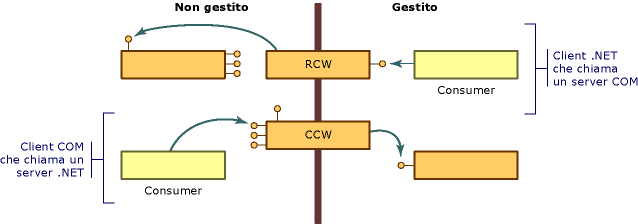

# COM Wrappers
COM differisce dal modello a oggetti di .NET Framework in diversi punti:  
  
-   I client degli oggetti COM devono gestire la durata di tali oggetti. Common Language Runtime gestisce la durata degli oggetti nel proprio ambiente.  
  
-   I client degli oggetti COM sanno se un servizio è disponibile avanzando una richiesta a un'interfaccia e ricevendo o meno in risposta un puntatore a interfaccia.  I client di oggetti .NET possono ottenere una descrizione delle funzionalità di un oggetto tramite reflection.  
  
-   Gli oggetti .NET risiedono nella memoria gestita dall'ambiente di esecuzione di .NET Framework.  Al fine di incrementare le prestazioni, l'ambiente di esecuzione può spostare gli oggetti all'interno della memoria e aggiornare tutti i riferimenti agli oggetti che sposta.  I client non gestiti, dopo aver ottenuto un puntatore a un oggetto, fidano sul fatto che l'oggetto resti nella stessa posizione.  Tali client non dispongono di meccanismi per interagire con oggetti la cui posizione non è fissa.  
  
 Per ovviare a tali differenze, il runtime fornisce classi wrapper grazie alle quali sia ai client gestiti che a quelli non gestiti sembra sempre di chiamare oggetti appartenenti al proprio ambiente.  Ogni volta che un client gestito chiama un metodo di un oggetto COM, il runtime crea un [Runtime Callable Wrapper](../../../docs/framework/interop/runtime-callable-wrapper.md) \(RCW\).  Tra l'altro, gli RCW nascondono le differenze tra meccanismi di riferimento gestiti e non gestiti.  Il runtime è anche in grado di creare un [COM Callable Wrapper](../../../docs/framework/interop/com-callable-wrapper.md) \(CCW\) per ottenere il risultato inverso, ovvero per consentire a un client COM di chiamare senza difficoltà un metodo di un oggetto .NET.  Come illustrato nella figura che segue, la prospettiva del codice chiamante determina quale classe wrapper verrà creata dal runtime.  
  
   
Cenni preliminari sul wrapper COM  
  
 Nella maggior parte dei casi, l'RCW o il CCW generato dal runtime fornisce un adeguato marshalling per le chiamate che varcano i confini tra COM e .NET Framework.  L'utilizzo di attributi personalizzati consente eventualmente di modificare il modo in cui il runtime rappresenta il codice gestito e non gestito.  
  
## Vedere anche  
 [Advanced COM Interoperability](http://msdn.microsoft.com/it-it/3ada36e5-2390-4d70-b490-6ad8de92f2fb)   
 [Runtime Callable Wrapper](../../../docs/framework/interop/runtime-callable-wrapper.md)   
 [COM Callable Wrapper](../../../docs/framework/interop/com-callable-wrapper.md)   
 [Customizing Standard Wrappers](http://msdn.microsoft.com/it-it/c40d089b-6a3c-41b5-a20d-d760c215e49d)   
 [How to: Customize Runtime Callable Wrappers](http://msdn.microsoft.com/it-it/4a4bb3da-4d60-4517-99f2-78d46a681732)