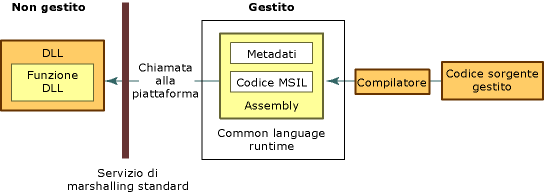

# Consuming Unmanaged DLL Functions
Platform invoke è un servizio che consente al codice gestito di chiamare funzioni non gestite implementate in librerie a collegamento dinamico \(DLL\), come quelle nell'API Win32.  Individua e richiama una funzione esportata ed esegue il marshalling degli argomenti \(Integer, stringhe, matrici, strutture e così via\) nel limite dell'interazione, in base alle necessità.  Per altre informazioni su questo servizio, vedere [Informazioni dettagliate su platform invoke](http://msdn.microsoft.com/it-it/ba9dd55b-2eaa-45cd-8afd-75cb8d64d243).  
  
 Questa sezione presenta diverse attività associate all'utilizzo di funzioni DLL non gestite.  Oltre alle seguenti attività, vengono illustrate alcune considerazioni generali e viene fornito un collegamento a informazioni ed esempi aggiuntivi.  
  
#### Per usare le funzioni DLL esportate  
  
1.  [Identificare le funzioni nelle DLL](../../../docs/framework/interop/identifying-functions-in-dlls.md).  
  
     È necessario specificare almeno il nome della funzione e il nome della DLL che la contiene.  
  
2.  [Creare una classe che contenga le funzioni DLL](../../../docs/framework/interop/creating-a-class-to-hold-dll-functions.md).  
  
     È possibile usare una classe esistente, creare una classe per ogni funzione non gestita o creare una classe contenente un set di funzioni non gestite correlate.  
  
3.  [Creare prototipi nel codice gestito](../../../docs/framework/interop/creating-prototypes-in-managed-code.md).  
  
     \[Visual Basic\] Usare l'istruzione **Declare** con le parole chiave **Function** e **Lib**.  In pochissimi casi, è possibile usare **DllImportAttribute** con le parole chiave **Shared Function**.  Questi casi vengono illustrati più avanti in questa sezione.  
  
     \[C\#\] Usare **DllImportAttribute** per identificare la DLL e la funzione.  Contrassegnare il metodo con i modificatori **static** ed **extern**.  
  
     \[C\+\+\] Usare **DllImportAttribute** per identificare la DLL e la funzione.  Contrassegnare il metodo o la funzione wrapper con **extern "C"**.  
  
4.  [Chiamare una funzione DLL](../../../docs/framework/interop/calling-a-dll-function.md)  
  
     Chiamare il metodo sulla classe gestita come qualsiasi altro metodo gestito.  Il [passaggio di strutture](../../../docs/framework/interop/passing-structures.md) e l'[implementazione di funzioni di callback](../../../docs/framework/interop/callback-functions.md) sono casi particolari.  
  
 Per esempi che illustrano come costruire dichiarazioni basate su .NET da usare con platform invoke, vedere [Marshalling dei dati con platform invoke](../../../docs/framework/interop/marshaling-data-with-platform-invoke.md).  
  
## Informazioni dettagliate su platform invoke  
 Platform invoke si basa sui metadati per individuare le funzioni esportate ed eseguire il marshalling degli argomenti in fase di esecuzione.  Nell'illustrazione seguente viene mostrato questo processo.  
  
   
Chiamata di platform invoke a una funzione DLL non gestita  
  
 Quando platform invoke chiama una funzione non gestita, esegue la sequenza di azioni seguente:  
  
1.  Individua la DLL contenente la funziona.  
  
2.  Carica la DLL in memoria.  
  
3.  Individua l'indirizzo della funzione in memoria ed effettua il push degli argomenti nello stack, eseguendo il marshalling dei dati in base alle necessità.  
  
    > [!NOTE]
    >  L'individuazione e il caricamento della DLL e l'individuazione dell'indirizzo della funzione in memoria si verificano solo alla prima chiamata alla funzione.  
  
4.  Trasferisce il controllo alla funzione non gestita.  
  
 Platform invoke dà luogo a eccezioni generate dalla funzione non gestita per il chiamante gestito.  
  
## Vedere anche  
 [Interoperating with Unmanaged Code](../../../docs/framework/interop/index.md)   
 [Platform Invoke Examples](../../../docs/framework/interop/platform-invoke-examples.md)   
 [Interop Marshaling](../../../docs/framework/interop/interop-marshaling.md)   
 [Consuming Unmanaged DLL Functions](../../../docs/framework/interop/consuming-unmanaged-dll-functions.md)