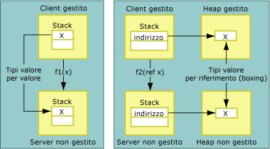
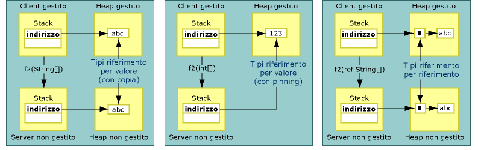

# Copying and Pinning
Durante il marshalling, il gestore di marshalling di interoperabilità può copiare o bloccare i dati interessati.  Mediante l'operazione di copia, una copia dei dati viene spostata da una posizione nella memoria a un'altra.  Nell'illustrazione riportata di seguito vengono mostrate le differenze esistenti tra la copia di un tipo di valore e quella di un tipo passato per riferimento dalla memoria gestita a quella non gestita.  
  
   
Tipi di valore passati per valore e per riferimento  
  
 Il marshalling degli argomenti del metodo passati per valore viene eseguito nel codice non gestito come valori sullo stack.  Il processo di copia è diretto.  Gli argomenti passati per riferimento vengono passati come puntatori sullo stack.  I tipi di riferimento vengono anche passati per valore e per riferimento.  Come mostrato nell'illustrazione riportata di seguito, i tipi di riferimento passati per valore vengono copiati o bloccati.  
  
   
Tipi di riferimento passati per valore e per riferimento  
  
 Con il blocco, i dati vengono temporaneamente bloccati nella posizione di memoria corrente, impedendone quindi il riposizionamento da parte del Garbage Collector di Common Language Runtime.  I dati vengono bloccati dal gestore di marshalling per ridurre il sovraccarico dell'operazione di copia e migliorare le prestazioni.  In base al tipo, si stabilisce se i dati verranno copiati o bloccati nel corso del processo di marshalling.  Sebbene il blocco venga eseguito automaticamente durante il marshalling per oggetti come <xref:System.String>, è comunque possibile bloccare la memoria manualmente attraverso la classe <xref:System.Runtime.InteropServices.GCHandle>.  
  
## Classi copiabili formattate  
 Le classi [copiabili](../../../docs/framework/interop/blittable-and-non-blittable-types.md) formattate hanno un layout fisso \(formattato\) e una rappresentazione dei dati comune sia nella memoria gestita che in quella non gestita.  Quando questi tipi richiedono il marshalling, un puntatore all'oggetto nell'heap viene passato direttamente al chiamato,  il quale può modificare il contenuto della posizione di memoria a cui il puntatore fa riferimento.  
  
> [!NOTE]
>  Il chiamato può modificare il contenuto della memoria se il parametro è impostato su Out o In\/Out.  Al contrario, deve evitare di modificare il contenuto quando il parametro è impostato su In per eseguire il marshalling, vale a dire sull'impostazione predefinita per i tipi copiabili formattati.  La modifica di un oggetto In genera problemi quando la stessa classe viene esportata in una libreria dei tipi e utilizzata per effettuare chiamate su più apartment.  
  
## Classi non copiabili formattate  
 Le classi [non copiabili](../../../docs/framework/interop/blittable-and-non-blittable-types.md) formattate hanno un layout fisso \(formattato\), ma una rappresentazione dei dati diversa nella memoria gestita e in quella non gestita.  Può essere necessaria la trasformazione dei dati nelle condizioni elencate di seguito:  
  
-   Se si esegue il marshalling di una classe non copiabile per valore, il chiamato riceve un puntatore a una copia della struttura dei dati.  
  
-   Se si esegue il marshalling di una classe non copiabile per riferimento, il chiamato riceve un puntatore a un puntatore a una copia della struttura dei dati.  
  
-   Se si imposta l'attributo <xref:System.Runtime.InteropServices.InAttribute>, la copia viene sempre inizializzata con lo stato dell'istanza. Il marshalling viene eseguito secondo necessità.  
  
-   Se si imposta l'attributo <xref:System.Runtime.InteropServices.OutAttribute>, lo stato viene sempre restituito come copia all'istanza. Il marshalling viene eseguito secondo necessità.  
  
-   Se si impostano sia **InAttribute** che **OutAttribute**, sono richieste entrambe le copie.  Se si omette uno degli attributi, il gestore di marshalling può ottimizzare il processo eliminando una delle copie.  
  
## Tipi di riferimento  
 È possibile passare i tipi di riferimento per valore o per riferimento.  Quando sono passati per valore, sullo stack viene passato un puntatore al tipo.  Quando sono passati per riferimento, sullo stack viene passato un puntatore a un puntatore al tipo.  
  
 I tipi di riferimento si comportano in base alle condizioni elencate di seguito:  
  
-   Se un tipo riferimento viene passato per valore e possiede membri di tipo non copiabile, i tipi vengono convertiti due volte:  
  
    -   Quando si passa un argomento al lato non gestito.  
  
    -   In risposta alla chiamata.  
  
     Per evitare inutili operazioni di copia e conversione, viene eseguito il marshalling di questi tipi come parametri In.  Affinché le modifiche apportate dal chiamato risultino visibili al chiamante, è necessario applicare gli attributi **InAttribute** e **OutAttribute** a un argomento in modo esplicito.  
  
-   Se un tipo riferimento viene passato per valore e possiede solo membri di tipi copiabili, è possibile bloccarlo durante il marshalling e le modifiche apportate ai membri del tipo dal chiamato saranno visibili al chiamante.  Applicare **InAttribute** e **OutAttribute** in modo esplicito per ottenere questo comportamento.  Senza questi attributi direzionali, il gestore di marshalling di interoperabilità non esporta informazioni direzionali nella libreria dei tipi, ma come parametro In per impostazione predefinita. Potrebbero quindi verificarsi problemi con il marshalling su più apartment COM.  
  
-   Se si passa un tipo riferimento per riferimento, il marshalling sarà eseguito come In\/Out per impostazione predefinita.  
  
## System.String e System.Text.StringBuilder  
 Quando si esegue il marshalling dei dati nel codice non gestito per valore o per riferimento, in genere i dati vengono copiati dal gestore di marshalling in un buffer secondario, eventualmente convertendo i set di caratteri nel corso della copia, e un riferimento al buffer viene passato al chiamato.  A meno che non si tratti di un **BSTR** allocato con **SysAllocString**, il riferimento viene sempre allocato con **CoTaskMemAlloc**.  
  
 Per ottimizzare il processo nel caso in cui il marshalling di uno dei tipi di stringa venga eseguito per valore, come nel caso di una stringa di carattere Unicode, il gestore di marshalling passa al chiamato un puntatore diretto alle stringhe gestite nel buffer Unicode interno anziché copiarlo in uno nuovo.  
  
> [!CAUTION]
>  Quando una stringa viene passata per valore, il riferimento passato dal gestore di marshalling non deve mai essere modificato dal chiamato,  per evitare danni all'heap gestito.  
  
 Quando un oggetto <xref:System.String?displayProperty=fullName> viene passato per riferimento, il contenuto della stringa viene copiato dal gestore di marshalling in un buffer secondario prima di effettuare la chiamata.  Il contenuto del buffer viene quindi copiato in una nuova stringa dopo la chiamata.  Grazie a questa tecnica, si garantisce che la stringa gestita immutabile rimanga inalterata.  
  
 Quando un oggetto <xref:System.Text.StringBuilder?displayProperty=fullName> viene passato per valore, un riferimento al buffer interno di **StringBuilder** viene passato dal gestore di marshalling direttamente al chiamante.  Il chiamante e il chiamato devono concordare sulla dimensione del buffer.  Il chiamante è responsabile della creazione di uno **StringBuilder** con lunghezza adeguata.  Il chiamato deve prendere le precauzioni necessarie per garantire che il buffer non risulti sovraccarico.  **StringBuilder** è un'eccezione alla regola in base alla quale i tipi di riferimento passati per valore vengono passati come parametri In per impostazione predefinita,  dato che viene sempre passato come parametro In\/Out.  
  
## Vedere anche  
 [Default Marshaling Behavior](../../../docs/framework/interop/default-marshaling-behavior.md)   
 [Memory Management with the Interop Marshaler](http://msdn.microsoft.com/it-it/417206ce-ee3e-4619-9529-0c0b686c7bee)   
 [Directional Attributes](http://msdn.microsoft.com/it-it/241ac5b5-928e-4969-8f58-1dbc048f9ea2)   
 [Interop Marshaling](../../../docs/framework/interop/interop-marshaling.md)