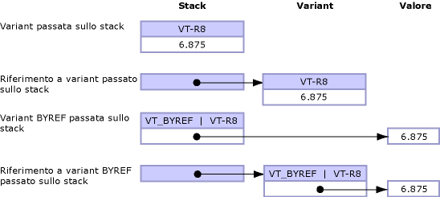

# Default Marshaling for Objects
I parametri e i campi tipizzati come <xref:System.Object?displayProperty=fullName> possono essere esposti al codice non gestito come uno dei tipi elencati di seguito:  
  
-   Un variant quando l'oggetto è un parametro.  
  
-   Un'interfaccia quando l'oggetto è un campo struttura.  
  
 Il marshalling per i tipi di oggetto è supportato solo dall'interoperabilità COM.  Il comportamento predefinito prevede il marshalling di oggetti su variant COM.  Queste regole si applicano solo al tipo **Object** e non a oggetti fortemente tipizzati che derivano dalla classe **Object**.  
  
 In questo argomento vengono fornite le seguenti informazioni aggiuntive sul marshalling dei tipi di oggetto:  
  
-   [Opzioni di marshalling](#cpcondefaultmarshalingforobjectsanchor7)  
  
-   [Marshalling di un oggetto su un'interfaccia](#cpcondefaultmarshalingforobjectsanchor2)  
  
-   [Marshalling di un oggetto su un variant](#cpcondefaultmarshalingforobjectsanchor3)  
  
-   [Marshalling di un variant su un oggetto](#cpcondefaultmarshalingforobjectsanchor4)  
  
-   [Marshalling di variant ByRef](#cpcondefaultmarshalingforobjectsanchor6)  
  
<a name="cpcondefaultmarshalingforobjectsanchor7"></a>   
## Opzioni di marshalling  
 Nella tabella seguente sono illustrate le opzioni di marshalling per il tipo di dati **Object**.  L'attributo <xref:System.Runtime.InteropServices.MarshalAsAttribute> fornisce diversi valori dell'enumerazione <xref:System.Runtime.InteropServices.UnmanagedType> per il marshalling di oggetti.  
  
|Tipo di enumerazione|Descrizione del formato non gestito|  
|--------------------------|-----------------------------------------|  
|**UnmanagedType.Struct**<br /><br /> \(valore predefinito per i parametri\)|Variant di tipo COM.|  
|**UnmanagedType.Interface**|Interfaccia **IDispatch**, se possibile; in caso contrario, **IUnknown**.|  
|**UnmanagedType.IUnknown**<br /><br /> \(valore predefinito per i campi\)|Interfaccia **IUnknown**.|  
|**UnmanagedType.IDispatch**|Interfaccia **IDispatch**.|  
  
 Nell'esempio che segue viene mostrata la definizione dell'interfaccia gestita per `MarshalObject`.  
  
```vb  
Interface MarshalObject  
   Sub SetVariant(o As Object)  
   Sub SetVariantRef(ByRef o As Object)  
   Function GetVariant() As Object  
  
   Sub SetIDispatch( <MarshalAs(UnmanagedType.IDispatch)> o As Object)  
   Sub SetIDispatchRef(ByRef <MarshalAs(UnmanagedType.IDispatch)> o _  
      As Object)  
   Function GetIDispatch() As <MarshalAs(UnmanagedType.IDispatch)> Object  
   Sub SetIUnknown( <MarshalAs(UnmanagedType.IUnknown)> o As Object)  
   Sub SetIUnknownRef(ByRef <MarshalAs(UnmanagedType.IUnknown)> o _  
      As Object)  
   Function GetIUnknown() As <MarshalAs(UnmanagedType.IUnknown)> Object  
End Interface  
  
```  
  
```csharp  
interface MarshalObject {  
   void SetVariant(Object o);  
   void SetVariantRef(ref Object o);  
   Object GetVariant();  
  
   void SetIDispatch ([MarshalAs(UnmanagedType.IDispatch)]Object o);  
   void SetIDispatchRef([MarshalAs(UnmanagedType.IDispatch)]ref Object o);  
   [MarshalAs(UnmanagedType.IDispatch)] Object GetIDispatch();  
   void SetIUnknown ([MarshalAs(UnmanagedType.IUnknown)]Object o);  
   void SetIUnknownRef([MarshalAs(UnmanagedType.IUnknown)]ref Object o);  
   [MarshalAs(UnmanagedType.IUnknown)] Object GetIUnknown();  
}  
```  
  
 Nel codice seguente l'interfaccia `MarshalObject` viene esportata in una libreria dei tipi.  
  
```  
interface MarshalObject {  
   HRESULT SetVariant([in] VARIANT o);  
   HRESULT SetVariantRef([in,out] VARIANT *o);  
   HRESULT GetVariant([out,retval] VARIANT *o)   
   HRESULT SetIDispatch([in] IDispatch *o);  
   HRESULT SetIDispatchRef([in,out] IDispatch **o);  
   HRESULT GetIDispatch([out,retval] IDispatch **o)   
   HRESULT SetIUnknown([in] IUnknown *o);  
   HRESULT SetIUnknownRef([in,out] IUnknown **o);  
   HRESULT GetIUnknown([out,retval] IUnknown **o)   
}  
```  
  
> [!NOTE]
>  Tramite il gestore di marshalling di interoperabilità, qualsiasi oggetto allocato all'interno del variant viene liberato automaticamente dopo la chiamata.  
  
 Nell'esempio riportato di seguito viene mostrato un tipo di valore formattato.  
  
```vb  
Public Structure ObjectHolder  
   Dim o1 As Object  
   <MarshalAs(UnmanagedType.IDispatch)> Public o2 As Object  
End Structure  
  
```  
  
```csharp  
public struct ObjectHolder {  
   Object o1;  
   [MarshalAs(UnmanagedType.IDispatch)]public Object o2;  
}  
```  
  
 Nel codice seguente il tipo formattato viene esportato in una libreria dei tipi.  
  
```  
struct ObjectHolder {  
   VARIANT o1;  
   IDispatch *o2;  
}  
```  
  
<a name="cpcondefaultmarshalingforobjectsanchor2"></a>   
## Marshalling di un oggetto su un'interfaccia  
 Quando un oggetto è esposto a COM come interfaccia, quest'ultima rappresenta l'interfaccia della classe del tipo gestito <xref:System.Object> \(interfaccia **\_Object**\).  Questa interfaccia è tipizzata come **IDispatch** \([UnmanagedType.IDispatch](frlrfSystemRuntimeInteropServicesUnmanagedTypeClassTopic)\) o **IUnknown** \(**UnmanagedType.IUnknown**\) nella libreria dei tipi risultante.  I client COM possono richiamare in modo dinamico i membri della classe gestita o i membri implementati dalle classi derivate mediante l'interfaccia **\_Object**.  Il client può inoltre chiamare **QueryInterface** per ottenere qualsiasi altra interfaccia implementata in modo esplicito dal tipo gestito.  
  
<a name="cpcondefaultmarshalingforobjectsanchor3"></a>   
## Marshalling di un oggetto su un variant  
 Quando si esegue il marshalling di un oggetto su un variant, il tipo di variant interno è determinato in fase di esecuzione, in base alle regole seguenti:  
  
-   Se il riferimento all'oggetto è null \(**Nothing** in Visual Basic\), il marshalling dell'oggetto viene eseguito a un variant di tipo **VT\_EMPTY**.  
  
-   Se l'oggetto è un'istanza di uno dei tipi elencati nella tabella riportata di seguito, il tipo di variant risultante è determinato dalle regole incorporate nel gestore di marshalling e illustrate nella tabella.  
  
-   Altri oggetti che devono controllare in modo esplicito il comportamento di marshalling possono implementare l'interfaccia <xref:System.IConvertible>.  In tal caso, il tipo di variant è determinato dal codice di tipo restituito dal metodo <xref:System.IConvertible.GetTypeCode%2A?displayProperty=fullName>.  In caso contrario, il marshalling dell'oggetto viene eseguito come variant di tipo **VT\_UNKNOWN**.  
  
### Marshalling dei tipi del sistema su variant  
 Nella tabella riportata di seguito vengono mostrati i tipi di oggetti gestiti e i tipi di variant COM corrispondenti.  Questi tipi vengono convertiti solo quando la firma del metodo chiamato è di tipo <xref:System.Object?displayProperty=fullName>.  
  
|Tipo di oggetto|Tipo di variant COM|  
|---------------------|-------------------------|  
|Riferimento a un oggetto null \(**Nothing** in Visual Basic\).|**VT\_EMPTY**|  
|<xref:System.DBNull?displayProperty=fullName>|**VT\_NULL**|  
|<xref:System.Runtime.InteropServices.ErrorWrapper?displayProperty=fullName>|**VT\_ERROR**|  
|<xref:System.Reflection.Missing?displayProperty=fullName>|**VT\_ERROR** con **E\_PARAMNOTFOUND**|  
|<xref:System.Runtime.InteropServices.DispatchWrapper?displayProperty=fullName>|**VT\_DISPATCH**|  
|<xref:System.Runtime.InteropServices.UnknownWrapper?displayProperty=fullName>|**VT\_UNKNOWN**|  
|<xref:System.Runtime.InteropServices.CurrencyWrapper?displayProperty=fullName>|**VT\_CY**|  
|<xref:System.Boolean?displayProperty=fullName>|**VT\_BOOL**|  
|<xref:System.SByte?displayProperty=fullName>|**VT\_I1**|  
|<xref:System.Byte?displayProperty=fullName>|**VT\_UI1**|  
|<xref:System.Int16?displayProperty=fullName>|**VT\_I2**|  
|<xref:System.UInt16?displayProperty=fullName>|**VT\_UI2**|  
|<xref:System.Int32?displayProperty=fullName>|**VT\_I4**|  
|<xref:System.UInt32?displayProperty=fullName>|**VT\_UI4**|  
|<xref:System.Int64?displayProperty=fullName>|**VT\_I8**|  
|<xref:System.UInt64?displayProperty=fullName>|**VT\_UI8**|  
|<xref:System.Single?displayProperty=fullName>|**VT\_R4**|  
|<xref:System.Double?displayProperty=fullName>|**VT\_R8**|  
|<xref:System.Decimal?displayProperty=fullName>|**VT\_DECIMAL**|  
|<xref:System.DateTime?displayProperty=fullName>|**VT\_DATE**|  
|<xref:System.String?displayProperty=fullName>|**VT\_BSTR**|  
|<xref:System.IntPtr?displayProperty=fullName>|**VT\_INT**|  
|<xref:System.UIntPtr?displayProperty=fullName>|**VT\_UINT**|  
|<xref:System.Array?displayProperty=fullName>|**VT\_ARRAY**|  
  
 Mediante l'utilizzo dell'interfaccia `MarshalObject` definita nell'esempio precedente, nell'esempio di codice seguente viene mostrato come passare vari tipi di variant a un server COM.  
  
```vb  
Dim mo As New MarshalObject()  
mo.SetVariant(Nothing)         ' Marshal as variant of type VT_EMPTY.  
mo.SetVariant(System.DBNull.Value) ' Marshal as variant of type VT_NULL.  
mo.SetVariant(CInt(27))        ' Marshal as variant of type VT_I2.  
mo.SetVariant(CLng(27))        ' Marshal as variant of type VT_I4.  
mo.SetVariant(CSng(27.0))      ' Marshal as variant of type VT_R4.  
mo.SetVariant(CDbl(27.0))      ' Marshal as variant of type VT_R8.  
  
```  
  
```csharp  
MarshalObject mo = new MarshalObject();  
mo.SetVariant(null);            // Marshal as variant of type VT_EMPTY.  
mo.SetVariant(System.DBNull.Value); // Marshal as variant of type VT_NULL.  
mo.SetVariant((int)27);          // Marshal as variant of type VT_I2.  
mo.SetVariant((long)27);          // Marshal as variant of type VT_I4.  
mo.SetVariant((single)27.0);   // Marshal as variant of type VT_R4.  
mo.SetVariant((double)27.0);   // Marshal as variant of type VT_R8.  
```  
  
 È possibile eseguire il marshalling dei tipi COM privi di tipi gestiti corrispondenti mediante classi wrapper quali <xref:System.Runtime.InteropServices.ErrorWrapper>, <xref:System.Runtime.InteropServices.DispatchWrapper>, <xref:System.Runtime.InteropServices.UnknownWrapper> e <xref:System.Runtime.InteropServices.CurrencyWrapper>.  Nell'esempio di codice riportato di seguito viene mostrato come utilizzare questi wrapper per passare diversi tipi di variant a un server COM.  
  
```vb  
Imports System.Runtime.InteropServices  
' Pass inew as a variant of type VT_UNKNOWN interface.  
mo.SetVariant(New UnknownWrapper(inew))  
' Pass inew as a variant of type VT_DISPATCH interface.  
mo.SetVariant(New DispatchWrapper(inew))  
' Pass a value as a variant of type VT_ERROR interface.  
mo.SetVariant(New ErrorWrapper(&H80054002))  
' Pass a value as a variant of type VT_CURRENCY interface.  
mo.SetVariant(New CurrencyWrapper(New Decimal(5.25)))  
  
```  
  
```csharp  
using System.Runtime.InteropServices;  
// Pass inew as a variant of type VT_UNKNOWN interface.  
mo.SetVariant(new UnknownWrapper(inew));  
// Pass inew as a variant of type VT_DISPATCH interface.  
mo.SetVariant(new DispatchWrapper(inew));  
// Pass a value as a variant of type VT_ERROR interface.  
mo.SetVariant(new ErrorWrapper(0x80054002));  
// Pass a value as a variant of type VT_CURRENCY interface.  
mo.SetVariant(new CurrencyWrapper(new Decimal(5.25)));  
```  
  
 Le classi wrapper sono definite nello spazio dei nomi <xref:System.Runtime.InteropServices>.  
  
### Marshalling dell'interfaccia IConvertible su un variant  
 Il marshalling dei tipi non elencati nella sezione precedente può essere controllato implementando l'interfaccia <xref:System.IConvertible>.  Se l'interfaccia **IConvertible** viene implementata dall'oggetto, il tipo di variant COM viene determinato in fase di esecuzione dal valore dell'enumerazione <xref:System.TypeCode> restituito dal metodo <xref:System.IConvertible.GetTypeCode%2A?displayProperty=fullName>.  
  
 Nella tabella riportata di seguito vengono mostrati i valori possibili per l'enumerazione **TypeCode** e il tipo di variant COM corrispondente per ciascun valore.  
  
|TypeCode|Tipo di variant COM|  
|--------------|-------------------------|  
|**TypeCode.Empty**|**VT\_EMPTY**|  
|**TypeCode.Object**|**VT\_UNKNOWN**|  
|**TypeCode.DBNull**|**VT\_NULL**|  
|**TypeCode.Boolean**|**VT\_BOOL**|  
|**TypeCode.Char**|**VT\_UI2**|  
|**TypeCode.Sbyte**|**VT\_I1**|  
|**TypeCode.Byte**|**VT\_UI1**|  
|**TypeCode.Int16**|**VT\_I2**|  
|**TypeCode.UInt16**|**VT\_UI2**|  
|**TypeCode.Int32**|**VT\_I4**|  
|**TypeCode.UInt32**|**VT\_UI4**|  
|**TypeCode.Int64**|**VT\_I8**|  
|**TypeCode.UInt64**|**VT\_UI8**|  
|**TypeCode.Single**|**VT\_R4**|  
|**TypeCode.Double**|**VT\_R8**|  
|**TypeCode.Decimal**|**VT\_DECIMAL**|  
|**TypeCode.DateTime**|**VT\_DATE**|  
|**TypeCode.String**|**VT\_BSTR**|  
|Non supportato.|**VT\_INT**|  
|Non supportato.|**VT\_UINT**|  
|Non supportato.|**VT\_ARRAY**|  
|Non supportato.|**VT\_RECORD**|  
|Non supportato.|**VT\_CY**|  
|Non supportato.|**VT\_VARIANT**|  
  
 Il valore del variant COM viene determinato chiamando l'interfaccia **IConvertible.To** *Tipo*, dove **To** *Tipo* rappresenta la routine di conversione corrispondente al tipo restituito da **IConvertible.GetTypeCode**.  Se un oggetto restituisce **TypeCode.Double** da **IConvertible.GetTypeCode**, viene eseguito il marshalling dell'oggetto come variant COM di tipo **VT\_R8**.  È possibile ottenere il valore del variant, memorizzato nel campo **dblVal** del variant COM, mediante il cast sull'interfaccia **IConvertible** e la chiamata al metodo <xref:System.IConvertible.ToDouble%2A>.  
  
<a name="cpcondefaultmarshalingforobjectsanchor4"></a>   
## Marshalling di un variant su un oggetto  
 Quando si esegue il marshalling di un variant su un oggetto, il tipo di oggetto prodotto viene determinato dal tipo, e talvolta dal valore, di tale variant.  Nella tabella riportata di seguito viene specificato ogni tipo di variant e il tipo di oggetto corrispondente creato dal gestore di marshalling quando si passa un variant da COM a .NET Framework.  
  
|Tipo di variant COM|Tipo di oggetto|  
|-------------------------|---------------------|  
|**VT\_EMPTY**|Riferimento a un oggetto null \(**Nothing** in Visual Basic\).|  
|**VT\_NULL**|<xref:System.DBNull?displayProperty=fullName>|  
|**VT\_DISPATCH**|**System.\_\_ComObject** o null se \(pdispVal \=\= null\)|  
|**VT\_UNKNOWN**|**System.\_\_ComObject** o null se \(punkVal \=\= null\)|  
|**VT\_ERROR**|<xref:System.UInt32?displayProperty=fullName>|  
|**VT\_BOOL**|<xref:System.Boolean?displayProperty=fullName>|  
|**VT\_I1**|<xref:System.SByte?displayProperty=fullName>|  
|**VT\_UI1**|<xref:System.Byte?displayProperty=fullName>|  
|**VT\_I2**|<xref:System.Int16?displayProperty=fullName>|  
|**VT\_UI2**|<xref:System.UInt16?displayProperty=fullName>|  
|**VT\_I4**|<xref:System.Int32?displayProperty=fullName>|  
|**VT\_UI4**|<xref:System.UInt32?displayProperty=fullName>|  
|**VT\_I8**|<xref:System.Int64?displayProperty=fullName>|  
|**VT\_UI8**|<xref:System.UInt64?displayProperty=fullName>|  
|**VT\_R4**|<xref:System.Single?displayProperty=fullName>|  
|**VT\_R8**|<xref:System.Double?displayProperty=fullName>|  
|**VT\_DECIMAL**|<xref:System.Decimal?displayProperty=fullName>|  
|**VT\_DATE**|<xref:System.DateTime?displayProperty=fullName>|  
|**VT\_BSTR**|<xref:System.String?displayProperty=fullName>|  
|**VT\_INT**|<xref:System.Int32?displayProperty=fullName>|  
|**VT\_UINT**|<xref:System.UInt32?displayProperty=fullName>|  
|**VT\_ARRAY** &#124; **VT\_\***|<xref:System.Array?displayProperty=fullName>|  
|**VT\_CY**|<xref:System.Decimal?displayProperty=fullName>|  
|**VT\_RECORD**|Tipo di valore boxed corrispondente.|  
|**VT\_VARIANT**|Non supportato.|  
  
 È possibile che i tipi di variant passati da COM al codice gestito e quindi restituiti a COM non mantengano lo stesso tipo di variant per la durata della chiamata.  Si consideri cosa succede quando si passa un variant di tipo **VT\_DISPATCH** da COM a .NET Framework.  Nel corso del marshalling, il variant viene convertito in un oggetto <xref:System.Object?displayProperty=fullName>.  Se **Object** viene restituito a COM, se ne esegue il marshalling su un variant di tipo **VT\_UNKNOWN**.  Non esistono garanzie che il variant prodotto quando si esegue il marshalling di un oggetto dal codice gestito su COM sia dello stesso tipo del variant inizialmente utilizzato per produrre l'oggetto.  
  
<a name="cpcondefaultmarshalingforobjectsanchor6"></a>   
## Marshalling di variant ByRef  
 Benché i variant possano essere passati per valore o per riferimento, il flag **VT\_BYREF** può anche essere utilizzato con qualsiasi tipo di variant per indicare che il contenuto del variant viene passato per riferimento e non per valore.  La differenza tra il marshalling di variant per riferimento e quello di un variant con il flag **VT\_BYREF** impostato può essere poco chiara.  Nell'illustrazione riportata di seguito vengono spiegate le differenze.  
  
   
Variant passati per valore e per riferimento  
  
 **Comportamento predefinito per il marshalling di oggetti e variant per valore**  
  
-   Quando si passa un oggetto dal codice gestito a COM, il contenuto dello stesso viene copiato in un nuovo variant creato dal gestore di marshalling mediante le regole definite nella sezione [Marshalling di un oggetto su un variant](#cpcondefaultmarshalingforobjectsanchor3).  Le modifiche apportate al variant sul lato non gestito non vengono propagate all'oggetto originale dopo la chiamata.  
  
-   Quando si passano variant da COM al codice gestito, il contenuto del variant viene copiato in un oggetto appena creato mediante le regole definite nella sezione [Marshalling di un variant su un oggetto](#cpcondefaultmarshalingforobjectsanchor4).  Le modifiche apportate all'oggetto sul lato gestito non vengono propagate al variant originale dopo la chiamata.  
  
 **Comportamento predefinito per il marshalling di oggetti e variant per riferimento**  
  
 Per propagare le modifiche al chiamante, i parametri devono essere passati per riferimento.  È ad esempio possibile utilizzare la parola chiave **ref** in C\# \(o **ByRef** nel codice gestito di Visual Basic\) per passare parametri per riferimento.  In COM, i parametri di riferimento vengono passati mediante un puntatore come **variant \***.  
  
-   Quando si passa un oggetto a COM per riferimento, il gestore di marshalling crea un nuovo variant nel quale copia il contenuto del riferimento all'oggetto prima di effettuare la chiamata.  Il variant viene passato alla funzione non gestita in cui l'utente può modificarne il contenuto.  Dopo la chiamata, le modifiche apportate al variant sul lato non gestito vengono propagate all'oggetto originale.  Se il tipo del variant è diverso da quello passato alla chiamata, le modifiche vengono propagate a un oggetto di tipo diverso,  ossia il tipo dell'oggetto passato nella chiamata può essere diverso da quello restituito dalla chiamata.  
  
-   Quando si passa un variant al codice gestito per riferimento, il gestore di marshalling crea un nuovo oggetto nel quale copia il contenuto del variant prima di effettuare la chiamata.  Un riferimento all'oggetto viene passato alla funzione gestita, in cui l'utente può modificare l'oggetto.  Dopo la chiamata, le modifiche apportate all'oggetto di riferimento vengono propagate al variant originale.  Se il tipo dell'oggetto è diverso da quello passato alla chiamata, viene modificato il tipo del variant originale e il valore viene propagato al variant.  Anche in questo caso, il tipo del variant passato nella chiamata può quindi essere diverso da quello restituito dalla chiamata.  
  
 **Comportamento predefinito per il marshalling di un variant con il flag VT\_BYREF impostato**  
  
-   Un variant passato al codice gestito per valore può avere il flag **VT\_BYREF** impostato per indicare che contiene un riferimento anziché un valore.  In questo caso, viene ancora eseguito il marshalling del variant su un oggetto, in quanto il variant è passato per valore.  Il gestore di marshalling dereferenzia automaticamente i contenuti del variant e li copia in un oggetto appena creato prima di effettuare la chiamata.  L'oggetto viene quindi passato alla funzione gestita. Tuttavia, dopo la chiamata, l'oggetto non viene propagato al variant originale.  Le modifiche apportate all'oggetto gestito vengono perse.  
  
    > [!CAUTION]
    >  Il valore di un variant passato per valore non può essere modificato in alcun modo, anche se nel variant è stato impostato il flag **VT\_BYREF**.  
  
-   Un variant passato al codice gestito per riferimento può anche avere il flag **VT\_BYREF** impostato per indicare che contiene un altro riferimento.  In questo caso, viene eseguito il marshalling del variant su un oggetto **ref**, in quanto il variant è passato per riferimento.  Il gestore di marshalling dereferenzia automaticamente i contenuti del variant e li copia in un oggetto appena creato prima di effettuare la chiamata.  Dopo la chiamata, il valore dell'oggetto viene propagato al riferimento all'interno del variant originale solo se l'oggetto è dello stesso tipo di quello passato.  Con la propagazione non viene modificato il tipo di un variant con il flag **VT\_BYREF** impostato.  Se il tipo dell'oggetto viene modificato nel corso della chiamata, dopo la chiamata viene generato un oggetto <xref:System.InvalidCastException>.  
  
 Nella tabella riportata di seguito sono riassunte le regole di propagazione per variant e oggetti.  
  
|Da|Per|Modifiche propagate|  
|--------|---------|-------------------------|  
|**Variant**  *v*|**Oggetto**  *o*|Mai|  
|**Oggetto**  *o*|**Variant**  *v*|Mai|  
|**Variant**   ***\****  *pv*|**Oggetto di riferimento**  *o*|Sempre|  
|**Oggetto di riferimento**  *o*|**Variant**   ***\****  *pv*|Sempre|  
|**Variant**  *v* **\(VT\_BYREF** *&#124;*  **VT\_\*\)**|**Oggetto**  *o*|Mai|  
|**Variant**  *v* **\(VT\_BYREF** *&#124;*  **VT\_\)**|**Oggetto di riferimento**  *o*|Solo se il tipo non è stato modificato|  
  
## Vedere anche  
 [Default Marshaling Behavior](../../../docs/framework/interop/default-marshaling-behavior.md)   
 [Blittable and Non\-Blittable Types](../../../docs/framework/interop/blittable-and-non-blittable-types.md)   
 [Directional Attributes](http://msdn.microsoft.com/it-it/241ac5b5-928e-4969-8f58-1dbc048f9ea2)   
 [Copying and Pinning](../../../docs/framework/interop/copying-and-pinning.md)