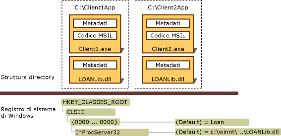

# Deploying an Interop Application
Un'applicazione di interoperabilità include in genere un assembly client .NET, uno o più assembly di interoperabilità che rappresentano librerie dei tipi COM diverse e uno o più componenti COM registrati.  Come discusso in [Importing a Type Library as an Assembly](../../../docs/framework/interop/importing-a-type-library-as-an-assembly.md), Visual Studio e [!INCLUDE[winsdklong](../../../includes/winsdklong-md.md)] forniscono strumenti per importare e convertire una libreria dei tipi in un assembly di interoperabilità.  Un'applicazione di interoperabilità può essere distribuita in due modi:  
  
-   Utilizzo di tipi di interoperabilità incorporati: a partire da [!INCLUDE[net_v40_long](../../../includes/net-v40-long-md.md)] è possibile indicare al compilatore di incorporare nel file eseguibile informazioni sul tipo ottenute da un assembly di interoperabilità.  Il compilatore incorpora solo le informazioni sul tipo utilizzate dall'applicazione.  Non è necessario distribuire l'assembly di interoperabilità con l'applicazione.  Questa è la tecnica consigliata.  
  
-   Distribuzione di assembly di interoperabilità: è possibile creare un riferimento standard a un assembly di interoperabilità.  In questo caso è necessario distribuire l'assembly di interoperabilità con l'applicazione.  Se si utilizza questa tecnica senza tuttavia utilizzare un componente COM privato, fare sempre riferimento all'assembly di interoperabilità primario \(PIA, Primary Interop Assembly\) pubblicato dall'autore del componente COM che si intende incorporare nel codice gestito.  Per ulteriori informazioni sulla creazione e sull'utilizzo di assembly di interoperabilità primari, vedere [Assembly di interoperabilità primari](http://msdn.microsoft.com/it-it/b977a8be-59a0-40a0-a806-b11ffba5c080).  
  
 Se si utilizzano tipi di interoperabilità incorporati, la distribuzione è semplice e lineare.  Non vi è alcuna operazione speciale da eseguire.  Il resto di questo articolo descrive gli scenari relativi alla distribuzione di assembly di interoperabilità con l'applicazione.  
  
## Distribuzione di assembly di interoperabilità  
 Gli assembly possono avere nomi sicuri.  Un assembly con nome sicuro include la chiave pubblica dell'editore, che lo identifica in modo univoco.  Gli assembly prodotti dall'[utilità di importazione della libreria dei tipi \(Tlbimp.exe\)](../../../docs/framework/tools/tlbimp-exe-type-library-importer.md) possono essere firmati dall'editore mediante l'opzione **\/keyfile**.  È possibile installare assembly firmati nella Global Assembly Cache.  Gli assembly non firmati devono essere installati sul computer dell'utente come assembly privati.  
  
### Assembly privati  
 Per installare un assembly da utilizzare in modo privato è necessario che sia l'eseguibile dell'applicazione sia l'assembly di interoperabilità contenente i tipi COM importati siano installati nella stessa struttura di directory.  Nella figura riportata di seguito viene illustrato un assembly di interoperabilità non firmato che deve essere utilizzato in modo privato da Client1.exe e Client2.exe, che risiedono in directory di applicazione separate.  L'assembly di interoperabilità, denominato in questo esempio LOANLib.dll, viene installato due volte.  
  
   
Struttura della directory e voci del Registro di sistema per una distribuzione privata  
  
 Tutti i componenti COM associati all'applicazione devono essere installati nel Registro di sistema di Windows.  Se quelli che nell'illustrazione sono denominati Client1.exe e Client2.exe vengono installati su due computer diversi, occorrerà registrare i componenti COM su entrambi.  
  
### Assembly condivisi  
 È opportuno che gli assembly condivisi da più applicazioni vengano installati in un repository centralizzato, denominato Global Assembly Cache.  I client .NET hanno accesso alla stessa copia dell'assembly di interoperabilità firmato e installato nella Global Assembly Cache.  Per ulteriori informazioni sulla creazione e sull'utilizzo di assembly di interoperabilità primari, vedere [Assembly di interoperabilità primari](http://msdn.microsoft.com/it-it/b977a8be-59a0-40a0-a806-b11ffba5c080).  
  
## Vedere anche  
 [Exposing COM Components to the .NET Framework](../../../docs/framework/interop/exposing-com-components.md)   
 [Importing a Type Library as an Assembly](../../../docs/framework/interop/importing-a-type-library-as-an-assembly.md)   
 [Using COM Types in Managed Code](http://msdn.microsoft.com/it-it/1a95a8ca-c8b8-4464-90b0-5ee1a1135b66)   
 [Compiling an Interop Project](../../../docs/framework/interop/compiling-an-interop-project.md)