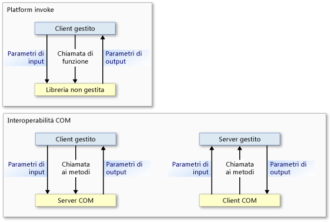
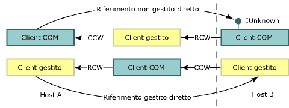

# Interop Marshaling
Il marshalling di interoperabilità determina il passaggio di dati in argomenti di metodo e i valori restituiti tra memoria gestita e non gestita durante le chiamate.  Il marshalling di interoperabilità è un'attività di run\-time eseguita dal servizio di marshalling di Common Language Runtime.  
  
 La maggior parte dei tipi di dati hanno rappresentazioni comuni nella memoria gestita e non gestita.  Il gestore di marshalling di interoperabilità gestisce questi tipi per conto dell'utente.  Altri tipi possono essere ambigui o non essere rappresentati nella memoria gestita.  
  
 Un tipo ambiguo può avere più rappresentazioni non gestite che eseguono il mapping a un singolo tipo gestito o informazioni sul tipo mancante, ad esempio le dimensioni della matrice.  Per i tipi ambigui, il gestore del marshalling fornisce una rappresentazione predefinita e rappresentazioni alternative in cui sono presenti più rappresentazioni.  È possibile fornire istruzioni esplicite al gestore del marshalling su come eseguire il marshalling di un tipo ambiguo.  
  
 In questa panoramica sono incluse le sezioni seguenti:  
  
-   [Modelli basati su platform invoke e sull'interoperabilità COM](#platform_invoke_and_com_interop_models)  
  
-   [Marshalling e apartment COM](#marshaling_and_com_apartments)  
  
-   [Marshalling di chiamate remote](#marshaling_remote_calls)  
  
-   [Argomenti correlati](#related_topics)  
  
-   [Riferimento](#reference)  
  
   
## Modelli basati su platform invoke e sull'interoperabilità COM  
 In Common Language Runtime vengono forniti due meccanismi per l'interoperabilità con il codice non gestito:  
  
-   Platform invoke, che consente la chiamata di funzioni esportate da una libreria non gestita da parte del codice gestito.  
  
-   L'interoperabilità COM, che consente l'interazione del codice gestito con oggetti COM \(Component Object Model\) mediante interfacce.  
  
 Il marshalling di interoperabilità viene usato sia da platform invoke che dall'interoperabilità COM per spostare con precisione gli argomenti dei metodi tra chiamante e chiamato e viceversa, se necessario.  Come mostrato nell'illustrazione seguente, una chiamata al metodo di platform invoke viene effettuata dal codice gestito a quello non gestito e mai viceversa, ad eccezione del caso in cui sono coinvolte [funzioni di callback](../../../docs/framework/interop/callback-functions.md).  Benché il flusso delle chiamate platform invoke possa andare solo dal codice gestito a quello non gestito, il flusso dei dati può essere in entrambe le direzioni, come parametri di input o di output.  Le chiamate al metodo di interoperabilità COM possono scorrere in entrambe le direzioni.  
  
   
Flusso delle chiamate con i metodi di platform invoke e di interoperabilità COM  
  
 Al livello inferiore, lo stesso servizio di marshalling di interoperabilità viene usato da entrambi i meccanismi. Alcuni tipi di dati sono tuttavia supportati esclusivamente dall'interoperabilità COM o da platform invoke.  Per informazioni dettagliate, vedere [Default Marshaling Behavior](../../../docs/framework/interop/default-marshaling-behavior.md).  
  
 [Torna all'inizio](#top)  
  
   
## Marshalling e apartment COM  
 Il gestore di marshalling di interoperabilità esegue il marshalling dei dati tra l'heap di Common Language Runtime e quello non gestito.  Il marshalling ha luogo ogni volta che il chiamante e il chiamato non possono operare sulla stessa istanza di dati.  Il gestore di marshalling di interoperabilità fa sì che il chiamante e il chiamato sembrino operare sugli stessi dati benché dispongano ognuno della propria copia dei dati.  
  
 In COM è anche disponibile un gestore che esegue il marshalling dei dati tra apartment COM o diversi processi COM.  Quando le chiamate tra codice gestito e non gestito sono effettuate all'interno dello stesso apartment COM, il gestore di marshalling di interoperabilità è il solo a essere coinvolto.  Quando si effettuano chiamate tra codice gestito e non gestito in un diverso apartment COM o processo, sono coinvolti sia il gestore di marshalling COM che quello di interoperabilità.  
  
### Server gestiti e client COM  
 Un server gestito esportato con una libreria dei tipi registrata dallo [Regasm.exe \(Assembly Registration Tool\)](../../../docs/framework/tools/regasm-exe-assembly-registration-tool.md) dispone di una voce `ThreadingModel` del Registro di sistema impostata su `Both`.  Questo valore indica che il server può essere attivato in un apartment a thread singolo \(Single\-Threaded Apartment, STA\) o in un apartment con multithreading \(Multithreaded Apartment, MTA\).  L'oggetto server viene creato nello stesso apartment del chiamante, come indicato nella tabella riportata di seguito.  
  
|Client COM|Server .NET|Requisiti di marshalling|  
|----------------|-----------------|------------------------------|  
|STA|`Both` diventa STA.|Marshalling nello stesso apartment.|  
|MTA|`Both` diventa MTA.|Marshalling nello stesso apartment.|  
  
 Poiché il client e il server si trovano nello stesso apartment, tutto il marshalling dei dati viene gestito automaticamente dal servizio di marshalling di interoperabilità.  L'illustrazione seguente mostra il servizio di marshalling di interoperabilità tra gli heap gestiti e non gestiti all'interno dello stesso apartment di tipo COM.  
  
   
Processo di marshalling nello stesso apartment  
  
 Se si intende esportare un server gestito, ricordare che il client COM determina l'apartment del server.  Un server gestito chiamato da un client COM inizializzato in un MTA deve garantire la thread safety.  
  
### Client gestiti e server COM  
 Benché l'impostazione predefinita per gli apartment dei client gestiti sia MTA, è possibile che essa venga modificata dal tipo di applicazione del client .NET.  L'impostazione di apartment per i client di [!INCLUDE[vbprvblong](../../../includes/vbprvblong-md.md)], ad esempio, è STA.  Per esaminare e modificare l'impostazione di apartment di un client gestito, è possibile usare l'oggetto <xref:System.STAThreadAttribute?displayProperty=fullName>, l'oggetto <xref:System.MTAThreadAttribute?displayProperty=fullName>, la proprietà <xref:System.Threading.Thread.ApartmentState%2A?displayProperty=fullName> o la proprietà <xref:System.Web.UI.Page.AspCompatMode%2A?displayProperty=fullName>.  
  
 L'autore del componente imposta l'affinità di thread di un server COM.  La tabella riportata di seguito mostra le combinazioni delle impostazioni di apartment per i client .NET e i server COM,  nonché i requisiti di marshalling per le diverse combinazioni.  
  
|Client .NET|Server COM|Requisiti di marshalling|  
|-----------------|----------------|------------------------------|  
|MTA \(predefinito\)|MTA   STA|Marshalling di interoperabilità.   Marshalling di interoperabilità e COM.|  
|STA|MTA   STA|Marshalling di interoperabilità e COM.   Marshalling di interoperabilità.|  
  
 Quando un client gestito e un server non gestito si trovano nello stesso apartment, tutto il marshalling dei dati viene eseguito dal servizio di marshalling di interoperabilità.  Tuttavia, quando il client e il server vengono inizializzati in apartment diversi, è necessario anche il marshalling COM.  L'illustrazione riportata di seguito mostra gli elementi di una chiamata su diversi apartment.  
  
   
Chiamata su diversi apartment tra un client .NET e un oggetto COM  
  
 Per il marshalling su diversi apartment, procedere come indicato di seguito:  
  
-   Accettare l'overhead del marshalling su diversi apartment, evidente solo quando sono presenti molte chiamate oltre il limite.  Registrare la libreria dei tipi del componente COM per consentire alle chiamate di attraversare correttamente il limite dell'apartment.  
  
-   Modificare il thread principale impostando il thread del client su STA o MTA.  Se il client C\# chiama ad esempio molti componenti COM STA, è possibile evitare il marshalling su diversi apartment impostando il thread principale su STA.  
  
    > [!NOTE]
    >  Dopo avere impostato il thread di un client C\# su STA, occorre eseguire il marshalling su diversi apartment per le chiamate ai componenti COM MTA.  
  
 Per istruzioni sulla selezione esplicita di un modello di apartment, vedere [Managed and Unmanaged Threading](http://msdn.microsoft.com/it-it/db425c20-4b2f-4433-bf96-76071c7881e5).  
  
 [Torna all'inizio](#top)  
  
   
## Marshalling di chiamate remote  
 Come per il marshalling su diversi apartment, si ricorre al marshalling COM nelle chiamate tra il codice gestito e non gestito ogni volta che gli oggetti si trovano in processi separati.  Ad esempio:  
  
-   Un client COM che richiama un server gestito in un host remoto usa DCOM.  
  
-   Un client gestito che richiama un server COM su un host remoto usa DCOM.  
  
 Nell'illustrazione seguente viene mostrato come il marshalling di interoperabilità e il marshalling COM forniscano canali di comunicazione attraverso i limiti dell'host e del processo.  
  
   
Marshalling su diversi processi  
  
### Mantenimento dell'identità  
 In Common Language Runtime l'identità di riferimenti gestiti e non gestiti viene mantenuta.  L'illustrazione riportata di seguito mostra il flusso di riferimenti non gestiti diretti \(prima riga\) e di riferimenti gestiti diretti \(ultima riga\) attraverso i limiti dell'host e del processo.  
  
   
Passaggio dei riferimenti attraverso i limiti dell'host e del processo  
  
 In questa illustrazione:  
  
-   Un client non gestito recupera un riferimento a un oggetto COM da un oggetto gestito che lo recupera da un host remoto.  Il meccanismo dei servizi remoti è DCOM.  
  
-   Un client gestito recupera un riferimento a un oggetto gestito da un oggetto COM che lo recupera da un host remoto.  Il meccanismo dei servizi remoti è DCOM.  
  
    > [!NOTE]
    >  La libreria dei tipi esportata del server gestito deve essere registrata.  
  
 Il numero di limiti di processo tra chiamante e chiamato non è rilevante. La creazione di riferimenti diretti è identica per le chiamate in\-process e per quelle out\-of\-process.  
  
### Servizi remoti gestiti  
 Tra i servizi di runtime vengono inoltre forniti servizi remoti gestiti, utilizzabili per stabilire un canale di comunicazione tra gli oggetti gestiti attraverso i limiti dell'host e del processo.  I servizi remoti gestiti possono contenere un firewall tra i componenti di comunicazione, come mostrato nell'illustrazione riportata di seguito.  
  
   
Chiamate remote attraverso i firewall mediante SOAP o la classe TcpChannel  
  
 È possibile incanalare tramite SOAP alcune chiamate non gestite, ad esempio quelle tra i [componenti serviti](http://msdn.microsoft.com/it-it/f109ee24-81ad-4d99-9892-51ac6f34978c) e COM.  Per altre informazioni sull'uso dei servizi remoti gestiti, vedere [Panoramica di Servizi remoti .NET](http://msdn.microsoft.com/it-it/eccb1d31-0a22-417a-97fd-f4f1f3aa4462).  
  
 [Torna all'inizio](#top)  
  
   
## Argomenti correlati  
  
|Titolo|Descrizione|  
|------------|-----------------|  
|[Default Marshaling Behavior](../../../docs/framework/interop/default-marshaling-behavior.md)|Descrive le regole usate dal servizio di marshalling di interoperabilità per il marshalling dei dati.|  
|[Marshaling Data with Platform Invoke](../../../docs/framework/interop/marshaling-data-with-platform-invoke.md)|Descrive come dichiarare i parametri dei metodi e passare gli argomenti alle funzioni esportate dalle librerie non gestite.|  
|[Marshaling Data with COM Interop](../../../docs/framework/interop/marshaling-data-with-com-interop.md)|Descrive come personalizzare i wrapper COM per modificare il comportamento di marshalling.|  
|[Procedura: Eseguire la migrazione di codice gestito da DCOM a WCF](../../../docs/framework/interop/how-to-migrate-managed-code-dcom-to-wcf.md)|Descrive come eseguire la migrazione da DCOM a WCF.|  
|[How to: Map HRESULTs and Exceptions](../../../docs/framework/interop/how-to-map-hresults-and-exceptions.md)|Descrive come mappare le eccezioni personalizzate agli oggetti HRESULT e illustra le relazioni di mapping tra ogni oggetto HRESULT e la classe di eccezioni corrispondente in .NET Framework.|  
|[Interoperating Using Generic Types](http://msdn.microsoft.com/it-it/26b88e03-085b-4b53-94ba-a5a9c709ce58)|Descrive le azioni supportate quando si usano tipi generici per l'interoperabilità COM.|  
|[Interoperating with Unmanaged Code](../../../docs/framework/interop/index.md)|Descrive i servizi di interoperabilità forniti da Common Language Runtime.|  
|[Advanced COM Interoperability](http://msdn.microsoft.com/it-it/3ada36e5-2390-4d70-b490-6ad8de92f2fb)|Contiene collegamenti per accedere ad altre informazioni sull'inclusione di componenti COM nell'applicazione .NET Framework.|  
|[Design Considerations for Interoperation](http://msdn.microsoft.com/it-it/b59637f6-fe35-40d6-ae72-901e7a707689)|Fornisce suggerimenti per la scrittura di componenti COM integrati.|  
|[Servizi remoti .NET](http://msdn.microsoft.com/it-it/515686e6-0a8d-42f7-8188-73abede57c58)|Descrive i diversi metodi disponibili in .NET Framework per le comunicazioni remote.|  
  
 [Torna all'inizio](#top)  
  
   
## Riferimento  
 <xref:System.Runtime.InteropServices?displayProperty=fullName>  
  
 [Torna all'inizio](#top)