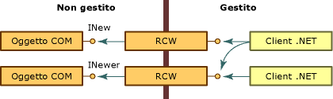
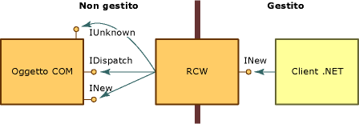

# Runtime Callable Wrapper
Common Language Runtime espone gli oggetti COM tramite un proxy denominato Runtime Callable Wrapper \(RCW\).  Benché l'RCW appaia ai client .NET come un normale oggetto, la sua funzione principale consiste nell'effettuare il marshalling tra un client .NET e un oggetto COM.  
  
 Il runtime crea esattamente un RCW per ciascun oggetto COM, indipendentemente dal numero di riferimenti all'oggetto.  Il runtime mantiene un solo RCW a processo per ciascun oggetto.  Se si crea un RCW in un apartment o dominio applicazione e si passa quindi un riferimento a un altro apartment o dominio applicazione, verrà usato un proxy al primo oggetto.  Come illustrato nella figura che segue, un numero qualsiasi di client gestiti può stabilire un riferimento agli oggetti COM che espongono le interfacce INew e INewer.  
  
   
Accesso a oggetti COM tramite Runtime Callable Wrapper  
  
 Usando i metadati derivati da una libreria dei tipi, il runtime crea sia l'oggetto COM che si sta chiamando che il relativo wrapper.  Ogni RCW mantiene una cache dei puntatori a interfaccia impostati sull'oggetto COM di cui effettua il wrapping e rilascia i riferimenti all'oggetto COM quando l'RCW non è più necessario.  Il runtime esegue la procedura di Garbage Collection sull'RCW.  
  
 Tra le altre attività, l'RCW effettua il marshalling dei dati trasferiti tra il codice gestito e quello non gestito, per conto dell'oggetto di cui effettua il wrapping.  In particolare, l'RCW effettua il marshalling degli argomenti e dei valori restituiti dei metodi ogni volta che il client e il server adottano rappresentazioni diverse dei dati scambiati.  
  
 Il wrapper standard applica le regole di marshalling incorporate.  Quando ad esempio un client .NET passa come parte di un argomento un tipo String a un oggetto gestito, il wrapper converte la stringa in un tipo BSTR.  Nel caso in cui l'oggetto COM dovesse restituire un valore di tipo BSTR, il relativo chiamante gestito riceverebbe una stringa.  Sia il client che il server inviano e ricevono dati rispettivamente noti.  Gli altri tipi non richiedono alcuna conversione.  Un wrapper standard, ad esempio, trasferirà sempre un intero di 4 byte tra il codice gestito e quello non gestito senza operare alcuna conversione di tipo.  
  
## Interfacce sottoposte a marshalling  
 L'obiettivo primario del [Runtime Callable Wrapper](../../../docs/framework/interop/runtime-callable-wrapper.md) \(RCW\) è nascondere le differenze tra i modelli di programmazione gestito e non gestito.  Per semplificare la transizione, l'RCW usa interfacce COM selezionate senza esporle al client .NET, come illustrato nella figura che segue.  
  
   
Interfacce COM e il Runtime Callable Wrapper  
  
 Quando viene creato come oggetto ad associazione anticipata, l'RCW è specifico del tipo.  Esso implementa le interfacce implementate dall'oggetto COM ed espone i metodi, le proprietà e gli eventi delle interfacce dell'oggetto.  Nella figura l'RCW espone l'interfaccia INew ma usa le interfacce **IUnknown** e **IDispatch**.  L'RCW espone inoltre al client .NET tutti i membri dell'interfaccia INew.  
  
 L'RCW usa le interfacce elencate nella tabella che segue, che sono esposte dall'oggetto di cui effettua il wrapping.  
  
|Interfaccia|Descrizione|  
|-----------------|-----------------|  
|**Idispatch**|Per l'associazione tardiva a oggetti COM tramite reflection.|  
|**IErrorInfo**|Fornisce una descrizione testuale dell'errore, la relativa origine, un file della Guida, un contesto della Guida e il GUID dell'interfaccia che ha definito l'errore \(sempre **GUID\_NULL** per le classi .NET\).|  
|**IProvideClassInfo**|Se l'oggetto COM di cui si effettua il wrapping implementa **IProvideClassInfo**, l'RCW estrarrà le informazioni contenute in tale interfaccia per definire meglio l'identità del tipo.|  
|**IUnknown**|Per l'identità del tipo, la coercizione dei tipi e la gestione della durata:   -   Identità dell'oggetto      Il runtime distingue tra gli oggetti COM confrontando il valore dell'interfaccia **IUnknown** di ciascun oggetto. -   Coercizione dei tipi      L'RCW riconosce l'individuazione dinamica del tipo compiuta dal metodo **QueryInterface**. -   Gestione della durata      Usando il metodo **QueryInterface**, l'RCW ottiene e mantiene un riferimento a un oggetto non gestito fino a quando il runtime effettua una procedura di Garbage Collection sul wrapper, che quale rilascia l'oggetto non gestito.|  
  
 RCW usa facoltativamente le interfacce elencate nella tabella che segue, che sono esposte dall'oggetto di cui effettua il wrapping.  
  
|Interfaccia|Descrizione|  
|-----------------|-----------------|  
|**IConnectionPoint** e **IConnectionPointContainer**|Talvolta l'RCW usa le interfacce elencate nella tabella che segue, che sono esposte dall'oggetto di cui effettua il wrapping.|  
|**IDispatchEx**|Se la classe implementa **IDispatchEx**, il RCW implementerà **IExpando**.  L'interfaccia **IDispatchEx** è un'estensione dell'interfaccia **IDispatch** che, diversamente da **IDispatch**, abilita l'enumerazione, l'aggiunta, l'eliminazione e la chiamata dei membri con distinzione tra maiuscole e minuscole.|  
|**IEnumVARIANT**|Consente di trattare come raccolte i tipi COM che supportano l'enumerazione.|  
  
## Vedere anche  
 [COM Wrappers](../../../docs/framework/interop/com-wrappers.md)   
 [Marshaling Selected Interfaces](http://msdn.microsoft.com/it-it/fdb97fd0-f694-4832-bf15-a4e7cf413840)   
 [COM Callable Wrapper](../../../docs/framework/interop/com-callable-wrapper.md)   
 [Type Library to Assembly Conversion Summary](http://msdn.microsoft.com/it-it/bf3f90c5-4770-4ab8-895c-3ba1055cc958)   
 [Importing a Type Library as an Assembly](../../../docs/framework/interop/importing-a-type-library-as-an-assembly.md)