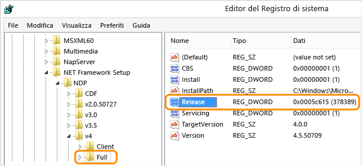

# Procedura: determinare le versioni di .NET Framework installate
Gli utenti possono installare ed eseguire nel computer più versioni di .NET Framework. Quando si sviluppa o si distribuisce l'app, potrebbe essere necessario conoscere quali versioni di .NET Framework sono installate nel computer dell'utente. Si noti che .NET Framework è costituito da due componenti principali, le cui versioni sono definite separatamente:  
  
-   Un set di assembly, ovvero raccolte di tipi e risorse che forniscono la funzionalità per le app. .NET Framework e gli assembly condividono lo stesso numero di versione.  
  
-   Common Language Runtime \(CLR\), che gestisce ed esegue il codice dell'app e che viene identificato dal relativo numero di versione \(vedere [Versioni e dipendenze](../../../docs/framework/migration-guide/versions-and-dependencies.md)\).  
  
 Per ottenere un elenco accurato delle versioni di .NET Framework installate in un computer, è possibile visualizzare il Registro di sistema o eseguire query sul Registro di sistema nel codice:  
  
 [Visualizzazione del Registro di sistema \(versioni 1\-4\)](#net_a)  
[Visualizzazione del Registro di sistema \(versione 4.5 e versioni successive\)](#net_b)  
[Uso di codice per eseguire una query sul Registro di sistema \(versioni 1\-4\)](#net_c)  
[Uso di codice per eseguire una query sul Registro di sistema \(versione 4.5 e versioni successive\)](#net_d)  
  
 Per trovare la versione di CLR, è possibile usare uno strumento o il codice:  
  
 [Uso dello strumento Clrver](#clr_a)  
[Uso del codice per eseguire query sulla classe System.Environment](#clr_b)  
  
 Per informazioni sul rilevamento degli aggiornamenti installati per ogni versione di .NET Framework, vedere [Procedura: determinare gli aggiornamenti di .NET Framework installati](../../../docs/framework/migration-guide/how-to-determine-which-net-framework-updates-are-installed.md). Per informazioni sull'installazione di .NET Framework, vedere la [Guida all'installazione](../../../docs/framework/install/guide-for-developers.md).  
  
<a name="net_a"></a>   
#### Per trovare le versioni di .NET Framework visualizzando il Registro di sistema \(.NET Framework 1\-4\)  
  
1.  Scegliere **Esegui** dal menu **Start**.  
  
2.  Nella casella **Apri** immettere **regedit.exe**.  
  
     Per eseguire regedit.exe, è necessario disporre di privilegi amministrativi.  
  
3.  Nell'Editor del Registro di sistema aprire la seguente sottochiave:  
  
     `HKEY_LOCAL_MACHINE\SOFTWARE\Microsoft\NET Framework Setup\NDP`  
  
     Le versioni installate sono elencate nella sottochiave NDP. Il numero di versione è archiviato nella voce **Version**. Per [!INCLUDE[net_v40_long](../../../includes/net-v40-long-md.md)] la voce **Version** è inclusa nella sottochiave Client o Full \(in NDP\) o in entrambe.  
  
    > [!NOTE]
    >  La cartella "NET Framework Setup" nel Registro di sistema non inizia con un punto.  
  
<a name="net_b"></a>   
#### Per trovare le versioni di .NET Framework visualizzando il Registro di sistema \(.NET Framework 4.5 e versioni successive\)  
  
1.  Scegliere **Esegui** dal menu **Start**.  
  
2.  Nella casella **Apri** immettere **regedit.exe**.  
  
     Per eseguire regedit.exe, è necessario disporre di privilegi amministrativi.  
  
3.  Nell'Editor del Registro di sistema aprire la seguente sottochiave:  
  
     `HKEY_LOCAL_MACHINE\SOFTWARE\Microsoft\NET Framework Setup\NDP\v4\Full`  
  
     Si noti che il percorso della sottochiave `Full` include la sottochiave `Net Framework` e non `.NET Framework`.  
  
    > [!NOTE]
    >  Se la sottochiave `Full` non è presente, .NET Framework 4.5 o versione successiva non è installato.  
  
     Verificare la presenza di un valore DWORD denominato `Release`. L'esistenza del valore DWORD `Release` indica che nel computer è stato installato [!INCLUDE[net_v45](../../../includes/net-v45-md.md)] o una versione successiva.  
  
       
  
     Il valore DWORD `Release` indica quale versione di .NET Framework è installata.  
  
    |Valore DWORD di Release|Versione|  
    |-----------------------------|--------------|  
    |378389|.NET Framework 4.5|  
    |378675|.NET Framework 4.5.1 installato con Windows 8.1 o Windows Server 2012 R2|  
    |378758|.NET Framework 4.5.1 installato in Windows 8, Windows 7 SP1 o Windows Vista SP2|  
    |379893|.NET Framework 4.5.2|  
    |Nei sistemi Windows 10: 393295<br /><br /> In tutte le altre versioni del sistema operativo: 393297|[!INCLUDE[net_v46](../../../includes/net-v46-md.md)]|  
    |Nei sistemi Windows 10 con aggiornamento di novembre: 394254<br /><br /> In tutte le altre versioni del sistema operativo: 394271|[!INCLUDE[net_v461](../../../includes/net-v461-md.md)]|  
  
<a name="net_c"></a>   
#### Per trovare le versioni di .NET Framework eseguendo query sul Registro di sistema nel codice \(.NET Framework 1\-4\)  
  
-   Usare la classe <xref:Microsoft.Win32.RegistryKey?displayProperty=fullName> per accedere alla sottochiave Software\\Microsoft\\NET Framework Setup\\NDP in HKEY\_LOCAL\_MACHINE nel Registro di sistema di Windows.  
  
     Nel codice seguente viene illustrato un esempio di questa query.  
  
    > [!NOTE]
    >  Questo codice non mostra come rilevare [!INCLUDE[net_v45](../../../includes/net-v45-md.md)] o versione successiva. Controllare il valore DWORD `Release` per rilevare tali versioni, come descritto nella sezione precedente.  
  
     [!code-csharp[ListVersions#0](../../../samples/snippets/csharp/VS_Snippets_CLR/listversions/cs/program.cs#0)]
     [!code-vb[ListVersions#0](../../../samples/snippets/visualbasic/VS_Snippets_CLR/listversions/vb/program.vb#0)]  
    [!code-csharp[ListVersions#1](../../../samples/snippets/csharp/VS_Snippets_CLR/listversions/cs/program.cs#1)]
    [!code-vb[ListVersions#1](../../../samples/snippets/visualbasic/VS_Snippets_CLR/listversions/vb/program.vb#1)]  
  
     In questo esempio viene generato un output simile al seguente:  
  
    ```  
  
    v2.0.50727  2.0.50727.4016  SP2 v3.0  3.0.30729.4037  SP2 v3.5  3.5.30729.01  SP1 v4 Client  4.0.30319 Full  4.0.30319  
    ```  
  
<a name="net_d"></a>   
#### Per trovare le versioni di .NET Framework eseguendo query sul Registro di sistema nel codice \(.NET Framework 4.5 e versioni successive\)  
  
1.  L'esistenza del valore DWORD `Release` indica che nel computer è stato installato .NET Framework 4.5 o versioni successive. Il valore di questa parola chiave indica la versione installata. Per controllare questa parola chiave, usare i metodi <xref:Microsoft.Win32.RegistryKey.OpenBaseKey%2A> e <xref:Microsoft.Win32.RegistryKey.OpenSubKey%2A> della classe <xref:Microsoft.Win32.RegistryKey?displayProperty=fullName> per accedere alla sottochiave Software\\Microsoft\\NET Framework Setup\\NDP\\v4\\Full in HKEY\_LOCAL\_MACHINE nel Registro di sistema di Windows.  
  
2.  Verificare il valore della parola chiave `Release` per determinare la versione installata. Affinché sia compatibile con la versione attualmente installata, è possibile cercare un valore maggiore o uguale ai valori elencati nella tabella. Ecco le versioni di .NET Framework e le parole chiave `Release` associate.  
  
    |Versione|Valore DWORD di Release|  
    |--------------|-----------------------------|  
    |.NET Framework 4.5|378389|  
    |.NET Framework 4.5.1 installato con Windows 8.1|378675|  
    |.NET Framework 4.5.1 installato in Windows 8, Windows 7 SP1 o Windows Vista SP2|378758|  
    |.NET Framework 4.5.2|379893|  
    |[!INCLUDE[net_v46](../../../includes/net-v46-md.md)] installato con Windows 10|393295|  
    |[!INCLUDE[net_v46](../../../includes/net-v46-md.md)] installato in tutte le altre versioni del sistema operativo|393297|  
    |[!INCLUDE[net_v461](../../../includes/net-v461-md.md)] installato in Windows 10|394254|  
    |[!INCLUDE[net_v461](../../../includes/net-v461-md.md)] installato in tutte le altre versioni del sistema operativo|394271|  
  
     Ecco un esempio di verifica di un valore maggiore o uguale ai valori della parola chiave Release per ogni versione:  
  
     [!code-csharp[ListVersions#0](../../../samples/snippets/csharp/VS_Snippets_CLR/listversions/cs/program.cs#0)]
     [!code-vb[ListVersions#0](../../../samples/snippets/visualbasic/VS_Snippets_CLR/listversions/vb/program.vb#0)]  
    [!code-csharp[ListVersions#3](../../../samples/snippets/csharp/VS_Snippets_CLR/listversions/cs/program.cs#3)]
    [!code-vb[ListVersions#3](../../../samples/snippets/visualbasic/VS_Snippets_CLR/listversions/vb/program.vb#3)]  
    [!code-csharp[ListVersions#4](../../../samples/snippets/csharp/VS_Snippets_CLR/listversions/cs/program.cs#4)]
    [!code-vb[ListVersions#4](../../../samples/snippets/visualbasic/VS_Snippets_CLR/listversions/vb/program.vb#4)]  
  
     In questo esempio viene generato un output simile al seguente:  
  
    ```  
    Version: 4.5.1 or later  
    ```  
  
<a name="clr_a"></a>   
#### Per trovare la versione corrente del runtime con lo strumento Clrver  
  
-   Usare lo strumento CLR Version \(Clrver.exe\) per determinare le versioni di Common Language Runtime installate in un computer.  
  
     Al prompt dei comandi di Visual Studio immettere `clrver`. Questo comando consente di generare un output analogo a quello illustrato di seguito.  
  
    ```  
    Versions installed on the machine: v2.0.50727 v4.0.30319  
    ```  
  
     Per altre informazioni sull'uso di questo strumento, vedere [Clrver.exe \(CLR Version Tool\)](../../../docs/framework/tools/clrver-exe-clr-version-tool.md).  
  
<a name="clr_b"></a>   
#### Per trovare la versione corrente del runtime eseguendo una query sulla classe Environment nel codice  
  
-   Eseguire una query sulla proprietà <xref:System.Environment.Version%2A?displayProperty=fullName> per recuperare un oggetto <xref:System.Version> che identifica la versione del runtime che esegue attualmente il codice. È possibile usare la proprietà <xref:System.Version.Major%2A?displayProperty=fullName> per ottenere l'identificatore della versione principale \(ad esempio "4" per la versione 4.0\), la proprietà <xref:System.Version.Minor%2A?displayProperty=fullName> per ottenere l'identificatore della versione secondaria \(ad esempio "0" per la versione 4.0\) oppure il metodo <xref:System.Object.ToString%2A?displayProperty=fullName> per ottenere l'intera stringa di versione \(ad esempio "4.0.30319.18010", come illustrato nel seguente codice\). Questa proprietà restituisce un valore singolo che corrisponde alla versione del runtime che esegue attualmente il codice; non restituisce le versioni di assembly o altre versioni del runtime che possono essere installate nel computer.  
  
     Per le versioni 4, 4.5, 4.5.1 e 4.5.2 di .NET Framework, la proprietà <xref:System.Environment.Version%2A?displayProperty=fullName> restituisce un oggetto <xref:System.Version> la cui rappresentazione di stringa ha il formato `4.0.30319.xxxxx`. Per [!INCLUDE[net_v46](../../../includes/net-v46-md.md)], ha il formato `4.0.30319.42000`.  
  
     Di seguito è illustrato un esempio di esecuzione di query sulla proprietà <xref:System.Environment.Version%2A?displayProperty=fullName> per informazioni sulla versione del runtime.  
  
     [!code-csharp[ListVersions#0](../../../samples/snippets/csharp/VS_Snippets_CLR/listversions/cs/program.cs#0)]
     [!code-vb[ListVersions#0](../../../samples/snippets/visualbasic/VS_Snippets_CLR/listversions/vb/program.vb#0)]  
    [!code-csharp[ListVersions#2](../../../samples/snippets/csharp/VS_Snippets_CLR/listversions/cs/program.cs#2)]
    [!code-vb[ListVersions#2](../../../samples/snippets/visualbasic/VS_Snippets_CLR/listversions/vb/program.vb#2)]  
  
     In questo esempio viene generato un output simile al seguente:  
  
    ```  
    Version: 4.0.30319.18010  
    ```  
  
## Vedere anche  
 [Procedura: determinare gli aggiornamenti di .NET Framework installati](../../../docs/framework/migration-guide/how-to-determine-which-net-framework-updates-are-installed.md)   
 [Guida all'installazione](../../../docs/framework/install/guide-for-developers.md)   
 [Versioni e dipendenze](../../../docs/framework/migration-guide/versions-and-dependencies.md)