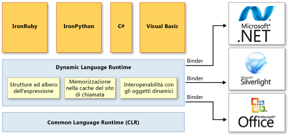

# Dynamic Language Runtime Overview
*Dynamic Language Runtime* \(DLR\) è un ambiente di runtime che estende Common Language Runtime \(CLR\) con un set di servizi per linguaggi dinamici.  DLR semplifica lo sviluppo di linguaggi dinamici eseguibili in .NET Framework nonché l'aggiunta di funzionalità dinamiche a linguaggi tipizzati in modo statico.  
  
 I linguaggi dinamici possono identificare il tipo di un oggetto in fase di esecuzione, mentre nei linguaggi tipizzati in modo statico quali C\# e Visual Basic \(quando si utilizza `Option Explicit On`\) i tipi di oggetto devono essere specificati in fase di progettazione.  Esempi di linguaggi dinamici sono Lisp, Smalltalk, JavaScript, PHP, Ruby, Python, ColdFusion, Lua, Cobra e Groovy.  
  
 La maggior parte dei linguaggi dinamici offre agli sviluppatori i vantaggi seguenti:  
  
-   Possibilità di utilizzare un ciclo di feedback rapido REPL \(Read\-Evaluate\-Print Loop, ciclo lettura\-valutazione\-stampa\).  Ciò consente di immettere diverse istruzioni ed eseguirle immediatamente per vedere i risultati.  
  
-   Supporto sia per lo sviluppo dall'alto verso il basso sia per lo sviluppo più tradizionale dal basso verso l'alto.  Ad esempio, quando si utilizza un approccio dall'alto verso il basso è possibile chiamare funzioni non ancora implementate e quindi aggiungere implementazioni sottostanti quando occorrono.  
  
-   Semplificazione del refactoring e della modifica del codice, poiché non è necessario modificare dichiarazioni di tipo statiche in tutto il codice.  
  
 I linguaggi dinamici sono eccellenti linguaggi di script.  Grazie ai linguaggi dinamici, i clienti possono estendere facilmente le applicazioni create con nuovi comandi e funzionalità.  I linguaggi dinamici vengono spesso utilizzati anche per creare siti Web e test harness, gestire server farm, sviluppare varie utilità ed eseguire trasformazioni dei dati.  
  
 Lo scopo di DLR è consentire l'esecuzione di un sistema di linguaggi dinamici in .NET Framework e garantire a tali linguaggi l'interoperabilità .NET.  In Visual Studio 2010, DLR introduce gli oggetti dinamici in C\# e Visual Basic per supportare il comportamento dinamico in questi linguaggi e consentirne l'interoperabilità con i linguaggi dinamici.  
  
 DLR consente inoltre di creare librerie che supportano operazioni dinamiche.  Ad esempio, se si dispone di una libreria che utilizza oggetti XML o JavaScript Object Notation \(JSON\), nei linguaggi che utilizzano DLR tali oggetti possono essere considerati come oggetti dinamici.  Ciò consente agli utenti della libreria di scrivere codice più naturale e più semplice dal punto di vista della sintassi per utilizzare gli oggetti e accedere ai relativi membri.  
  
 Ad esempio, in XML in C\# è possibile utilizzare il codice seguente per incrementare un contatore.  
  
 `Scriptobj.SetProperty("Count", ((int)GetProperty("Count")) + 1);`  
  
 Con DLR è invece possibile utilizzare il codice seguente per la stessa operazione.  
  
 `scriptobj.Count += 1;`  
  
 Come CLR, DLR è una parte di .NET Framework e viene fornito con i pacchetti di installazione di .NET Framework e Visual Studio.  La versione open\-source di DLR è anche scaricabile dal sito Web [CodePlex](http://go.microsoft.com/fwlink/?LinkId=141028).  
  
> [!NOTE]
>  La versione open\-source di DLR offre tutte le funzionalità di DLR incluse in Visual Studio e .NET Framework.  Inoltre, tale versione fornisce supporto aggiuntivo per gli implementatori di linguaggio.  Per ulteriori informazioni, vedere la documentazione nel sito Web [CodePlex](http://go.microsoft.com/fwlink/?LinkId=141028).  
  
 Seguono alcuni esempi di linguaggi sviluppati tramite DLR:  
  
-   IronPython.  Disponibile come software open\-source nel sito Web [CodePlex](http://go.microsoft.com/fwlink/?LinkId=141040).  
  
-   IronRuby.  Disponibile come software open\-source nel sito Web [RubyForge](http://go.microsoft.com/fwlink/?LinkId=141044).  
  
## Vantaggi principali di DLR  
 DLR offre i vantaggi elencati di seguito.  
  
### Semplificazione del porting dei linguaggi dinamici a .NET Framework  
 Grazie a DLR, gli implementatori di linguaggio possono evitare la creazione di analizzatori lessicali, parser, analizzatori semantici, generatori di codice e degli altri strumenti che di norma sono tenuti a creare.  Per utilizzare DLR, un linguaggio deve produrre *strutture ad albero dell'espressione* \(che rappresentano codice a livello di linguaggio in una struttura ad albero\), routine di supporto di runtime e oggetti dinamici facoltativi che implementano l'interfaccia <xref:System.Dynamic.IDynamicMetaObjectProvider>.  DLR e .NET Framework automatizzano molte delle attività di analisi e generazione del codice.  Ciò consente agli implementatori di linguaggio di concentrarsi sulle funzionalità peculiari dei linguaggi.  
  
### Possibilità di utilizzare funzionalità dinamiche in linguaggi tipizzati in modo statico  
 I linguaggi di .NET Framework esistenti quali C\# e Visual Basic sono in grado di creare oggetti dinamici e utilizzarli insieme a oggetti tipizzati in modo statico.  Ad esempio, C\# e Visual Basic sono in grado di utilizzare oggetti dinamici per HTML, Document Object Model \(DOM\) e reflection .NET.  
  
### Possibilità di ottenere i vantaggi futuri di DLR e .NET Framework  
 I linguaggi implementati tramite DLR possono trarre vantaggio dai miglioramenti futuri di DLR e .NET Framework.  Ad esempio, se .NET Framework rilascia una nuova versione avente un Garbage Collector migliorato o un tempo ridotto di caricamento degli assembly, i linguaggi implementati tramite DLR ottengono immediatamente gli stessi vantaggi.  Se DLR aggiunge ottimizzazioni, ad esempio una migliore compilazione, le prestazioni migliorano anche per tutti i linguaggi implementati tramite DLR.  
  
### Possibilità di condividere librerie e oggetti  
 Gli oggetti e le librerie implementati in un determinato linguaggio possono essere utilizzati da altri linguaggi.  DLR consente inoltre l'interoperabilità tra i linguaggi dinamici e quelli tipizzati in modo statico.  Ad esempio, C\# può dichiarare un oggetto dinamico che utilizza una libreria scritta in un linguaggio dinamico.  Allo stesso tempo, i linguaggi dinamici possono utilizzare le librerie di .NET Framework.  
  
### Funzionalità dinamiche veloci di invio e richiamo  
 DLR consente l'esecuzione veloce di operazioni dinamiche tramite il supporto di un'avanzata funzionalità polimorfica di memorizzazione nella cache.  DLR crea regole per associare le operazioni che utilizzano oggetti alle implementazioni di runtime necessarie e quindi memorizza nella cache tali regole per evitare che durante le esecuzioni successive dello stesso codice per gli stessi tipi di oggetti vengano eseguiti calcoli di associazione onerosi in termini di utilizzo delle risorse.  
  
## Architettura DLR  
 Nella figura seguente viene illustrata l'architettura DLR.  
  
   
Architettura DLR  
  
 DLR estende CLR con un set di servizi in grado di supportare in modo più efficiente i linguaggi dinamici.  Questi servizi includono:  
  
-   Strutture ad albero dell'espressione.  DLR utilizza le strutture ad albero dell'espressione per rappresentare la semantica del linguaggio.  A tale scopo, DLR ha esteso le strutture ad albero dell'espressione LINQ affinché includano il flusso di controllo, l'assegnazione e altri nodi di modellazione dei linguaggi.  Per ulteriori informazioni, vedere [Strutture ad albero dell'espressione](../Topic/Expression%20Trees%20\(C%23%20and%20Visual%20Basic\).md).  
  
-   Memorizzazione nella cache del sito di chiamata.  Un *sito di chiamata dinamica* è un punto del codice in cui si esegue un'operazione come `a + b` o `a.b()` su oggetti dinamici.  DLR memorizza nella cache le caratteristiche di `a` e `b` \(in genere i tipi di questi oggetti\) e le informazioni sull'operazione.  Se tale operazione è già stata eseguita in precedenza, DLR recupera tutte le informazioni necessarie dalla cache per eseguire un invio veloce.  
  
-   Interoperabilità con gli oggetti dinamici.  DLR fornisce un set di classi e interfacce che rappresentano oggetti e operazioni dinamici utilizzabili dagli implementatori di linguaggio e dagli autori di librerie dinamiche.  Tali classi e interfacce comprendono <xref:System.Dynamic.IDynamicMetaObjectProvider>, <xref:System.Dynamic.DynamicMetaObject>, <xref:System.Dynamic.DynamicObject> e <xref:System.Dynamic.ExpandoObject>.  
  
 DLR utilizza gestori di associazione nei siti di chiamata per comunicare non solo con .NET Framework, ma anche con altre infrastrutture e servizi, compresi Silverlight e COM.  I gestori di associazione incapsulano la semantica di un linguaggio e specificano come eseguire operazioni in un sito di chiamata tramite strutture ad albero dell'espressione.  Ciò consente ai linguaggi dinamici e a quelli tipizzati in modo statico che utilizzano DLR di condividere librerie nonché accedere a tutte le tecnologie supportate da DLR.  
  
## Documentazione DLR  
 Per ulteriori informazioni su come utilizzare la versione open\-source di DLR per aggiungere un comportamento dinamico in un linguaggio o su come consentire l'utilizzo di un linguaggio dinamico con .NET Framework, vedere la documentazione disponibile nel sito Web [CodePlex](http://go.microsoft.com/fwlink/?LinkId=141028).  
  
## Vedere anche  
 <xref:System.Dynamic.ExpandoObject>   
 <xref:System.Dynamic.DynamicObject>   
 [Common Language Runtime](../../../docs/standard/clr.md)   
 [Strutture ad albero dell'espressione](../Topic/Expression%20Trees%20\(C%23%20and%20Visual%20Basic\).md)   
 [Procedura dettagliata: creazione e utilizzo di oggetti dinamici](../Topic/Walkthrough:%20Creating%20and%20Using%20Dynamic%20Objects%20\(C%23%20and%20Visual%20Basic\).md)