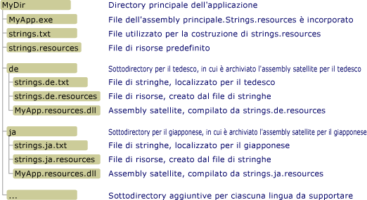

# Creazione di assembly satellite per applicazioni desktop
I file di risorse svolgono un ruolo fondamentale nelle applicazioni localizzate.  Consentono ad un'applicazione di visualizzare stringhe, immagini e altri dati nella propria lingua e impostazioni di cultura e forniscono dati alternativi se le risorse per la propria lingua e impostazioni di cultura non sono disponibili.  .NET Framework utilizza un modello hub e spoke per individuare e distribuire le risorse localizzate.  L'hub è l'assembly principale che contiene il codice eseguibile non localizzabile e le risorse relative a singole impostazioni di cultura, note come non associate ad alcun paese o predefinite.  Le impostazioni di cultura predefinite sono le impostazioni di cultura di fallback dell'applicazione; vengono utilizzate quando non sono disponibili risorse localizzate.  Utilizzare l'attributo <xref:System.Resources.NeutralResourcesLanguageAttribute> per definire le impostazioni cultura delle impostazioni cultura predefinite dell'applicazione.  Ciascuno spoke si connette ad un assembly satellite che contiene le risorse relative a singole impostazioni cultura localizzate, ma non contiene alcun codice.  Poiché gli assembly satellite non fanno parte dell'assembly principale, è possibile sostituire o aggiornare facilmente le risorse che corrispondono a impostazioni cultura specifiche senza sostituire l'assembly principale dell'applicazione.  
  
> [!NOTE]
>  Le risorse di lingua predefinita di un'applicazione possono anche essere memorizzate in un assembly satellite.  A tale scopo, assegnare all'attributo <xref:System.Resources.NeutralResourcesLanguageAttribute> un valore di <xref:System.Resources.UltimateResourceFallbackLocation?displayProperty=fullName>.  
  
## Percorso e nome dell'Assembly satellite  
 Il modello hub e spoke richiede che le risorse vengano inserite in percorsi specifici, in modo da poter essere facilmente individuate e utilizzate.  Se le risorse non vengono compilate e denominate correttamente, o se non vengono inserite nei percorsi corretti, Common Language Runtime non potrà individuarle e utilizzerà al loro posto le risorse delle impostazioni cultura predefinite.  Il gestore delle risorse di .NET Framework, rappresentato da un oggetto <xref:System.Resources.ResourceManager>, viene utilizzato automaticamente per accedere alle risorse localizzate.  Il gestore delle risorse richiede:  
  
-   Un assembly satellite singolo deve includere tutte le risorse per determinate impostazioni cultura.  Ovvero è necessario compilare più file .txt o .resx in un singolo file binario .resources.  
  
-   Deve essere presente una sottodirectory separata nella directory dell'applicazione per ciascuna delle impostazioni cultura localizzate che contengono le risorse delle impostazioni cultura.  Il nome della sottodirectory deve corrispondere al nome delle impostazioni cultura.  In alternativa, è possibile memorizzare gli assembly satellite nella global assembly cache.  In questo caso, il componente di informazioni delle impostazioni cultura di nome sicuro dell'assembly deve indicare le impostazioni cultura. \(Vedere la sezione [Installare gli assembly satellite nella Global Assembly Cache](#SN) più avanti in questo argomento\).  
  
    > [!NOTE]
    >  Se l'applicazione include risorse per le lingue secondarie, inserire ogni elemento in una sottodirectory separata nella directory dell'applicazione.  Non inserire le impostazioni cultura secondarie in sottodirectory della directory delle impostazioni cultura principali.  
  
-   L'assembly satellite deve avere lo stesso nome dell'applicazione e deve utilizzare l'estensione ".resources.dll".  Ad esempio, se un'applicazione è denominata Example. exe, il nome di ogni assembly satellite dovrà essere Example.resources.dll.  Si noti che il nome dell'assembly satellite non indica le impostazioni cultura dei suoi file di risorse.  Tuttavia, l'assembly satellite viene visualizzato in una directory che consente di specificare le impostazioni cultura.  
  
-   Informazioni sulle impostazioni cultura dell'assembly satellite devono essere incluse nei metadati dell'assembly.  Per archiviare il nome di impostazioni cultura nei metadati degli assembly satellite, specificare l'opzione `/culture` quando si utilizza [Assembly Linker](../../../docs/framework/tools/al-exe-assembly-linker.md) per importare risorse nell'assembly satellite.  
  
 Nell'illustrazione riportata di seguito vengono mostrati i requisiti del percorso e una struttura di directory di esempio per le applicazioni non installate nella [Global Assembly Cache](../../../docs/framework/app-domains/gac.md).  Gli elementi con estensione .txt e .resources non verranno forniti con l'applicazione finale.  Si tratta di file di risorse intermedi utilizzati per creare gli assembly di risorse satellite finali.  In questo esempio è possibile sostituire file RESX ai file TXT.  Per ulteriori informazioni, vedere [Importazione ed esportazione di risorse](../../../docs/framework/resources/packaging-and-deploying-resources-in-desktop-apps.md).  
  
   
Directory di assembly satellite  
  
## Compilazione di assembly satellite  
 Utilizzare [generatore di file di risorse \(Resgen.exe\)](../../../docs/framework/tools/resgen-exe-resource-file-generator.md) per compilare i file di testo o i file XML con estensione .resx che contengono le risorse ai file binari .resources.  Per compilare i file .resources in assembly satellite, utilizzare [Assembly Linker \(Al.exe\)](../../../docs/framework/tools/al-exe-assembly-linker.md).  Al.exe crea un assembly dai file RESOURCES specificati.  Gli assembly satellite possono contenere solo risorse; non possono contenere codice eseguibile.  
  
 Il comando Al.exe riportato di seguito crea un assembly satellite con nome sicuro per l'applicazione `Example` dal file string.de.resources delle risorse tedesche.  
  
```  
al /target:lib /embed:strings.de.resources /culture:de /out:Example.resources.dll  
```  
  
 Anche il comando Al.exe seguente crea un assembly satellite per l'applicazione `Example` dal file strings.de.resources.  L'opzione **\/template** fa sì che l'assembly satellite erediti tutti i metadati dell'assembly ad eccezione delle informazioni sulle impostazioni cultura dall'assembly padre \(Example.dll\).  
  
```  
al /target:lib /embed:strings.de.resources /culture:de /out:Example.resources.dll /template:Example.dll  
```  
  
 Nella tabella che segue vengono illustrate in modo più dettagliato le opzioni di Al.exe utilizzate in questi comandi.  
  
|Opzione|Descrizione|  
|-------------|-----------------|  
|**\/target:**lib|Specifica che l'assembly satellite viene compilato in un file di libreria \(.dll\).  Poiché un assembly satellite non contiene codice eseguibile e non è un assembly principale di applicazione, è necessario salvare gli assembly satellite come DLL.|  
|**\/embed:**strings.de.resources|Specifica il nome del file di risorse da utilizzare quando Al.exe compila l'assembly.  È possibile importare i file di più resources in un assembly satellite, ma se si segue il modello hub\-and\-spoke, è necessario compilare un assembly satellite per tutte le impostazioni cultura.  È comunque possibile creare file .resources separati per stringhe e oggetti.|  
|**\/culture:**de|Specifica le impostazioni cultura della risorsa da compilare.  Common language runtime utilizza queste informazioni quando cerca le risorse per le impostazioni cultura specificate.  Se si omette questa opzione, Al.exe compila la risorsa, ma il runtime non riesce a trovarla quando un utente la richiede.|  
|**\/out:**Example.resources.dll|Specifica il nome del file di output.  Il nome deve seguire la denominazione standard *baseName*.resources.*extension*, dove *baseName* è il nome dell'assembly principale e *extension* è un'estensione valida \(ad esempio .dll\).  Si noti che il runtime no può determinare le impostazioni cultura di un assembly satellite in base al nome del suo file di output; è necessario utilizzare l'opzione **\/culture** per specificarle.|  
|**\/template:**Example.dll|Specifica un assembly dal quale tutti gli assembly satelliti erediteranno tutti i metadati di assembly, ad eccezione del campo relativo alle impostazioni cultura.  Questa opzione ha effetto sugli assembly satellite solo se si specifica un assembly con un nome sicuro [](../../../docs/framework/app-domains/strong-named-assemblies.md "Strong-Named Assemblies").|  
  
 Per un elenco completo delle opzioni disponibili con Al.exe, vedere [Assembly Linker \(Al.exe\)](../../../docs/framework/tools/al-exe-assembly-linker.md).  
  
## Assembly satellite: Un esempio  
 Ecco un semplice esempio "Hello world" che mostra una finestra di messaggio contenente un saluto localizzato.  L'esempio include le risorse per le impostazioni cultura inglesi \(Stati Uniti\), francesi \(Francia\) e russe \(Russia\) e le relative impostazioni cultura di fallback sono inglesi.  Per creare l'esempio, effettuare le seguenti operazioni:  
  
1.  Creare un file di risorse denominato Greeting.resx o Greeting.txt per contenere la risorsa per le impostazioni cultura predefinite.  Archiviare una singola stringa denominata `HelloString` il cui valore è "hello world\!" in questo file.  
  
2.  Per indicare che "en" rappresenta le impostazioni cultura predefinite dell'applicazione, è necessario aggiungere anche il seguente attributo <xref:System.Resources.NeutralResourcesLanguageAttribute?displayProperty=fullName> al file AssemblyInfo dell'applicazione o a uno dei file di codice sorgente principali che sarà compilato nell'assembly principale dell'applicazione.  
  
     [!code-csharp[Conceptual.Resources.Locating#2](../../../samples/snippets/csharp/VS_Snippets_CLR/conceptual.resources.locating/cs/assemblyinfo.cs#2)]
     [!code-vb[Conceptual.Resources.Locating#2](../../../samples/snippets/visualbasic/VS_Snippets_CLR/conceptual.resources.locating/vb/assemblyinfo.vb#2)]  
  
3.  Aggiungere il supporto per impostazioni cultura addizionali \(en\-US, fr\-FR e ru\-RU\) all'applicazione nel modo seguente:  
  
    -   Per supportare le impostazioni cultura "en\-US" o in lingua inglese \(Stati Uniti\), creare un file di risorse denominato Greeting.en\-US.resx e archiviarlo in una singola stringa denominata `HelloString` il cui valore è "Hi world\!".  
  
    -   Per supportare le impostazioni cultura "fr\-FR" o in lingua francese \(Francia\), creare un file di risorse denominato Greeting.fr\-FR.resx e archiviarlo in una singola stringa denominata `HelloString` il cui valore è "Salut tout le monde\!".  
  
    -   Per supportare le impostazioni cultura "ru\-RU" o in lingua russa \(Russia\), creare un file di risorse denominato Greeting.ru\-RU.resx e archiviarlo in una singola stringa denominata `HelloString` il cui valore è "Всем привет\!".  
  
4.  Utilizzare [Resgen. exe](../../../docs/framework/tools/resgen-exe-resource-file-generator.md) per compilare ogni testo o un file di risorse XML in un file binario .resources.  L'output è un set di file con lo stesso nome file radice del resx o .txt file, ma estensione .resources.  Se si crea l'esempio con Visual Studio, il processo di compilazione viene gestito automaticamente.  Se non si utilizza Visual Studio, eseguire i seguenti controlli per compilare i file .resx in file .resources:  
  
    ```  
  
    resgen Greeting.resx  
    resgen Greeting.en-us.resx  
    resgen Greeting.fr-FR.resx  
    resgen Greeting.ru-RU.resx  
  
    ```  
  
     Se le risorse sono in file di testo anziché in file XML, sostituire l'estensione .resx con .txt.  
  
5.  Compilare il codice sorgente riportato di seguito con le risorse per le impostazioni cultura predefinite nell'assembly principale dell'applicazione:  
  
    > [!IMPORTANT]
    >  Se si utilizza la riga di comando anziché Visual Studio per creare l'esempio, è necessario modificare la chiamata al costruttore della classe <xref:System.Resources.ResourceManager> come nel seguente: `ResourceManager rm = new ResourceManager("Greetings",``typeof(Example).Assembly);`  
  
     [!code-csharp[Conceptual.Resources.Locating#1](../../../samples/snippets/csharp/VS_Snippets_CLR/conceptual.resources.locating/cs/program.cs#1)]
     [!code-vb[Conceptual.Resources.Locating#1](../../../samples/snippets/visualbasic/VS_Snippets_CLR/conceptual.resources.locating/vb/module1.vb#1)]  
  
     Se l'applicazione è denominata Example e si compila dalla riga di comando, il comando per il compilatore C\# è:  
  
    ```  
    csc Example.cs /res:Greeting.resources  
    ```  
  
     Il corrispondente comando del compilatore Visual Basic:  
  
    ```  
    vbc Example.vb /res:Greeting.resources  
    ```  
  
6.  Creare una sottodirectory nella directory principale dell'applicazione per ogni lingua localizzata supportata dall'applicazione.  È necessario creare delle sottodirectory en\-US, fr\-FR e ru\- RU.  Come parte del processo di compilazione, Visual Studio crea automaticamente queste sottodirectory.  
  
7.  Incorporare i singoli file specifici delle impostazioni cultura .resources in assembly satellite e salvarli nella directory appropriata.  Il comando per eseguire questa operazione per ogni file .resources è:  
  
    ```  
    al /target:lib /embed:Greeting.culture.resources /culture:culture /out:culture\Example.resources.dll  
    ```  
  
     dove *culture* è il nome delle impostazioni cultura le cui risorse sono contenute dall'assembly satellite.  Visual Studio gestisce automaticamente questo processo.  
  
 È quindi possibile eseguire l'esempio.  Renderà casualmente una delle impostazioni cultura le impostazioni cultura correnti e visualizzerà un messaggio di saluto localizzata.  
  
<a name="SN"></a>   
## Installazione di un assembly satellite nella Global Assembly Cache  
 Invece di installare gli assembly in una sottodirectory dell'applicazione locale, è possibile installarli nella global assembly cache.  Ciò è particolarmente utile se si dispone di librerie di classi e gli assembly di risorse libreria di classi che vengono utilizzati da più applicazioni.  
  
 Installare degli assembly nella global assembly cache richiede che essi abbiano nomi sicuri.  Gli assembly con nomi sicuri sono firmati con una coppia di chiavi pubblica\/privata valida.  Essi contengono informazioni sulla versione che utilizza il runtime per determinare quale assembly utilizzare per soddisfare una richiesta di associazione.  Per ulteriori informazioni sui nomi sicuri e sul controllo delle versioni, vedere [Controllo delle versioni degli assembly](../../../docs/framework/app-domains/assembly-versioning.md).  Per ulteriori informazioni sui nomi sicuri, vedere [Assembly con nome sicuro](../../../docs/framework/app-domains/strong-named-assemblies.md).  
  
 Quando si sviluppa un'applicazione, è probabile che non si avrà accesso alla coppia di chiavi pubblica\/privata finale.  Per installare un assembly satellite nella Global Assembly Cache ed essere sicuri che funzioni correttamente, è possibile utilizzare una tecnica denominata firma posticipata.  Quando si posticipa la firma di un assembly, durante la compilazione viene riservato nel file lo spazio per la firma con nome sicuro.  La firma viene posticipata a quando sarà disponibile la coppia di chiavi pubblica\/privata finale.  Per ulteriori informazioni sulla firma posticipata, vedere [Firma posticipata di un assembly](../../../docs/framework/app-domains/delay-sign-assembly.md).  
  
### Recupero della chiave pubblica  
 Per posticipare la firma di un assembly, è necessario avere accesso alla chiave pubblica.  È possibile ottenere la chiave pubblica reale dall'organizzazione della propria azienda che eventualmente provvederà ad apporre la firma, o a creare una chiave pubblica utilizzando lo [strumento Nome sicuro \(Sn.exe\)](../../../docs/framework/tools/sn-exe-strong-name-tool.md).  
  
 Il comando Sn.exe crea una coppia di chiavi pubblica\/privata del test.  L'opzione **–k** indica a Sn.exe di creare una nuova coppia di chiavi e la salva in un file chiamato TestKeyPair.snk.  
  
```  
sn –k TestKeyPair.snk   
```  
  
 È possibile estrarre la chiave pubblica dal file contenente la coppia di chiavi di prova.  Il comando seguente estrae la chiave pubblica da TestKeyPair.snk e la salva in PublicKey.snk:  
  
```  
sn –p TestKeyPair.snk PublicKey.snk  
```  
  
### Ritardo della firma di un assembly  
 Una volta ottenuta o creata la chiave pubblica, utilizzare [Assembly Linker \(Al.exe\)](../../../docs/framework/tools/al-exe-assembly-linker.md) per compilare l'assembly con il posticipo della firma.  
  
 Il comando Al.exe riportato di seguito crea un assembly satellite con nome sicuro per l'applicazione StringLibrary dal file strings.ja.resources:  
  
```  
al /target:lib /embed:strings.ja.resources /culture:ja /out:StringLibrary.resources.dll /delay+ /keyfile:PublicKey.snk  
```  
  
 L'opzione **\/delay\+** specifica che l'Assembly Linker deve ritardare la firma dell'assembly.  L'opzione **\/keyfile:** specifica il nome del file di chiavi contenente la chiave pubblica da utilizzare per posticipare la firma dell'assembly.  
  
### Nuova firma di un assembly  
 Prima di distribuire l'applicazione, è necessario firmare di nuovo l'assembly satellite con firma ritardata con la coppia di chiavi reale.  È possibile compiere questa operazione utilizzando Sn.exe.  
  
 Il comando Sn.exe seguente firma StringLibrary.resources.dll con la coppia di chiavi archiviata nel file RealKeyPair.snk.  L'opzione **–R** indica al comando Sn.exe di firmare nuovamente un assembly firmato in precedenza o con firma ritardata.  
  
```  
sn –R StringLibrary.resources.dll RealKeyPair.snk   
```  
  
### Installazione di un assembly satellite nella Global Assembly Cache  
 Durante il processo di fallback delle risorse la ricerca di risorse viene effettuata dapprima nella [Global Assembly Cache](../../../docs/framework/app-domains/gac.md) . \(Per ulteriori informazioni, vedere la sezione "Processo di fallback delle risorse" nell'argomento [Creazione del pacchetto e distribuzione delle risorse](../../../docs/framework/resources/packaging-and-deploying-resources-in-desktop-apps.md) .\) Non appena un assembly satellite è firmato con un nome sicuro, esso può essere installato nella global assembly cache utilizzando [Strumento Global Assembly Cache \(Gacutil. exe\)](../../../docs/framework/tools/gacutil-exe-gac-tool.md).  
  
 Il seguente comando Gacutil.exe installa StringLibrary.resources.dll nella Global Assembly Cache:  
  
```  
gacutil /i:StringLibrary.resources.dll  
```  
  
 L'opzione **\/i** indica al comando Gacutil.exe di installare l'assembly specificato nella Global Assembly Cache.  Dopo che l'assembly satellite viene installato nella cache, le risorse che esso contiene diventano disponibili per tutte le applicazioni progettate per utilizzare l'assembly satellite.  
  
### Le risorse nella Global Assembly Cache: un esempio  
 Nell'esempio seguente viene utilizzato un metodo in una libreria di classi .NET Framework per estrarre e restituire un saluto localizzato da un file di risorse.  La libreria e le relative risorse sono registrate nella global assembly cache.  L'esempio include le risorse per l'inglese \(Stati Uniti\), francese \(Francia\), russo \(Russia\) e le impostazioni cultura inglesi.  Li impostazioni cultura inglesi sono le predefinite; le risorse vengono memorizzate nell'assembly principale.  L'esempio inizialmente ritarda la firma della libreria e dei suoi assembly satellite con una chiave pubblica, quindi li firma nuovamente con una coppia di chiavi pubblica\/privata.  Per creare l'esempio, effettuare le seguenti operazioni:  
  
1.  Se non si utilizza Visual Studio, utilizzare il seguente comando [strumento Nome sicuro \(Sn.exe\)](../../../docs/framework/tools/sn-exe-strong-name-tool.md) per creare una coppia di chiavi pubblica\/privata denominata ResKey.snk:  
  
    ```  
    sn –k ResKey.snk  
    ```  
  
     Se si utilizza Visual Studio, utilizzare la scheda **Firma** dalla finestra di dialogo del progetto **Proprietà** per generare il file di chiave.  
  
2.  Utilizzare il seguente comando [strumento Nome sicuro \(Sn.exe\)](../../../docs/framework/tools/sn-exe-strong-name-tool.md) per creare un file di chiave pubblica denominato PublicKey.snk:  
  
    ```  
    sn –p ResKey.snk PublicKey.snk  
    ```  
  
3.  Creare un file di risorse denominato Strings. resx per contenere la risorsa per le impostazioni cultura predefinite.  Archiviare una singola stringa denominata `Greeting` il cui valore è "How do you do?" in tale file.  
  
4.  Per indicare che "en" rappresenta le impostazioni cultura predefinite dell'applicazione, è necessario aggiungere anche il seguente attributo <xref:System.Resources.NeutralResourcesLanguageAttribute?displayProperty=fullName> al file AssemblyInfo dell'applicazione o a uno dei file di codice sorgente che sarà compilato nell'assembly principale dell'applicazione.  
  
     [!code-csharp[Conceptual.Resources.Satellites#2](../../../samples/snippets/csharp/VS_Snippets_CLR/conceptual.resources.satellites/cs/stringlibrary.cs#2)]
     [!code-vb[Conceptual.Resources.Satellites#2](../../../samples/snippets/visualbasic/VS_Snippets_CLR/conceptual.resources.satellites/vb/stringlibrary.vb#2)]  
  
5.  Aggiungere il supporto per impostazioni cultura addizionali \(en\-US, fr\-FR e ru\-RU\) all'applicazione nel modo seguente:  
  
    -   Per supportare le impostazioni cultura "en\-US" o inglesi \(Stati Uniti\), creare un file di risorse denominato Strings.en\-US.resx o Strings.en.US.txt e archiviarlo in una singola stringa denominata `Greeting` il cui valore è "Hello\!".  
  
    -   Per supportare le impostazioni cultura "fr\-FR" o in lingua francese \(Francia\), creare un file di risorse denominato Strings.fr\-FR.resx o Strings.fr\-FR.txt e archiviarlo in una singola stringa denominata `Greeting` il cui valore è "Bon jour\!".  
  
    -   Per supportare le impostazioni cultura "ru\-RU" o in lingua russa \(Russia\), creare un file di risorse denominato Strings.ru\-RU.resx o Strings.ru.Ru.txt e archiviarlo in una singola stringa denominata `Greeting` il cui valore è "Привет\!".  
  
6.  Utilizzare [Resgen. exe](../../../docs/framework/tools/resgen-exe-resource-file-generator.md) per compilare ogni testo o un file di risorse XML in un file binario .resources.  L'output è un set di file con lo stesso nome file radice del resx o .txt file, ma estensione .resources.  Se si crea l'esempio con Visual Studio, il processo di compilazione viene gestito automaticamente.  Se non si utilizza Visual Studio, eseguire i seguenti comandi per compilare i file .resx in file .resources:  
  
    ```  
    resgen filename  
    ```  
  
     dove *filename* è il percorso opzionale, il nome file e l'estensione del file .resx o del file di testo.  
  
7.  Compilare il seguente codice sorgente per StringLibrary.vb o StringLibrary.cs con le risorse per le impostazioni cultura predefinite in un assembly della libreria con firma ritardata denominata StringLibrary.dll:  
  
    > [!IMPORTANT]
    >  Se si utilizza la riga di comando anziché Visual Studio per creare l'esempio, è necessario modificare la chiamata al costruttore della classe <xref:System.Resources.ResourceManager> in `ResourceManager rm = new ResourceManager("Strings",` `typeof(Example).Assembly);`  
  
     [!code-csharp[Conceptual.Resources.Satellites#1](../../../samples/snippets/csharp/VS_Snippets_CLR/conceptual.resources.satellites/cs/stringlibrary.cs#1)]
     [!code-vb[Conceptual.Resources.Satellites#1](../../../samples/snippets/visualbasic/VS_Snippets_CLR/conceptual.resources.satellites/vb/stringlibrary.vb#1)]  
  
     Il comando del compilatore C\# è:  
  
    ```  
    csc /t:library /resource:Strings.resources /delaysign+ /keyfile:publickey.snk StringLibrary.cs  
    ```  
  
     Il corrispondente comando del compilatore Visual Basic:  
  
    ```  
    vbc /t:library /resource:Strings.resources /delaysign+ /keyfile:publickey.snk StringLibrary.vb  
    ```  
  
8.  Creare una sottodirectory nella directory principale dell'applicazione per ogni lingua localizzata supportata dall'applicazione.  È necessario creare delle sottodirectory en\-US, fr\-FR e ru\- RU.  Come parte del processo di compilazione, Visual Studio crea automaticamente queste sottodirectory.  Poiché tutti gli assembly satellite hanno lo stesso nome del file, le sottodirectory vengono utilizzate per archiviare i singoli assembly satellite specifici delle impostazioni cultura fino che essi non sono firmati con una coppia di chiavi pubblica\/privata.  
  
9. Incorporare i singoli file specifici delle impostazioni cultura .resources in assembly satellite con firma ritardata e salvarli nella directory appropriata.  Il comando per eseguire questa operazione per ogni file .resources è:  
  
    ```  
    al /target:lib /embed:Strings.culture.resources /culture:culture /out:culture\StringLibrary.resources.dll /delay+ /keyfile:publickey.snk  
    ```  
  
     dove *culture* è il nome delle impostazioni cultura.  In questo esempio, i nomi delle impostazioni cultura sono en\-US, fr\-FR e ru\- RU.  
  
10. Firmare nuovamente StringLibrary.dll utilizzando [Strumento nome sicuro \(sn. exe\)](../../../docs/framework/tools/sn-exe-strong-name-tool.md) come segue:  
  
    ```  
    sn –R StringLibrary.dll RealKeyPair.snk  
    ```  
  
11. Firmare nuovamente i singoli assembly satellite.  A questo scopo, utilizzare [strumento Nome sicuro \(Sn.exe\)](../../../docs/framework/tools/sn-exe-strong-name-tool.md) come segue per ogni assembly satellite:  
  
    ```  
    sn –R StringLibrary.resources.dll RealKeyPair.snk  
    ```  
  
12. È possibile registrare StringLibrary.dll e ciascuno dei relativi assembly satellite nella global assembly cache utilizzando il comando riportato di seguito:  
  
    ```  
    gacutil /i filename  
    ```  
  
     dove *filename* è il nome del file da registrare.  
  
13. Se si utilizza Visual Studio, creare un nuovo progetto denominato **Applicazione console** `Example`, aggiungere un riferimento a StringLibrary.dll e il seguente codice sorgente e compilare.  
  
     [!code-csharp[Conceptual.Resources.Satellites#3](../../../samples/snippets/csharp/VS_Snippets_CLR/conceptual.resources.satellites/cs/example.cs#3)]
     [!code-vb[Conceptual.Resources.Satellites#3](../../../samples/snippets/visualbasic/VS_Snippets_CLR/conceptual.resources.satellites/vb/example.vb#3)]  
  
     Per compilare dalla riga di comando, utilizzare il seguente comando per il compilatore C\#:  
  
    ```  
    csc Example.cs /r:StringLibrary.dll   
    ```  
  
     Le opzioni della riga di comando per il compilatore di Visual Basic sono:  
  
    ```  
    vbc Example.vb /r:StringLibrary.dll   
    ```  
  
14. Eseguire Example.exe.  
  
## Vedere anche  
 [Creazione del pacchetto e distribuzione delle risorse](../../../docs/framework/resources/packaging-and-deploying-resources-in-desktop-apps.md)   
 [Ritardo della firma di un assembly](../../../docs/framework/app-domains/delay-sign-assembly.md)   
 [Al.exe \(Assembly Linker\)](../../../docs/framework/tools/al-exe-assembly-linker.md)   
 [Sn.exe \(Strong Name Tool\)](../../../docs/framework/tools/sn-exe-strong-name-tool.md)   
 [Gacutil.exe \(Global Assembly Cache Tool\)](../../../docs/framework/tools/gacutil-exe-gac-tool.md)   
 [Risorse nelle applicazioni desktop](../../../docs/framework/resources/index.md)