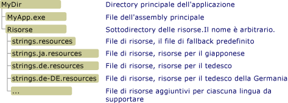

# <a name="retrieving-resources-in-desktop-apps"></a>Recupero di risorse nelle applicazioni desktop
Quando si utilizzano le risorse localizzate in applicazioni desktop di .NET Framework, è consigliabile comprimere le risorse per le impostazioni cultura predefinite o non associate ad alcun paese con l'assembly principale e creare un assembly satellite separato per ciascuna lingua o impostazione cultura supportata dall'applicazione. È quindi possibile utilizzare la classe <xref:System.Resources.ResourceManager> come descritto nella sezione successiva per accedere alle risorse denominate. Se si sceglie di non includere le risorse nell'assembly principale e negli assembly satellite, è inoltre possibile accedere direttamente ai file binari .resources, come illustrato nella sezione [Recupero delle risorse dai file .resources](#from_file) più avanti in questo articolo.  Per recuperare le risorse nelle app di [!INCLUDE[win8_appname_long](../../../includes/win8-appname-long-md.md)] , vedere [Creazione e recupero di risorse nelle app di Windows Store](http://go.microsoft.com/fwlink/p/?LinkID=241674) nel Windows Dev Center.  
  
<a name="from_assembly"></a>   
## <a name="retrieving-resources-from-assemblies"></a>Recupero delle risorse dagli assembly  
 La classe <xref:System.Resources.ResourceManager> fornisce l'accesso alle risorse in fase di esecuzione. Utilizzare il metodo <xref:System.Resources.ResourceManager.GetString%2A?displayProperty=fullName> per recuperare le risorse di tipo stringa e il metodo <xref:System.Resources.ResourceManager.GetObject%2A?displayProperty=fullName> o <xref:System.Resources.ResourceManager.GetStream%2A?displayProperty=fullName> per recuperare le risorse non di tipo stringa. Ogni metodo dispone di due overload:  
  
-   Un overload di cui l'unico parametro è una stringa contenente il nome della risorsa. Il metodo tenta di recuperare la risorsa per le impostazioni cultura del thread corrente. Per ulteriori informazioni, vedere i metodi <xref:System.Resources.ResourceManager.GetString%28System.String%29>, <xref:System.Resources.ResourceManager.GetObject%28System.String%29> e <xref:System.Resources.ResourceManager.GetStream%28System.String%29>.  
  
-   Un overload che dispone di due parametri: una stringa contenente il nome della risorsa e un oggetto <xref:System.Globalization.CultureInfo> che rappresenta le impostazioni cultura di cui deve essere recuperata la risorsa. Se non è possibile trovare un set di risorse per le impostazioni cultura, il gestore di risorse utilizza le regole di fallback per recuperare una risorsa appropriata. Per ulteriori informazioni, vedere i metodi <xref:System.Resources.ResourceManager.GetString%28System.String%2CSystem.Globalization.CultureInfo%29>, <xref:System.Resources.ResourceManager.GetObject%28System.String%2CSystem.Globalization.CultureInfo%29> e <xref:System.Resources.ResourceManager.GetStream%28System.String%2CSystem.Globalization.CultureInfo%29>.  
  
 Il gestore di risorse utilizza il processo di fallback delle risorse per controllare come l'applicazione recupera le risorse specifiche delle impostazioni cultura. Per altre informazioni, vedere la sezione "Processo di recupero di una risorsa" in [Creazione del package e distribuzione delle risorse](../../../docs/framework/resources/packaging-and-deploying-resources-in-desktop-apps.md). Per informazioni sulla creazione di un'istanza di un oggetto <xref:System.Resources.ResourceManager>, vedere la sezione "Creazione di un'istanza di un oggetto ResourceManager" nell'argomento relativo alla classe <xref:System.Resources.ResourceManager>.  
  
### <a name="retrieving-string-data-an-example"></a>Recupero di dati di tipo stringa: un esempio  
 Nell'esempio seguente viene chiamato il metodo <xref:System.Resources.ResourceManager.GetString%28System.String%29> per recuperare le risorse di tipo stringa delle impostazioni cultura correnti dell'interfaccia utente. Include una risorsa di tipo stringa non associata ad alcun paese per le impostazioni cultura inglesi (Stati Uniti) e le risorse localizzate per le impostazioni cultura francesi (Francia) e russe (Russia). La risorsa inglese (Stati Uniti) seguente si trova in un file denominato Strings.txt:  
  
```  
TimeHeader=The current time is  
```  
  
 La risorsa francese (Francia) si trova in un file denominato Strings.fr-FR.txt:  
  
```  
TimeHeader=L'heure actuelle est  
```  
  
 La risorsa russa (Russia) si trova in un file denominato Strings.ru-RU-txt:  
  
```  
TimeHeader=Текущее время —  
```  
  
 Il codice sorgente per questo esempio, che si trova in un file denominato GetString.cs per la versione C# del codice e GetString.vb per la versione Visual Basic, definisce una matrice di stringhe contenente il nome di quattro impostazioni cultura: le tre impostazioni cultura per le quali sono disponibili le risorse e le impostazioni cultura spagnole (Spagna). Un ciclo eseguibile cinque volte seleziona casualmente una di queste impostazioni cultura e la assegna alle proprietà <xref:System.Threading.Thread.CurrentCulture%2A?displayProperty=fullName> e <xref:System.Globalization.CultureInfo.CurrentUICulture%2A?displayProperty=fullName>. Chiama quindi il metodo <xref:System.Resources.ResourceManager.GetString%28System.String%29> per recuperare la stringa localizzata, visualizzata con l'ora del giorno.  
  
 [!code-csharp[Conceptual.Resources.Retrieving#3](../../../samples/snippets/csharp/VS_Snippets_CLR/conceptual.resources.retrieving/cs/getstring.cs#3)] [!code-vb[Conceptual.Resources.Retrieving#3](../../../samples/snippets/visualbasic/VS_Snippets_CLR/conceptual.resources.retrieving/vb/getstring.vb#3)]  
  
 Il seguente file batch (.bat) consente di compilare l'esempio e genera gli assembly satellite nelle directory appropriate. I comandi vengono forniti per il linguaggio e il compilatore C#. Per Visual Basic, modificare `csc` in `vbc`e modificare `GetString.cs` in `GetString.vb`.  
  
```  
resgen strings.txt  
csc GetString.cs /resource:strings.resources  
  
resgen strings.fr-FR.txt  
md fr-FR  
al /embed:strings.fr-FR.resources /culture:fr-FR /out:fr-FR\GetString.resources.dll  
  
resgen strings.ru-RU.txt  
md ru-RU  
al /embed:strings.ru-RU.resources /culture:ru-RU /out:ru-RU\GetString.resources.dll  
```  
  
 Quando le impostazioni cultura correnti dell'interfaccia utente sono impostate sullo spagnolo (Spagna), si noti che nell'esempio vengono visualizzate le risorse della lingua inglese, perché le risorse della lingua spagnola non sono disponibili e l'inglese rappresenta le impostazioni cultura predefinite dell'esempio.  
  
### <a name="retrieving-object-data-two-examples"></a>Recupero di dati oggetto: due esempi  
 È possibile utilizzare i metodi <xref:System.Resources.ResourceManager.GetObject%2A> e <xref:System.Resources.ResourceManager.GetStream%2A> per recuperare i dati oggetto. Sono inclusi i tipi di dati primitivi, gli oggetti serializzabili e gli oggetti archiviati in formato binario, ad esempio le immagini.  
  
 Nell'esempio seguente viene usato il metodo <xref:System.Resources.ResourceManager.GetStream%28System.String%29> per recuperare una bitmap visualizzata nella finestra iniziale di apertura di un'app. Il seguente codice sorgente in un file denominato CreateResources.cs (per C#) o CreateResources.vb (per Visual Basic) genera un file .resx che contiene l'immagine serializzata. In questo caso, l'immagine viene caricata da un file denominato SplashScreen.jpg. È possibile modificare il nome per sostituire il file con un'immagine personalizzata.  
  
 [!code-csharp[Conceptual.Resources.Retrieving#4](../../../samples/snippets/csharp/VS_Snippets_CLR/conceptual.resources.retrieving/cs/createresources.cs#4)] [!code-vb[Conceptual.Resources.Retrieving#4](../../../samples/snippets/visualbasic/VS_Snippets_CLR/conceptual.resources.retrieving/vb/createresources.vb#4)]  
  
 Il seguente codice recupera la risorsa e visualizza l'immagine in un controllo <xref:System.Windows.Forms.PictureBox>.  
  
 [!code-csharp[Conceptual.Resources.Retrieving#5](../../../samples/snippets/csharp/VS_Snippets_CLR/conceptual.resources.retrieving/cs/getstream.cs#5)] [!code-vb[Conceptual.Resources.Retrieving#5](../../../samples/snippets/visualbasic/VS_Snippets_CLR/conceptual.resources.retrieving/vb/getstream.vb#5)]  
  
 È possibile usare il file batch seguente per compilare l'esempio in C#. Per Visual Basic, sostituire `csc` con `vbc` e modificare l'estensione del file del codice sorgente da `.cs` a `.vb`.  
  
```  
csc CreateResources.cs  
CreateResources  
  
resgen AppResources.resx  
  
csc GetStream.cs /resource:AppResources.resources  
```  
  
 Nell'esempio seguente viene usato il metodo <xref:System.Resources.ResourceManager.GetObject%28System.String%29?displayProperty=fullName> per deserializzare un oggetto personalizzato. L'esempio include un file di codice sorgente denominato UIElements.cs (UIElements.vb per Visual Basic) che definisce la seguente struttura denominata `PersonTable`. Questa struttura deve essere usata da una procedura generale di visualizzazione della tabella che mostra i nomi localizzati delle colonne della tabella. Si noti che la struttura `PersonTable` è contrassegnata con l'attributo <xref:System.SerializableAttribute>.  
  
 [!code-csharp[Conceptual.Resources.Retrieving#6](../../../samples/snippets/csharp/VS_Snippets_CLR/conceptual.resources.retrieving/cs/example.cs#6)] [!code-vb[Conceptual.Resources.Retrieving#6](../../../samples/snippets/visualbasic/VS_Snippets_CLR/conceptual.resources.retrieving/vb/example.vb#6)]  
  
 Il codice seguente, proveniente da un file denominato CreateResources.cs (CreateResources.vb per Visual Basic), crea un file di risorse XML denominato UIResources.resx che memorizza un titolo di tabella e un oggetto `PersonTable` contenente le informazioni per un'app che viene localizzata per la lingua inglese.  
  
 [!code-csharp[Conceptual.Resources.Retrieving#7](../../../samples/snippets/csharp/VS_Snippets_CLR/conceptual.resources.retrieving/cs/example1.cs#7)] [!code-vb[Conceptual.Resources.Retrieving#7](../../../samples/snippets/visualbasic/VS_Snippets_CLR/conceptual.resources.retrieving/vb/example.vb#7)]  
  
 Il codice seguente, contenuto in un file di codice sorgente denominato GetObject.cs (GetObject.vb), recupera quindi le risorse e le visualizza nella console.  
  
 [!code-csharp[Conceptual.Resources.Retrieving#8](../../../samples/snippets/csharp/VS_Snippets_CLR/conceptual.resources.retrieving/cs/example2.cs#8)] [!code-vb[Conceptual.Resources.Retrieving#8](../../../samples/snippets/visualbasic/VS_Snippets_CLR/conceptual.resources.retrieving/vb/example2.vb#8)]  
  
 È possibile creare il file di risorse e gli assembly necessari ed eseguire l'app mediante il file batch seguente. È necessario usare l'opzione `/r` per fornire a Resgen.exe un riferimento a UIElements.dll in modo che possa accedere alle informazioni sulla struttura `PersonTable` . Se si usa C#, sostituire il nome del compilatore `vbc` con `csc`e l'estensione `.vb` con `.cs`.  
  
```  
vbc /t:library UIElements.vb  
vbc CreateResources.vb /r:UIElements.dll  
CreateResources  
  
resgen UIResources.resx  /r:UIElements.dll  
vbc GetObject.vb /r:UIElements.dll /resource:UIResources.resources  
  
GetObject.exe  
```  
  
## <a name="versioning-support-for-satellite-assemblies"></a>Supporto per il controllo delle versioni per gli assembly satellite  
 Per impostazione predefinita, quando l'oggetto <xref:System.Resources.ResourceManager> recupera le risorse richieste, cerca gli assembly satellite con numeri di versione che corrispondono a quello dell'assembly principale. Una volta distribuita un'applicazione, è possibile che si desideri aggiornare l'assembly principale o gli assembly satellite di risorse specifiche. .NET Framework offre supporto per il controllo delle versioni dell'assembly principale e degli assembly satellite.  
  
 L'attributo <xref:System.Resources.SatelliteContractVersionAttribute> fornisce supporto per il controllo delle versioni di un assembly principale. Specificare questo attributo per l'assembly principale di un'applicazione consente di aggiornare e ridistribuire un assembly principale senza aggiornare i relativi assembly satellite. Una volta aggiornato l'assembly principale, incrementare il numero di versione dell'assembly principale, ma lasciare inalterato il numero di versione del contratto con i satelliti. Per recuperare le risorse richieste, il gestore di risorse carica la versione di assembly satellite specificata da questo attributo.  
  
 Gli assembly di criteri dell'editore forniscono il supporto per il controllo delle versioni degli assembly satellite. È possibile aggiornare e ridistribuire un assembly satellite senza aggiornare l'assembly principale. Una volta aggiornato un assembly satellite, incrementarne il numero di versione e fornirlo con un assembly di criteri dell'editore. Nell'assembly di criteri dell'editore specificare che il nuovo assembly satellite è compatibile con le versioni precedenti. Il gestore di risorse utilizzerà l'attributo <xref:System.Resources.SatelliteContractVersionAttribute> per determinare la versione di assembly satellite, ma il caricatore di assembly verrà associato alla versione di assembly satellite specificata dai criteri editore. Per ulteriori informazioni sugli assembly di criteri dell'editore, vedere [Creazione di un file dei criteri editore](../../../docs/framework/configure-apps/how-to-create-a-publisher-policy.md).  
  
 Per abilitare il supporto completo del controllo delle versioni, si consiglia di distribuire gli assembly con nome sicuro nella [Global Assembly Cache](../../../docs/framework/app-domains/gac.md) e gli assembly che non hanno nome sicuro nella directory dell'applicazione. Se si vuole distribuire assembly con nome sicuro nella directory dell'applicazione, non sarà possibile incrementare il numero di versione di un assembly satellite quando si aggiorna l'assembly. Sarà invece necessario eseguire un aggiornamento sul posto in base al quale il codice esistente verrà sostituito dal codice aggiornato e verrà mantenuto lo stesso numero di versione. Se, ad esempio, si desidera aggiornare la versione 1.0.0.0 di un assembly satellite con il nome assembly completo "myApp.resources, Version=1.0.0.0, Culture=de, PublicKeyToken=b03f5f11d50a3a", sovrascriverlo con il file myApp.resources.dll aggiornato compilato con lo stesso nome assembly completo "myApp.resources, Version=1.0.0.0, Culture=de, PublicKeyToken=b03f5f11d50a3a". Si noti che l'utilizzo degli aggiornamenti sul posto dei file di assembly satellite rende difficile la determinazione accurata da parte dell'applicazione della versione di un assembly satellite.  
  
 Per ulteriori informazioni sul controllo delle versioni degli assembly, vedere [Controllo delle versioni degli assembly](../../../docs/framework/app-domains/assembly-versioning.md) e [Come il runtime individua gli assembly](../../../docs/framework/deployment/how-the-runtime-locates-assemblies.md).  
  
<a name="from_file"></a>   
## <a name="retrieving-resources-from-resources-files"></a>Recupero di risorse da file .resources  
 Se si sceglie di non distribuire le risorse in assembly satellite, è comunque possibile utilizzare direttamente un oggetto <xref:System.Resources.ResourceManager> per accedere alle risorse dai file .resources. A tale scopo, è necessario distribuire i file .resources correttamente. Utilizzare quindi il metodo <xref:System.Resources.ResourceManager.CreateFileBasedResourceManager%2A?displayProperty=fullName> per creare un'istanza di un oggetto <xref:System.Resources.ResourceManager> e specificare la directory contenente i file .resources autonomi.  
  
### <a name="deploying-resources-files"></a>Distribuzione di file .resources  
 Quando si incorporano i file .resources in un assembly dell'applicazione e in assembly satellite, ogni assembly satellite ha lo stesso nome file, ma viene collocato in una sottodirectory che corrisponde alle impostazioni cultura dell'assembly satellite. Al contrario, quando si accede direttamente alle risorse dai file .resources, è possibile inserire tutti i file .resources in una singola directory, in genere una sottodirectory della directory dell'applicazione. Il nome del file .resources predefinito dell'applicazione è costituito solo da un nome radice, senza indicare le impostazioni cultura, ad esempio strings.resources. Le risorse per ogni impostazione cultura localizzata vengono archiviate in un file il cui nome è costituito dal nome radice seguito dalle impostazioni cultura, ad esempio strings.ja.resources o strings.de-DE.resources. La figura seguente mostra dove collocare i file di risorse nella struttura di directory.  
  
   
Struttura della directory e convenzioni di denominazione per i file .resources  
  
### <a name="using-the-resource-manager"></a>Utilizzo del gestore di risorse  
 Dopo aver creato e inserito le risorse nella directory appropriata, creare un oggetto <xref:System.Resources.ResourceManager> per utilizzare le risorse chiamando il metodo <xref:System.Resources.ResourceManager.CreateFileBasedResourceManager%28System.String%2CSystem.String%2CSystem.Type%29>. Il primo parametro specifica il nome radice del file .resources predefinito dell'applicazione, ovvero "stringa" per l'esempio nella sezione precedente. Il secondo parametro specifica il percorso delle risorse, ovvero "Resources" per l'esempio precedente. Il terzo parametro specifica l'implementazione di <xref:System.Resources.ResourceSet> da usare. Se il terzo parametro è `null`, viene utilizzato il runtime predefinito <xref:System.Resources.ResourceSet>.  
  
> [!NOTE]
>  Non distribuire applicazioni ASP.NET utilizzando file .resources autonomi. Questo può causare problemi di blocco e interrompere la distribuzione XCOPY. Si consiglia di distribuire le risorse ASP.NET in assembly satellite. Per altre informazioni, vedere [Cenni preliminari sulle risorse delle pagine Web ASP.NET](http://msdn.microsoft.com/library/0936b3b2-9e6e-4abe-9c06-364efef9dbbd).  
  
 Dopo avere creato un'istanza dell'oggetto <xref:System.Resources.ResourceManager>, utilizzare i metodi <xref:System.Resources.ResourceManager.GetString%2A>, <xref:System.Resources.ResourceManager.GetObject%2A> e <xref:System.Resources.ResourceManager.GetStream%2A> come illustrato in precedenza per recuperare le risorse. Tuttavia, il recupero delle risorse direttamente dai file .resources differisce dal recupero delle risorse incorporate dagli assembly. Quando si recuperano le risorse dai file .resources, i metodi <xref:System.Resources.ResourceManager.GetString%28System.String%29>, <xref:System.Resources.ResourceManager.GetObject%28System.String%29> e <xref:System.Resources.ResourceManager.GetStream%28System.String%29> recuperano sempre le risorse delle impostazioni cultura predefinite indipendentemente dalle impostazioni cultura correnti. Per recuperare le risorse delle impostazioni cultura correnti dell'applicazione o delle impostazioni cultura specifiche, è necessario chiamare il metodo <xref:System.Resources.ResourceManager.GetString%28System.String%2CSystem.Globalization.CultureInfo%29>, <xref:System.Resources.ResourceManager.GetObject%28System.String%2CSystem.Globalization.CultureInfo%29> o <xref:System.Resources.ResourceManager.GetStream%28System.String%2CSystem.Globalization.CultureInfo%29> e specificare le impostazioni cultura di cui devono essere recuperate le risorse. Per recuperare le risorse delle impostazioni cultura correnti, specificare il valore della proprietà <xref:System.Globalization.CultureInfo.CurrentCulture%2A?displayProperty=fullName> come argomento `culture`. Se il gestore di risorse non può recuperare le risorse di `culture`, utilizza le regole standard di fallback delle risorse per recuperare le risorse appropriate.  
  
### <a name="an-example"></a>Esempio  
 Nell'esempio seguente viene illustrato come il gestore di risorse recupera le risorse direttamente dai file .resources. L'esempio è costituito da tre file di risorse basati su testo per le impostazioni cultura inglesi (Stati Uniti), francesi (Francia) e russe (Russia). L'inglese (Stati Uniti) rappresenta le impostazioni cultura predefinite dell'esempio. Le risorse vengono archiviate nel seguente file denominato Strings.txt:  
  
```  
Greeting=Hello  
Prompt=What is your name?  
```  
  
 Le risorse per le impostazioni cultura francesi (Francia) vengono archiviate nel seguente file, denominato Strings.fr-FR.txt:  
  
```  
Greeting=Bon jour  
Prompt=Comment vous appelez-vous?  
```  
  
 Le risorse per le impostazioni cultura russe (Russia) vengono archiviate nel seguente file, denominato Strings.ru-RU.txt:  
  
```  
Greeting=Здравствуйте  
Prompt=Как вас зовут?  
```  
  
 Di seguito viene riportato il codice sorgente per l'esempio. L'esempio crea un'istanza degli oggetti <xref:System.Globalization.CultureInfo> per le impostazioni cultura inglesi (Stati Uniti), inglesi (Canada), francesi (Francia) e russe (Russia) e imposta ognuna come le impostazioni cultura correnti. Il metodo <xref:System.Resources.ResourceManager.GetString%28System.String%2CSystem.Globalization.CultureInfo%29?displayProperty=fullName> fornisce quindi il valore della proprietà <xref:System.Globalization.CultureInfo.CurrentCulture%2A?displayProperty=fullName> come argomento `culture` per recuperare le risorse specifiche delle impostazioni cultura appropriate.  
  
 [!code-csharp[Conceptual.Resources.Retrieving#9](../../../samples/snippets/csharp/VS_Snippets_CLR/conceptual.resources.retrieving/cs/example3.cs#9)] [!code-vb[Conceptual.Resources.Retrieving#9](../../../samples/snippets/visualbasic/VS_Snippets_CLR/conceptual.resources.retrieving/vb/example3.vb#9)]  
  
 È possibile compilare la versione C# dell'esempio eseguendo il file batch riportato di seguito. Se si usa Visual Basic, sostituire `csc` con `vbc` e l'estensione `.cs` con `.vb`.  
  
```  
Md Resources  
Resgen Strings.txt Resources\Strings.resources  
Resgen Strings.fr-FR.txt Resources\Strings.fr-FR.resources  
Resgen Strings.ru-RU.txt Resources\Strings.ru-RU.resources  
  
csc Example.cs  
```  
  
## <a name="see-also"></a>Vedere anche  
 <xref:System.Resources.ResourceManager>   
 [Risorse nelle applicazioni desktop](../../../docs/framework/resources/index.md)   
 [Creazione del package e distribuzione delle risorse](../../../docs/framework/resources/packaging-and-deploying-resources-in-desktop-apps.md)   
 [Come il runtime individua gli assembly](../../../docs/framework/deployment/how-the-runtime-locates-assemblies.md)   
 [Creazione e recupero di risorse nelle app di Windows Store](http://go.microsoft.com/fwlink/p/?LinkID=241674)

