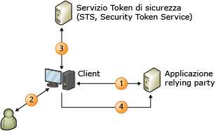

# Modello di identit&#224; basata sulle attestazioni
Quando si compilano applicazioni in grado di riconoscere attestazioni, l'identità dell'utente è rappresentata come un set di attestazioni nell'applicazione.  Un'attestazione può essere, ad esempio, il nome dell'utente o un indirizzo di posta elettronica.  L'idea è che viene configurato un sistema di identità esterno per fornire all'applicazione tutti gli elementi necessari per ottenere informazioni sull'utente con ogni richiesta effettuata, con la garanzia crittografica che i dati di identità ricevuti provengono da un'origine attendibile.  
  
 In questo modello, un punto di accesso singolo è molto più semplice da ottenere e l'applicazione non viene più utilizzata per le operazioni seguenti:  
  
-   Autenticazione degli utenti.  
  
-   Archiviazione di account utente e password.  
  
-   Chiamata alle directory dell'organizzazione per trovare i dettagli dell'identità utente.  
  
-   Integrazione con sistemi di identità da altre piattaforme o società.  
  
 In questo modello, le decisioni correlate all'identità basate sulle attestazioni fornite dal sistema tramite cui è stato autenticato l'utente vengono prese dall'applicazione.  Può trattarsi di un elemento che va da una semplice personalizzazione dell'applicazione con il nome dell'utente, fino all'autorizzazione dell'utente per l'accesso a funzionalità e risorse di valore più elevato nell'applicazione.  
  
 In questo argomento vengono fornite le seguenti informazioni:  
  
-   [Introduzione all'identità basata sulle attestazioni](../../../docs/framework/security/claims-based-identity-model.md#BKMK_1)  
  
-   [Scenario di base per un modello di identità basato sulle attestazioni](../../../docs/framework/security/claims-based-identity-model.md#BKMK_2)  
  
   
## Introduzione all'identità basata sulle attestazioni  
 La terminologia e i concetti seguenti sono utili per comprendere la nuova architettura dell'identità.  
  
### Identità  
 Ai fini della descrizione del modello di programmazione in Windows Identity Foundation \(WIF\), il termine "identità" verrà utilizzato per rappresentare un set di attributi con cui vengono descritti un utente o un'altra entità in un sistema che si desidera proteggere.  
  
### Attestazione  
 Un'attestazione può essere una parte di informazioni sull'identità come il nome, l'indirizzo di posta elettronica, l'età, l'appartenenza al ruolo Vendite e così via.  Più sono le attestazioni ricevute dall'applicazione, maggiori saranno le informazioni di cui si disporrà sull'utente.  Ci si potrebbe chiedere per quale motivo vengono definite "attestazioni" anziché "attributi, come avviene comunemente nella descrizione delle directory dell'organizzazione.  Il motivo è correlato al metodo di recapito.  In questo modello, gli attributi dell'utente in una directory non vengono trovati dall'applicazione.  L'utente recapita le attestazioni all'applicazione tramite cui vengono esaminate.  Tutte le attestazioni vengono eseguite da un'autorità di certificazione e vengono considerate attendibili dall'utente solo se anche l'autorità di certificazione è altrettanto attendibile.  Ad esempio, un'attestazione effettuata da un controller di dominio della società viene considerata più attendibile di una effettuata dall'utente stesso.  In WIF le attestazioni vengono rappresentate con un tipo <xref:System.Security.Claims.Claim>, che dispone di una proprietà <xref:System.Security.Claims.Claim.Issuer%2A> che consente all'utente di scoprire l'autore del rilascio dell'attestazione.  
  
### Token di sicurezza  
 L'utente fornisce un set di attestazioni all'applicazione con una richiesta.  In un servizio Web, queste attestazioni vengono eseguite nell'intestazione di sicurezza della busta SOAP.  In un'applicazione Web basata sul browser, le attestazioni arrivano tramite HTTP POST dal browser dell'utente e, successivamente, possono essere memorizzate nella cache in un cookie se si desidera una sessione.  Indipendentemente dalla modalità di arrivo, queste attestazioni devono essere serializzate, operazione durante la quale vengono utilizzati i token di sicurezza.  Un token di sicurezza è un set serializzato di attestazioni con firma digitale di un'autorità emittente.  La firma è importante: garantisce che l'utente non ha semplicemente costituito un gruppo di attestazioni che ha poi inviato.  In situazioni a bassa sicurezza in cui la crittografia non è necessaria o desiderata, è possibile utilizzare token senza firma, ma uno scenario simile non è descritto in questo argomento.  
  
 Una delle funzionalità principali disponibile in WIF è la possibilità di creare e leggere i token di sicurezza.  Tramite WIF e .NET Framework vengono gestite tutte le operazioni di crittografia e viene presentata l'applicazione con un set di attestazioni che è possibile leggere.  
  
### Autorità emittente  
 Esistono molti tipi diversi di autorità emittente, dal controller di dominio tramite cui vengono emessi ticket Kerberos, alle autorità di certificazione che emettono certificati X.509, ma il tipo specifico di autorità illustrato in questo argomento emette token di sicurezza contenenti attestazioni.  Questa autorità emittente è un'applicazione Web o un servizio Web a cui è nota la modalità di emissione dei token di sicurezza.  Deve disporre di informazioni sufficienti per poter emettere le attestazioni appropriate in base al relying party di destinazione e all'utente che effettua la richiesta e può essere responsabile dell'interazione con gli archivi dell'utente per trovare le attestazioni e autenticare gli utenti stessi.  
  
 Qualunque sia l'autorità emittente scelta, ha un ruolo centrale nella soluzione delle identità.  Quando si suddivide l'autenticazione in fattori dall'applicazione basandosi sulle attestazioni, la responsabilità viene passata all'autorità a cui viene richiesto di autenticare gli utenti per proprio conto.  
  
### Servizio Token di sicurezza \(STS, Security Token Service\)  
 Un servizio token di sicurezza \(STS\) è il componente del servizio tramite cui i token di sicurezza vengono compilati, firmati ed emessi in base ai protocolli WS\-Trust e WS\-Federation.  L'implementazione di questi protocolli richiede molte operazioni che possono essere eseguite automaticamente da WIF, consentendo in questo modo a un utente non esperto sui protocolli di ottenere un servizio token di sicurezza operativo con facilità.  È possibile utilizzare un servizio token di sicurezza predefinito come [Active Directory® Federation Services \(AD FS\) 2.0](http://go.microsoft.com/fwlink/?LinkID=247516), un servizio token di sicurezza per cloud quale [Servizio di controllo di accesso \(ACS\) di Microsoft Azure](http://go.microsoft.com/fwlink/?LinkID=247517) oppure, se si desidera emettere token personalizzati o fornire autenticazione o autorizzazione personalizzata, è possibile compilare un proprio servizio token di sicurezza personalizzato mediante WIF.  WIF facilita la compilazione di un proprio servizio token di sicurezza.  
  
### Applicazione relying party  
 Quando si sviluppa un'applicazione basata sulle attestazioni, si compila un'applicazione relying party \(RP\).  L'applicazione in grado di riconoscere attestazioni e l'applicazione basata sulle attestazioni sono sinonimi di applicazioni relying party.  Le applicazioni Web e i servizi Web possono essere entrambi esempi di relying party.  Tramite un'applicazione relying party vengono utilizzati i token emessi da un servizio token di sicurezza e vengono estratte le attestazioni dai token per utilizzarle per attività correlate all'identità.  WIF offre funzionalità di supporto per la compilazione di applicazioni relying party.  
  
### Standard  
 Per rendere interoperabile tutte le operazioni, nello scenario precedente sono stati utilizzati diversi standard WS\-\*.  I criteri vengono recuperati tramite WS\-MetadataExchange e i criteri stessi sono strutturati in base alla specifica WS\-Policy.  Tramite il servizio token di sicurezza vengono esposti gli endpoint con cui viene implementata la specifica WS\-Trust, in cui viene illustrato come richiedere e ricevere i token di sicurezza.  La maggior parte dei servizi token di sicurezza attuali è stata formattata con SAML \(Security Assertion Markup Language\),  un vocabolario XML riconosciuto dal settore utilizzabile per rappresentare le attestazioni in una modalità interoperabile.  In alternativa, in una situazione con più piattaforme, questo consente di comunicare con un servizio token di sicurezza in una piattaforma completamente diversa e ottenere un punto di accesso singolo in tutte le applicazioni, indipendentemente dalla piattaforma.  
  
### Applicazioni basate su browser  
 Gli smart client non sono gli unici a poter utilizzare il modello di identità basato sulle attestazioni.  Questo modello può inoltre essere utilizzato dalle applicazioni basate sul browser \(definite anche client passivi\).  Il funzionamento è descritto nello scenario seguente:  
  
 Innanzitutto, l'utente punta un browser in corrispondenza di un'applicazione Web in grado di riconoscere attestazioni \(applicazione relying party\).  Tramite l'applicazione Web il browser viene reindirizzato al servizio token di sicurezza in modo che l'utente possa essere autenticato.  Il servizio token di sicurezza è ospitato in un'applicazione Web semplice tramite cui viene letta la richiesta in ingresso, viene autenticato l'utente mediante i meccanismi HTTP standard e, successivamente, viene creato un token SAML e inviata una risposta con una parte di codice JavaScript che comporta l'inizializzazione da parte del browser di un HTTP POST tramite cui il token SAML viene reinviato al relying party.  Nel corpo di questo POST sono contenute le attestazioni richieste dal relying party.  A questo punto, è normale per il relying party comprimere le attestazioni in un cookie in modo che l'utente non debba eseguire un reindirizzamento per ogni richiesta.  
  
   
## Scenario di base per un modello di identità basato sulle attestazioni  
 Di seguito è riportato un esempio di un sistema basato sulle attestazioni.  
  
   
  
 In questo diagramma viene mostrato un sito Web \(l'applicazione relying party, RP\) configurato per utilizzare WIF per l'autenticazione e un client, un Web browser, tramite cui si intende utilizzare il sito in questione.  
  
1.  Quando un utente non autenticato richiede una pagina, il browser viene reindirizzato alle pagine del provider di identità \(IP\).  
  
2.  Il provider di identità richiede all'utente di presentare le credenziali, ad esempio nome utente\/password, Kerberos e così via.  
  
3.  Il provider di identità emette di nuovo un token che viene restituito al browser.  
  
4.  Il browser viene ora di nuovo reindirizzato alla pagina richiesta originariamente in cui WIF determina se il token soddisfa i requisiti di accesso alla pagina.  In questo caso viene emesso un cookie per stabilire una sessione in modo che l'autenticazione deve essere eseguita una sola volta e il controllo viene passato all'applicazione.