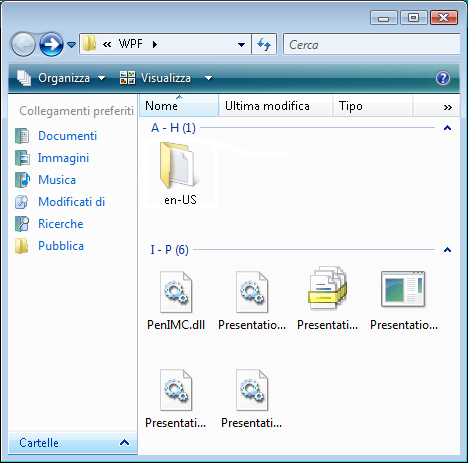

# Implementing the UI Automation Grid Control Pattern
> [!NOTE]
>  Questa documentazione è destinata agli sviluppatori di .NET Framework che vogliono usare le classi gestite di [!INCLUDE[TLA2#tla_uiautomation](../../../includes/tla2sharptla-uiautomation-md.md)] definite nello spazio dei nomi <xref:System.Windows.Automation>. Per informazioni aggiornate su [!INCLUDE[TLA2#tla_uiautomation](../../../includes/tla2sharptla-uiautomation-md.md)], vedere [Windows Automation API: automazione interfaccia utente](http://go.microsoft.com/fwlink/?LinkID=156746).  
  
 In questo argomento vengono presentate le linee guida e le convenzioni per l'implementazione di <xref:System.Windows.Automation.Provider.IGridProvider>, incluse le informazioni relative a proprietà, metodi ed eventi. Alla fine della panoramica sono elencati collegamenti a ulteriore materiale di riferimento.  
  
 Il pattern di controllo <xref:System.Windows.Automation.GridPattern> viene usato per supportare i controlli che fungono da contenitori per una raccolta di elementi figlio. Gli elementi figlio di questo elemento devono implementare <xref:System.Windows.Automation.Provider.IGridItemProvider> e devono essere organizzati in un sistema di coordinate logico bidimensionale che può essere attraversato da righe e colonne. Per esempi di controlli che implementano questo pattern di controllo, vedere [Control Pattern Mapping for UI Automation Clients](../../../docs/framework/ui-automation/control-pattern-mapping-for-ui-automation-clients.md).  
  
   
## Linee guida e convenzioni di implementazione  
 Quando si implementa il pattern di controllo Grid, tenere presenti le linee guida e le convenzioni seguenti:  
  
-   Le coordinate della griglia sono in base zero, dove la cella in alto a sinistra \(o in alto a destra a seconda delle impostazioni locali\) ha coordinate \(0, 0\).  
  
-   Se una cella è vuota, è necessario che venga restituito un elemento di automazione interfaccia utente per supportare la proprietà <xref:System.Windows.Automation.Provider.IGridItemProvider.ContainingGrid%2A> per tale cella. Ciò è possibile quando il layout degli elementi figlio nella griglia è simile a una matrice irregolare \(vedere l'esempio riportato di seguito\).  
  
   
Esempio di controllo griglia con coordinate vuote  
  
-   Una griglia contenente un singolo elemento deve comunque implementare <xref:System.Windows.Automation.Provider.IGridProvider> se viene logicamente considerata una griglia. Il numero di elementi figlio nella griglia non ha importanza.  
  
-   Le righe e colonne nascoste, a seconda dell'implementazione del provider, possono essere caricate nell'albero di [!INCLUDE[TLA2#tla_uiautomation](../../../includes/tla2sharptla-uiautomation-md.md)] e pertanto influenzare le proprietà <xref:System.Windows.Automation.GridPattern.GridPatternInformation.RowCount%2A> e <xref:System.Windows.Automation.GridPattern.GridPatternInformation.ColumnCount%2A>. Se le righe e colonne nascoste non sono ancora state caricate, non devono essere contate.  
  
-   <xref:System.Windows.Automation.Provider.IGridProvider> non consente la modifica attiva di una griglia. <xref:System.Windows.Automation.Provider.ITransformProvider> deve essere implementata per abilitare questa funzionalità.  
  
-   Usare un'interfaccia <xref:System.Windows.Automation.StructureChangedEventHandler> per attendere le modifiche strutturali o di layout della griglia, ad esempio l'aggiunta, la rimozione o l'unione di celle.  
  
-   Usare un'interfaccia <xref:System.Windows.Automation.AutomationFocusChangedEventHandler> per registrare l'attraversamento di elementi o celle di una griglia.  
  
   
## Membri obbligatori per IGridProvider  
 Le proprietà e i metodi seguenti sono obbligatori per l'implementazione dell'interfaccia IGridProvider.  
  
|Membri obbligatori|Tipo|Note|  
|------------------------|----------|----------|  
|<xref:System.Windows.Automation.Provider.IGridProvider.RowCount%2A>|Proprietà|Nessuna|  
|<xref:System.Windows.Automation.Provider.IGridProvider.ColumnCount%2A>|Proprietà|Nessuna|  
|<xref:System.Windows.Automation.Provider.IGridProvider.GetItem%2A>|Metodo|Nessuna|  
  
 Questo pattern di controllo non è associato a eventi.  
  
   
## Eccezioni  
 I provider devono generare le eccezioni seguenti.  
  
|Tipo di eccezione|Condizione|  
|-----------------------|----------------|  
|<xref:System.ArgumentOutOfRangeException>|<xref:System.Windows.Automation.Provider.IGridProvider.GetItem%2A>   -   La coordinata di riga richiesta è maggiore di <xref:System.Windows.Automation.Provider.IGridProvider.RowCount%2A> o la coordinata di colonna è maggiore di <xref:System.Windows.Automation.Provider.IGridProvider.ColumnCount%2A>.|  
|<xref:System.ArgumentOutOfRangeException>|<xref:System.Windows.Automation.Provider.IGridProvider.GetItem%2A>   -   La coordinata di riga o colonna richiesta è minore di zero.|  
  
## Vedere anche  
 [UI Automation Control Patterns Overview](../../../docs/framework/ui-automation/ui-automation-control-patterns-overview.md)   
 [Support Control Patterns in a UI Automation Provider](../../../docs/framework/ui-automation/support-control-patterns-in-a-ui-automation-provider.md)   
 [UI Automation Control Patterns for Clients](../../../docs/framework/ui-automation/ui-automation-control-patterns-for-clients.md)   
 [Implementing the UI Automation GridItem Control Pattern](../../../docs/framework/ui-automation/implementing-the-ui-automation-griditem-control-pattern.md)   
 [UI Automation Tree Overview](../../../docs/framework/ui-automation/ui-automation-tree-overview.md)   
 [Use Caching in UI Automation](../../../docs/framework/ui-automation/use-caching-in-ui-automation.md)