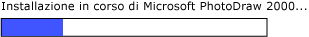

# Implementing the UI Automation RangeValue Control Pattern
> [!NOTE]
>  Questa documentazione è destinata agli sviluppatori di .NET Framework che vogliono usare le classi gestite di [!INCLUDE[TLA2#tla_uiautomation](../../../includes/tla2sharptla-uiautomation-md.md)] definite nello spazio dei nomi <xref:System.Windows.Automation>. Per informazioni aggiornate su [!INCLUDE[TLA2#tla_uiautomation](../../../includes/tla2sharptla-uiautomation-md.md)], vedere [Windows Automation API: automazione interfaccia utente](http://go.microsoft.com/fwlink/?LinkID=156746).  
  
 In questo argomento vengono presentate le linee guida e le convenzioni per l'implementazione di <xref:System.Windows.Automation.Provider.IRangeValueProvider>, incluse le informazioni relative a eventi e proprietà. Alla fine della panoramica sono elencati collegamenti ad altro materiale di riferimento.  
  
 Il pattern di controllo <xref:System.Windows.Automation.RangeValuePattern> viene usato per supportare i controlli che possono impostare un valore in un intervallo. Per esempi di controlli che implementano questo pattern di controllo, vedere [Control Pattern Mapping for UI Automation Clients](../../../docs/framework/ui-automation/control-pattern-mapping-for-ui-automation-clients.md).  
  
   
## Linee guida e convenzioni di implementazione  
 Quando si implementa il pattern di controllo RangeValue, tenere presenti le linee guida e le convenzioni seguenti:  
  
-   I controlli consentono la ricalibrazione delle relative proprietà supportate in base alle preferenze utente o alle impostazioni locali. Un esempio di questo è un controllo termometro che può essere impostato per visualizzare la temperatura in gradi Fahrenheit o Celsius.  
  
-   I controlli che dispongono di valori di intervallo ambigui, ad esempio le barre di avanzamento o i dispositivi di scorrimento, devono avere questi valori normalizzati.  
  
   
Esempio di un indicatore di stato in cui valore è di tipo Integer e i relativi valori di proprietà minimo e massimo sono normalizzati rispettivamente a 0 e 100  
  
   
## Membri obbligatori per IRangeValueProvider  
  
|Membro obbligatorio|Tipo di membro|Note|  
|-------------------------|--------------------|----------|  
|<xref:System.Windows.Automation.RangeValuePattern.IsReadOnlyProperty>|Proprietà|Nessuna|  
|<xref:System.Windows.Automation.RangeValuePattern.ValueProperty>|Proprietà|Nessuna|  
|<xref:System.Windows.Automation.RangeValuePattern.LargeChangeProperty>|Proprietà|Nessuna|  
|<xref:System.Windows.Automation.RangeValuePattern.SmallChangeProperty>|Proprietà|Nessuna|  
|<xref:System.Windows.Automation.RangeValuePattern.MaximumProperty>|Proprietà|Nessuna|  
|<xref:System.Windows.Automation.RangeValuePattern.MinimumProperty>|Proprietà|Nessuna|  
|<xref:System.Windows.Automation.RangeValuePattern.SetValue%2A>|Metodi|Nessuna|  
  
 Questo pattern di controllo non è associato a eventi.  
  
   
## Eccezioni  
 I provider devono generare le eccezioni seguenti.  
  
|Tipo di eccezione|Condizione|  
|-----------------------|----------------|  
|<xref:System.ArgumentOutOfRangeException>|<xref:System.Windows.Automation.RangeValuePattern.SetValue%2A> viene chiamato con un valore che è maggiore di <xref:System.Windows.Automation.RangeValuePattern.MaximumProperty> o minore di <xref:System.Windows.Automation.RangeValuePattern.MinimumProperty>.|  
  
## Vedere anche  
 [UI Automation Control Patterns Overview](../../../docs/framework/ui-automation/ui-automation-control-patterns-overview.md)   
 [Support Control Patterns in a UI Automation Provider](../../../docs/framework/ui-automation/support-control-patterns-in-a-ui-automation-provider.md)   
 [UI Automation Control Patterns for Clients](../../../docs/framework/ui-automation/ui-automation-control-patterns-for-clients.md)   
 [UI Automation Tree Overview](../../../docs/framework/ui-automation/ui-automation-tree-overview.md)   
 [Use Caching in UI Automation](../../../docs/framework/ui-automation/use-caching-in-ui-automation.md)