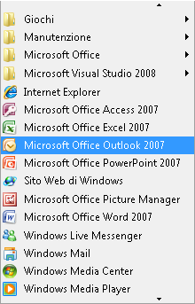

# Implementing the UI Automation Scroll Control Pattern
> [!NOTE]
>  Questa documentazione è destinata agli sviluppatori di .NET Framework che vogliono usare le classi gestite di [!INCLUDE[TLA2#tla_uiautomation](../../../includes/tla2sharptla-uiautomation-md.md)] definite nello spazio dei nomi <xref:System.Windows.Automation>. Per informazioni aggiornate su [!INCLUDE[TLA2#tla_uiautomation](../../../includes/tla2sharptla-uiautomation-md.md)], vedere [Windows Automation API: automazione interfaccia utente](http://go.microsoft.com/fwlink/?LinkID=156746).  
  
 In questo argomento vengono presentate le linee guida e le convenzioni per l'implementazione di <xref:System.Windows.Automation.Provider.IScrollProvider>, incluse le informazioni relative a eventi e proprietà. Alla fine della panoramica sono elencati collegamenti ad altro materiale di riferimento.  
  
 Il pattern di controllo <xref:System.Windows.Automation.ScrollPattern> viene usato per supportare un controllo che funge da contenitore scorrevole per una raccolta di oggetti figlio. Pur supportandole, il controllo non deve usare le barre di scorrimento per supportare la funzionalità di scorrimento.  
  
   
Esempio di controllo scorrevole che non usa barre di scorrimento  
  
 Per esempi di controlli che implementano questo controllo, vedere [Control Pattern Mapping for UI Automation Clients](../../../docs/framework/ui-automation/control-pattern-mapping-for-ui-automation-clients.md).  
  
   
## Linee guida e convenzioni di implementazione  
 Quando si implementa il pattern di controllo Scroll, tenere presenti le linee guida e le convenzioni seguenti:  
  
-   Gli elementi figlio di questo controllo devono implementare <xref:System.Windows.Automation.Provider.IScrollItemProvider>.  
  
-   Le barre di scorrimento di un controllo contenitore non supportano il pattern di controllo <xref:System.Windows.Automation.ScrollPattern>. Devono invece supportare il pattern di controllo <xref:System.Windows.Automation.RangeValuePattern>.  
  
-   Quando lo scorrimento è misurato in percentuali, tutti i valori o gli importi relativi alla scala di scorrimento devono essere normalizzati in base a un intervallo compreso tra 0 e 100.  
  
-   <xref:System.Windows.Automation.ScrollPatternIdentifiers.HorizontallyScrollableProperty> e <xref:System.Windows.Automation.ScrollPatternIdentifiers.VerticallyScrollableProperty> sono indipendenti da <xref:System.Windows.Automation.AutomationElement.IsEnabledProperty>.  
  
-   Se <xref:System.Windows.Automation.ScrollPatternIdentifiers.HorizontallyScrollableProperty> \= `false`, <xref:System.Windows.Automation.ScrollPatternIdentifiers.HorizontalViewSizeProperty> deve essere impostata su 100% e <xref:System.Windows.Automation.ScrollPatternIdentifiers.HorizontalScrollPercentProperty> deve essere impostata su <xref:System.Windows.Automation.ScrollPatternIdentifiers.NoScroll>. In modo analogo, se <xref:System.Windows.Automation.ScrollPatternIdentifiers.VerticallyScrollableProperty> \= `false`, <xref:System.Windows.Automation.ScrollPatternIdentifiers.VerticalViewSizeProperty> deve essere impostata su 100% e <xref:System.Windows.Automation.ScrollPatternIdentifiers.VerticalScrollPercentProperty> deve essere impostata su <xref:System.Windows.Automation.ScrollPatternIdentifiers.NoScroll>. In questo modo un client di automazione interfaccia utente è in grado di usare questi valori di proprietà all'interno del metodo <xref:System.Windows.Automation.ScrollPattern.SetScrollPercent%2A> evitando una [race condition](http://support.microsoft.com/default.aspx?scid=kb;en-us;317723) se viene attivata una direzione di scorrimento non pertinente per il client.  
  
-   <xref:System.Windows.Automation.Provider.IScrollProvider.HorizontalScrollPercent%2A> dipende dalle impostazioni locali. L'impostazione di HorizontalScrollPercent \= 100.0 deve impostare la posizione di scorrimento del controllo sull'equivalente della posizione all'estrema destra per lingue caratterizzate dalla lettura da sinistra a destra, ad esempio l'inglese. In alternativa, per lingue caratterizzate dalla lettura da destra a sinistra, ad esempio l'arabo, l'impostazione di HorizontalScrollPercent \= 100.0 deve impostare la posizione di scorrimento nella posizione più a sinistra.  
  
   
## Membri obbligatori per IScrollProvider  
 Le proprietà e i metodi seguenti sono obbligatori per l'implementazione di <xref:System.Windows.Automation.Provider.IScrollProvider>.  
  
|Membro obbligatorio|Tipo di membro|Note|  
|-------------------------|--------------------|----------|  
|<xref:System.Windows.Automation.Provider.IScrollProvider.HorizontalScrollPercent%2A>|Proprietà|Nessuna|  
|<xref:System.Windows.Automation.Provider.IScrollProvider.VerticalScrollPercent%2A>|Proprietà|Nessuna|  
|<xref:System.Windows.Automation.Provider.IScrollProvider.HorizontalViewSize%2A>|Proprietà|Nessuna|  
|<xref:System.Windows.Automation.Provider.IScrollProvider.VerticalViewSize%2A>|Proprietà|Nessuna|  
|<xref:System.Windows.Automation.Provider.IScrollProvider.HorizontallyScrollable%2A>|Proprietà|Nessuna|  
|<xref:System.Windows.Automation.Provider.IScrollProvider.VerticallyScrollable%2A>|Proprietà|Nessuna|  
|<xref:System.Windows.Automation.Provider.IScrollProvider.Scroll%2A>|Metodo|Nessuna|  
|<xref:System.Windows.Automation.Provider.IScrollProvider.SetScrollPercent%2A>|Metodo|Nessuna|  
  
 Questo pattern di controllo non è associato a eventi.  
  
   
## Eccezioni  
 I provider devono generare le eccezioni seguenti.  
  
|Tipo di eccezione|Condizione|  
|-----------------------|----------------|  
|<xref:System.ArgumentException>|<xref:System.Windows.Automation.Provider.IScrollProvider.Scroll%2A> genera questa eccezione se un controllo supporta valori di <xref:System.Windows.Automation.ScrollAmount> esclusivamente per lo scorrimento orizzontale o verticale, ma viene passato un valore di <xref:System.Windows.Automation.ScrollAmount>.|  
|<xref:System.ArgumentException>|<xref:System.Windows.Automation.Provider.IScrollProvider.SetScrollPercent%2A> genera questa eccezione quando viene passato un valore che non può essere convertito in valore double.|  
|<xref:System.ArgumentOutOfRangeException>|<xref:System.Windows.Automation.Provider.IScrollProvider.SetScrollPercent%2A> genera questa eccezione quando viene passato un valore maggiore di 100 o minore di 0 \(eccetto \-1, che equivale a <xref:System.Windows.Automation.ScrollPatternIdentifiers.NoScroll>\).|  
|<xref:System.InvalidOperationException>|<xref:System.Windows.Automation.Provider.IScrollProvider.Scroll%2A> e <xref:System.Windows.Automation.Provider.IScrollProvider.SetScrollPercent%2A> generano entrambi questa eccezione quando viene effettuato un tentativo di scorrimento in una direzione non supportata.|  
  
## Vedere anche  
 [UI Automation Control Patterns Overview](../../../docs/framework/ui-automation/ui-automation-control-patterns-overview.md)   
 [Support Control Patterns in a UI Automation Provider](../../../docs/framework/ui-automation/support-control-patterns-in-a-ui-automation-provider.md)   
 [UI Automation Control Patterns for Clients](../../../docs/framework/ui-automation/ui-automation-control-patterns-for-clients.md)   
 [UI Automation Tree Overview](../../../docs/framework/ui-automation/ui-automation-tree-overview.md)   
 [Use Caching in UI Automation](../../../docs/framework/ui-automation/use-caching-in-ui-automation.md)