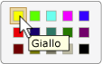

# Implementing the UI Automation Value Control Pattern
> [!NOTE]
>  Questa documentazione è destinata agli sviluppatori di .NET Framework che vogliono usare le classi gestite di [!INCLUDE[TLA2#tla_uiautomation](../../../includes/tla2sharptla-uiautomation-md.md)] definite nello spazio dei nomi <xref:System.Windows.Automation>. Per informazioni aggiornate su [!INCLUDE[TLA2#tla_uiautomation](../../../includes/tla2sharptla-uiautomation-md.md)], vedere [Windows Automation API: automazione interfaccia utente](http://go.microsoft.com/fwlink/?LinkID=156746).  
  
 In questo argomento vengono presentate le linee guida e le convenzioni per l'implementazione di <xref:System.Windows.Automation.Provider.IValueProvider>, incluse le informazioni relative a eventi e proprietà. Alla fine della panoramica sono elencati collegamenti ad altro materiale di riferimento.  
  
 Il pattern di controllo <xref:System.Windows.Automation.ValuePattern> viene usato per supportare i controlli con un valore intrinseco che non si estende su un intervallo e che può essere rappresentato come stringa. Questa stringa può essere modificabile, a seconda del controllo e delle impostazioni. Per esempi di controlli che implementano questo pattern, vedere [Control Pattern Mapping for UI Automation Clients](../../../docs/framework/ui-automation/control-pattern-mapping-for-ui-automation-clients.md).  
  
   
## Linee guida e convenzioni di implementazione  
 Quando si implementa il pattern di controllo Value, tenere presenti le linee guida e le convenzioni seguenti:  
  
-   I controlli come <xref:System.Windows.Automation.ControlType.ListItem> e <xref:System.Windows.Automation.ControlType.TreeItem> devono supportare <xref:System.Windows.Automation.ValuePattern> se il valore di uno qualsiasi degli elementi è modificabile, indipendentemente dalla modalità di modifica corrente del controllo. Il controllo padre deve supportare anche <xref:System.Windows.Automation.ValuePattern> se gli elementi figlio sono modificabili.  
  
   
Esempio di elemento elenco modificabile  
  
-   I controlli di modifica a riga singola supportano l'accesso a livello di codice ai contenuti implementando <xref:System.Windows.Automation.Provider.IValueProvider>. I controlli di modifica a più righe, tuttavia, non implementano <xref:System.Windows.Automation.Provider.IValueProvider>, ma forniscono l'accesso ai contenuti implementando <xref:System.Windows.Automation.Provider.ITextProvider>.  
  
-   Per recuperare i contenuti testuali di un controllo di modifica a più righe, il controllo deve implementare <xref:System.Windows.Automation.Provider.ITextProvider>.<xref:System.Windows.Automation.Provider.ITextProvider> non supporta, tuttavia, l'impostazione del valore di un controllo.  
  
-   <xref:System.Windows.Automation.Provider.IValueProvider> non supporta il recupero delle informazioni di formattazione o dei valori delle sottostringhe. Implementare <xref:System.Windows.Automation.Provider.ITextProvider> in questi scenari.  
  
-   <xref:System.Windows.Automation.Provider.IValueProvider> deve essere implementato da controlli come il controllo di selezione **Selezione colori** in [!INCLUDE[TLA#tla_word](../../../includes/tlasharptla-word-md.md)] \(illustrato di seguito\), che supporta il mapping delle stringhe tra il valore di un colore \(ad esempio, "giallo"\) e una struttura [!INCLUDE[TLA#tla_rgb](../../../includes/tlasharptla-rgb-md.md)] interna equivalente.  
  
   
Esempio di mapping delle stringhe dei campioni colore  
  
-   Un controllo deve avere <xref:System.Windows.Automation.AutomationElement.IsEnabledProperty> impostato su `true` e <xref:System.Windows.Automation.ValuePattern.IsReadOnlyProperty> impostato su `false` prima di consentire una chiamata a <xref:System.Windows.Automation.Provider.IValueProvider.SetValue%2A>.  
  
   
## Membri obbligatori per IValueProvider  
 Le proprietà e i metodi seguenti sono obbligatori per l'implementazione di <xref:System.Windows.Automation.Provider.IValueProvider>.  
  
|Membri obbligatori|Tipo di membro|Note|  
|------------------------|--------------------|----------|  
|<xref:System.Windows.Automation.ValuePattern.IsReadOnlyProperty>|Proprietà|Nessuno|  
|<xref:System.Windows.Automation.ValuePattern.ValueProperty>|Proprietà|Nessuno|  
|<xref:System.Windows.Automation.ValuePattern.SetValue%2A>|Metodo|None|  
  
   
## Eccezioni  
 I provider devono generare le eccezioni seguenti.  
  
|Tipo di eccezione|Condizione|  
|-----------------------|----------------|  
|<xref:System.InvalidOperationException>|<xref:System.Windows.Automation.ValuePattern.SetValue%2A>   -   Se informazioni specifiche delle impostazioni locali vengono passate a un controllo in un formato non corretto, ad esempio una data non formattata correttamente.|  
|<xref:System.ArgumentException>|<xref:System.Windows.Automation.ValuePattern.SetValue%2A>   -   Se un nuovo valore non può essere convertito da una stringa a un formato riconosciuto dal controllo.|  
|<xref:System.Windows.Automation.ElementNotEnabledException>|<xref:System.Windows.Automation.ValuePattern.SetValue%2A>   -   Quando viene effettuato un tentativo di modificare un controllo non abilitato.|  
  
## Vedere anche  
 [UI Automation Control Patterns Overview](../../../docs/framework/ui-automation/ui-automation-control-patterns-overview.md)   
 [Support Control Patterns in a UI Automation Provider](../../../docs/framework/ui-automation/support-control-patterns-in-a-ui-automation-provider.md)   
 [UI Automation Control Patterns for Clients](../../../docs/framework/ui-automation/ui-automation-control-patterns-for-clients.md)   
 [TextPattern Insert Text Sample](http://msdn.microsoft.com/it-it/67353f93-7ee2-42f2-ab76-5c078cf6ca16)   
 [UI Automation Tree Overview](../../../docs/framework/ui-automation/ui-automation-tree-overview.md)   
 [Use Caching in UI Automation](../../../docs/framework/ui-automation/use-caching-in-ui-automation.md)