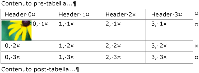
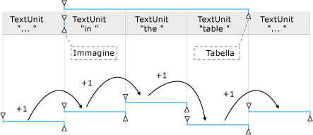
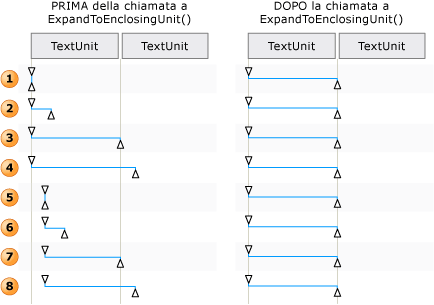

# TextPattern and Embedded Objects Overview
> [!NOTE]
>  Questa documentazione è destinata agli sviluppatori di .NET Framework che vogliono usare le classi gestite di [!INCLUDE[TLA2#tla_uiautomation](../../../includes/tla2sharptla-uiautomation-md.md)] definite nello spazio dei nomi <xref:System.Windows.Automation>. Per informazioni aggiornate su [!INCLUDE[TLA2#tla_uiautomation](../../../includes/tla2sharptla-uiautomation-md.md)], vedere [Windows Automation API: automazione interfaccia utente](http://go.microsoft.com/fwlink/?LinkID=156746).  
  
 In questa panoramica è descritto come l'[!INCLUDE[TLA#tla_uiautomation](../../../includes/tlasharptla-uiautomation-md.md)] espone oggetti incorporati, o elementi figlio, all'interno di un documento di testo o di un contenitore.  
  
 Nell'[!INCLUDE[TLA2#tla_uiautomation](../../../includes/tla2sharptla-uiautomation-md.md)] un oggetto incorporato corrisponde a qualsiasi elemento che disponga di limiti non testuali, ad esempio un'immagine, un collegamento ipertestuale, una tabella o un tipo di documento quale un foglio di calcolo di [!INCLUDE[TLA#tla_xl](../../../includes/tlasharptla-xl-md.md)] o un file di [!INCLUDE[TLA#tla_winmedia](../../../includes/tlasharptla-winmedia-md.md)]. Questa definizione è diversa dalla definizione standard, che prevede che un elemento venga creato in un'applicazione e incorporato o collegato in un'altra. Nel contesto dell'[!INCLUDE[TLA2#tla_uiautomation](../../../includes/tla2sharptla-uiautomation-md.md)] è irrilevante che l'oggetto possa essere modificato all'interno dell'applicazione originale.  
  
   
## Oggetti incorporati e albero di automazione interfaccia utente  
 Gli oggetti incorporati vengono considerati come singoli elementi all'interno della vista di controllo dell'albero di [!INCLUDE[TLA2#tla_uiautomation](../../../includes/tla2sharptla-uiautomation-md.md)]. Gli oggetti vengono esposti come elementi figlio del contenitore di testo, in modo che sia possibile accedervi tramite lo stesso modello degli altri controlli nell'[!INCLUDE[TLA2#tla_uiautomation](../../../includes/tla2sharptla-uiautomation-md.md)].  
  
   
Esempio di un contenitore di testo con oggetti incorporati tabella, immagine e collegamento ipertestuale  
  
   
Esempio di visualizzazione del contenuto di una parte del contenitore di testo precedente  
  
   
## Esporre oggetti incorporati tramite TextPattern e TextPatternRange  
 Usate in combinazione, le classi pattern di controllo <xref:System.Windows.Automation.TextPattern> e <xref:System.Windows.Automation.Text.TextPatternRange> espongono metodi e proprietà che facilitano lo spostamento e l'esecuzione di query di oggetti incorporati.  
  
 Il contenuto testuale \(o testo interno\) di un contenitore di testo o di un oggetto incorporato, ad esempio una cella di tabella o un collegamento ipertestuale, viene esposto come un flusso di testo continuo sia nella vista di controllo che nella visualizzazione del contenuto dell'albero di [!INCLUDE[TLA2#tla_uiautomation](../../../includes/tla2sharptla-uiautomation-md.md)]. I limiti dell'oggetto vengono ignorati. Se un client di automazione interfaccia utente sta recuperando il testo a scopo di esposizione, interpretazione o analisi, è necessario verificare l'eventuale presenza di casi speciali nell'intervallo di testo, ad esempio una tabella con contenuto testuale o altri oggetti incorporati. Questa operazione può essere eseguita chiamando <xref:System.Windows.Automation.Text.TextPatternRange.GetChildren%2A> per ottenere un <xref:System.Windows.Automation.AutomationElement> per ogni oggetto incorporato e chiamando quindi <xref:System.Windows.Automation.TextPattern.RangeFromChild%2A> per ottenere un intervallo di testo per ogni elemento. Questa operazione viene eseguita in modo ricorsivo fino a quando non è stato recuperato l'intero contenuto testuale.  
  
   
Esempio di un flusso di testo con oggetti incorporati e le estensioni degli intervalli corrispondenti  
  
 Quando è necessario scorrere il contenuto di un intervallo di testo, per garantire una corretta esecuzione del metodo <xref:System.Windows.Automation.Text.TextPatternRange.Move%2A> è prevista una serie di passaggi dietro le quinte.  
  
1.  L'intervallo di testo viene normalizzato, ovvero viene compresso in un intervallo degenerato all'endpoint <xref:System.Windows.Automation.Text.TextPatternRangeEndpoint>. Ciò rende superfluo l'endpoint <xref:System.Windows.Automation.Text.TextPatternRangeEndpoint>. Questo passaggio è necessario per rimuovere l'ambiguità nei casi in cui un intervallo di testo si estenda sui limiti di <xref:System.Windows.Automation.Text.TextUnit>: ad esempio, "{L'U}RL [http:\/\/www.microsoft.com](http://www.microsoft.com) è incorporato nel testo", dove "{" e "}" rappresentano gli endpoint dell'intervallo di testo.  
  
2.  L'intervallo risultante viene spostato indietro in <xref:System.Windows.Automation.TextPattern.DocumentRange%2A> all'inizio del limite <xref:System.Windows.Automation.Text.TextUnit> richiesto.  
  
3.  L'intervallo viene spostato avanti o indietro in <xref:System.Windows.Automation.TextPattern.DocumentRange%2A> per il numero richiesto di limiti <xref:System.Windows.Automation.Text.TextUnit>.  
  
4.  L'intervallo viene quindi espanso dallo stato di intervallo degenerato spostando l'endpoint <xref:System.Windows.Automation.Text.TextPatternRangeEndpoint> di un limite <xref:System.Windows.Automation.Text.TextUnit> richiesto.  
  
   
Esempi di regolazione di un intervallo di testo per Move\(\) ed ExpandToEnclosingUnit\(\)  
  
   
## Scenari comuni  
 Nelle sezioni seguenti vengono illustrati esempi degli scenari più comuni che prevedono l'uso di oggetti incorporati.  
  
 Legenda per gli esempi illustrati:  
  
 { \= <xref:System.Windows.Automation.Text.TextPatternRangeEndpoint>  
  
 } \= <xref:System.Windows.Automation.Text.TextPatternRangeEndpoint>  
  
   
### Collegamento ipertestuale  
 **Esempio 1: intervallo di testo che contiene un collegamento ipertestuale con testo incorporato**  
  
 {L'URL [http:\/\/www.microsoft.com](http://www.microsoft.com) è incorporato nel testo}.  
  
|Metodo chiamato|Risultato|  
|---------------------|---------------|  
|<xref:System.Windows.Automation.Text.TextPatternRange.GetText%2A>|Restituisce la stringa "L'URL http:\/\/www.microsoft.com è incorporato nel testo".|  
|<xref:System.Windows.Automation.Text.TextPatternRange.GetEnclosingElement%2A>|Restituisce l'<xref:System.Windows.Automation.AutomationElement> più interno che racchiude l'intervallo di testo, in questo caso, l'<xref:System.Windows.Automation.AutomationElement> che rappresenta il provider di testo stesso.|  
|<xref:System.Windows.Automation.Text.TextPatternRange.GetChildren%2A>|Restituisce un <xref:System.Windows.Automation.AutomationElement> che rappresenta il controllo collegamento ipertestuale.|  
|<xref:System.Windows.Automation.TextPattern.RangeFromChild%2A> dove <xref:System.Windows.Automation.AutomationElement> è l'oggetto restituito dal metodo `GetChildren` precedente.|Restituisce l'intervallo che rappresenta "http:\/\/www.microsoft.com".|  
  
 **Esempio 2: intervallo di testo che si estende parzialmente su un collegamento ipertestuale con testo incorporato**  
  
 L'URL http:\/\/{[www](www)} è incorporato nel testo.  
  
|Metodo chiamato|Risultato|  
|---------------------|---------------|  
|<xref:System.Windows.Automation.Text.TextPatternRange.GetText%2A>|Restituisce la stringa "www".|  
|<xref:System.Windows.Automation.Text.TextPatternRange.GetEnclosingElement%2A>|Restituisce l'<xref:System.Windows.Automation.AutomationElement> più interno che racchiude l'intervallo di testo, in questo caso, il controllo collegamento ipertestuale.|  
|<xref:System.Windows.Automation.Text.TextPatternRange.GetChildren%2A>|Restituisce `null` poiché l'intervallo di testo non si estende sull'intera stringa dell'URL.|  
  
 **Esempio 3: intervallo di testo che si estende parzialmente sul contenuto di un contenitore di testo. Il contenitore di testo contiene testo incorporato che non fa parte dell'intervallo di testo.**  
  
 {L'URL} [http:\/\/www.microsoft.com](http://www.microsoft.com) è incorporato nel testo.  
  
|Metodo chiamato|Risultato|  
|---------------------|---------------|  
|<xref:System.Windows.Automation.Text.TextPatternRange.GetText%2A>|Restituisce la stringa "L'URL".|  
|<xref:System.Windows.Automation.Text.TextPatternRange.GetEnclosingElement%2A>|Restituisce l'<xref:System.Windows.Automation.AutomationElement> più interno che racchiude l'intervallo di testo, in questo caso, l'<xref:System.Windows.Automation.AutomationElement> che rappresenta il provider di testo stesso.|  
|<xref:System.Windows.Automation.Text.TextPatternRange.Move%2A> con i parametri \(TextUnit.Word, 1\).|Sposta l'estensione dell'intervallo di intervallo di testo ad "http", poiché il testo del collegamento ipertestuale è costituito da parole singole. In questo caso, il collegamento ipertestuale non viene considerato come oggetto singolo.   L'URL {[http](../../../ocs/framework/network-programming/http.md)} è incorporato nel testo.|  
  
   
### Immagine  
 **Esempio 1: intervallo di testo che contiene un'immagine incorporata**  
  
 {L'immagine  è incorporata nel testo}.  
  
|Metodo chiamato|Risultato|  
|---------------------|---------------|  
|<xref:System.Windows.Automation.Text.TextPatternRange.GetText%2A>|Restituisce la stringa "L'immagine è incorporata nel testo". Non è possibile prevedere l'inclusione nel flusso di testo dell'eventuale testo alternativo associato all'immagine.|  
|<xref:System.Windows.Automation.Text.TextPatternRange.GetEnclosingElement%2A>|Restituisce l'<xref:System.Windows.Automation.AutomationElement> più interno che racchiude l'intervallo di testo, in questo caso, l'<xref:System.Windows.Automation.AutomationElement> che rappresenta il provider di testo stesso.|  
|<xref:System.Windows.Automation.Text.TextPatternRange.GetChildren%2A>|Restituisce un <xref:System.Windows.Automation.AutomationElement> che rappresenta il controllo immagine.|  
|<xref:System.Windows.Automation.TextPattern.RangeFromChild%2A> dove <xref:System.Windows.Automation.AutomationElement> è l'oggetto restituito dal metodo <xref:System.Windows.Automation.Text.TextPatternRange.GetChildren%2A> precedente.|Restituisce l'intervallo degenerato che rappresenta "".|  
  
 **Esempio 2: intervallo di testo che si estende parzialmente sul contenuto di un contenitore di testo. Il contenitore di testo contiene un'immagine incorporata che non fa parte dell'intervallo di testo.**  
  
 {L'immagine}  è incorporata nel testo.  
  
|Metodo chiamato|Risultato|  
|---------------------|---------------|  
|<xref:System.Windows.Automation.Text.TextPatternRange.GetText%2A>|Restituisce la stringa "L'immagine".|  
|<xref:System.Windows.Automation.Text.TextPatternRange.GetEnclosingElement%2A>|Restituisce l'<xref:System.Windows.Automation.AutomationElement> più interno che racchiude l'intervallo di testo, in questo caso, l'<xref:System.Windows.Automation.AutomationElement> che rappresenta il provider di testo stesso.|  
|<xref:System.Windows.Automation.Text.TextPatternRange.Move%2A> con i parametri \(TextUnit.Word, 1\).|Sposta l'estensione dell'intervallo di testo a "è". Poiché solo gli oggetti incorporati basati su testo sono considerati parte del flusso di testo, l'immagine in questo esempio non influisce su Move o sul valore restituito da questo metodo \(1 in questo caso\).|  
  
   
### Tabella  
  
### Tabella usata per gli esempi  
  
|Cella con immagine|Cella con testo|  
|------------------------|---------------------|  
||X|  
||Y|  
|   Immagine per Z|Z|  
  
 **Esempio 1: ottenere il contenitore di testo dal contenuto di una cella.**  
  
|Metodo chiamato|Risultato|  
|---------------------|---------------|  
|<xref:System.Windows.Automation.GridPattern.GetItem%2A> con parametri \(0,0\)|Restituisce l'<xref:System.Windows.Automation.AutomationElement> che rappresenta il contenuto della cella della tabella; in questo caso, l'elemento è un controllo di testo.|  
|<xref:System.Windows.Automation.TextPattern.RangeFromChild%2A> dove <xref:System.Windows.Automation.AutomationElement> è l'oggetto restituito dal metodo `GetItem` precedente.|Restituisce l'intervallo che si estende sull'immagine .|  
|<xref:System.Windows.Automation.Text.TextPatternRange.GetEnclosingElement%2A> per l'oggetto restituito dal metodo `RangeFromChild` precedente.|Restituisce l'<xref:System.Windows.Automation.AutomationElement> che rappresenta la cella della tabella; in questo caso, l'elemento è un controllo di testo che supporta TableItemPattern.|  
|<xref:System.Windows.Automation.Text.TextPatternRange.GetEnclosingElement%2A> per l'oggetto restituito dal metodo `GetEnclosingElement` precedente.|Restituisce l'<xref:System.Windows.Automation.AutomationElement> che rappresenta la tabella.|  
|<xref:System.Windows.Automation.Text.TextPatternRange.GetEnclosingElement%2A> per l'oggetto restituito dal metodo `GetEnclosingElement` precedente.|Restituisce l'<xref:System.Windows.Automation.AutomationElement> che rappresenta il provider di testo stesso.|  
  
 **Esempio 2: ottenere il contenitore di testo di una cella.**  
  
|Metodo chiamato|Risultato|  
|---------------------|---------------|  
|<xref:System.Windows.Automation.GridPattern.GetItem%2A> con parametri \(1,1\).|Restituisce l'<xref:System.Windows.Automation.AutomationElement> che rappresenta il contenuto della cella della tabella; in questo caso, l'elemento è un controllo di testo.|  
|<xref:System.Windows.Automation.TextPattern.RangeFromChild%2A> dove <xref:System.Windows.Automation.AutomationElement> è l'oggetto restituito dal metodo `GetItem` precedente.|Restituisce "Y".|  
  
## Vedere anche  
 <xref:System.Windows.Automation.TextPattern>   
 <xref:System.Windows.Automation.Text.TextPatternRange>   
 <xref:System.Windows.Automation.Provider.ITextProvider>   
 <xref:System.Windows.Automation.Provider.ITextRangeProvider>   
 [Access Embedded Objects Using UI Automation](../../../docs/framework/ui-automation/access-embedded-objects-using-ui-automation.md)   
 [Expose the Content of a Table Using UI Automation](../../../docs/framework/ui-automation/expose-the-content-of-a-table-using-ui-automation.md)   
 [Traverse Text Using UI Automation](../../../docs/framework/ui-automation/traverse-text-using-ui-automation.md)   
 [TextPattern Search and Selection Sample](http://msdn.microsoft.com/it-it/0a3bca57-8b72-489d-a57c-da85b7a22c7f)