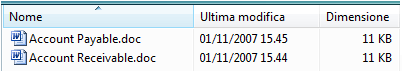

# UI Automation Support for the DataGrid Control Type
> [!NOTE]
>  Questa documentazione è destinata agli sviluppatori di .NET Framework che vogliono usare le classi gestite di [!INCLUDE[TLA2#tla_uiautomation](../../../includes/tla2sharptla-uiautomation-md.md)] definite nello spazio dei nomi <xref:System.Windows.Automation>. Per informazioni aggiornate su [!INCLUDE[TLA2#tla_uiautomation](../../../includes/tla2sharptla-uiautomation-md.md)], vedere [Windows Automation API: automazione interfaccia utente](http://go.microsoft.com/fwlink/?LinkID=156746).  
  
 In questo argomento vengono fornite informazioni sul supporto di [!INCLUDE[TLA#tla_uiautomation](../../../includes/tlasharptla-uiautomation-md.md)] per il tipo di controllo DataGrid. In [!INCLUDE[TLA2#tla_uiautomation](../../../includes/tla2sharptla-uiautomation-md.md)] un tipo di controllo è un set di condizioni che un controllo deve soddisfare per usare la proprietà `ControlType`. Le condizioni includono linee guida specifiche per la struttura ad albero di [!INCLUDE[TLA2#tla_uiautomation](../../../includes/tla2sharptla-uiautomation-md.md)], i valori delle proprietà di [!INCLUDE[TLA2#tla_uiautomation](../../../includes/tla2sharptla-uiautomation-md.md)] e i pattern di controllo.  
  
 Il tipo di controllo DataGrid consente a un utente di usare facilmente gli elementi contenenti metadati rappresentati in colonne. I controlli griglia dati contengono righe di elementi e colonne di informazioni su tali elementi. Un controllo visualizzazione elenco in Esplora risorse di Microsoft Vista è un esempio che supporta il tipo di controllo DataGrid.  
  
 Nelle sezioni seguenti vengono definiti la struttura ad albero necessaria di [!INCLUDE[TLA2#tla_uiautomation](../../../includes/tla2sharptla-uiautomation-md.md)], le proprietà, i pattern di controllo e gli eventi per il tipo di controllo DataGrid. I requisiti di [!INCLUDE[TLA2#tla_uiautomation](../../../includes/tla2sharptla-uiautomation-md.md)] si applicano a tutti i controlli griglia dati, in [!INCLUDE[TLA#tla_winclient](../../../includes/tlasharptla-winclient-md.md)], [!INCLUDE[TLA#tla_win32](../../../includes/tlasharptla-win32-md.md)] o [!INCLUDE[TLA#tla_winforms](../../../includes/tlasharptla-winforms-md.md)].  
  
   
## Struttura ad albero di automazione interfaccia utente obbligatoria  
 Nella tabella seguente vengono illustrate la visualizzazione controlli e la visualizzazione contenuto dell'albero di [!INCLUDE[TLA2#tla_uiautomation](../../../includes/tla2sharptla-uiautomation-md.md)] relativo ai controlli griglia dati e viene descritto il possibile contenuto di ogni visualizzazione. Per altre informazioni sull'albero di [!INCLUDE[TLA2#tla_uiautomation](../../../includes/tla2sharptla-uiautomation-md.md)], vedere [UI Automation Tree Overview](../../../docs/framework/ui-automation/ui-automation-tree-overview.md).  
  
|Albero di [!INCLUDE[TLA2#tla_uiautomation](../../../includes/tla2sharptla-uiautomation-md.md)] \- Visualizzazione controlli|Albero di [!INCLUDE[TLA2#tla_uiautomation](../../../includes/tla2sharptla-uiautomation-md.md)] \- Visualizzazione contenuto|  
|------------------------------------------------------------------------------------------------------------------|------------------------------------------------------------------------------------------------------------------|  
|DataGrid   <ul><li>Header \(0, 1 o 2\)   <ul><li>HeaderItem \(numero di colonne o righe\)</li></ul></li><li>DataItem \(0 o più, può essere strutturato in una gerarchia\)</li></ul>|DataGrid   -   DataItem \(0 o più, può essere strutturato in una gerarchia\)|  
  
   
## Proprietà di automazione interfaccia utente obbligatorie  
 La tabella seguente elenca le proprietà il cui valore o la cui definizione è particolarmente rilevante per i controlli griglia dati. Per altre informazioni sulle proprietà di [!INCLUDE[TLA2#tla_uiautomation](../../../includes/tla2sharptla-uiautomation-md.md)], vedere [UI Automation Properties for Clients](../../../docs/framework/ui-automation/ui-automation-properties-for-clients.md).  
  
|Proprietà|Valore|Note|  
|---------------|------------|----------|  
|<xref:System.Windows.Automation.AutomationElementIdentifiers.AutomationIdProperty>|Vedere le note.|Il valore di questa proprietà deve essere univoco in tutti i controlli in un'applicazione.|  
|<xref:System.Windows.Automation.AutomationElementIdentifiers.BoundingRectangleProperty>|Vedere le note.|Il rettangolo più esterno che contiene l'intero controllo.|  
|<xref:System.Windows.Automation.AutomationElementIdentifiers.ClickablePointProperty>|Vedere le note.|Supportata se è presente un rettangolo di delimitazione. Se non tutti i punti all'interno del rettangolo di delimitazione sono selezionabili ed è stato eseguito un processo di hit testing specializzato, eseguire l'override e implementare un punto selezionabile.|  
|<xref:System.Windows.Automation.AutomationElementIdentifiers.ControlTypeProperty>|DataGrid|Questo valore è uguale per tutti i framework dell'interfaccia utente.|  
|<xref:System.Windows.Automation.AutomationElementIdentifiers.IsContentElementProperty>|True|Il valore di questa proprietà deve essere sempre True. Ciò significa che il controllo griglia dati deve essere sempre presente nella visualizzazione contenuto dell'albero di [!INCLUDE[TLA2#tla_uiautomation](../../../includes/tla2sharptla-uiautomation-md.md)].|  
|<xref:System.Windows.Automation.AutomationElementIdentifiers.IsControlElementProperty>|True|Il valore di questa proprietà deve essere sempre True. Ciò significa che il controllo griglia dati deve essere sempre presente nella visualizzazione controlli dell'albero di [!INCLUDE[TLA2#tla_uiautomation](../../../includes/tla2sharptla-uiautomation-md.md)].|  
|<xref:System.Windows.Automation.AutomationElementIdentifiers.IsKeyboardFocusableProperty>|Vedere le note.|Se il controllo può ricevere lo stato attivo, deve supportare questa proprietà.|  
|<xref:System.Windows.Automation.AutomationElementIdentifiers.LabeledByProperty>|Vedere le note.|Se è presente un'etichetta di testo statico, questa proprietà deve esporre un riferimento a tale controllo.|  
|<xref:System.Windows.Automation.AutomationElementIdentifiers.LocalizedControlTypeProperty>|"data grid"|Stringa localizzata corrispondente al tipo di controllo DataGrid.|  
|<xref:System.Windows.Automation.AutomationElementIdentifiers.NameProperty>|Vedere le note.|Il controllo griglia dati in genere ottiene il valore per la proprietà `Name` da un'etichetta di testo statico. Se non è presente alcuna etichetta di testo statico, lo sviluppatore di un'applicazione deve assegnare un valore alla proprietà `Name`. Il valore della proprietà `Name` non deve mai essere il contenuto testuale del controllo di modifica.|  
  
   
## Pattern di controllo obbligatori per l'automazione interfaccia utente  
 La tabella seguente elenca i pattern di controllo che devono essere supportati da tutti i controlli griglia dati. Per altre informazioni sui pattern di controllo, vedere [UI Automation Control Patterns Overview](../../../docs/framework/ui-automation/ui-automation-control-patterns-overview.md).  
  
|Pattern di controllo|Supporto|Note|  
|--------------------------|--------------|----------|  
|<xref:System.Windows.Automation.Provider.IGridProvider>|Sì|Il controllo griglia dati stesso supporta sempre il pattern di controllo Grid perché gli elementi che contiene sono i metadati disposti in una griglia.|  
|<xref:System.Windows.Automation.Provider.IScrollProvider>|A seconda dei casi|La possibilità di scorrere la griglia dati dipende dal contenuto e dalla presenza o meno delle barre di scorrimento.|  
|<xref:System.Windows.Automation.Provider.ISelectionProvider>|A seconda dei casi|La possibilità di selezionare la griglia dati dipende dal contenuto.|  
|<xref:System.Windows.Automation.Provider.ITableProvider>|Sì|Il controllo griglia dati ha sempre un'intestazione all'interno del relativo sottoalbero. Per tale motivo, il pattern di controllo Table deve essere supportato.|  
  
 Gli elementi di dati nei contenitori di griglia dati supporteranno almeno:  
  
-   Pattern di controllo Selection Item \(se la griglia dati è selezionabile\)  
  
-   Pattern di controllo Scroll Item \(se la griglia dati è scorribile\)  
  
-   Pattern di controllo Grid Item  
  
-   TableItem \(pattern di controllo\)  
  
   
## Eventi di automazione interfaccia utente obbligatori  
 La tabella seguente elenca gli eventi di [!INCLUDE[TLA2#tla_uiautomation](../../../includes/tla2sharptla-uiautomation-md.md)] che devono essere supportati da tutti i controlli griglia dati. Per altre informazioni sugli eventi, vedere [UI Automation Events Overview](../../../docs/framework/ui-automation/ui-automation-events-overview.md).  
  
|Evento [!INCLUDE[TLA2#tla_uiautomation](../../../includes/tla2sharptla-uiautomation-md.md)]|Supporto|Note|  
|----------------------------------------------------------------------------------|--------------|----------|  
|<xref:System.Windows.Automation.AutomationElementIdentifiers.AutomationFocusChangedEvent>|Obbligatorio|None|  
|Evento di modifica della proprietà <xref:System.Windows.Automation.AutomationElementIdentifiers.BoundingRectangleProperty>.|Obbligatorio|None|  
|Evento di modifica della proprietà <xref:System.Windows.Automation.AutomationElementIdentifiers.IsEnabledProperty>.|Obbligatorio|None|  
|Evento di modifica della proprietà <xref:System.Windows.Automation.AutomationElementIdentifiers.IsOffscreenProperty>.|Obbligatorio|Nessuna|  
|<xref:System.Windows.Automation.AutomationElementIdentifiers.LayoutInvalidatedEvent>|A seconda dei casi|Nessuno|  
|<xref:System.Windows.Automation.AutomationElementIdentifiers.StructureChangedEvent>|Obbligatorio|None|  
|Evento di modifica della proprietà <xref:System.Windows.Automation.MultipleViewPatternIdentifiers.CurrentViewProperty>.|A seconda dei casi|None|  
|Evento di modifica della proprietà <xref:System.Windows.Automation.ScrollPatternIdentifiers.HorizontallyScrollableProperty>.|A seconda dei casi|Se il controllo supporta il pattern Scroll, deve supportare questo evento.|  
|Evento di modifica della proprietà <xref:System.Windows.Automation.ScrollPatternIdentifiers.HorizontalScrollPercentProperty>.|A seconda dei casi|Se il controllo supporta il pattern Scroll, deve supportare questo evento.|  
|Evento di modifica della proprietà <xref:System.Windows.Automation.ScrollPatternIdentifiers.HorizontalViewSizeProperty>.|A seconda dei casi|Se il controllo supporta il pattern Scroll, deve supportare questo evento.|  
|Evento di modifica della proprietà <xref:System.Windows.Automation.ScrollPatternIdentifiers.VerticalScrollPercentProperty>.|A seconda dei casi|Se il controllo supporta il pattern Scroll, deve supportare questo evento.|  
|Evento di modifica della proprietà <xref:System.Windows.Automation.ScrollPatternIdentifiers.VerticallyScrollableProperty>.|A seconda dei casi|Se il controllo supporta il pattern Scroll, deve supportare questo evento.|  
|Evento di modifica della proprietà <xref:System.Windows.Automation.ScrollPatternIdentifiers.VerticalViewSizeProperty>.|A seconda dei casi|Se il controllo supporta il pattern Scroll, deve supportare questo evento.|  
|<xref:System.Windows.Automation.SelectionPatternIdentifiers.InvalidatedEvent>|Obbligatorio|None|  
  
   
## Esempio di tipo di controllo griglia dati  
 Nell'immagine seguente viene illustrato un controllo visualizzazione elenco che implementa il tipo di controllo DataGrid.  
  
   
  
 La visualizzazione controlli e la visualizzazione contenuto dell'albero di [!INCLUDE[TLA2#tla_uiautomation](../../../includes/tla2sharptla-uiautomation-md.md)] relative al controllo visualizzazione elenco sono visualizzate di seguito. I pattern di controllo per ogni elemento di automazione sono indicati tra parentesi.  
  
|Albero di [!INCLUDE[TLA2#tla_uiautomation](../../../includes/tla2sharptla-uiautomation-md.md)] \- Visualizzazione controlli|Albero di [!INCLUDE[TLA2#tla_uiautomation](../../../includes/tla2sharptla-uiautomation-md.md)] \- Visualizzazione contenuto|  
|------------------------------------------------------------------------------------------------------------------|------------------------------------------------------------------------------------------------------------------|  
|<ul><li>DataGrid \(Table, Grid, Selection\)</li><li>Intestazione   <ul><li>HeaderItem "Nome" \(Invoke\)</li><li>HeaderItem "Ultima modifica" \(Invoke\)</li><li>HeaderItem "Dimensione" \(Invoke\)</li></ul></li><li>Group "Contoso" \(TableItem, GridItem, SelectionItem, Table\*, Grid\*\)   <ul><li>DataItem "Accounts Receivable.doc" \(SelectionItem, Invoke, TableItem\*, GridItem\*\)</li><li>DataItem "Accounts Payable.doc" \(SelectionItem, Invoke, TableItem\*, GridItem\*\)</li></ul></li></ul>|<ul><li>DataGrid \(Table, Grid, Selection\)</li><li>Group "Contoso" \(TableItem, GridItem, SelectionItem, Table\*, Grid\*\)   <ul><li>DataItem "Accounts Receivable.doc" \(SelectionItem, Invoke, TableItem\*, GridItem\*\)</li><li>DataItem "Accounts Payable.doc" \(SelectionItem, Invoke, TableItem\*, GridItem\*\)</li></ul></li></ul>|  
  
 \*L'esempio precedente mostra un DataGrid contenente più livelli di controlli. Il controllo Group \("Contoso"\) contiene due controlli DataItem \("Accounts Receivable.doc" e "Accounts Payable.doc"\). Una copia DataGrid\/GridItem è indipendente da una coppia in un altro livello. I controlli DataItem sotto Group possono essere esposti anche come tipo di controllo ListItem e quindi presentati più chiaramente come oggetti selezionabili, invece che come semplici elementi dati. Questo esempio non include i sottoelementi degli elementi di dati raggruppati.  
  
## Vedere anche  
 <xref:System.Windows.Automation.ControlType.DataGrid>   
 [UI Automation Control Types Overview](../../../docs/framework/ui-automation/ui-automation-control-types-overview.md)   
 [UI Automation Overview](../../../docs/framework/ui-automation/ui-automation-overview.md)