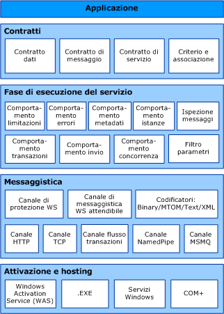

# Architettura di Windows Communication Foundation
Nel grafico seguente sono illustrati i livelli principali dell'architettura di [!INCLUDE[indigo1](../../../includes/indigo1-md.md)].  
  
## Architettura WCF  
   
  
### Contratti e descrizioni  
 I contratti definiscono i vari aspetti del sistema del messaggio.Il contratto dati descrive ogni parametro che costituisce ogni messaggio che un servizio può creare o utilizzare.I parametri del messaggio sono definiti da documenti XSD \(XML Schema Definition Language\) e consentono a qualsiasi sistema compatibile con XML di elaborare i documenti.Il contratto del messaggio definisce parti specifiche del messaggio utilizzando protocolli SOAP e consente un controllo più preciso delle parti del messaggio laddove tale precisione è richiesta dall'interoperabilità.Il contratto di servizio specifica le firme effettive del metodo del servizio ed è distribuito come interfaccia in uno dei linguaggi di programmazione supportati, ad esempio Visual Basic o Visual C\#.  
  
 I criteri e le associazioni stipulano le condizioni necessarie per la comunicazione con un servizio.L'associazione, ad esempio, deve specificare almeno il trasporto utilizzato \(ad esempio HTTP o TCP\) e una codifica.I criteri comprendono requisiti di sicurezza e altre condizioni che devono essere soddisfatte per la comunicazione con un servizio.  
  
### Fase di esecuzione del servizio  
 Il livello della fase di esecuzione del servizio contiene i comportamenti che si verificano solo durante l'operazione effettiva del servizio, ovvero, i comportamenti della fase di esecuzione del servizio.La limitazione delle richieste controlla la quantità dei messaggi elaborati, che può essere variata se la richiesta per il servizio raggiunge un limite preimpostato.Un comportamento dell'errore specifica la situazione che ha luogo quando si verifica un errore interno nel servizio, ad esempio controllando le informazioni comunicate al client\(troppe informazioni possono favorire un utente malintenzionato consentendogli di organizzare un attacco\). Il comportamento dei metadati stabilisce il modo e l'opportunità di rendere disponibili i metadati al mondo esterno.Il comportamento dell'istanza specifica il numero delle istanze del servizio che possono essere eseguite \(ad esempio, un singleton specifica una sola istanza per l'elaborazione di tutti i messaggi\).Il comportamento della transazione consente il rollback delle operazioni transazionali in caso di errore.Il comportamento della distribuzione è il controllo del modo in cui un messaggio viene elaborato nell'infrastruttura [!INCLUDE[indigo2](../../../includes/indigo2-md.md)].  
  
 L'estendibilità consente la personalizzazione di processi della fase di esecuzione.Il controllo messaggi, ad esempio, è la funzionalità che consente di controllare parti di un messaggio e il filtro parametri consente il verificarsi di azioni preimpostate in base a filtri che agiscono sulle intestazioni del messaggio.  
  
### Messaggistica  
 Il livello di messaggistica è composto da *canali*.Un canale è un componente che elabora in vario modo un messaggio, ad esempio autenticandolo.Un set di canali, inoltre, è noto come *stack di canali*.I canali operano su messaggi e intestazioni del messaggio.È un livello diverso dalla fase di esecuzione del servizio, che verte essenzialmente sull'elaborazione del contenuto del corpo del messaggio.  
  
 Esistono due tipi di canali: canali del trasporto e canali del protocollo.  
  
 I canali del trasporto leggono e scrivono messaggi dalla rete \(o da altri punti di comunicazione con il mondo esterno\).Alcuni trasporti utilizzano un codificatore per convertire i messaggi \(rappresentati come InfoSet XML\) nella\/dalla rappresentazione del flusso di byte utilizzata dalla rete.Esempi di trasporti sono HTTP, named pipe, TCP e MSMQ.Esempi di codifiche sono XML e sistema binario ottimizzato.  
  
 I canali del protocollo implementano protocolli di elaborazione dei messaggi, spesso leggendo o scrivendo intestazioni aggiuntive nel messaggio.Esempi di tali protocolli comprendono WS\-Security e WS\-Reliability.  
  
 Il livello di messaggistica illustra i possibili formati e modelli di scambio dei dati.WS\-Security è un'implementazione della specifica WS\-Security che consente la protezione a livello di messaggio.Il canale WS\-Reliable Messaging consente la garanzia di recapito dei messaggi.I codificatori presentano una varietà di codifiche che possono essere utilizzate per soddisfare le esigenze del messaggio.Il canale HTTP specifica che il protocollo di trasporto dell'ipertesto \(HyperText Transport Protocol\) viene utilizzato per il recapito dei messaggi.Allo stesso modo il canale TCP specifica il protocollo TCP.Il canale del flusso delle transazioni regola modelli di messaggio transazionali.Il canale named pipe consente la comunicazione tra processi.Il canale MSMQ consente l'interazione con applicazioni MSMQ.  
  
### Hosting e attivazione  
 Nella forma finale un servizio è un programma.Come altri programmi, un servizio viene eseguito in un file eseguibile.Si parla in questo caso di servizi *indipendenti*.  
  
 I servizi possono inoltre essere *ospitati* oppure eseguiti in un file eseguibile gestito da un agente esterno, ad esempio IIS o WAS.WAS consente alle applicazioni [!INCLUDE[indigo2](../../../includes/indigo2-md.md)] di essere attivate automaticamente se distribuite in un computer che esegue WAS.I servizi possono inoltre essere eseguiti manualmente come file eseguibili \(file con estensione exe\).Un servizio può essere eseguito automaticamente come servizio Windows.I componenti COM\+, inoltre, possono essere ospitati come servizi [!INCLUDE[indigo2](../../../includes/indigo2-md.md)].  
  
## Vedere anche  
 [Informazioni su Windows Communication Foundation](../../../docs/framework/wcf/whats-wcf.md)   
 [Concetti fondamentali di Windows Communication Foundation](../../../docs/framework/wcf/fundamental-concepts.md)