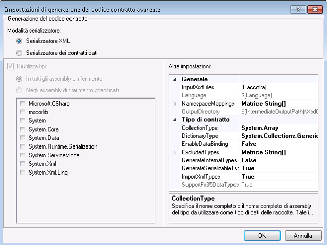

# Strumento con priorit&#224; al contratto (&quot;contract-first&quot;)
I contratti di servizio devono spesso essere creati dai servizi esistenti.In [!INCLUDE[net_v45](../../../includes/net-v45-md.md)] le classi dei contratti dati possono essere create automaticamente dai servizi esistenti utilizzando lo strumento con priorità al contratto \("contract\-first"\).Per utilizzare lo strumento con priorità al contratto \("contract\-first"\), il file di definizione di XML Schema \(XSD\) deve essere scaricato localmente; lo strumento non può importare i contratti dati remoti tramite HTTP.  
  
 Lo strumento con priorità al contratto \("contract\-first"\) è integrato in [!INCLUDE[vs_current_long](../../../includes/vs-current-long-md.md)] come attività di compilazione.I file di codice generati dall'attività di compilazione vengono creati ogni volta che il progetto viene compilato, in modo che il progetto possa facilmente adottare le modifiche nel contratto di servizio sottostante.  
  
 Di seguito sono riportati i tipi di schema che lo strumento con priorità al contratto \("contract\-first"\) può importare:  
  
```  
<xsd:complexType>  
<xsd:simpleType>  
```  
  
 I tipi semplici non verranno generati se sono primitivi come `Int16` o `String`; i tipi complessi non verranno generati se sono di tipo `Collection`.I tipi non verranno generati anche se fanno parte di un altro elemento `xsd:complexType`.In tutti questi casi, per un riferimento ai tipi verranno invece utilizzati i tipi esistenti nel progetto.  
  
## Aggiunta di un contratto dati a un progetto  
 Prima di poter utilizzare lo strumento con priorità al contratto \("contract\-first"\), è necessario aggiungere il contratto di servizio \(XSD\) al progetto.Ai fini di questa panoramica, il seguente contratto sarà utilizzato per illustrare le funzioni con priorità al contratto \("contract\-first"\).Questa definizione del servizio è un subset di piccole dimensioni del contratto di servizio utilizzato dall'API di ricerca di Bing.  
  
```xml  
<?xml version="1.0" encoding="utf-8"?>  
<xs:schema id="ServiceSchema"  
    targetNamespace="http://tempuri.org/ServiceSchema.xsd"  
    elementFormDefault="qualified"  
    xmlns="http://tempuri.org/ServiceSchema.xsd"  
    xmlns:mstns="http://tempuri.org/ServiceSchema.xsd"  
    xmlns:xs="http://www.w3.org/2001/XMLSchema"  
>  
  <xs:complexType name="SearchRequest">  
    <xs:sequence>  
      <xs:element minOccurs="0" maxOccurs="1" name="Version" type="xs:string" default="2.2" />  
      <xs:element minOccurs="0" maxOccurs="1" name="Market" type="xs:string" />  
      <xs:element minOccurs="0" maxOccurs="1" name="UILanguage" type="xs:string" />  
      <xs:element minOccurs="1" maxOccurs="1" name="Query" type="xs:string" />  
      <xs:element minOccurs="1" maxOccurs="1" name="AppId" type="xs:string" />  
      <xs:element minOccurs="0" maxOccurs="1" name="Latitude" type="xs:double" />  
      <xs:element minOccurs="0" maxOccurs="1" name="Longitude" type="xs:double" />  
      <xs:element minOccurs="0" maxOccurs="1" name="Radius" type="xs:double" />  
    </xs:sequence>  
  </xs:complexType>  
  <xs:simpleType name="WebSearchOption">  
    <xs:restriction base="xs:string">  
      <xs:enumeration value="DisableHostCollapsing" />  
      <xs:enumeration value="DisableQueryAlterations" />  
    </xs:restriction>  
  </xs:simpleType>  
</xs:schema>  
  
```  
  
 Per aggiungere al progetto il contratto di servizio illustrato in precedenza, fare clic con il pulsante destro del mouse sul progetto e scegliere **Aggiungi nuovo**.Selezionare Definizione schema nel riquadro WCF della finestra di dialogo Modelli e denominare il nuovo file SampleContract.xsd.Copiare e incollare il codice illustrato in precedenza nella visualizzazione Codice del nuovo file.  
  
## Configurazione delle opzioni con priorità al contratto \("contract\-first"\)  
 Le opzioni con priorità al contratto \("contract\-first"\) possono essere configurate nel menu Proprietà di un progetto [!INCLUDE[indigo2](../../../includes/indigo2-md.md)].Per abilitare lo sviluppo con priorità al contratto \("contract\-first"\), selezionare la casella di controllo **Abilita XSD come linguaggio di definizione del tipo** nella pagina WCF della finestra delle proprietà del progetto.  
  
   
  
 Per configurare le proprietà avanzate, fare clic sul pulsante Avanzate.  
  
   
  
 Le seguenti impostazioni avanzate possono essere configurate per la generazione di codice dai contratti.Attualmente, le impostazioni possono essere configurate solo per tutti i file del progetto e non per singoli file.  
  
-   **Modalità serializzatore**: questa impostazione determina il serializzatore che viene utilizzato per leggere i file del contratto di servizio.Se l'opzione **Serializzatore XML** è selezionata, le opzioni **Tipi di raccolte** e **Riutilizza tipi** sono disabilitate.Queste opzioni vengono applicate solo a **Serializzatore dei contratti dati**.  
  
-   **Riutilizza tipi**: questa impostazione specifica le librerie che vengono utilizzate per il riutilizzo dei tipi.Questa impostazione si applica solo se l'opzione **Modalità serializzazione** è impostata su **Serializzatore dei contratti dati**.  
  
-   **Tipo di raccolta**: questa impostazione specifica il tipo completo o completo di assembly da utilizzare per il tipo di dati della raccolta.Questa impostazione si applica solo se l'opzione **Modalità serializzazione** è impostata su **Serializzatore dei contratti dati**.  
  
-   **Tipo di dizionario**: questa impostazione specifica il tipo completo o completo di assembly da utilizzare per il tipo di dati del dizionario.  
  
-   **EnableDataBinding**: questa impostazione specifica se implementare l'interfaccia <xref:System.ComponentModel.INotifyPropertyChanged> in tutti i tipi di dati per implementare l'associazione dati.  
  
-   **ExcludedTypes**: questa impostazione specifica l'elenco di tipi completi o completi di assembly da escludere dagli assembly a cui si fa riferimento.Questa impostazione si applica solo se l'opzione **Modalità serializzazione** è impostata su **Serializzatore dei contratti dati**.  
  
-   **GenerateInternalTypes**: questa impostazione specifica se generare classi contrassegnate come interne.Questa impostazione si applica solo se l'opzione **Modalità serializzazione** è impostata su **Serializzatore dei contratti dati**.  
  
-   **GenerateSerializableTypes**: questa impostazione specifica se generare classi con l'attributo <xref:System.SerializableAttribute>.Questa impostazione si applica solo se l'opzione **Modalità serializzazione** è impostata su **Serializzatore dei contratti dati**.  
  
-   **ImportXMLTypes**: questa impostazione specifica se configurare il serializzatore dei contratti dati in modo che l'attributo <xref:System.SerializableAttribute> venga applicato alle classi senza l'attributo <xref:System.Runtime.Serialization.DataContractAttribute>.Questa impostazione si applica solo se l'opzione **Modalità serializzazione** è impostata su **Serializzatore dei contratti dati**.  
  
-   **SupportFx35TypedDataSets**: questa impostazione specifica se fornire funzionalità aggiuntive per i set di dati tipizzati creati per .NET Framework 3.5.Se l'opzione **Modalità serializzatore** è impostata su **Serializzatore XML**, l'estensione <xref:System.Data.Design.TypedDataSetSchemaImporterExtensionFx35> verrà aggiunta all'utilità di importazione di XML Schema quando questo valore è impostato su True.Se l'opzione **Modalità serializzatore** è impostata su **Serializzatore dei contratti dati**, il tipo <xref:System.DateTimeOffset> sarà escluso dai riferimenti quando questo valore è impostato su False, in modo che il tipo [DateTimeOffset](assetId:///DateTimeOffset?qualifyHint=False&amp;autoUpgrade=True) venga sempre generato per le versioni precedenti del framework.  
  
-   **InputXsdFiles**: questa impostazione specifica l'elenco dei file di input.Ogni file deve contenere un XML Schema valido.  
  
-   **Linguaggio**: questa impostazione specifica il linguaggio del codice del contratto generato.L'impostazione deve essere riconoscibile dall'oggetto <xref:System.CodeDom.Compiler.CodeDomProvider>.  
  
-   **NamespaceMappings**: questa impostazione specifica i mapping degli spazi dei nomi di destinazione XSD agli spazi dei nomi CLR.Ogni mapping deve utilizzare il formato seguente:  
  
    ```xml  
    “<Schema Namespace>, <CLR Namespace>”  
    ```  
  
     Il serializzatore XML accetta solo un mapping nel formato seguente:  
  
    ```xml  
    “*, <CLR Namespace>”  
    ```  
  
-   **OutputDirectory**: questa impostazione specifica la directory in cui verranno generati i file di codice.  
  
 Le impostazioni verranno utilizzate per generare i tipi di contratti di servizio dai relativi file quando il progetto viene compilato.  
  
## Utilizzo dello sviluppo con priorità al contratto \("contract\-first"\)  
 Dopo aver aggiunto il contratto di servizio al progetto e confermato le impostazioni di compilazione, compilare il progetto premendo **F6**.I tipi definiti nel contratto di servizio potranno quindi essere utilizzati nel progetto.  
  
 Per utilizzare i tipi definiti nel contratto di servizio, aggiungere un riferimento a `ContractTypes` nello spazio dei nomi corrente:  
  
```csharp  
using MyProjectNamespace.ContractTypes;  
```  
  
 I tipi definiti nel contratto di servizio potranno quindi essere risolti nel progetto, come mostrato di seguito.  
  
   
  
 I tipi generati dallo strumento vengono creati nel file GeneratedXSDTypes.cs.Per impostazione predefinita, il file viene creato nella directory \<directory del progetto\>\/obj\/\<configurazione di compilazione\>\/XSDGeneratedCode\/.Lo schema di esempio all'inizio di questo argomento viene convertito come segue:  
  
```scr  
//------------------------------------------------------------------------------  
// <auto-generated>  
//     This code was generated by a tool.  
//     Runtime Version:4.0.30319.17330  
//  
//     Changes to this file may cause incorrect behavior and will be lost if  
//     the code is regenerated.  
// </auto-generated>  
//------------------------------------------------------------------------------  
  
namespace TestXSD3.ContractTypes  
{  
    using System.Xml.Serialization;  
  
    /// <remarks/>  
    [System.CodeDom.Compiler.GeneratedCodeAttribute("System.Xml", "4.0.30319.17330")]  
    [System.SerializableAttribute()]  
    [System.Diagnostics.DebuggerStepThroughAttribute()]  
    [System.ComponentModel.DesignerCategoryAttribute("code")]  
    [System.Xml.Serialization.XmlTypeAttribute(Namespace="http://tempuri.org/ServiceSchema.xsd")]  
    [System.Xml.Serialization.XmlRootAttribute(Namespace="http://tempuri.org/ServiceSchema.xsd", IsNullable=true)]  
    public partial class SearchRequest  
    {  
  
        private string versionField;  
  
        private string marketField;  
  
        private string uILanguageField;  
  
        private string queryField;  
  
        private string appIdField;  
  
        private double latitudeField;  
  
        private bool latitudeFieldSpecified;  
  
        private double longitudeField;  
  
        private bool longitudeFieldSpecified;  
  
        private double radiusField;  
  
        private bool radiusFieldSpecified;  
  
        public SearchRequest()  
        {  
            this.versionField = "2.2";  
        }  
  
        /// <remarks/>  
        [System.ComponentModel.DefaultValueAttribute("2.2")]  
        public string Version  
        {  
            get  
            {  
                return this.versionField;  
            }  
            set  
            {  
                this.versionField = value;  
            }  
        }  
  
        /// <remarks/>  
        public string Market  
        {  
            get  
            {  
                return this.marketField;  
            }  
            set  
            {  
                this.marketField = value;  
            }  
        }  
  
        /// <remarks/>  
        public string UILanguage  
        {  
            get  
            {  
                return this.uILanguageField;  
            }  
            set  
            {  
                this.uILanguageField = value;  
            }  
        }  
  
        /// <remarks/>  
        public string Query  
        {  
            get  
            {  
                return this.queryField;  
            }  
            set  
            {  
                this.queryField = value;  
            }  
        }  
  
        /// <remarks/>  
        public string AppId  
        {  
            get  
            {  
                return this.appIdField;  
            }  
            set  
            {  
                this.appIdField = value;  
            }  
        }  
  
        /// <remarks/>  
        public double Latitude  
        {  
            get  
            {  
                return this.latitudeField;  
            }  
            set  
            {  
                this.latitudeField = value;  
            }  
        }  
  
        /// <remarks/>  
        [System.Xml.Serialization.XmlIgnoreAttribute()]  
        public bool LatitudeSpecified  
        {  
            get  
            {  
                return this.latitudeFieldSpecified;  
            }  
            set  
            {  
                this.latitudeFieldSpecified = value;  
            }  
        }  
  
        /// <remarks/>  
        public double Longitude  
        {  
            get  
            {  
                return this.longitudeField;  
            }  
            set  
            {  
                this.longitudeField = value;  
            }  
        }  
  
        /// <remarks/>  
        [System.Xml.Serialization.XmlIgnoreAttribute()]  
        public bool LongitudeSpecified  
        {  
            get  
            {  
                return this.longitudeFieldSpecified;  
            }  
            set  
            {  
                this.longitudeFieldSpecified = value;  
            }  
        }  
  
        /// <remarks/>  
        public double Radius  
        {  
            get  
            {  
                return this.radiusField;  
            }  
            set  
            {  
                this.radiusField = value;  
            }  
        }  
  
        /// <remarks/>  
        [System.Xml.Serialization.XmlIgnoreAttribute()]  
        public bool RadiusSpecified  
        {  
            get  
            {  
                return this.radiusFieldSpecified;  
            }  
            set  
            {  
                this.radiusFieldSpecified = value;  
            }  
        }  
    }  
  
    /// <remarks/>  
    [System.CodeDom.Compiler.GeneratedCodeAttribute("System.Xml", "4.0.30319.17330")]  
    [System.SerializableAttribute()]  
    [System.Xml.Serialization.XmlTypeAttribute(Namespace="http://tempuri.org/ServiceSchema.xsd")]  
    [System.Xml.Serialization.XmlRootAttribute(Namespace="http://tempuri.org/ServiceSchema.xsd", IsNullable=false)]  
    public enum WebSearchOption  
    {  
  
        /// <remarks/>  
        DisableHostCollapsing,  
  
        /// <remarks/>  
        DisableQueryAlterations,  
    }  
}  
  
```  
  
## Errori e avvisi  
 Gli errori e gli avvisi rilevati durante l'analisi dello schema XSD verranno visualizzati come errori e avvisi di compilazione.  
  
## Ereditarietà di interfaccia  
 Non è possibile utilizzare l'ereditarietà dell'interfaccia con sviluppo con priorità al contratto \("contract\-first"\), ciò è coerente con la modalità in cui le interfacce si comportano in altre operazioni.Per utilizzare un'interfaccia che eredita da un'interfaccia di base, utilizzare due endpoint separati.Il primo endpoint utilizza il contratto ereditato e il secondo endpoint implementa l'interfaccia di base.