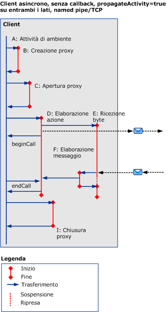
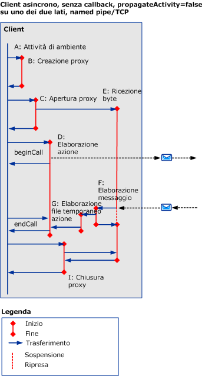
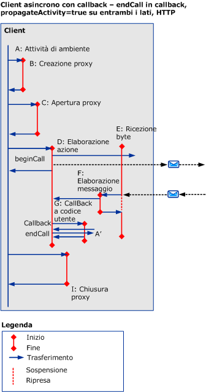
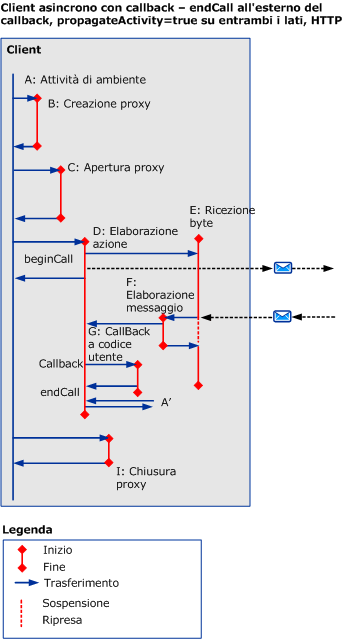
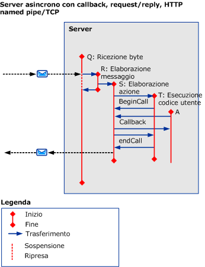

# Scenari asincroni con trasporti HTTP, TCP o pipe con nome
In questo argomento vengono descritti attività e trasferimenti per vari scenari Request\/Reply asincroni, con richieste multithreading che utilizzano HTTP, TCP o named pipe.  
  
## Request\/Reply asincroni senza errori  
 In questa sezione vengono descritti attività e trasferimenti per uno scenario Request\/Reply asincrono, con client multithreading.  
  
 L'attività del chiamante termina quando viene restituito `beginCall` e viene restituito `endCall`.Se viene chiamato un callback, viene restituito il callback.  
  
 L'attività chiamata termina quando viene restituito `beginCall`, viene restituito `endCall` o quando viene restituito il callback, se chiamato da tale attività.  
  
### Client asincrono senza callback  
  
#### La propagazione è attivata su entrambi i lati, con l'utilizzo di HTTP  
   
  
 Figura 1.Client asincrono, senza callback, `propagateActivity`\=`true` su entrambi i lati, HTTP  
  
 Se `propagateActivity`\=`true`, ProcessMessage indica l'attività ProcessAction nella quale eseguire il trasferimento.  
  
 Per gli scenari basati su HTTP, ReceiveBytes viene richiamato nel primo messaggio da inviare ed esiste per la durata della richiesta.  
  
#### La propagazione è disattivata su uno dei due lati, con l'utilizzo di HTTP  
 Se `propagateActivity`\=`false` sull'uno o l'altro lato, ProcessMessage non indica l'attività ProcessAction nella quale eseguire il trasferimento.Pertanto, viene richiamata una nuova attività ProcessAction temporanea con un nuovo ID.Quando la risposta asincrona viene abbinata alla richiesta nel codice di ServiceModel, l'ID attività può essere recuperato dal contesto locale.L'effettiva attività ProcessAction può essere trasferita con tale ID.  
  
   
  
 Figura 2.Client asincrono, senza callback, `propagateActivity`\=`false` sull'uno o l'altro lato, HTTP  
  
 Per gli scenari basati su HTTP, ReceiveBytes viene richiamato nel primo messaggio da inviare ed esiste per la durata della richiesta.  
  
 Un'attività ProcessAction viene creata in un client asincrono quando `propagateActivity`\=`false` nel chiamante o nel chiamato e quando il messaggio di risposta non include un'intestazione Action.  
  
#### La propagazione è attivata su entrambi i lati, con l'utilizzo di TCP o named pipe  
   
  
 Figura 3.Client asincrono, senza callback, `propagateActivity`\=`true` su entrambi i lati, named pipe\/TCP  
  
 Per uno scenario basato su named pipe o TCP, ReceiveBytes viene richiamato quando il client è aperto ed esiste per la durata della connessione.  
  
 Come nella Figura 1, se `propagateActivity`\=`true`, ProcessMessage indica l'attività ProcessAction nella quale eseguire il trasferimento.  
  
#### La propagazione è disattivata su uno dei due lati, con l'utilizzo di TCP o named pipe  
 Per uno scenario basato su named pipe o TCP, ReceiveBytes viene richiamato quando il client è aperto ed esiste per la durata della connessione.  
  
 Come nella Figura 2, se `propagateActivity`\=`false` sull'uno o l'altro lato, ProcessMessage non indica l'attività ProcessAction nella quale eseguire il trasferimento.Pertanto, viene richiamata una nuova attività ProcessAction temporanea con un nuovo ID.Quando la risposta asincrona viene abbinata alla richiesta nel codice di ServiceModel, l'ID attività può essere recuperato dal contesto locale.L'effettiva attività ProcessAction può essere trasferita con tale ID.  
  
   
  
 Figura 4.Client asincrono, senza callback, `propagateActivity`\=`false` su un lato, named pipe\/TCP  
  
### Client asincrono con callback  
 Questo scenario aggiunge attività G e A', per il callback e `endCall`, e i rispettivi trasferimenti dentro\/fuori.  
  
 In questa sezione viene solo dimostrato l'utilizzo di HTTP con `propragateActivity`\=`true`.Le attività e i trasferimenti aggiuntivi, tuttavia, si applicano anche agli altri casi \(ovvero `propagateActivity`\=`false`, utilizzando TCP o named pipe\).  
  
 Il callback crea un'attività nuova \(G\) quando il client chiama codice utente per notificare che i risultati sono pronti.Il codice utente chiama quindi `endCall` all'interno del callback \(come mostrato in Figura 5\) o fuori del callback \(Figura 6\).Poiché non si conosce da quale attività dell'utente `endCall` viene chiamata, questa attività si identifica come `A’`.È possibile che A' sia identico ad A o diverso.  
  
   
  
 Figura 5.Client asincrono con callback, `endCall` all'interno del callback  
  
   
  
 Figura 6.Client asincrono con callback, `endCall` esternamente al callback  
  
### Server asincrono con callback  
   
  
 Figura 7.Server asincrono con callback  
  
 Le stack dei canali richiama il client in Messaggio Ricevere: le tracce di questa elaborazione vengono create nell'attività ProcessRequest stessa.  
  
## Request\/Reply asincroni con errori  
 I messaggi di errore vengono ricevuti durante `endCall`.In caso contrario, attività e trasferimenti sono simili agli scenari precedenti.  
  
## Unidirezionale asincrono con o senza errori  
 Al client non vengono restituite risposte né errori.