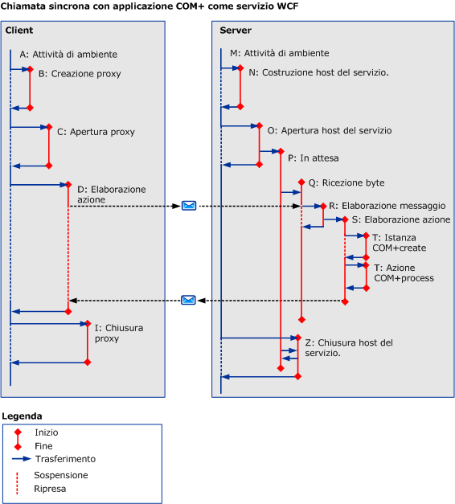

# COM+
La figura seguente mostra come è possibile utilizzare la traccia attività in un'applicazione COM\+.Anziché eseguire codice utente nel server è possibile definire un'attività COM\+ per ogni chiamata di metodo relativa al modello a oggetti di COM\+.  
  
 