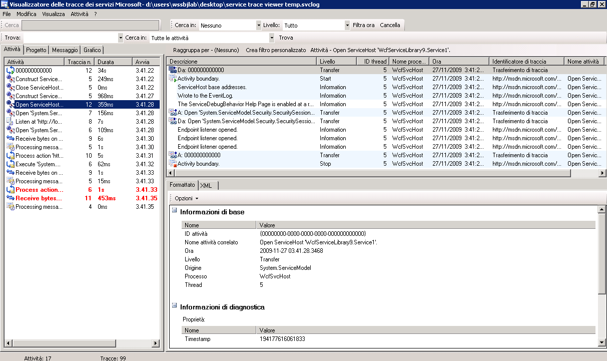
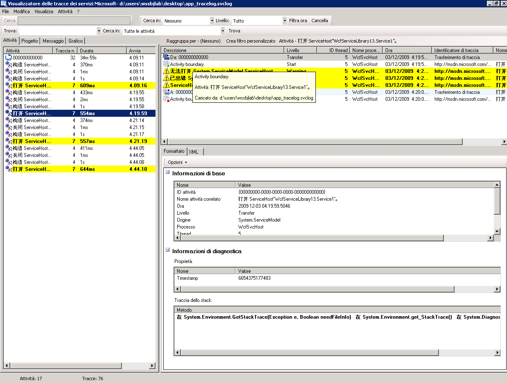
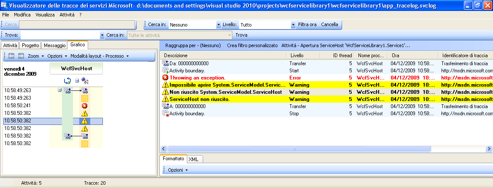

# Creazione di tracce di codice utente
Oltre ad attivare le funzionalità di traccia nella configurazione allo scopo di raccogliere dati di strumentazione generati da [!INCLUDE[indigo1](../../../../../includes/indigo1-md.md)], è possibile creare tracce nel codice utente a livello di programmazione.  In questo modo è possibile creare attivamente dati di strumentazione che possono essere successivamente usati a scopo diagnostico.  In questo argomento viene illustrata la procedura da seguire.  
  
 L'esempio incluso nella sezione [Estensione della funzionalità di traccia](../../../../../docs/framework/wcf/samples/extending-tracing.md) include inoltre tutto il codice illustrato nelle sezioni seguenti.  
  
## Creazione di un'origine di traccia  
 Per creare un'origine di traccia dell'utente è possibile usare il codice seguente.  
  
```  
TraceSource ts = new TraceSource("myUserTraceSource");  
```  
  
## Creazione di attività  
 Le attività sono unità logiche  di elaborazione.  È possibile creare un'attività per ogni unità di elaborazione principale nella quale si desidera raggruppare le tracce.  È possibile creare, ad esempio, un'attività per ogni richiesta inviata al servizio.  A tale scopo, eseguire i passaggi seguenti.  
  
1.  Salvare l'ID attività nell'ambito.  
  
2.  Creare un nuovo ID attività.  
  
3.  Eseguire il trasferimento dall'attività nell'ambito alla nuova attività, impostare la nuova attività nell'ambito e creare una traccia di inizio per questa attività.  
  
 Nell'esempio di codice seguente viene illustrato come eseguire questa operazione.  
  
```  
Guid oldID = Trace.CorrelationManager.ActivityId;  
Guid traceID = Guid.NewGuid();  
ts.TraceTransfer(0, "transfer", traceID);  
Trace.CorrelationManager.ActivityId = traceID; // Trace is static  
ts.TraceEvent(TraceEventType.Start, 0, "Add request");  
```  
  
## Creazione di tracce all'interno di un'attività utente  
 Il codice seguente crea tracce all'interno di un'attività utente.  
  
```  
double value1 = 100.00D;  
double value2 = 15.99D;  
ts.TraceInformation("Client sends message to Add " + value1 + ", " + value2);  
double result = client.Add(value1, value2);  
ts.TraceInformation("Client receives Add response '" + result + "'");  
```  
  
## Interruzione delle attività  
 Per interrompere le attività, tornare alla vecchia attività, interrompere l'ID dell'attività corrente e reimpostare l'ID della vecchia attività nell'ambito.  
  
 Nell'esempio di codice seguente viene illustrato come eseguire questa operazione.  
  
```  
ts.TraceTransfer(0, "transfer", oldID);  
ts.TraceEvent(TraceEventType.Stop, 0, "Add request");  
Trace.CorrelationManager.ActivityId = oldID;  
```  
  
## Propagazione dell'ID attività a un servizio  
 Se si imposta l'attributo `propagateActivity` su `true` per l'origine di traccia `System.ServiceModel` in entrambi i file di configurazione del client e del servizio, l'elaborazione del servizio per la richiesta Add si verifica nella stessa attività definita nel client.  Se il servizio definisce attività e trasferimenti specifici, le tracce del servizio non vengono visualizzate nell'attività propagata dal client.  Vengono invece visualizzate in un'attività correlata mediante tracce di trasferimento all'attività il cui ID viene propagato dal client.  
  
> [!NOTE]
>  Se l'attributo `propagateActivity` viene impostato su `true` sia nel client che nel servizio, l'attività di ambiente nell'ambito dell'operazione del servizio viene impostata da [!INCLUDE[indigo2](../../../../../includes/indigo2-md.md)].  
  
 Per controllare se un'attività è stata impostata nell'ambito da [!INCLUDE[indigo2](../../../../../includes/indigo2-md.md)], è possibile usare il codice seguente.  
  
```  
// Check if an activity was set in scope by WCF, if it was   
// propagated from the client. If not, ( ambient activity is   
// equal to Guid.Empty), create a new one.  
if(Trace.CorrelationManager.ActivityId == Guid.Empty)  
{  
    Guid newGuid = Guid.NewGuid();  
    Trace.CorrelationManager.ActivityId = newGuid;  
}  
// Emit your Start trace.  
ts.TraceEvent(TraceEventType.Start, 0, "Add Activity");  
  
// Emit the processing traces for that request.  
serviceTs.TraceInformation("Service receives Add "   
                            + n1 + ", " + n2);  
// double result = n1 + n2;  
serviceTs.TraceInformation("Service sends Add result" + result);  
  
// Emit the Stop trace and exit the method scope.  
ts.TraceEvent(TraceEventType.Stop, 0, "Add Activity");  
// return result;  
```  
  
## Eccezioni di traccia generate nel codice  
 Quando si genera un'eccezione nel codice, è anche possibile tracciare l'eccezione a livello di avviso o a un livello superiore usando il codice seguente.  
  
```  
ts.TraceEvent(TraceEventType.Warning, 0, “Throwing exception “ + “exceptionMessage”);  
```  
  
## Visualizzazione di tracce utente nello strumento di visualizzazione delle tracce dei servizi  
 Contenuto della sezione sono riportate le schermate relative alle tracce generate eseguendo l'esempio [Estensione della funzionalità di traccia](../../../../../docs/framework/wcf/samples/extending-tracing.md), in caso di visualizzazione con lo strumento [Strumento Visualizzatore di tracce dei servizi \(SvcTraceViewer.exe\)](../../../../../docs/framework/wcf/service-trace-viewer-tool-svctraceviewer-exe.md).  
  
 Nel diagramma seguente l'attività "Add request" creata precedentemente risulta selezionata nel riquadro sinistro.  L'attività è riportata insieme ad attività di operazioni matematiche \(Divide, Subtract, Multiply\) che costituiscono l'applicazione client.  Il codice utente ha definito una nuova attività per consentire a ogni operazione di isolare potenziali occorrenze di errore in richieste diverse.  
  
 Per dimostrare l'uso di trasferimenti nell'esempio [Estensione della funzionalità di traccia](../../../../../docs/framework/wcf/samples/extending-tracing.md) viene creata anche un'attività di calcolo che incapsula le quattro richieste di operazione.  Per ogni richiesta si verifica un trasferimento dall'attività di calcolo all'attività di richiesta e viceversa \(nella figura la traccia è evidenziata nel riquadro in alto a destra\).  
  
 Quando si seleziona un'attività nel riquadro sinistro, le tracce incluse da questa attività vengono mostrate nel riquadro in alto a destra.  Se `propagateActivity` è `true` in ogni endpoint incluso nel percorso della richiesta, le tracce nell'attività di richiesta provengono da tutti i processi che partecipano alla richiesta.  In questo esempio, nella quarta colonna del riquadro sono visualizzate tracce relative a entrambi il client e il servizio.  
  
 Questa attività mostra l'ordine di elaborazione seguente:  
  
1.  Il client invia un messaggio alla richiesta Add.  
  
2.  Il servizio riceve il messaggio di richiesta Add.  
  
3.  Il servizio invia la risposta Add.  
  
4.  Il client riceve la risposta Add.  
  
 Tutte queste tracce vengono create a livello di informazioni.  Facendo clic su una traccia nel riquadro in alto a destra è possibile visualizzare i dettagli della traccia nel riquadro in basso a destra.  
  
 Nel diagramma seguente è inoltre possibile vedere tracce di trasferimento da e verso l'attività di calcolo, nonché due coppie di tracce Start e Stop per ogni attività di richiesta, una per il client e una per il servizio \(una per ogni origine di traccia\).  
  
   
Elenco delle attività in base all'ora di creazione \(riquadro sinistro\) e alle relative attività annidate \(riquadro superiore destro\)  
  
 Se il codice del servizio genera un'eccezione che determina a sua volta la generazione di un'eccezione nel client \(ad esempio, quando il client non ha ottenuto la risposta alla richiesta\), entrambi i messaggi di errore o di avviso del client e del servizio vengono restituiti nella stessa attività per correlazione diretta.  Nel diagramma seguente il servizio genera un'eccezione che indica che il servizio rifiuta di elaborare la richiesta nel codice utente. Anche il client genera un'eccezione che indica che il server non è in grado di elaborare la richiesta a causa di un errore interno.  
  
   
Se l'ID attività è stato propagato, gli errori verificatisi su endpoint diversi per una determinata richiesta vengono visualizzati nella stessa attività.  
  
 Facendo doppio clic sull'attività Multiply nel riquadro sinistro è possibile visualizzare il grafico seguente, con le tracce relative all'attività Multiply per ogni processo coinvolto.  Si può notare un avviso verificatosi inizialmente nel servizio \(eccezione generata\), seguito da avvisi ed errori nel client in quanto la richiesta non è stata elaborata.  Si può pertanto presupporre la relazione di errore causale tra gli endpoint e derivare la causa radice dell'errore.  
  
   
Visualizzazione grafica della correlazione tra errori  
  
 Per ottenere le tracce precedenti è stato impostato `ActivityTracing` per le origini di traccia dell'utente e `propagateActivity=true` per l'origine di traccia `System.ServiceModel`.  Non è stato impostato `ActivityTracing` per l'origine di traccia `System.ServiceModel` per attivare la propagazione di attività codice utente\-codice utente.  Quando la traccia attività ServiceModel è attiva, l'ID attività definito nel client non viene propagato fino al codice utente del servizio. I trasferimenti, tuttavia, mettono in correlazione le attività client e le attività del codice utente del servizio alle attività [!INCLUDE[indigo2](../../../../../includes/indigo2-md.md)] intermedie.  
  
 La definizione delle attività e la propagazione dell'ID attività consentono di eseguire la correlazione diretta degli errori sui vari endpoint.  In questo modo è possibile individuare più rapidamente la causa radice di un errore.  
  
## Vedere anche  
 [Estensione della funzionalità di traccia](../../../../../docs/framework/wcf/samples/extending-tracing.md)