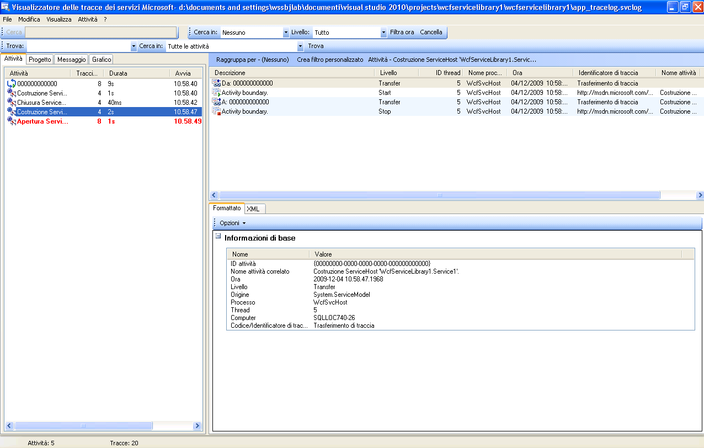
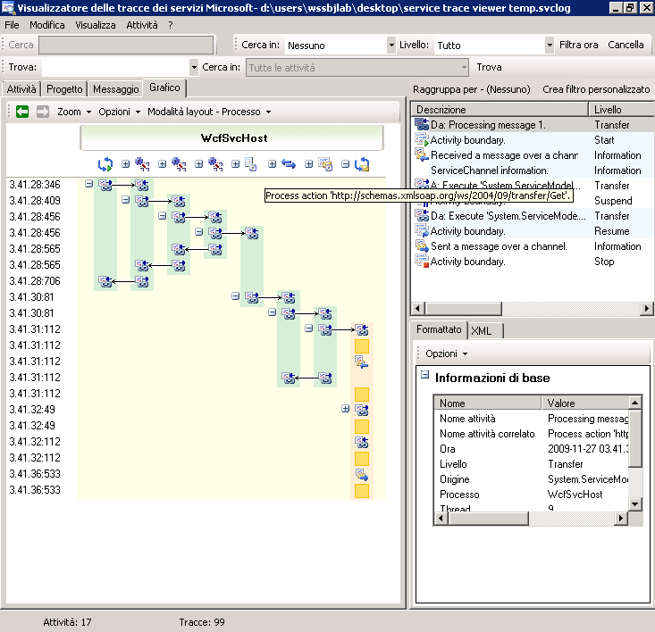
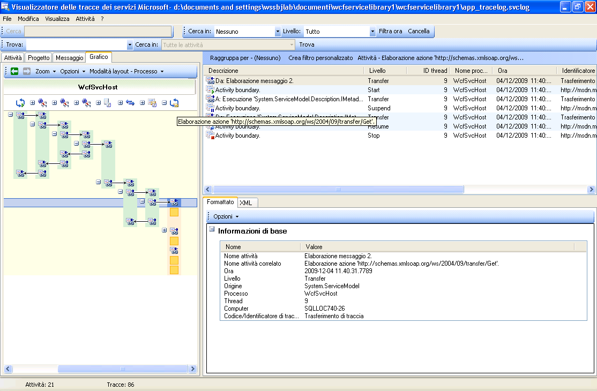
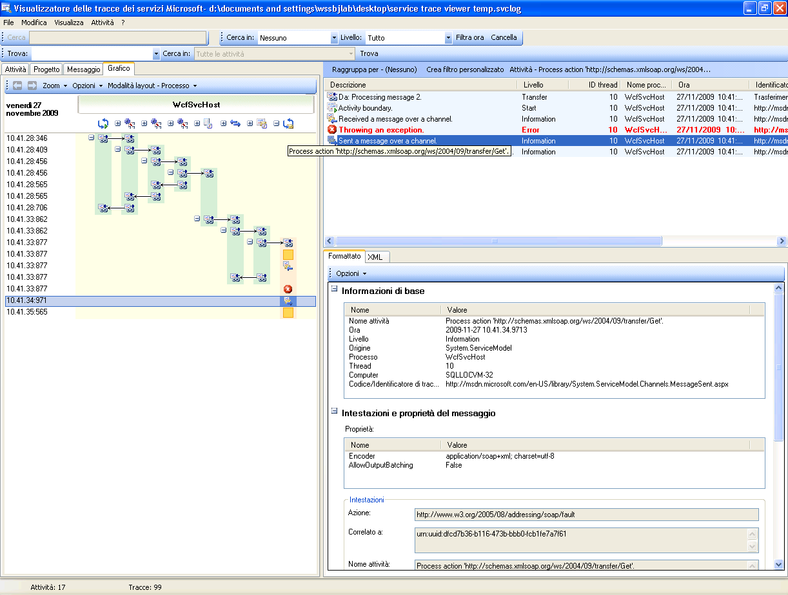
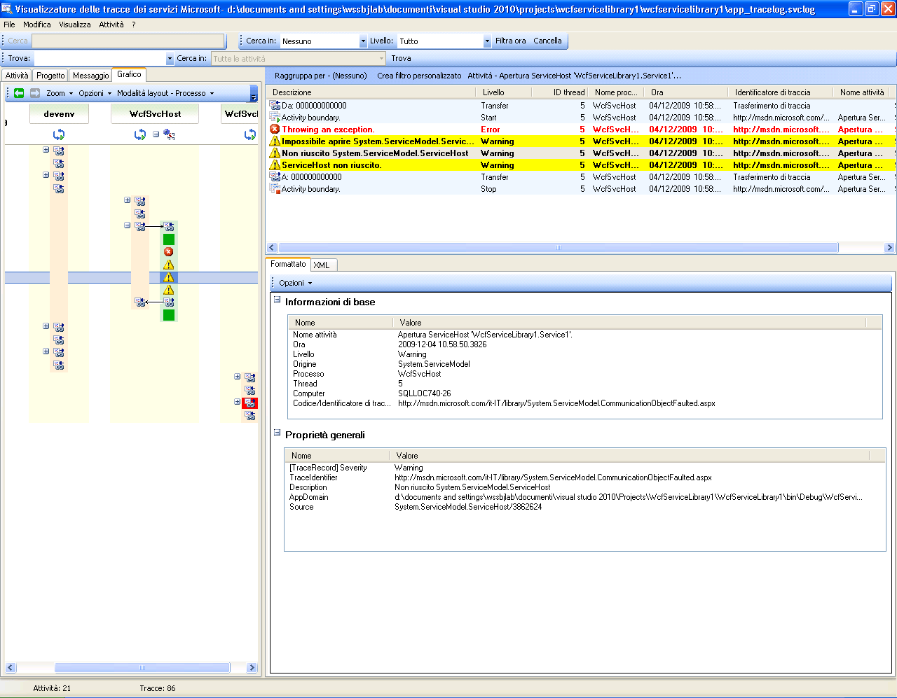
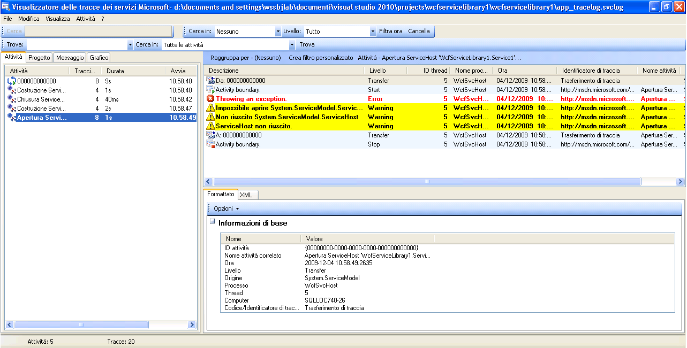

# Utilizzo di Service Trace Viewer per la visualizzazione di tracce correlate e risoluzione dei problemi
In questo argomento viene illustrato il formato dei dati di traccia, come visualizzarlo e gli approcci che usano Service Trace Viewer per risolvere i problemi dell'applicazione.  
  
## Uso dello strumento Visualizzatore di tracce dei servizi  
 Lo strumento Service Trace Viewer di [!INCLUDE[indigo1](../../../../../includes/indigo1-md.md)] aiuta a correlare le tracce di diagnostica prodotte dai listener [!INCLUDE[indigo2](../../../../../includes/indigo2-md.md)] per individuare la causa principale di un errore.  Questo strumento consente di visualizzare, raggruppare e filtrare facilmente le tracce per diagnosticare, riparare e verificare i problemi dei servizi [!INCLUDE[indigo2](../../../../../includes/indigo2-md.md)].  Per altre informazioni sull'uso di questo strumento, vedere [Strumento Visualizzatore di tracce dei servizi \(SvcTraceViewer.exe\)](../../../../../docs/framework/wcf/service-trace-viewer-tool-svctraceviewer-exe.md).  
  
 In questo argomento sono riportate le schermate relative alle tracce generate eseguendo l'esempio [Traccia e registrazione dei messaggi](../../../../../docs/framework/wcf/samples/tracing-and-message-logging.md), in caso di visualizzazione con lo strumento [Strumento Visualizzatore di tracce dei servizi \(SvcTraceViewer.exe\)](../../../../../docs/framework/wcf/service-trace-viewer-tool-svctraceviewer-exe.md).  In questo argomento viene dimostrato come capire il contenuto della traccia, le attività e la loro correlazione e come analizzare moltissime tracce in caso di risoluzione dei problemi.  
  
## Visualizzazione del contenuto di una traccia  
 Un evento traccia contiene le seguenti informazioni più significative:  
  
-   Nome dell'attività quando impostato.  
  
-   Ora di emissione.  
  
-   Livello di traccia.  
  
-   Nome dell'origine di traccia.  
  
-   Nome processo.  
  
-   ID thread.  
  
-   Un identificatore di traccia univoco, ovvero un URL che punta a una destinazione nella libreria MSDN in linea, dalla quale è possibile ottenere più informazioni relative alla traccia.  
  
 Tutte queste informazioni sono visualizzate nel riquadro in alto a destra in Service Trace Viewer o nella sezione **Informazioni di base** nella visualizzazione formattata del riquadro in basso a destra, quando viene selezionata una traccia.  
  
> [!NOTE]
>  Se il client e il servizio si trovano nello stesso computer, saranno presenti le tracce per entrambe le applicazioni.  Tali tracce possono essere filtrate tramite la colonna **Nome processo**.  
  
 La visualizzazione formattata fornisce inoltre anche una descrizione per la traccia e ulteriori informazioni dettagliate quando disponibili.  Le informazioni possono includere il tipo di eccezione e il messaggio, gli stack di chiamate, l'azione del messaggio, i campi da\/a e altre informazioni sull'eccezione.  
  
 Nella visualizzazione XML, i tag xml utili includono gli elementi seguenti:  
  
-   \<SubType\> \(livello di traccia\).  
  
-   \<TimeCreated\>.  
  
-   \<Source\> \(nome dell'origine di traccia\).  
  
-   \<Correlation\> \(ID attività impostato quando viene emessa la traccia\).  
  
-   \<Execution\> \(processo e ID thread\).  
  
-   \<Computer\>.  
  
-   \<ExtendedData\>, inclusi \<Action\>, \<MessageID\> e \<ActivityId\> impostati nell'intestazione del messaggio al momento di inviare un messaggio.  
  
 Se si esamina la traccia "Messaggio inviato tramite canale", è possibile vedere il contenuto seguente.  
  
```  
<E2ETraceEvent xmlns="http://schemas.microsoft.com/2004/06/E2ETraceEvent">  
   <System xmlns="http://schemas.microsoft.com/2004/06/windows/eventlog/system">  
      <EventID>262163</EventID>  
      <Type>3</Type>  
      <SubType Name="Information">0</SubType>  
      <Level>8</Level>  
      <TimeCreated SystemTime="2006-08-04T18:45:30.8491051Z" />  
      <Source Name="System.ServiceModel" />  
       <Correlation ActivityID="{27c6331d-8998-43aa-a382-03239013a6bd}"/>  
       <Execution ProcessName="client" ProcessID="1808" ThreadID="1" />  
       <Channel />  
       <Computer>TEST1</Computer>  
   </System>  
   <ApplicationData>  
       <TraceData>  
          <DataItem>  
             <TraceRecord xmlns="http://schemas.microsoft.com/2004/10/E2ETraceEvent/TraceRecord" Severity="Information">  
                 <TraceIdentifier>http://msdn.microsoft.com/library/System.ServiceModel.Channels.MessageSent.aspx</TraceIdentifier>  
                 <Description>Sent a message over a channel.</Description>  
                 <AppDomain>client.exe</AppDomain>  
                 <Source>System.ServiceModel.Channels.ClientFramingDuplexSessionChannel/35191196</Source>  
                <ExtendedData xmlns="http://schemas.microsoft.com/2006/08/ServiceModel/MessageTransmitTraceRecord">  
  
                  <MessageProperties>  
                     <AllowOutputBatching>False</AllowOutputBatching>  
                  </MessageProperties>  
                  <MessageHeaders>  
                     <Action d4p1:mustUnderstand="1" xmlns:d4p1="http://www.w3.org/2003/05/soap-envelope" xmlns="http://www.w3.org/2005/08/addressing">http://Microsoft.ServiceModel.Samples/ICalculator/Multiply</Action>  
                     <MessageID xmlns="http://www.w3.org/2005/08/addressing">urn:uuid:7c6670d8-4c9c-496e-b6a0-2ceb6db35338</MessageID>  
                     <ActivityId CorrelationId="b02e2189-0816-4387-980c-dd8e306440f5" xmlns="http://schemas.microsoft.com/2004/09/ServiceModel/Diagnostics">27c6331d-8998-43aa-a382-03239013a6bd</ActivityId>  
                     <ReplyTo xmlns="http://www.w3.org/2005/08/addressing">  
                        <Address>http://www.w3.org/2005/08/addressing/anonymous</Address>  
                    </ReplyTo>  
                    <To d4p1:mustUnderstand="1" xmlns:d4p1="http://www.w3.org/2003/05/soap-envelope" xmlns="http://www.w3.org/2005/08/addressing">net.tcp://localhost/servicemodelsamples/service</To>  
                  </MessageHeaders>  
                  <RemoteAddress>net.tcp://localhost/servicemodelsamples/service</RemoteAddress>  
                </ExtendedData>  
            </TraceRecord>  
          </DataItem>  
       </TraceData>  
   </ApplicationData>  
</E2ETraceEvent>  
```  
  
## Traccia E2E ServiceModel  
 Quando l'origine di traccia `System.ServiceModel` è impostata con un `switchValue` diverso da Off e `ActivityTracing`, [!INCLUDE[indigo2](../../../../../includes/indigo2-md.md)] crea attività e trasferimenti per l'elaborazione [!INCLUDE[indigo2](../../../../../includes/indigo2-md.md)].  
  
 Un'attività è un'unità logica di elaborazione che raggruppa tutte le tracce relative a quell'unità di elaborazione.  È possibile definire, ad esempio, un'attività per ogni richiesta.  I trasferimenti creano una relazione causale tra le attività all'interno di endpoint.  La propagazione dell'ID attività consente di correlare le attività attraverso gli endpoint.  A tale fine, impostare `propagateActivity`\=`true` nella configurazione su ogni endpoint.  Attività, trasferimenti e propagazione consentono di eseguire la correlazione degli errori.  In questo modo è possibile individuare più rapidamente la causa fondamentale di un errore.  
  
 Nel client viene creata un'attività [!INCLUDE[indigo2](../../../../../includes/indigo2-md.md)] per ogni chiamata al modello oggetto \(ad esempio apertura di ChannelFactory, addizione, divisione e così via\). Ogni chiamata dell'operazione viene elaborata in un'attività "Elaborazione azione".  
  
 Nella schermata seguente, tratta dall'esempio [Traccia e registrazione dei messaggi](../../../../../docs/framework/wcf/samples/tracing-and-message-logging.md), nel riquadro di sinistra è visualizzato l'elenco delle attività create nel processo client, ordinate in base all'ora di creazione.  Di seguito è riportato un elenco cronologico delle attività:  
  
-   È stata costruita la channel factory \(ClientBase\).  
  
-   È stata aperta la channel factory.  
  
-   È stata elaborata l'azione di addizione.  
  
-   È stata impostata la sessione di sicurezza \(questo si è VERIFICATO alla prima richiesta\) e sono stati elaborati tre messaggi di risposta dell'infrastruttura di sicurezza: RST, RSTR, SCT \(elaborazione messaggio 1, 2, 3\).  
  
-   Sono state elaborate le richieste di sottrazione, moltiplicazione e divisione.  
  
-   È stata chiusa la channel factory e, così facendo, è stata chiusa la sessione di sicurezza ed è stata elaborata la risposta del messaggio di sicurezza di annullamento.  
  
 La visualizzazione dei messaggi dell'infrastruttura di sicurezza è resa possibile da wsHttpBinding.  
  
> [!NOTE]
>  In [!INCLUDE[indigo2](../../../../../includes/indigo2-md.md)], i messaggi di risposta elaborati inizialmente vengono riportati in un'attività separata \(elaborazione messaggio\), quindi vengono correlati all'attività Elaborazione azione corrispondente che include il messaggio di richiesta, tramite un trasferimento.  Ciò vale per i messaggi dell'infrastruttura e le richieste asincrone ed è dovuto al fatto che è necessario ispezionare il messaggio, leggere l'intestazione activityId e identificare l'attività Elaborazione azione esistente con quell'ID per correlarla ad esso.  Per le richieste sincrone, viene bloccata la risposta e pertanto viene riconosciuta a quale Elaborazione azione è correlata la risposta.  
  
   
Elenco delle attività client WCF in base all'ora di creazione \(riquadro sinistro\) e alle relative tracce e attività annidate \(riquadro superiore destro\)  
  
 Quando si seleziona un'attività nel riquadro sinistro, le tracce e le attività annidate compaiono nel riquadro in alto a destra.  Questa è pertanto una visualizzazione gerarchica ridotta dell'elenco delle attività sulla sinistra, basato sull'attività padre selezionata.  Dato che l'Elaborazione azione di aggiunta è la prima richiesta fatta, questa attività contiene l'attività Impostazione sessione di sicurezza \(trasferimento a, trasferimento da\) e le tracce per l'elaborazione effettiva dell'azione di aggiunta.  
  
 Se si fa doppio clic sull'attività di aggiunta di Elaborazione azione nel pannello sinistro, è possibile visualizzare una rappresentazione grafica delle attività [!INCLUDE[indigo2](../../../../../includes/indigo2-md.md)] del client pertinenti.  La prima attività sulla sinistra è l'attività radice \(0000\), che è l'attività predefinita.  [!INCLUDE[indigo2](../../../../../includes/indigo2-md.md)] effettua il trasferimento all'esterno dell'attività di ambiente.  Se questa non è definita, [!INCLUDE[indigo2](../../../../../includes/indigo2-md.md)] trasferisce fuori da 0000.  Qui, la seconda attività, Add di Elaborazione azione, viene trasferita fuori da 0.  Quindi si vede l'attività di impostazione della sessione di sicurezza.  
  
   
Visualizzazione grafica delle attività client WCF: Attività di ambiente \(qui 0\), Elaborazione azione e Impostazione sessione di sicurezza  
  
 Nel riquadro in alto a destra, è possibile vedere tutte le tracce relative all'attività Add di Elaborazione azione.  In particolare, è stato inviato il messaggio di richiesta \("Messaggio inviato tramite canale"\) ed è stata ricevuta la risposta \("Ricevuto un messaggio tramite canale"\) nella stessa attività,  come illustrato nel grafico seguente.  Per maggiore chiarezza, nel grafico l'attività Impostazione sessione di sicurezza è compressa.  
  
   
Elenco di tracce per l'attività Elaborazione azione: nella stessa attività viene inviata la richiesta e viene ricevuta la risposta.  
  
 Qui, le tracce del client vengono caricate solo a fini di chiarezza, ma nella stessa attività vengono visualizzate le tracce del servizio \(il messaggio di richiesta ricevuto e il messaggio di risposta inviato\) se sono caricate anche nello strumento e se `propagateActivity` è stato impostato su `true.` Questa situazione viene illustrata in una figura seguente.  
  
 Nel servizio, il modello di attività esegue il mapping ai concetti [!INCLUDE[indigo2](../../../../../includes/indigo2-md.md)] come segue:  
  
1.  Viene costruito e aperto un ServiceHost \(ciò può creare diverse attività correlate all'host, ad esempio, nel caso della protezione\).  
  
2.  Viene creata un'attività di ascolto per ogni listener in ServiceHost \(con trasferimenti dentro e fuori da Apertura ServiceHost\).  
  
3.  Quando il listener rileva una richiesta di comunicazione iniziata dal client, la trasferisce a un'attività "Ricezione byte", nella quale vengono elaborati tutti i byte inviati dal client.  In questa attività, è possibile vedere qualsiasi errore di connessione che si sia verificato durante l'interazione tra client e servizio.  
  
4.  Ogni set di byte ricevuto che corrisponde a un messaggio, viene elaborato in un'attività "Elaborazione messaggio", in cui viene creato l'oggetto Messaggio [!INCLUDE[indigo2](../../../../../includes/indigo2-md.md)].  In questa attività vengono visualizzati gli errori correlati a una envelope errata o a un messaggio in formato non valido.  
  
5.  Quando il messaggio è formato, viene trasferito a un'attività Elaborazione azione.  Se `propagateActivity` è impostato su `true` sia nel client che nel servizio, l'ID di questa attività è identico a quello definito nel client e descritto in precedenza.  A partire da questa fase si inizia a beneficiare della correlazione diretta tra gli endpoint, perché tutte le tracce emesse in [!INCLUDE[indigo2](../../../../../includes/indigo2-md.md)] correlate alla richiesta si trovano in quella stessa attività, inclusa l'elaborazione del messaggio di risposta.  
  
6.  Per l'azione out\-of\-process, viene creata un'attività di esecuzione codice utente per isolare le tracce emesse nel codice utente da quelle emesse in [!INCLUDE[indigo2](../../../../../includes/indigo2-md.md)].  Nell'esempio precedente, la traccia "Il servizio invia la risposta Add" viene emessa nell'attività "Esecuzione codice utente" non nell'attività propagata dal client, se applicabile.  
  
 Nella figura seguente, la prima attività sulla sinistra è l'attività radice \(0000\), ed è l'attività predefinita.  Le tre attività seguenti interessano l'apertura di ServiceHost.  L'attività nella colonna 5 è il listener e le attività rimanenti \(da 6 a 8\) descrivono l'elaborazione WCF di un messaggio, dall'elaborazione dei byte all'attivazione del codice utente.  
  
   
Elenco delle attività del servizio WCF  
  
 Nella schermata seguente vengono illustrate le attività sia per il client che per il servizio e viene evidenziata l'attività Add di Elaborazione azione nei processi \(arancione\).  Le frecce indicano i messaggi di richiesta e di risposta inviati e ricevuti dal client e dal servizio.  Le tracce di Elaborazione azione sono separate nei processi nel grafico, ma sono riportate come parte della stessa attività nel riquadro in alto a destra.  In questo riquadro è possibile vedere le tracce del client per i messaggi inviati, seguite dalle tracce del servizio per i messaggi ricevuti ed elaborati.  
  
   
Visualizzazione grafica delle attività di client e servizio WCF  
  
 Nello scenario di errore seguente, le tracce di errore e di avviso nel servizio e nel client sono correlate.  Un'eccezione viene generata prima nel codice utente nel servizio \(attività verde più a destra che include una traccia di avviso per l'eccezione relativa all'impossibilità per il servizio di elaborare la richiesta nel codice utente\).  Quando la risposta viene inviata al client, viene emessa di nuovo una traccia di avviso per indicare il messaggio di errore \(attività rosa a sinistra\).  Il client chiude quindi il proprio client WCF \(attività gialla in basso a sinistra\), causando l'interruzione della connessione al servizio.  Il servizio genera un errore \(attività rosa più lunga a destra\).  
  
   
Correlazione dell'errore tra il servizio e il client  
  
 L'esempio usato per generare queste tracce è una serie di richieste sincrone tramite wsHttpBinding.  Il grafico si presenta diversamente in caso di scenari senza protezione o con richieste asincrone, in cui l'attività Elaborazione azione include le operazioni di inizio e fine che costituiscono la chiamata asincrona e mostra i trasferimenti a un'attività di callback.  Per altre informazioni sugli scenari aggiuntivi, vedere [Scenari di analisi end\-to\-end](../../../../../docs/framework/wcf/diagnostics/tracing/end-to-end-tracing-scenarios.md).  
  
## Risoluzione dei problemi tramite Service Trace Viewer  
 Quando si caricano file di traccia nello strumento Servize Trace Viewer, è possibile selezionare qualsiasi attività rossa o gialla nel riquadro di sinistra per individuare la causa di un problema nell'applicazione.  L'attività 000 in genere ha eccezioni non gestite che vengono visualizzate all'utente.  
  
   
Selezione dell'attività rossa o gialla per individuare la causa di un problema  
  
 Nel riquadro in alto a destra, è possibile esaminare le tracce per l'attività selezionata nel riquadro di sinistra.  È quindi possibile esaminare le tracce rosse o gialle in quel riquadro e vedere come sono correlate.  Nel grafico precedente, le tracce di avviso sia per il client che per il servizio sono riportate nella stessa attività Elaborazione azione.  
  
 Se queste tracce non forniscono la causa principale dell'errore, è possibile usare il grafico facendo doppio clic sull'attività selezionata nel riquadro di sinistra \(qui Elaborazione azione\).  Viene quindi visualizzato il grafico con attività correlate.  A questo punto, è possibile espandere le attività correlate \(facendo clic sul segno "\+"\) per trovare la prima traccia emessa in rosso o giallo in un'attività correlata.  Continuare a espandere le attività che si verificano subito prima della traccia rossa o gialla di interesse, seguendo i trasferimenti alle attività correlate o il flusso dei messaggi tra gli endpoint, fino a individuare la causa principale del problema.  
  
   
Espansione delle attività per individuare la causa principale di un problema  
  
 Se `ActivityTracing` di ServiceModel è disattivata, ma la traccia di ServiceModel è attiva, è possibile visualizzare le tracce di ServiceModel emesse nell'attività 0000.  In questo caso, tuttavia, è richiesto un maggior impegno per comprendere la correlazione di queste tracce.  
  
 Se Registrazione messaggi è attivata, è possibile usare la scheda Messaggio per vedere qual è il messaggio su cui influisce l'errore.  Facendo doppio clic su un messaggio in rosso o in giallo, è possibile visualizzare la rappresentazione grafica delle attività correlate.  Queste attività sono quelle più strettamente legate alla richiesta in cui si è verificato un errore.  
  
   
Per iniziare la risoluzione dei problemi, è anche possibile scegliere una traccia dei messaggi rossa o gialla e fare doppio clic su di essa per individuare la causa principale  
  
## Vedere anche  
 [Scenari di analisi end\-to\-end](../../../../../docs/framework/wcf/diagnostics/tracing/end-to-end-tracing-scenarios.md)   
 [Strumento Visualizzatore di tracce dei servizi \(SvcTraceViewer.exe\)](../../../../../docs/framework/wcf/service-trace-viewer-tool-svctraceviewer-exe.md)   
 [Traccia](../../../../../docs/framework/wcf/diagnostics/tracing/index.md)