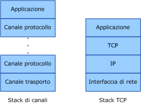
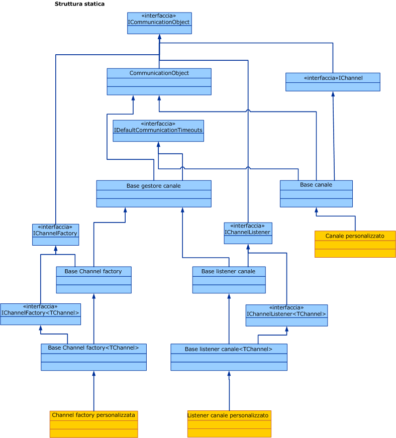

# Panoramica sul modello dei canali
Lo stack dei canali di [!INCLUDE[indigo1](../../../../includes/indigo1-md.md)] è uno stack di comunicazione su più livelli con uno o più canali che elaborano i messaggi.Nella parte inferiore dello stack è presente un canale di trasporto che è responsabile dell'adattamento dello stack dei canali al trasporto sottostante \(ad esempio TCP, HTTP, SMTP e altri tipi di trasporto.\).I canali forniscono un modello di programmazione di basso livello per l'invio e la ricezione di messaggi.Questo modello di programmazione si basa su varie interfacce e altri tipi noti collettivamente come modello dei canali [!INCLUDE[indigo2](../../../../includes/indigo2-md.md)].In questo argomento vengono illustrate le forme del canale, la costruzione di un listener del canale di base \(sul servizio\) e di una channel factory \(sul client\).  
  
## Stack dei canali  
 Gli endpoint [!INCLUDE[indigo2](../../../../includes/indigo2-md.md)] comunicano con il mondo esterno utilizzando uno stack di comunicazione chiamato stack dei canali.Nel diagramma seguente lo stack dei canali viene messo a confronto con altri stack di comunicazione, ad esempio TCP\/IP.  
  
   
  
 Innanzitutto, le analogie: in entrambi i casi, ogni livello dello stack fornisce un'astrazione del mondo al di sotto di esso ed espone tale astrazione solo al livello direttamente superiore.Ogni livello utilizza l'astrazione del solo livello direttamente inferiore.In entrambi casi, quando due stack comunicano, ogni livello comunica con il livello corrispondente dell'altro stack; ad esempio, il livello IP comunica con il livello IP e il livello TCP con il livello TCP e così via.  
  
 Ora, le differenze: mentre lo stack TCP è progettato per fornire un'astrazione della rete fisica, lo stack dei canali è progettato per fornire un'astrazione non solo della modalità di recapito del messaggio, ovvero il trasporto, ma anche di altre funzionalità, ad esempio ciò che è contenuto nel messaggio o il protocollo utilizzato per la comunicazione, incluso il trasporto ma anche molto altro ancora.Ad esempio, l'elemento di associazione di una sessione affidabile fa parte dello stack dei canali ma non è al di sotto del trasporto o il trasporto stesso.Questa astrazione viene realizzata richiedendo al canale più in basso nello stack di adattare il protocollo di trasporto sottostante all'architettura dello stack dei canali e quindi affidandosi ai canali di livello superiore per fornire funzionalità di comunicazione quali le garanzie di affidabilità e la protezione.  
  
 I messaggi attraversano lo stack di comunicazione come oggetti <xref:System.ServiceModel.Channels.Message>.Come illustrato nella figura precedente, il canale più in basso è detto canale di trasporto.Tale canale è responsabile dell'invio e della ricezione di messaggi da e verso altre partie questo include la responsabilità di trasformare l'oggetto <xref:System.ServiceModel.Channels.Message> a da e verso il formato utilizzato per comunicare con le altre parti.Al di sopra del canale di trasporto possono essere presenti più canali di protocollo, ognuno responsabile di fornire una funzione di comunicazione, ad esempio le garanzie di recapito affidabile.I canali di protocollo operano sui messaggi che li attraversano sotto forma di oggetti <xref:System.ServiceModel.Channels.Message>.Solitamente trasformano il messaggio, ad esempio, aggiungendo intestazioni o crittografando il corpo, oppure inviano e ricevono propri messaggi di controllo di protocollo, ad esempio messaggi di conferma di ricezione.  
  
## Forme del canale  
 Ogni canale implementa una o più interfacce definite interfacce di forma del canale o forme del canale.Tali forme forniscono i metodi orientati alla comunicazione, ad esempio invio e ricezione o richiesta e risposta, implementati dal canale e chiamati dall'utente del canale.Alla base delle forme del canale è l'interfaccia <xref:System.ServiceModel.Channels.IChannel>, che fornisce un metodo `GetProperty`\<T\> utilizzato come meccanismo su più livelli per accedere a funzionalità arbitrarie esposte dai canali nello stack.Le cinque forme del canale che estendono <xref:System.ServiceModel.Channels.IChannel> sono:  
  
-   <xref:System.ServiceModel.Channels.IInputChannel>  
  
-   <xref:System.ServiceModel.Channels.IOutputChannel>  
  
-   <xref:System.ServiceModel.Channels.IRequestChannel>  
  
-   <xref:System.ServiceModel.Channels.IReplyChannel>  
  
-   <xref:System.ServiceModel.Channels.IDuplexChannel>  
  
 Ognuna di queste forme dispone inoltre di un equivalente che estende <xref:System.ServiceModel.Channels.ISessionChannel%601?displayProperty=fullName> per supportare le sessioni.Queste sono:  
  
-   <xref:System.ServiceModel.Channels.IInputSessionChannel>  
  
-   <xref:System.ServiceModel.Channels.IOutputSessionChannel>  
  
-   <xref:System.ServiceModel.Channels.IRequestSessionChannel>  
  
-   <xref:System.ServiceModel.Channels.IReplySessionChannel>  
  
-   <xref:System.ServiceModel.Channels.IDuplexSessionChannel>  
  
 Le forme del canale sono basate su alcuni dei modelli di scambio di messaggi fondamentali supportati dai protocolli di trasporto esistenti.Ad esempio, la messaggistica unidirezionale corrisponde a una coppia <xref:System.ServiceModel.Channels.IInputChannel>\/<xref:System.ServiceModel.Channels.IOutputChannel>, request\-reply corrisponde alle coppie <xref:System.ServiceModel.Channels.IRequestChannel>\/<xref:System.ServiceModel.Channels.IReplyChannel> e le comunicazioni duplex bidirezionali corrispondono a <xref:System.ServiceModel.Channels.IDuplexChannel> \(che estende <xref:System.ServiceModel.Channels.IInputChannel> e <xref:System.ServiceModel.Channels.IOutputChannel>\).  
  
## Programmazione con lo stack dei canali  
 Gli stack dei canali vengono in genere creati utilizzando un modello factory in cui un'associazione crea lo stack dei canali.Sul lato di invio, viene utilizzata un'associazione per creare una classe <xref:System.ServiceModel.ChannelFactory>, che a sua volta crea uno stack dei canali e restituisce un riferimento al canale superiore nello stack.L'applicazione può quindi utilizzare questo canale per inviare i messaggi.Per ulteriori informazioni, vedere [Programmazione a livello di canale client](../../../../docs/framework/wcf/extending/client-channel-level-programming.md).  
  
 Sul lato ricevente, viene utilizzata un'associazione per creare un'interfaccia <xref:System.ServiceModel.Channels.IChannelListener> che resta in ascolto dei messaggi in ingresso.L'interfaccia <xref:System.ServiceModel.Channels.IChannelListener> fornisce i messaggi all'applicazione in ascolto creando stack di canali e passando il riferimento all'applicazione al canale superiore.L'applicazione utilizza quindi questo canale per ricevere i messaggi in ingresso.Per ulteriori informazioni, vedere [Programmazione client a livello di canale](../../../../docs/framework/wcf/extending/service-channel-level-programming.md).  
  
## Il modello a oggetti dei canali  
 Il modello a oggetti dei canali costituisce il set principale di interfacce necessario per implementare canali, listener di canale e channel factory.Sono inoltre disponibili alcune classi di base fornite per semplificare le implementazioni personalizzate.  
  
 I listener di canale sono responsabili dell'ascolto dei messaggi in ingresso e quindi del loro recapito al livello superiore attraverso canali creati dai listener stessi.  
  
 Le channel factory sono responsabili della creazione dei canali utilizzati per l'invio dei messaggi e della chiusura di tutti i canali creati quando vengono chiuse.  
  
 <xref:System.ServiceModel.ICommunicationObject> è l'interfaccia principale che definisce la macchina a stati di base implementata da tutti gli oggetti di comunicazione.<xref:System.ServiceModel.Channels.CommunicationObject> fornisce un'implementazione di tale interfaccia principale da cui è possibile derivare altre classi del canale anziché implementare nuovamente l'interfaccia.Questa operazione non è tuttavia obbligatoria: un canale personalizzato può implementare direttamente <xref:System.ServiceModel.ICommunicationObject> e non ereditare da <xref:System.ServiceModel.Channels.CommunicationObject>.Nessuna delle classi della Figura 3 viene considerata parte del modello dei canali; esse sono helper disponibili per gli implementatori di canali personalizzati che desiderano creare canali.  
  
   
  
 Negli argomenti seguenti vengono illustrati il modello a oggetti dei canali e varie aree di sviluppo che facilitano la creazione di canali personalizzati.  
  
|Argomento|Descrizione|  
|---------------|-----------------|  
|[Servizio: listener del canale e canali](../../../../docs/framework/wcf/extending/service-channel-listeners-and-channels.md)|Descrive i listener di canale in ascolto di canali in ingresso in un'applicazione di servizio.|  
|[Client: channel factory e canali](../../../../docs/framework/wcf/extending/client-channel-factories-and-channels.md)|Descrive le channel factory che creano canali per la connessione a un'applicazione di servizio.|  
|[Informazioni sui cambiamenti di stato](../../../../docs/framework/wcf/extending/understanding-state-changes.md)|Descrive come l'interfaccia <xref:System.ServiceModel.ICommunicationObject?displayProperty=fullName> modella le modifiche dello stato nei canali.|  
|[Scelta di un modello di scambio dei messaggi](../../../../docs/framework/wcf/extending/choosing-a-message-exchange-pattern.md)|Descrive i sei modelli base di scambio dei messaggi supportati dai canali.|  
|[Gestione di eccezioni ed errori](../../../../docs/framework/wcf/extending/handling-exceptions-and-faults.md)|Descrive come gestire errori ed eccezioni nei canali personalizzati.|  
|[Supporto di configurazione e metadati](../../../../docs/framework/wcf/extending/configuration-and-metadata-support.md)|Descrive come supportare l'utilizzo di canali personalizzati dal modello dell'applicazione e come esportare e importare metadati utilizzando associazioni ed elementi di associazione.|