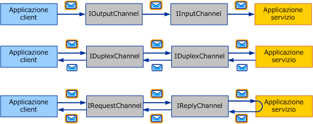
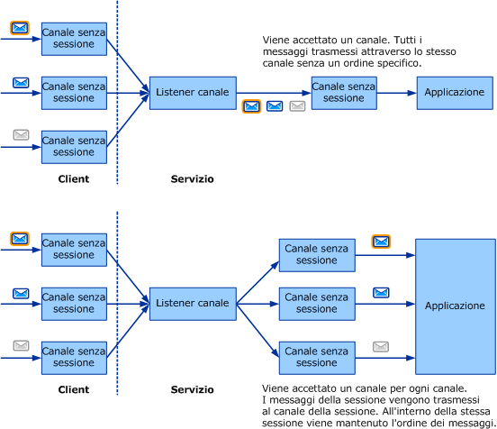

# Scelta di un modello di scambio dei messaggi
Per scrivere un trasporto personalizzato, è necessario innanzitutto stabilire quali *modelli di scambio dei messaggi* \(o MEP, Message Exchange Pattern\) sono necessari per il canale da sviluppare.In questo argomento vengono descritte le opzioni disponibili e vengono illustrati i vari requisiti.Si tratta della prima attività di sviluppo di un canale contenuta nell'elenco riportato in [Sviluppo di canali](../../../../docs/framework/wcf/extending/developing-channels.md).  
  
## Sei modelli di scambio dei messaggi  
 Sono disponibili tre modelli di scambio dei messaggi:  
  
-   Datagramma \(<xref:System.ServiceModel.Channels.IInputChannel> e <xref:System.ServiceModel.Channels.IOutputChannel>\)  
  
     Quando si utilizza un modello datagramma, un client invia un messaggio utilizzando uno scambio di tipo *fire and forget*.Tale scambio richiede una conferma fuori banda di recapito con esito positivo.Il messaggio potrebbe infatti andare perso durante il transito e non raggiungere mai il servizio.Se l'operazione di invio viene completata correttamente sul lato client, non c'è garanzia che l'endpoint remoto abbia ricevuto il messaggio.Il datagramma è un componente fondamentale per i messaggi, poiché sulla sua base è possibile compilare protocolli propri, tra cui protocolli affidabili e protocolli sicuri.I canali del datagramma del client implementano l'interfaccia <xref:System.ServiceModel.Channels.IOutputChannel>, mentre i canali del datagramma del servizio implementano l'interfaccia <xref:System.ServiceModel.Channels.IInputChannel>.  
  
-   Richiesta\-risposta \(<xref:System.ServiceModel.Channels.IRequestChannel> e <xref:System.ServiceModel.Channels.IReplyChannel>\)  
  
     In questo modello di scambio, viene inviato un messaggio e viene ricevuta una risposta.Il modello è costituito da coppie richiesta\-risposta.Esempi di chiamate richiesta\-risposta sono le chiamate RPC \(Remote Procedure Call, chiamata a procedura remota\) e le richieste GET del browser.Questo modello è anche noto come half\-duplex.In tale modello, i canali client implementano l'interfaccia <xref:System.ServiceModel.Channels.IRequestChannel>, mentre i canali del servizio implementano l'interfaccia <xref:System.ServiceModel.Channels.IReplyChannel>.  
  
-   Duplex \(<xref:System.ServiceModel.Channels.IDuplexChannel>\)  
  
     Il modello di scambio duplex consente l'invio di un numero arbitrario di messaggi da parte di un client e la ricezione in qualsiasi ordine.Tale modello è simile a una conversazione telefonica, in cui ogni parola pronunciata è un messaggio.Poiché in questo modello i due lati possono entrambi inviare e ricevere messaggi, l'interfaccia implementata dai canali client e del servizio è <xref:System.ServiceModel.Channels.IDuplexChannel>.  
  
   
I tre modelli di scambio dei messaggi di base.Dall'alto verso il basso: datagramma, richiesta\-risposta e duplex.  
  
 Ognuno di questi modelli può inoltre supportare *sessioni*.Una sessione \(e un'implementazione di <xref:System.ServiceModel.Channels.ISessionChannel%601?displayProperty=fullName> di tipo <xref:System.ServiceModel.Channels.ISession?displayProperty=fullName>\) mette in correlazione tutti i messaggi inviati e ricevuti su un canale.Il modello richiesta\-risposta è una sessione autonoma a due messaggi, poiché la richiesta e la risposta sono correlate.Il modello richiesta\-risposta che supporta sessioni implica invece che tutte le coppie richiesta\/risposta sul canale siano correlate le une con le altre.È quindi possibile scegliere fra un totale di sei modelli di scambio dei messaggi:  
  
-   Datagramma  
  
-   Richiesta\-risposta  
  
-   Duplex  
  
-   Datagramma con sessioni  
  
-   Richiesta\-risposta con sessioni  
  
-   Duplex con sessioni  
  
> [!NOTE]
>  Per il trasporto UDP, l'unico modello di scambio dei messaggi supportato è il datagramma, poiché il protocollo UPD è di tipo fire and forget.  
  
## Sessioni e canali con sessione  
 Nel campo delle reti, esistono protocolli orientati alla connessione, ad esempio il protocollo TCP, e protocolli senza connessione, ad esempio il protocollo UPD.In [!INCLUDE[indigo2](../../../../includes/indigo2-md.md)] il termine sessione viene utilizzato per indicare un'astrazione logica simile a una connessione.I protocolli WCF con sessione sono simili ai protocolli di rete orientati alla connessione, mentre i protocolli WCF senza sessione sono simili ai protocolli di rete senza connessione.  
  
 Nel modello a oggetti dei canali, ogni sessione logica si manifesta come un'istanza di un canale con sessione.Ogni nuova sessione creata dal client e accettata nel servizio corrisponde pertanto a un nuovo canale con sessione su ciascun lato.Nel diagramma seguente viene illustrata, nella parte superiore, la struttura dei canali senza sessione e, nella parte inferiore, la struttura dei canali con sessione.  
  
   
  
 Un client crea un nuovo canale con sessione e invia un messaggio.Sul lato del servizio, il listener del canale riceve il messaggio e ne rileva l'appartenenza a una nuova sessione, crea quindi un nuovo canale con sessione e lo passa all'applicazione \(in risposta alla chiamata dell'applicazione AcceptChannel sul listener del canale\).L'applicazione riceve quindi il messaggio e tutti i messaggi successivi inviati nella stessa sessione attraverso lo stesso canale con sessione.  
  
 Un altro \(o lo stesso\) client crea un nuovo canale con sessione e invia un messaggio.Il listener del canale rileva che il messaggio è in una nuova sessione e crea un nuovo canale con sessione e il processo si ripete.  
  
 Senza sessioni, non esiste alcuna correlazione tra i canali e le sessioni.Un listener del canale crea pertanto un solo canale tramite il quale tutti i messaggi ricevuti vengono recapitati all'applicazione.Non esiste inoltre alcun ordinamento dei messaggi, poiché non esiste alcuna sessione al cui interno mantenere l'ordine dei messaggi.Nella parte superiore dell'immagine precedente viene illustrato uno scambio di messaggi senza sessione.  
  
## Avvio e terminazione di sessioni  
 Le sessioni vengono avviate sul client mediante la creazione di un nuovo canale con sessionee vengono avviate sul servizio quando il servizio riceve un messaggio inviato in una nuova sessione.Analogamente, le sessioni vengono terminate mediante la chiusura o l'interruzione di un canale con sessione.  
  
 L'eccezione è rappresentata dall'interfaccia <xref:System.ServiceModel.Channels.IDuplexSessionChannel>, che viene utilizzata per l'invio e la ricezione di messaggi in un modello di comunicazione duplex con sessione.È possibile che un lato desideri arrestare l'invio di messaggi ma continuarne la ricezione; a questo scopo, quando si utilizza l'interfaccia <xref:System.ServiceModel.Channels.IDuplexSessionChannel>, è presente un meccanismo che consente di chiudere la sessione di output, indicando quindi che non verranno più inviati messaggi, ma di mantenere aperta la sessione di input in modo da continuare a ricevere messaggi.  
  
 In generale, le sessioni vengono chiuse sul lato di uscita e non sul lato di ingresso.In altri termini, è possibile chiudere i canali di output con sessione, in questo modo terminando correttamente la sessione.Con la chiusura di un canale di output con sessione, il canale di input con sessione corrispondente restituirà un valore null all'applicazione che chiama <xref:System.ServiceModel.Channels.IInputChannel.Receive%2A?displayProperty=fullName> su <xref:System.ServiceModel.Channels.IDuplexSessionChannel>.  
  
 Non è tuttavia consigliabile chiudere i canali di input con sessione a meno che <xref:System.ServiceModel.Channels.IInputChannel.Receive%2A?displayProperty=fullName> su <xref:System.ServiceModel.Channels.IDuplexSessionChannel> non restituisca un valore null per indicare che la sessione è già chiusa.Se <xref:System.ServiceModel.Channels.IInputChannel.Receive%2A?displayProperty=fullName> su <xref:System.ServiceModel.Channels.IDuplexSessionChannel> non ha restituito un valore null, con la chiusura di un canale di input con sessione è possibile che venga generata un'eccezione a causa della ricezione di messaggi imprevisti durante la chiusura.Se un destinatario desidera terminare una sessione prima che lo faccia il mittente, è necessario chiamare <xref:System.ServiceModel.ICommunicationObject.Abort%2A> sul canale di input, terminando così immediatamente la sessione.  
  
## Scrittura di canali con sessione  
 Quando si crea un canale con sessione, è necessario che il canale esegua alcune operazioni per fornire le sessioni.Sul lato di invio, il canale deve:  
  
-   Per ogni nuovo canale, creare una nuova sessione e associarlo all'ID della nuova sessione rappresentato da una stringa univocaoppure ottenere una nuova sessione dal canale con sessione sottostante nello stack.  
  
-   Per ogni messaggio inviato utilizzando il canale, se il canale ha creato la sessione \(anziché ottenerla dal livello sottostante\), è necessario associare il messaggio alla sessione.Per i canali di protocollo, questa operazione viene in genere eseguita aggiungendo un'intestazione SOAP.Per i canali di trasporto, viene in genere eseguita creando una nuova connessione di trasporto o aggiungendo informazioni sulla sessione al protocollo di frame.  
  
-   Per ogni messaggio inviato utilizzando il canale, è necessario fornire le garanzie di recapito sopra indicate.Se ci si basa sul canale sottostante per fornire la sessione, tale canale fornirà anche le garanzie di recapito.Se si sta creando la sessione, è necessario implementare tali garanzie all'interno del protocollo.In generale, se si scrive un canale di protocollo che presuppone WCF su entrambi i lati, potrebbe essere necessario il canale di trasporto TCP o di messaggistica affidabile e basarsi su uno di essi per fornire una sessione.  
  
-   Quando sul canale viene chiamato il metodo<xref:System.ServiceModel.ICommunicationObject.Close%2A?displayProperty=fullName>, eseguire le operazioni necessarie per chiudere la sessione utilizzando il timeout specificato o quello predefinito.A tale scopo è sufficiente chiamare il metodo <xref:System.ServiceModel.ICommunicationObject.Close%2A> sul canale sottostante \(se la sessione è stata ottenuta da tale canale\), inviare un messaggio SOAP speciale o chiudere una connessione di trasporto.  
  
-   Quando sul canale viene chiamato il metodo <xref:System.ServiceModel.ICommunicationObject.Abort%2A>, terminare immediatamente la sessione senza eseguire l'I\/O.Questa operazione può non comportare nulla o implicare l'interruzione di una connessione di rete o di un'altra risorsa.  
  
 Sul lato di ricezione, il canale deve:  
  
-   Per ogni messaggio in ingresso, il listener del canale deve rilevare a quale sessione appartiene.Se si tratta del primo messaggio della sessione, il listener del canale deve creare un nuovo canale e restituirlo dalla chiamata al metodo <xref:System.ServiceModel.Channels.IChannelListener%601.AcceptChannel%2A?displayProperty=fullName>.In caso contrario, il listener del canale deve cercare il canale esistente che corrisponde alla sessione e recapitare il messaggio tramite tale canale.  
  
-   Se il canale sta creando la sessione \(unitamente alle garanzie di recapito necessarie\), potrebbe essere necessario che il lato ricevente esegua alcune azioni, ad esempio il riordinamento dei messaggi o l'invio di conferme.  
  
-   Quando sul canale viene chiamato il metodo <xref:System.ServiceModel.ICommunicationObject.Close%2A>, eseguire le operazioni necessarie per chiudere la sessione utilizzando il timeout specificato o quello predefinito.Se il canale riceve un messaggio mentre è in attesa della scadenza del timeout di chiusura, è possibile che vengano generate delle eccezioni.Questo perché il canale sarà nello stato di chiusura in corso al momento della ricezione di un messaggio.  
  
-   Quando sul canale viene chiamato il metodo <xref:System.ServiceModel.ICommunicationObject.Abort%2A>, terminare immediatamente la sessione senza eseguire l'I\/O.Anche in questo caso, tale operazione può non comportare nulla o implicare l'interruzione di una connessione di rete o di un'altra risorsa.  
  
## Vedere anche  
 [Panoramica sul modello dei canali](../../../../docs/framework/wcf/extending/channel-model-overview.md)