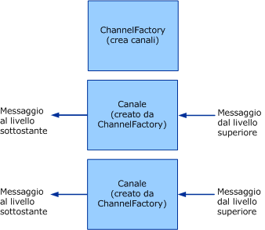

# Client: channel factory e canali
In questo argomento viene illustrata la creazione di channel factory e canali.  
  
## Channel factory e canali  
 Le channel factory sono responsabili della creazione di canali.  I canali creati da channel factory vengono usati per l'invio di messaggi.  Questi canali ottengono il messaggio dal livello superiore, eseguono l'elaborazione necessaria, quindi inviano il messaggio al livello inferiore.  Nel grafico seguente viene illustrato questo processo.  
  
   
Una channel factory crea canali.  
  
 Quando sono chiuse, le channel factory sono responsabili della chiusura di tutti i canali creati non ancora chiusi.  Il modello rappresentato è asimmetrico perché quando un listener del canale viene chiuso, smette solo di accettare nuovi canali, mentre lascia aperti i canali esistenti affinché possano continuare a ricevere messaggi.  
  
 [!INCLUDE[indigo2](../../../../includes/indigo2-md.md)] fornisce supporti di classi di base per questo processo.  Per un diagramma delle classi di supporto del canale descritte in questo argomento, vedere [Panoramica sul modello dei canali](../../../../docs/framework/wcf/extending/channel-model-overview.md).  
  
-   La classe <xref:System.ServiceModel.Channels.CommunicationObject> implementa <xref:System.ServiceModel.ICommunicationObject> e attiva la macchina a stati descritta nel passaggio 2 di [Sviluppo di canali](../../../../docs/framework/wcf/extending/developing-channels.md).  
  
-   La classe  `` <xref:System.ServiceModel.Channels.ChannelManagerBase> implementa <xref:System.ServiceModel.Channels.CommunicationObject> e fornisce una classe di base unificata per <xref:System.ServiceModel.Channels.ChannelFactoryBase?displayProperty=fullName> e <xref:System.ServiceModel.Channels.ChannelListenerBase?displayProperty=fullName>.  La classe <xref:System.ServiceModel.Channels.ChannelManagerBase> opera unitamente alla classe <xref:System.ServiceModel.Channels.ChannelBase>, una classe di base che implementa l'interfaccia <xref:System.ServiceModel.Channels.IChannel>.  
  
-   La classe  `` <xref:System.ServiceModel.Channels.ChannelFactoryBase> implementa <xref:System.ServiceModel.Channels.ChannelManagerBase> e <xref:System.ServiceModel.Channels.IChannelFactory> e consolida gli overload `CreateChannel` in un unico metodo astratto `OnCreateChannel`.  
  
-   La classe `` <xref:System.ServiceModel.Channels.ChannelListenerBase> implementa <xref:System.ServiceModel.Channels.IChannelListener>.  Si occupa della gestione dello stato di base.  
  
 La discussione seguente è basata sull'esempio di [Trasporto UDP](../../../../docs/framework/wcf/samples/transport-udp.md).  
  
### Creazione di una channel factory  
 `UdpChannelFactory` deriva da <xref:System.ServiceModel.Channels.ChannelFactoryBase>.  L'esempio esegue l'override di <xref:System.ServiceModel.Channels.ChannelFactoryBase.GetProperty%2A> per fornire accesso alla versione del messaggio del codificatore di messaggi.  L'esempio esegue inoltre l'override di <xref:System.ServiceModel.Channels.ChannelFactoryBase.OnClose%2A> per chiudere l'istanza di <xref:System.ServiceModel.Channels.BufferManager> quando la macchina a stati esegue la transizione.  
  
#### Canale di output UDP  
 `UdpOutputChannel` implementa <xref:System.ServiceModel.Channels.IOutputChannel>.  Il costruttore convalida gli argomenti e costruisce un oggetto <xref:System.Net.EndPoint> di destinazione basato sull'elemento <xref:System.ServiceModel.EndpointAddress> che viene passato.  
  
 L'override di <xref:System.ServiceModel.Channels.CommunicationObject.OnOpen%2A> crea un socket che viene usato per inviare messaggi a questa classe <xref:System.Net.EndPoint>.  
  
 `this.socket = new Socket(`  
  
 `this.remoteEndPoint.AddressFamily,`  
  
 `SocketType.Dgram,`  
  
 `ProtocolType.Udp`  
  
 `);`  
  
 Il canale può essere chiuso normalmente o in modo anomalo.  Se il canale viene chiuso normalmente, il socket viene chiuso e viene eseguita una chiamata al metodo `OnClose` della classe di base.  Se viene generata un'eccezione, l'infrastruttura chiama `Abort` per verificare che il canale sia pulito.  
  
```  
this.socket.Close();  
base.OnClose(timeout);  
  
```  
  
 Implementare `Send()` e `BeginSend()`\/`EndSend()`.  In questo modo si ottengono due sezioni principali.  Prima serializzare il messaggio in una matrice di byte:  
  
```  
ArraySegment<byte> messageBuffer = EncodeMessage(message);  
  
```  
  
 Inviare quindi i dati risultanti sulla rete.  
  
```  
this.socket.SendTo(  
  messageBuffer.Array,   
  messageBuffer.Offset,   
  messageBuffer.Count,   
  SocketFlags.None,   
  this.remoteEndPoint  
);  
```  
  
## Vedere anche  
 [Sviluppo di canali](../../../../docs/framework/wcf/extending/developing-channels.md)